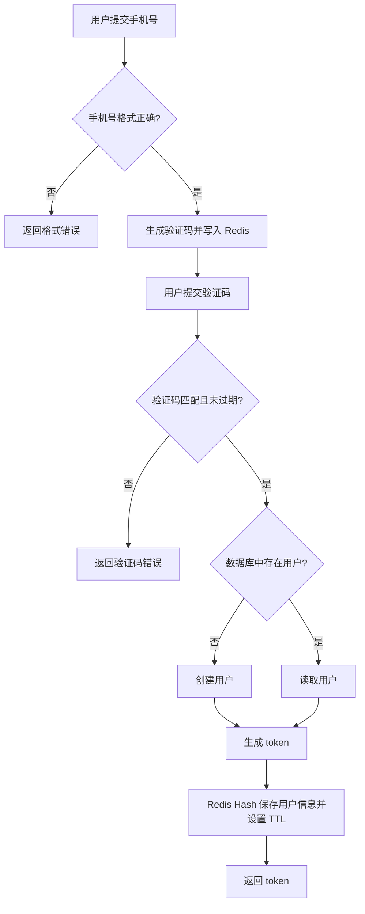
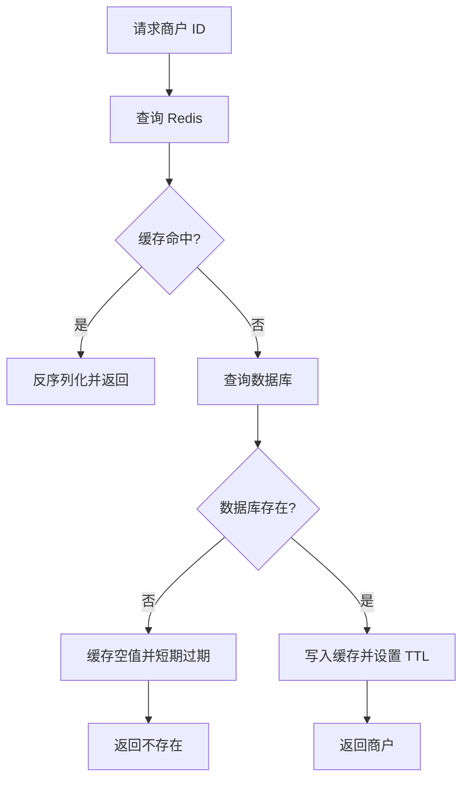
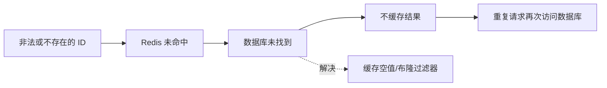
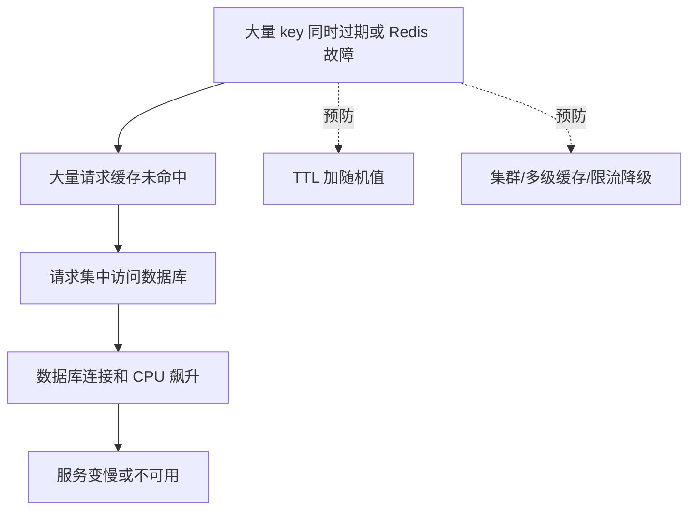
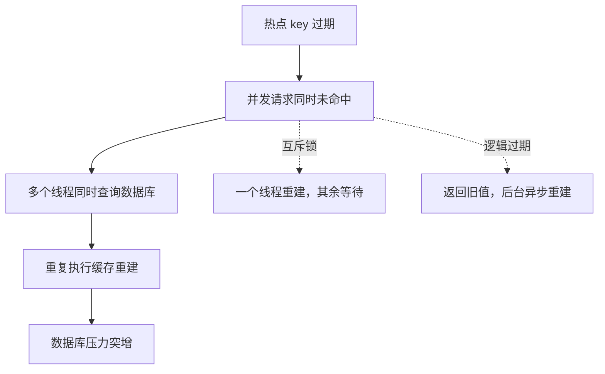
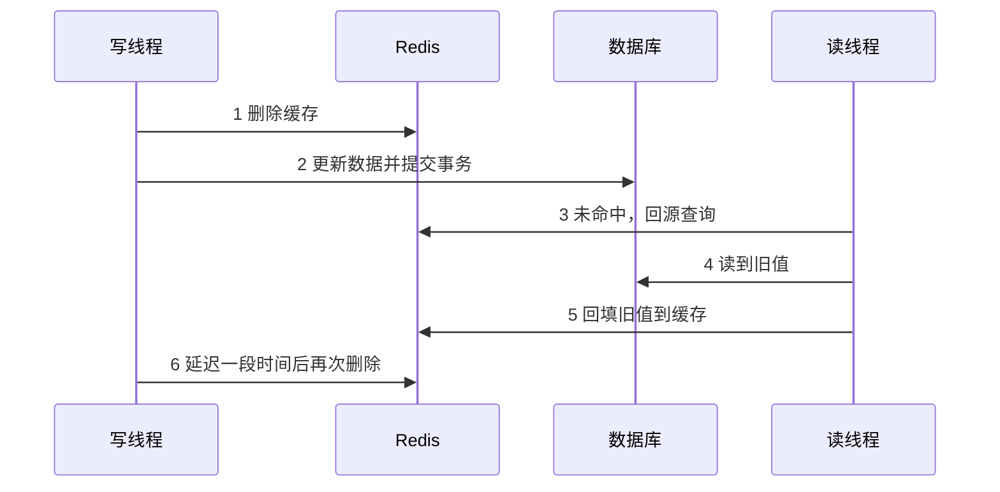

# Redis 实战：短信登录与缓存

## 1 短信登录

### 1.0 登录流程图



### 1.1 业务环境

短信登录通常包含发送验证码、验证码登录注册、校验登录状态三个步骤。数据库保存用户长期信息，Redis 保存验证码和登录 token 等临时信息。

### 1.2 发送验证码

流程：校验手机号 -> 生成 6 位验证码 -> 写入 Redis -> 设置过期时间 -> 调用短信服务。

```java
public Result sendCode(String phone) {
    if (RegexUtils.isPhoneInvalid(phone)) {
        return Result.fail("手机号格式错误");
    }
    String code = RandomUtil.randomNumbers(6);
    // 验证码使用 String，并设置短过期时间
    String key = "login:code:" + phone;
    stringRedisTemplate.opsForValue().set(key, code, 2, TimeUnit.MINUTES);
    log.debug("验证码：{}", code);
    return Result.ok();
}
```

### 1.3 登录与自动注册

用户提交手机号和验证码后，先从 Redis 获取正确验证码。验证通过后查询数据库；用户不存在则创建，再生成随机 token 保存用户信息。

```java
public Result login(String phone, String code) {
    String codeKey = "login:code:" + phone;
    String rightCode = stringRedisTemplate.opsForValue().get(codeKey);
    if (rightCode == null || !rightCode.equals(code)) {
        return Result.fail("验证码错误或已过期");
    }
    User user = userService.findByPhone(phone);
    if (user == null) {
        user = userService.createByPhone(phone); // 新用户自动注册
    }
    String token = UUID.randomUUID().toString();
    Map<String, String> userMap = Map.of(
            "id", user.getId().toString(),
            "nickName", user.getNickName());
    String tokenKey = "login:token:" + token;
    stringRedisTemplate.opsForHash().putAll(tokenKey, userMap);
    stringRedisTemplate.expire(tokenKey, 30, TimeUnit.MINUTES);
    return Result.ok(token);
}
```

### 1.4 Key-Value 设计

| 数据 | 类型 | Key 示例 | 过期时间 |
| --- | --- | --- | --- |
| 短信验证码 | String | `login:code:13800000000` | 2 分钟 |
| 登录用户 | Hash | `login:token:{token}` | 30 分钟 |
| 商户缓存 | String | `cache:shop:{id}` | 30 分钟左右 |

设计 key 时要保证唯一、便于定位，并控制 value 粒度，避免把无关字段全部放入缓存。

### 1.5 登录拦截与 token 刷新

拦截器从请求头读取 token，再查询 Redis Hash。查询成功则写入 ThreadLocal，并刷新过期时间；请求结束时清理 ThreadLocal。

```java
String token = request.getHeader("authorization");
if (StrUtil.isBlank(token)) {
    response.setStatus(401);
    return false;
}
String key = "login:token:" + token;
Map<Object, Object> userMap = stringRedisTemplate.opsForHash().entries(key);
if (userMap.isEmpty()) {
    response.setStatus(401);
    return false;
}
UserHolder.saveUser(convert(userMap));
stringRedisTemplate.expire(key, 30, TimeUnit.MINUTES); // 滑动过期
return true;
```

实际项目建议拆成两个拦截器：一个拦截所有请求并刷新 token，另一个只拦截必须登录的路径。

### 1.6 验证码与登录态的工具类封装

发送验证码、登录、拦截器这三处都要操作 Redis，如果每处都手写 key 字符串和过期时间，很容易写错前缀或漏设过期。常见做法是把 key 前缀抽到常量类，把读写操作收进一个 Spring 组件。

```java
public class RedisConstants {
    public static final String LOGIN_CODE_KEY = "login:code:";
    public static final String LOGIN_TOKEN_KEY = "login:token:";
    public static final Long LOGIN_CODE_TTL = 2L;
    public static final Long LOGIN_TOKEN_TTL = 30L;
}
```

```java
@Component
public class RedisLoginHelper {

    private final StringRedisTemplate template;

    public RedisLoginHelper(StringRedisTemplate template) {
        this.template = template;
    }

    // 写入时带上 TTL，避免 set 与 expire 分成两步执行
    public void saveCode(String phone, String code) {
        template.opsForValue().set(RedisConstants.LOGIN_CODE_KEY + phone,
                code, RedisConstants.LOGIN_CODE_TTL, TimeUnit.MINUTES);
    }

    public String getCode(String phone) {
        return template.opsForValue().get(RedisConstants.LOGIN_CODE_KEY + phone);
    }

    // 验证成功后删除，保证验证码只能用一次
    public void removeCode(String phone) {
        template.delete(RedisConstants.LOGIN_CODE_KEY + phone);
    }

    public void saveUser(String token, Map<String, String> userMap) {
        String key = RedisConstants.LOGIN_TOKEN_KEY + token;
        template.opsForHash().putAll(key, userMap);
        template.expire(key, RedisConstants.LOGIN_TOKEN_TTL, TimeUnit.MINUTES);
    }

    public Map<Object, Object> getUser(String token) {
        return template.opsForHash().entries(RedisConstants.LOGIN_TOKEN_KEY + token);
    }

    // 每次访问续期，构成滑动过期
    public void refresh(String token) {
        template.expire(RedisConstants.LOGIN_TOKEN_KEY + token,
                RedisConstants.LOGIN_TOKEN_TTL, TimeUnit.MINUTES);
    }
}
```

| 方法 | 对应操作 | 关键点 |
| --- | --- | --- |
| `saveCode` | 写入验证码 | 用带 TTL 的 `set` 一步完成，不必再单独调用 `expire` |
| `getCode` | 读取验证码 | 前缀统一拼接，调用方只传手机号 |
| `removeCode` | 验证成功后删除 | 保证一个验证码只能用一次 |
| `saveUser` | 写入登录态 | Hash 保存用户字段，token 用随机值不泄露用户信息 |
| `getUser` | 拦截器读取登录态 | 返回空 Map 就代表未登录或已过期 |
| `refresh` | 登录态续期 | 拦截器读到用户后调用，实现 30 分钟滑动过期 |

工具类通过构造器注入 `StringRedisTemplate`，不要写成持有静态字段的 `static` 工具类，否则实现无法替换，也不好写单元测试。

## 2 商户查询缓存

### 2.0 缓存查询主流程



### 2.1 缓存模型

读取商户时先查询 Redis，命中则直接返回；未命中再查询数据库，并把结果写入 Redis。

缓存是位于应用与数据库之间的高速数据副本。它不是最终数据源，所以缓存丢失后，系统应该能够重新从数据库构建缓存。

一次完整的缓存查询包含四个动作：

1. 根据业务对象拼接唯一 key。
2. 查询 Redis 并判断命中、空值或真正不存在。
3. 未命中时查询数据库。
4. 将数据库结果序列化后写入 Redis，并设置 TTL。

缓存命中表示 Redis 中有可用数据；缓存未命中表示 key 不存在或已过期；缓存空值表示数据库确认不存在该对象，但把这个结论短暂保存到了 Redis。

```java
public Shop queryShop(Long id) {
    String key = "cache:shop:" + id;
    String json = stringRedisTemplate.opsForValue().get(key);
    if (StrUtil.isNotBlank(json)) {
        return JSONUtil.toBean(json, Shop.class);
    }
    Shop shop = shopMapper.selectById(id);
    if (shop == null) {
        return null;
    }
    stringRedisTemplate.opsForValue().set(key,
            JSONUtil.toJsonStr(shop), 30, TimeUnit.MINUTES);
    return shop;
}
```

### 2.2 缓存优缺点

| 方面 | 说明 |
| --- | --- |
| 优点 | 降低数据库压力、提高响应速度 |
| 成本 | 需要处理一致性、过期、内存和额外运维 |
| 适合数据 | 读多写少、允许短暂不一致的数据 |
| 不适合数据 | 只能保存一份且不能丢失的核心数据 |

### 2.3 缓存更新策略

一般使用“先更新数据库，再删除缓存”，并给缓存设置过期时间。

#### 2.3.1 三种缓存读写模式

| 模式 | 谁负责读写缓存 | 谁负责保证一致性 | 优点 | 缺点 |
| --- | --- | --- | --- | --- |
| Cache Aside | 业务代码查询和更新缓存 | 业务代码 | 灵活、实现成本低、适合大多数 Java 服务 | 业务代码较多，双写失败需要补偿 |
| Read/Write Through | 业务只调用缓存服务，由缓存服务读写数据库 | 缓存服务 | 业务代码简单，一致性逻辑集中 | 需要额外的缓存服务或框架，改造成本高 |
| Write Behind | 业务只写缓存，由后台线程异步写数据库 | 缓存服务和异步任务 | 写入速度快，可合并多次写操作 | 数据存在延迟和丢失风险，实现复杂，不适合强一致数据 |

初学和普通 Spring Boot 项目优先掌握 Cache Aside：读时缓存未命中查数据库并回填，写时先更新数据库再删除缓存。

| 更新方案 | 优点 | 缺点 | 适用场景 |
| --- | --- | --- | --- |
| 只依赖内存淘汰 | 不需要编写更新代码，维护成本最低 | 一致性差，淘汰时机不可控 | 对实时性要求低的字典、分类数据 |
| 设置 TTL 被动过期 | 实现简单，能自动清理旧数据 | TTL 内可能读取旧值，过期瞬间可能击穿 | 允许短暂不一致的查询缓存 |
| 更新数据库并更新缓存 | 读取命中率高，数据更新后可立即读到 | 多次更新会产生无效写入，双写失败难处理 | 写入较少且对实时性要求高 |
| 更新数据库并删除缓存 | 写入次数少，下一次读取自动重建 | 删除后第一次访问会查数据库，仍需 TTL 兜底 | 大多数 Cache Aside 场景 |

为什么推荐“先更新数据库，再删除缓存”：如果先删除缓存，其他线程可能在数据库更新完成前读到旧数据并重新写入缓存；先提交数据库，再删除缓存，能明显缩短产生旧缓存的窗口。

```java
@Transactional
public void updateShop(Shop shop) {
    shopMapper.updateById(shop);
    stringRedisTemplate.delete("cache:shop:" + shop.getId());
}
```

### 2.4 缓存穿透、雪崩与击穿

#### 2.4.1 缓存穿透流程

缓存穿透是请求一个“缓存没有、数据库也没有”的数据。攻击者或异常参数会让每次请求都落到数据库。



##### 缓存穿透的解决方案对比

| 解决方案 | 工作方式 | 优点 | 缺点 | 适用场景 |
| --- | --- | --- | --- | --- |
| 参数校验 | 在进入缓存前拒绝格式错误、范围错误的请求 | 实现简单，完全不占 Redis 内存 | 只能拦截明显非法参数，不能判断合法但不存在的 ID | 接口参数校验 |
| 缓存空对象 | 数据库查不到时写入特殊空值，并设置较短 TTL | 实现简单，维护方便 | 额外占用内存，短时间内可能出现空值与数据库不一致 | 数据不存在概率较高但访问量可控 |
| 布隆过滤器 | 用多个哈希位判断 key 是否可能存在 | 内存占用小，不需要为每个不存在 ID 建 key | 实现复杂，存在误判；不能准确判断一定存在 | 海量 ID、防恶意枚举 |

布隆过滤器只能保证“不存在时一定不存在”，判断为“存在”时仍可能是误判，所以命中布隆过滤器后仍要继续查询 Redis 或数据库。

#### 2.4.2 缓存雪崩流程

缓存雪崩是大量 key 在同一时间失效，或 Redis 整体不可用，导致请求集中冲击数据库。



##### 缓存雪崩的解决方案对比

| 解决方案 | 优点 | 缺点 | 说明 |
| --- | --- | --- | --- |
| TTL 加随机值 | 改动小，能错开大量 key 的过期时间 | 只能缓解同时过期，不能解决 Redis 整体故障 | 适合作为基础措施 |
| Redis 高可用或集群 | 节点故障时仍可能提供服务，容量也可扩展 | 成本更高，部署和运维复杂 | 生产环境常用 |
| 限流与降级 | 保护数据库，避免故障扩散 | 部分请求会失败或返回兜底数据 | 与监控告警配合使用 |
| 多级缓存 | Redis 故障时可以使用本地缓存 | 数据一致性和失效策略更复杂 | 高频热点数据 |

#### 2.4.3 缓存击穿流程

缓存击穿只针对某个被高并发访问的热点 key 失效。与雪崩相比，影响范围更集中，但瞬时数据库压力同样很大。



##### 击穿的两种主要方案

| 解决方案 | 工作方式 | 优点 | 缺点 | 适用场景 |
| --- | --- | --- | --- | --- |
| 互斥锁 | 只有拿到锁的线程查询数据库并重建缓存，其他线程等待后重试 | 没有额外数据副本，能保证重建期间只有一个线程访问数据库 | 线程需要等待，吞吐下降；锁过期或异常处理不当可能造成风险 | 数据一致性要求高、重建耗时可控 |
| 逻辑过期 | Redis value 中保存业务数据和逻辑过期时间，过期后由后台线程重建，前台暂时返回旧数据 | 请求无需等待，性能好，适合热点 key | 返回的数据可能暂时不一致；需要线程池、锁和额外字段，实现复杂 | 读多写少、允许短暂旧数据 |

互斥锁的关键是“保护缓存重建”；逻辑过期的关键是“缓存 key 本身不真正过期”，否则请求无法读到旧数据。

| 问题 | 表现 | 常见解决方案 |
| --- | --- | --- |
| 缓存穿透 | 查询不存在的数据，缓存和数据库都被反复访问 | 缓存空值、布隆过滤器、参数校验 |
| 缓存雪崩 | 大量 key 同时过期或 Redis 故障 | 过期时间加随机值、集群、限流降级 |
| 缓存击穿 | 热点 key 过期瞬间大量请求访问数据库 | 互斥锁、逻辑过期、热点永不过期 |

缓存空值示例：

```java
String json = stringRedisTemplate.opsForValue().get(key);
if ("NULL".equals(json)) {
    return null;
}
if (json == null) {
    Shop shop = shopMapper.selectById(id);
    if (shop == null) {
        stringRedisTemplate.opsForValue().set(key, "NULL", 2, TimeUnit.MINUTES);
        return null;
    }
    stringRedisTemplate.opsForValue().set(key,
            JSONUtil.toJsonStr(shop), 30, TimeUnit.MINUTES);
    return shop;
}
return JSONUtil.toBean(json, Shop.class);
```

上面的空值方案只解决缓存穿透，不解决热点 key 同时失效。实际代码应根据问题类型组合使用：参数校验防非法请求，空值或布隆过滤器防穿透，随机 TTL 防雪崩，互斥锁或逻辑过期防击穿。

#### 2.4.4 互斥锁与逻辑过期的学习重点

互斥锁流程是“一个线程重建，其余线程等待后重试”。优点是实现后数据一致性更好、无需额外保存旧数据；缺点是等待会降低吞吐，锁超时或异常处理不当可能造成并发风险。

逻辑过期流程是“缓存不设置 Redis TTL，只在 value 中保存 expireTime”。发现逻辑过期后，一个线程异步重建，其余线程直接返回旧值。优点是请求几乎不等待、性能高；缺点是允许短暂脏数据、需要线程池和重建锁，且会额外占用内存。

### 2.5 StringRedisTemplate、RedisTemplate 与序列化器

本篇代码统一使用 `stringRedisTemplate`，而项目里往往同时存在 `RedisTemplate`。两者不是同一个模板的两种写法，而是序列化配置不同的两个 Bean。

| 模板 | key 与 value 的序列化器 | 写入 Redis 后的样子 | 适用场景 |
| --- | --- | --- | --- |
| `StringRedisTemplate` | key、value 都是 `StringRedisSerializer` | 明文，`redis-cli` 里可以直接看懂 | 验证码、token、计数、手动转好的 JSON 字符串 |
| `RedisTemplate` 默认配置 | `JdkSerializationRedisSerializer` | 二进制字节，key 带乱码前缀 | 不推荐直接使用 |
| `RedisTemplate` 自定义配置 | key 用 `StringRedisSerializer`，value 用 `GenericJackson2JsonRedisSerializer` | key 明文，value 是带 `@class` 的 JSON | 直接缓存 POJO |

JDK 序列化与 JSON 序列化的差别落在三个地方：

- 可读性：JDK 序列化写入的 key 是 `\xac\xed\x00\x05t\x00...` 这类字节，`SCAN` 和 `redis-cli` 里几乎无法辨认，排查问题只能靠代码推断；JSON 序列化写入的是明文，肉眼可读。
- 兼容性：JDK 序列化要求对象实现 `Serializable`，字段增删后旧数据可能反序列化失败；JSON 序列化对字段变化更宽容，但 `GenericJackson2JsonRedisSerializer` 会把 `@class` 类型信息写进 value，改包名或改类名后旧数据同样无法还原。
- 使用成本：手动转 JSON 的代码略多，但存储内容清楚；自动 JSON 序列化省去转换代码，代价是多一个 `@class` 字段和一点体积。

需要特别注意：两个模板操作的是同一批 Redis 数据，但字节格式不同。用 `RedisTemplate` 写入、用 `StringRedisTemplate` 读取，只会得到乱码或反序列化异常，混用必须成套。本篇缓存 `Shop`、`User` 时先用 `JSONUtil.toJsonStr` 转成字符串再写入，正是因为 `StringRedisTemplate` 只处理字符串。只需要缓存文本时优先用 `StringRedisTemplate`，确实要缓存多种 POJO 又不想每处手写转换时，才配置带 JSON 序列化器的 `RedisTemplate`。

```java
@Bean
public RedisTemplate<String, Object> redisTemplate(RedisConnectionFactory factory) {
    RedisTemplate<String, Object> template = new RedisTemplate<>();
    template.setConnectionFactory(factory);
    // key 用字符串序列化，value 用 JSON 序列化
    template.setKeySerializer(new StringRedisSerializer());
    template.setValueSerializer(new GenericJackson2JsonRedisSerializer());
    template.setHashKeySerializer(new StringRedisSerializer());
    template.setHashValueSerializer(new GenericJackson2JsonRedisSerializer());
    template.afterPropertiesSet();
    return template;
}
```

自定义这个 Bean 不会顶掉 Spring Boot 自动配置的 `StringRedisTemplate`，两者可以共存：简单文本走 `StringRedisTemplate`，POJO 走自定义 `RedisTemplate`。

### 2.6 延迟双删

2.3 给出的“先更新数据库，再删除缓存”已经把产生脏数据的窗口压得很小，但仍有一种漏网情况：缓存刚被删除就被并发读重建，而这次重建读到的还是更新前的旧值。延迟双删的做法是等数据库更新提交之后再补一次删除，把这段窗口里回填的旧值清掉。

| 步骤 | 动作 | 目的 |
| --- | --- | --- |
| 1 | 删除缓存 | 让后续读请求直接落到数据库 |
| 2 | 更新数据库并提交事务 | 新值正式生效 |
| 3 | 延迟一段时间，例如 500 毫秒 | 等并发读“查库再回填”的动作结束 |
| 4 | 再次删除缓存 | 清掉可能被回填的旧值 |



延迟双删的注意点：

- 延迟时间没有通用值，通常按一次“查数据库加回写缓存”的耗时估计，取几百毫秒；第二次删除应交给延时任务，不要用 `Thread.sleep` 阻塞业务线程。
- 第二次删除同样可能失败，需要记录日志并重试，否则这次更新实际只做了单次删除。
- 它只能降低而不能消除不一致，最终仍要靠 TTL 兜底，所以缓存必须设置过期时间。
- 大多数 CRUD 场景用“先更新数据库，再删除缓存加 TTL”就够了；延迟双删更适合缓存重建耗时长、又对短暂脏数据敏感的场景。

## 3 小白易错点

1. 现象：单机测试正常，部署两个实例后登录时好时坏。原因：验证码或登录态存在服务本地 Map、单机 Session 里，各实例内存不共享，负载均衡把下一次请求打到另一台就查不到。
2. 现象：A 业务的验证码被 B 业务读出来，或刚写入就被覆盖。原因：key 直接用手机号或用户 ID，没有 `login:code:` 这类业务前缀，不同业务撞到了同一个 key。
3. 现象：Redis 内存持续上涨，token 过期后仍能登录。原因：写入时只调用了 `set` 忘了 `expire`，或者 `set` 与 `expire` 分成两步、中间抛异常导致 key 永久有效。
4. 现象：校验验证码时偶发空指针异常。原因：写成 `code.equals(rightCode)`，而 Redis 查不到时 `rightCode` 为 null，应把可能为 null 的一方放进 `equals` 的参数位置。
5. 现象：同一个验证码在 2 分钟内可以反复登录。原因：验证通过后没有删除验证码，窗口期内它一直有效。
6. 现象：并发下单出现重复提交或超卖。原因：先用 `get` 判断再 `set` 写入，两步之间没有原子性，多个请求同时判断为“不存在”并全部写入成功，应改用 `setIfAbsent` 或 Lua。
7. 现象：更新之后接口长时间返回旧数据。原因：先删除缓存再更新数据库，并发读在更新提交前把旧值重新回填缓存，脏数据一直留到 TTL 到期。
8. 现象：数据库事务回滚了，缓存里却已经查不到数据。原因：删缓存与更新数据库不在同一个事务里，也没有补偿措施，回滚后缓存无法自动恢复。
9. 现象：数据库新增了记录，接口仍返回“不存在”，持续好几分钟。原因：空值缓存忘了设短过期时间，直接沿用了正常数据的 30 分钟 TTL。
10. 现象：读到空值缓存时抛反序列化异常，或把空值标记当成真实对象返回。原因：只判断了 `json == null`，没有单独识别空值方案写入的字面量 `"NULL"`。
11. 现象：读缓存报类型转换异常，或者读出来一串乱码。原因：用 `RedisTemplate` 写入、用 `StringRedisTemplate` 读取，两个模板的序列化器不同，同一个 key 的字节格式对不上。
12. 现象：执行一条命令后 Redis 卡顿几秒，接口大面积超时。原因：用 `KEYS pattern` 扫描线上键，该命令会阻塞单线程的 Redis，耗时随 key 数量线性增长，应换成渐进遍历的 `SCAN`。
13. 现象：一次缓存命中就传输几百 KB，网络和内存压力都很大。原因：把整个列表或集合当作一个 value 缓存，形成大 key，读写都只能整体进行。
14. 现象：上一个用户的信息出现在下一个用户的请求里。原因：拦截器的 `afterCompletion` 没有调用 `UserHolder.removeUser()`，Tomcat 复用线程时 ThreadLocal 里残留了上一个请求的用户。
15. 现象：登录页和验证码接口也返回 401，用户根本进不来。原因：拦截器路径配置成匹配所有请求，要求每个请求都带 token，应该只拦截需要登录的路径。
16. 现象：某个核心业务数据突然全部消失。原因：给不该设过期的数据也设了 TTL，缓存只能由数据库重建，唯一数据不能只保存在缓存中。

## 4 练习清单

| 题目 | 涉及知识点 | 提示 |
| --- | --- | --- |
| 实现发送短信验证码接口 | String、`SET NX`、EXPIRE | key 用 `login:code:{手机号}`，2 分钟过期，开发期把验证码打到日志里 |
| 实现验证码登录与自动注册 | Hash、UUID、TTL | 验证成功后立刻删除验证码，避免重复使用 |
| 改造拦截器校验登录态并续期 | 拦截器、ThreadLocal、滑动过期 | 读到用户后 `expire` 续期，`afterCompletion` 清理 ThreadLocal |
| 把验证码与登录态抽成工具类 | Spring 构造器注入、常量类 | key 前缀写进常量类，杜绝各业务手写字符串 |
| 给商户查询加上缓存 | Cache Aside、JSON 序列化 | 命中直接返回，未命中查库回填并设 30 分钟 TTL |
| 复现缓存穿透并修复 | 空值缓存、短 TTL | 不存在的 id 也缓存为 `"NULL"`，TTL 缩短到 2 分钟 |
| 用互斥锁解决缓存击穿 | `setIfAbsent`、锁超时、双重检查 | 拿到锁后要再查一次缓存，`finally` 里用令牌校验后解锁 |
| 设计一套缓存 key 规范 | key 设计、命名前缀 | 采用 `业务:对象:id` 三段式，避免与其他业务撞 key |
| 对比两个模板的存储格式 | 序列化器 | 分别在 `redis-cli` 里执行 `get`，观察明文与二进制字节的差别 |
| 把缓存更新改造成延迟双删 | 一致性、延时任务、重试 | 第二次删除延迟 500 毫秒左右，失败要记录并重试 |
| 用随机 TTL 缓解缓存雪崩 | 过期时间设计 | 在基础 TTL 上叠加 0 到 300 秒的随机值 |
| 观察未设过期时间的 key 增长 | TTL、内存 | 用 `TTL` 和 `INFO memory` 对比有无过期时间时的差异 |

## 5 资料对应关系

| 本仓库篇目 | 对应内容 | 说明 |
| --- | --- | --- |
| [03-redis应用实践与总结](03-redis应用实践与总结.md) | Spring Data Redis、序列化器配置 | 本篇用的 `StringRedisTemplate` 与前一篇的序列化器细节互相衔接 |
| [05-Redis实战-优惠券秒杀与分布式锁](05-Redis实战-优惠券秒杀与分布式锁.md) | 分布式锁 | 缓存击穿的互斥锁只在本机 JVM 内生效，跨实例要换成 Redis 分布式锁 |
| [06-Redis实战-秒杀优化与消息队列](06-Redis实战-秒杀优化与消息队列.md) | Lua 脚本、消息队列 | 判断与删除的原子性、异步重建缓存都可以用 Lua 与 Stream 落地 |
| [07-Redis实战-探店关注与Feed流](07-Redis实战-探店关注与Feed流.md) | Set、Sorted Set 实战 | 除了登录态和缓存，Redis 还负责点赞、关注关系与 Feed 收件箱 |
| [09-Redis实战-流程图与版本演进](09-Redis实战-流程图与版本演进.md) | 三类缓存问题与更新方案对比 | 本篇第 2 章流程图的展开版本，适合画图复习 |
| [12-Redis过期与内存淘汰](12-Redis过期与内存淘汰.md) | 过期策略、内存淘汰 | 缓存 key 过期后 Redis 何时真正删除、内存写满时淘汰谁 |
| [13-Redis最佳实践](13-Redis最佳实践.md) | key 设计与 BigKey | 易错点里 `KEYS` 扫描与大 key 问题的系统解法 |
| [16-Redis多级缓存与缓存同步](16-Redis多级缓存与缓存同步.md) | JVM 进程缓存、缓存同步 | 本地缓存加 Redis 的多级方案，以及缓存之间的同步 |
| [../javaweb/12-后端Web实战（登录认证）](../javaweb/12-后端Web实战（登录认证）.md) | JWT、拦截器、ThreadLocal | 登录认证的另一条路线，可与本篇的 Redis token 方案对照阅读 |

## 6 本篇总结

1. Redis 可以把验证码、token 和缓存数据从单机 Session 中抽离出来。
2. 登录 token 使用 Hash 保存用户字段，并通过过期时间实现自动失效。
3. 缓存查询遵循先 Redis、后数据库、回写 Redis 的流程。
4. 缓存方案必须同时考虑一致性、穿透、雪崩和击穿。
