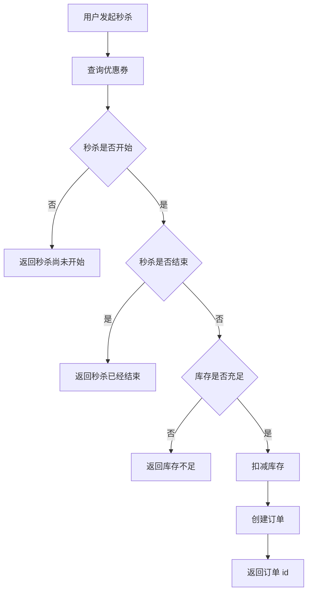
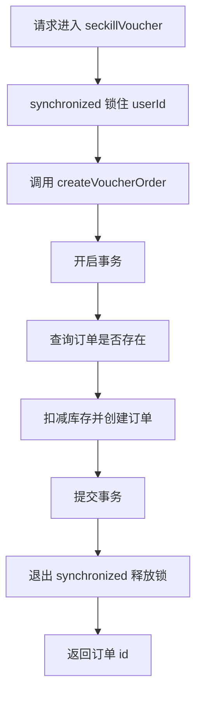
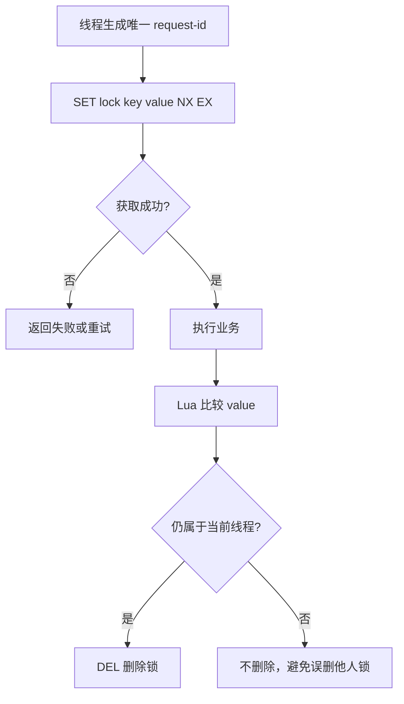
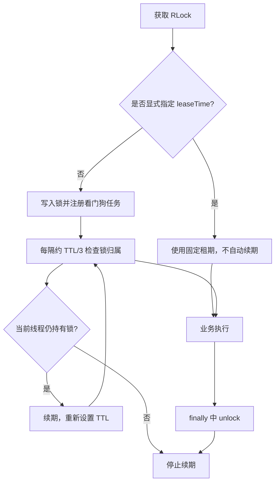

# Redis 实战：优惠券秒杀与分布式锁

秒杀是 Redis 最经典的应用场景之一，它把两个问题同时摆到面前：一是如何在高并发下不超卖、不重复下单，二是如何让多个 JVM 之间的并发操作串行化。

前面讲的缓存和数据结构解决的是“读得快”，这一篇解决的是“抢得准”。内容分三段：先把秒杀下单的业务和全局唯一 ID 立起来，再用乐观锁和一人一单解决并发正确性，最后落到分布式锁和 Redisson。

## 1 优惠券秒杀基础

### 1.1 业务模型

每个店铺都可以发布优惠券，分为平价券和特价券。平价券优惠力度低，限制少；特价券优惠力度高，所以有数量、抢购时间、结束时间等限制。这牵扯到两张表：

- tb_voucher：优惠券的基本信息，优惠金额、使用规则等。
- tb_seckill_voucher：优惠券的库存、开始抢购时间、结束抢购时间，特价优惠券才需要填写这些信息。

秒杀下单就是把“判断活动时间 + 判断库存 + 扣减库存 + 创建订单”这一串动作做完。

### 1.2 秒杀下单流程



### 1.3 秒杀资格判断

秒杀请求需要依次判断三件事：活动是否在时间范围内、库存是否充足、这个用户是否已经下过单。

其中库存扣减必须是原子操作，否则并发请求会让“查询库存”和“扣减库存”之间的空隙被其他线程挤进来，最终导致超卖。

## 2 全局唯一 ID

### 2.1 为什么不能只用数据库自增

订单 ID 不能只依赖数据库自增，原因有两层：

- 多个数据库实例各自自增，会产生重复 ID，无法在分布式系统中保证唯一。
- ID 是连续的整数，会暴露业务的真实单量，别人下两单就能推算出你一天的订单量。

所以需要一个全局 ID 生成器：一种在分布式系统下生成全局唯一 ID 的工具。

### 2.2 全局 ID 的五个特性

- 唯一性：任何时刻、任何机器上生成的 ID 都不重复，这是最基本的要求。
- 高可用：服务本身不能成为单点，不能因为生成 ID 的组件挂了就下不了单。
- 递增性：整体趋势递增，对数据库索引友好（B+ 树顺序插入，避免页分裂），也方便按时间排序。
- 高性能：下单链路在高峰时会拿到极高的 QPS，生成 ID 必须是内存级或近内存级的操作。
- 安全性：ID 不能携带能被外部推断出的内部信息，例如自增序列和真实单量。

### 2.3 四种生成策略对比

| 策略 | 唯一性范围 | 趋势递增 | 性能 | 缺点 | 适用场景 |
| --- | --- | --- | --- | --- | --- |
| UUID | 全局唯一 | 不递增 | 本地生成，很快 | 无序，做主键会造成索引页分裂；长度 36 位，占用空间大 | 对顺序无要求的标识，如 traceId |
| Redis 自增 | 全局唯一 | 递增 | 高，一次 INCR 即可 | 依赖 Redis 可用性；需要额外做位拼接才能保证趋势递增 | 分布式订单号、业务单号 |
| 雪花算法 | 全局唯一 | 递增 | 高，本地生成 | 依赖机器时钟，时钟回拨会导致重复 | 大规模分布式系统 |
| 数据库自增 | 单表或分段唯一 | 递增 | 一般，受数据库压力限制 | 性能受数据库能力限制，多实例需要额外分段方案 | 并发量不大的系统 |

### 2.4 Redis 自增方案：64 位拆解

对于 long 型 ID，占用 8 个字节、64 位，把这 64 位拆成三部分：

| 部分 | 位数 | 含义 |
| --- | --- | --- |
| 符号位 | 1 bit | 永远为 0，保证 ID 是正数 |
| 时间戳 | 31 bit | 以秒为单位，31 位可以表示约 69 年 |
| 序列号 | 32 bit | 秒内的计数器，支持每秒产生 2^32 个不同 ID |

组合方式是把时间戳左移 32 位，再和序列号做按位或：

```text
orderId = (timestamp << COUNT_BITS) | sequence
```

要注意的是，这个方案里没有机器标识。机器标识是雪花算法的要素，用来在多台机器之间区分 ID 的生成者；这里的唯一性由“Redis 全局自增序列 + 时间戳”共同保证，不需要机器标识参与。

### 2.5 代码实现

两个常量必须显式定义，否则代码里引用的 BEGIN_TIMESTAMP 和 COUNT_BITS 就没有来源：

- BEGIN_TIMESTAMP：起始时间戳，取一个固定的过去时刻，用来把时间戳的位数压到 31 bit 能表示的范围内。
- COUNT_BITS：序列号占用的位数，这里是 32。

```java
@Component
public class RedisIdWorker {
    // 开始时间戳
    private static final long BEGIN_TIMESTAMP = 1760895122L;
    // 序列号的位数
    private static final int COUNT_BITS = 32;

    private StringRedisTemplate stringRedisTemplate;

    public RedisIdWorker(StringRedisTemplate stringRedisTemplate) {
        this.stringRedisTemplate = stringRedisTemplate;
    }

    public long nextId(String keyPrefix) {
        // 1.生成时间戳
        LocalDateTime now = LocalDateTime.now();
        long nowSecond = now.toEpochSecond(ZoneOffset.UTC);
        long timestamp = nowSecond - BEGIN_TIMESTAMP;

        // 2.生成序列号
        // 2.1.获取当前日期，精确到天
        String date = now.format(DateTimeFormatter.ofPattern("yyyy:MM:dd"));
        // 2.2.自增长
        long count = stringRedisTemplate.opsForValue().increment("icr:" + keyPrefix + ":" + date);

        // 3.拼接并返回
        return timestamp << COUNT_BITS | count;
    }
}
```

几个细节：

- key 里带上日期（icr:order:2025:10:19），让计数器每天归零，避免 32 bit 的序列号在单日流量极端时被撑满，也方便排查问题。
- 同一个前缀对应同一个计数器序列，不同业务用 keyPrefix 区分，例如 order、voucher。
- 时间戳只有 31 bit，这就是“约 69 年”的来源：2^31 秒约等于 68 年。

### 2.6 性能测试

在测试之前先了解一下 CountDownLatch：它名为信号枪，用于协调多线程之间的等待与唤醒。

程序是异步的，有可能其他线程还没运行完，主线程却已经运行完了，而我们需要主线程在所有子线程结束后才继续。这时就需要 CountDownLatch，它有两个重要方法：countDown 和 await。

await 是阻塞方法，可以阻塞主线程，直到 CountDownLatch 内部维护的变量变为 0 才放行；每调用一次 countDown，这个变量就减 1。让每个子线程在结束时调用一次 countDown，并把初始值设为子线程数量，就能实现主线程最后执行。

```java
@Resource
private RedisIdWorker redisIdWorker;
private final ExecutorService es = Executors.newFixedThreadPool(500); // 线程池

@Test
void testIdWorker() throws InterruptedException {
    CountDownLatch latch = new CountDownLatch(300);

    Runnable task = () -> {
        for (int i = 0; i < 100; i++) {
            long id = redisIdWorker.nextId("order");
            System.out.println("id = " + id);
        }
        latch.countDown();
    };
    long begin = System.currentTimeMillis();
    for (int i = 0; i < 300; i++) {
        es.submit(task);
    }
    latch.await();
    long end = System.currentTimeMillis();
    System.out.println("time = " + (end - begin));
}
```

测试结果是生成 30000 个 ID 用时近 3 秒，平均一个 ID 用时约 0.1 ms，性能很高。

## 3 库存超卖问题

### 3.1 问题现象与原因

用 JMeter 发送 200 个请求实现抢购，会发现数据库里产生了超过 100 个订单，库存最后变成了负数，而券仅限购 100 份，这就是库存超卖。

原因在于“查询库存”和“扣减库存”之间存在时间间隔：线程 1 查询出库存为 1，在它还没把扣减结果写回数据库的时候，线程 2、线程 3 也查询库存，同样看到还有库存，于是都去更新数据库，最终导致超卖。

超卖的本质是一个并发问题：多个线程基于同一个过期状态做了决策。解决思路是加锁，让这段逻辑串行化。

### 3.2 悲观锁与乐观锁

| 方案 | 做法 | 优点 | 缺点 | 适用场景 |
| --- | --- | --- | --- | --- |
| 悲观锁 | 查询时加数据库行锁，实现数据串行化执行 | 简单直观，正确性强 | 并发低、等待时间长 | 写操作密集、事务逻辑复杂 |
| 乐观锁 | 使用版本号或数据本身的条件更新 | 并发性能更好，不加锁等待 | 失败后需要重试或返回错误 | 更新类操作、冲突概率不高 |
| Redis 原子扣减 | 用 Lua 一次完成判断和扣减 | 快，减少数据库压力 | 需要处理 Redis 与数据库的一致性 | 并发量极高的秒杀入口 |

选择原则：并发量较低且事务逻辑复杂时可以使用数据库锁；并发量较高时，把资格判断前移到 Redis，并用数据库事务和唯一索引作为最终兜底。

### 3.3 乐观锁的两种实现

乐观锁假设冲突不常发生，只在真正更新时校验数据有没有被别人改过。它有两种实现方式：

| 实现方式 | 做法 | 是否需要改表 | 说明 |
| --- | --- | --- | --- |
| 版本号法 | 表中加一列 version，每次更新都让 version 加 1；更新时带上原来的 version 作为条件 | 需要改表结构和实体类 | 语义清晰，但要动数据库 schema 和 pojo |
| CAS 法 | 直接用业务数据本身作为判断依据，例如判断 stock 是否还是查询时的值 | 不需要 | 依赖现有字段，改造最小 |

版本号法的逻辑是：每次更新数据库都使版本号加 1。更新时如果版本号还是原来的版本号，说明这段时间没有线程更新过数据库，可以更新；如果版本号已经改变，说明已经有线程更新过了，就不更新或重新处理请求逻辑。

CAS 法（Compare And Swap）则是利用数据本身有没有变化来判断拒绝更新还是重试：更新时如果数据与原来查询到的数据不一样，说明这段时间有线程操作过数据库，就不更新或重新处理请求逻辑；否则说明这段时间没有线程插队，可以安全更新。

### 3.4 推导：从 eq 到 gt

由于版本号法还要修改数据库表结构甚至修改 pojo，改动大，所以这里用 CAS 法，直接利用 stock 字段是否发生变化来解决超卖。

第一步，把扣减库存的条件改成“库存等于刚才查到的值”：

```java
boolean success = seckillVoucherService.update()
        .setSql("stock = stock -1")
        .eq("voucher_id", voucherId)
        .eq("stock", voucher.getStock()) // where voucher_id = ? and stock = ?
        .update();
```

测试后发现，虽然不会超卖，但售出的却不足 100 份。原因是：假如 100 个线程都查到了同一个库存值，然后一起修改库存，这 100 个更新同一时间只能有 1 个成功，其他线程全部失败，导致大量优惠券没有卖出去。

第二步，把判断条件从“库存等于原值”放宽为“库存大于 0”。只要还有库存，就让线程去扣减：

```java
boolean success = seckillVoucherService.update()
        .setSql("stock = stock - 1")
        .eq("voucher_id", voucherId)
        .gt("stock", 0) // where voucher_id = ? and stock > 0
        .update();
```

两次修改的差别可以用一张表说清楚：

| 判断条件 | 并发下会发生什么 | 结果 |
| --- | --- | --- |
| eq("stock", voucher.getStock()) | 只有一个线程的条件成立，其余线程的条件不成立 | 不超卖，但卖不完 |
| gt("stock", 0) | 所有拿到“还有库存”这一信息的线程都能扣减，数据库行锁保证每行只减一次 | 不超卖，也不浪费库存 |

这个推导说明：乐观锁的粒度要与业务目标匹配。要防的是“库存减成负数”，而不是“同一时刻只允许一个线程更新”。

## 4 一人一单

### 4.1 问题分析与思路

优惠券是为了引流，但如果一个用户可以重复下单，最终优惠券会被同一个用户抢光，所以需要限制一个人只能下单一次。

实现思路：秒杀开始后，先判断库存是否充足，再根据优惠券 id 和用户 id 查询用户是否已经下过这个订单。如果下过，则不再下单；否则进行下单。

### 4.2 初步实现

```java
@Override
@Transactional
public Result seckillVoucher(Long voucherId) {
    // 1.查询优惠券
    SeckillVoucher voucher = seckillVoucherService.getById(voucherId);
    // 2.判断秒杀是否开始
    if (voucher.getBeginTime().isAfter(LocalDateTime.now())) {
        return Result.fail("秒杀尚未开始！");
    }
    // 3.判断秒杀是否已经结束
    if (voucher.getEndTime().isBefore(LocalDateTime.now())) {
        return Result.fail("秒杀已经结束！");
    }
    // 4.判断库存是否充足
    if (voucher.getStock() < 1) {
        return Result.fail("库存不足！");
    }
    // 5.一人一单逻辑
    // 5.1.用户 id
    Long userId = UserHolder.getUser().getId();
    int count = query().eq("user_id", userId).eq("voucher_id", voucherId).count();
    // 5.2.判断是否存在
    if (count > 0) {
        return Result.fail("用户已经购买过一次！");
    }
    // 6.扣减库存
    boolean success = seckillVoucherService.update()
            .setSql("stock = stock - 1")
            .eq("voucher_id", voucherId).gt("stock", 0).update();
    if (!success) {
        return Result.fail("库存不足！");
    }
    // 7.创建订单
    VoucherOrder voucherOrder = new VoucherOrder();
    long orderId = redisIdWorker.nextId("order");
    voucherOrder.setId(orderId);
    voucherOrder.setUserId(userId);
    voucherOrder.setVoucherId(voucherId);
    save(voucherOrder);
    return Result.ok(orderId);
}
```

再次并发测试，仍然会出现一人多单。原因是：同一个用户的多个请求线程并发运行时，都查询数据库发现未下单，然后都去扣减库存、创建订单。

解决方法是加锁。这里要注意锁的选型：乐观锁适合更新操作（判断数据有没有被改过），而这里是插入操作，插入不存在“原来的值”可以比较，所以需要用悲观锁。

### 4.3 锁粒度：从方法锁到用户锁

先把一人一单的逻辑抽成 createVoucherOrder 方法，并在方法上加 synchronized，同时把事务从 seckillVoucher 上移走：

```java
@Transactional
public synchronized Result createVoucherOrder(Long voucherId) {
    Long userId = UserHolder.getUser().getId();
    // 5.1.查询订单
    int count = query().eq("user_id", userId).eq("voucher_id", voucherId).count();
    // 5.2.判断是否存在
    if (count > 0) {
        return Result.fail("用户已经购买过一次！");
    }
    // 6.扣减库存
    boolean success = seckillVoucherService.update()
            .setSql("stock = stock - 1")
            .eq("voucher_id", voucherId).gt("stock", 0)
            .update();
    if (!success) {
        return Result.fail("库存不足！");
    }
    // 7.创建订单
    VoucherOrder voucherOrder = new VoucherOrder();
    long orderId = redisIdWorker.nextId("order");
    voucherOrder.setId(orderId);
    voucherOrder.setUserId(userId);
    voucherOrder.setVoucherId(voucherId);
    save(voucherOrder);
    return Result.ok(orderId);
}
```

但现在锁是加在方法上的，锁的对象是 this。不同用户请求过来也只能一个一个串行执行，效率很低。可以把锁对象换成用户 id，保证不同用户的线程并行执行、同一用户的线程串行执行：

```java
@Transactional
public Result createVoucherOrder(Long voucherId) {
    Long userId = UserHolder.getUser().getId();
    synchronized (userId.toString().intern()) {
        // 5.1.查询订单
        int count = query().eq("user_id", userId).eq("voucher_id", voucherId).count();
        // 5.2.判断是否存在
        if (count > 0) {
            return Result.fail("用户已经购买过一次！");
        }
        // 6.扣减库存
        boolean success = seckillVoucherService.update()
                .setSql("stock = stock - 1")
                .eq("voucher_id", voucherId).gt("stock", 0)
                .update();
        if (!success) {
            return Result.fail("库存不足！");
        }
        // 7.创建订单
        VoucherOrder voucherOrder = new VoucherOrder();
        long orderId = redisIdWorker.nextId("order");
        voucherOrder.setId(orderId);
        voucherOrder.setUserId(userId);
        voucherOrder.setVoucherId(voucherId);
        save(voucherOrder);
        return Result.ok(orderId);
    }
}
```

intern() 的作用是保证锁对象是同一个。虽然每个用户 id 的值相同，但 `userId.toString()` 底层是 new 出来的字符串对象，不同线程各自 new 一次，得到的是两个不同的对象，而 synchronized 锁的是对象引用，锁不同对象就等于没加锁。intern() 会把字符串放入字符串常量池并返回池中的那个对象，同一个用户 id 的多个线程拿到的是同一个对象，锁才真正生效。

### 4.4 锁必须包住整个事务

把 synchronized 放在 createVoucherOrder 内部会有一个新的问题：锁的释放在事务提交前执行。如果事务还没来得及提交，这个用户又有一个线程进来，先一步完成了抢购业务，这时就会出现两个事务都提交，一人一单仍然被破坏。

所以事务必须放在锁的范围之内，保证事务先提交、再释放锁：

```java
// 原来逻辑
// return createVoucherOrder(voucherId);

// 修改后
Long userId = UserHolder.getUser().getId();
synchronized (userId.toString().intern()) {
    return this.createVoucherOrder(voucherId);
}
```

正确的顺序是：



### 4.5 this 调用导致事务失效

上面的写法里，调用 createVoucherOrder 用的是 this，而不是通过代理对象调用的，所以事务会失效。

原因是 Spring 的事务是基于 AOP 代理实现的：外部调用服务方法时，进入的是代理对象，代理对象在方法前后开启和提交事务。而类内部用 this 调用自己的另一个方法，走的是原始对象，根本没有经过代理，所以 @Transactional 不起作用。

解决办法是拿到代理对象再调用。先导入依赖：

```xml
<dependency>
    <groupId>org.aspectj</groupId>
    <artifactId>aspectjweaver</artifactId>
</dependency>
```

启动类上加 @EnableAspectJAutoProxy(exposeProxy = true) 暴露代理对象，然后修改调用逻辑：

```java
Long userId = UserHolder.getUser().getId();
synchronized (userId.toString().intern()) {
    // 获取代理对象
    IVoucherOrderService proxy = (IVoucherOrderService) AopContext.currentProxy();
    return proxy.createVoucherOrder(voucherId);
}
```

AopContext.currentProxy() 返回当前线程绑定的代理对象，用它调用就会重新走一遍代理逻辑，事务注解才会生效。

### 4.6 集群下 synchronized 失效

把项目复制成两个实例（例如端口 8081 和 8082），再用 Nginx 做负载均衡，用 JMeter 分别向两台服务器发请求，通过 debug 调试会发现两个线程同时获取锁成功了，这会导致一人多单。

失效原因：两台服务器就是两个 JVM。当 JVM1 中的线程 1 获取锁并查询订单不存在时，JVM2 也会尝试获取锁。虽然用户 id 一致，但两台虚拟机是相互独立的，JVM2 的线程会在自己的范围内生成一个对象，JVM1 和 JVM2 拿到的锁对象不是同一个，所以都能加锁成功，两边同时查询订单不存在，同时插入订单，导致一人多单。

| 场景 | 锁的作用范围 | 是否有效 |
| --- | --- | --- |
| 单机多线程 | 同一个 JVM 内的对象 | 有效 |
| 集群多实例 | 每个 JVM 各有一把自己的对象锁 | 无效 |
| 集群多实例 + Redis 分布式锁 | 所有实例竞争同一个 Redis key | 有效 |

结论：synchronized 只能锁住当前 JVM，跨进程的互斥必须交给进程外的公共组件，这就是分布式锁。

### 4.7 数据库唯一索引兜底

不管 Redis 预判断做得多严，最终都要在数据库上兜一层：给订单表建立 (user_id, voucher_id) 唯一索引，让重复插入直接失败。

```sql
ALTER TABLE tb_voucher_order
ADD UNIQUE KEY uk_user_voucher (user_id, voucher_id);
```

Redis 预判断只能提高性能、拦截绝大部分重复请求，不能替代最终的一致性约束。数据库唯一索引是防止重复订单的最后一道防线。

## 5 Redis 分布式锁

### 5.1 基本原理与要求

分布式锁满足“分布式系统或集群模式下多进程可见并且互斥”的要求，核心思想是让所有线程都使用同一把锁，保证所有线程串行化，而不会出现锁失效的情况。

分布式锁应该满足以下几点：

- 可见性：多个线程都能看到相同的结果。
- 互斥：分布式锁最基本的条件，使得程序串行执行。
- 高可用：程序不易崩溃，时时刻刻都保证较高的可用性。
- 高性能：较高的加锁性能和释放锁性能。
- 安全性：安全是程序中必不可少的一环。

常见的分布式锁有三种实现方式：

| 对比项 | MySQL | Redis | ZooKeeper |
| --- | --- | --- | --- |
| 互斥 | 利用 MySQL 本身的互斥锁机制 | 利用 setnx 这样的互斥命令 | 利用节点的唯一性和有序性实现互斥 |
| 高可用 | 好 | 好 | 好 |
| 高性能 | 一般 | 好 | 一般 |
| 安全性 | 断开连接后自动释放锁 | 利用锁超时机制，到期释放 | 临时节点，断开连接自动释放 |

### 5.2 加锁与解锁流程



### 5.3 核心思路与基本实现

利用 setnx 命令，多个线程同时请求时只能有一个线程执行成功、获得锁，其他线程执行失败，休眠重试或返回错误。

为了确保“设置超时时间”和“setnx”同时成功或失败，需要把两个动作合并成一条命令：

```text
SET lock:order:1001 request-id NX EX 10
```

NX 表示 key 不存在时才写入，EX 设置过期秒数。新代码应优先使用带 NX 和 EX 的 SET，而不是把 SETNX 与 EXPIRE 分成两步，否则中间宕机就会留下永远不过期的锁。

先定义锁接口：

```java
public interface ILock {
    // 尝试获取锁
    // timeoutSec：锁的持有时间
    // 返回 true 表示获取成功，false 表示获取失败
    boolean tryLock(long timeoutSec);

    // 释放锁
    void unlock();
}
```

再实现一个最简版本：

```java
public class SimpleRedisLock implements ILock {
    private String name;
    private StringRedisTemplate stringRedisTemplate;
    private static final String KEY_PREFIX = "lock:";

    public SimpleRedisLock(String name, StringRedisTemplate stringRedisTemplate) {
        this.name = name;
        this.stringRedisTemplate = stringRedisTemplate;
    }

    @Override
    public boolean tryLock(long timeoutSec) {
        // 获取线程标识
        long threadId = Thread.currentThread().getId();
        // 获取锁
        Boolean success = stringRedisTemplate.opsForValue()
                .setIfAbsent(KEY_PREFIX + name, threadId + "", timeoutSec, TimeUnit.SECONDS);
        return Boolean.TRUE.equals(success); // null 值也返回 false
    }

    @Override
    public void unlock() {
        stringRedisTemplate.delete(KEY_PREFIX + name);
    }
}
```

替换业务代码里的锁：

```java
Long userId = UserHolder.getUser().getId();
// 创建锁对象
SimpleRedisLock lock = new SimpleRedisLock("order:" + userId, stringRedisTemplate);
// 获取锁
boolean isLock = lock.tryLock(5);
// 加锁失败
if (!isLock) {
    return Result.fail("不允许重复下单");
}
try {
    // 获取代理对象(事务)
    IVoucherOrderService proxy = (IVoucherOrderService) AopContext.currentProxy();
    return proxy.createVoucherOrder(voucherId);
} finally {
    // 释放锁
    lock.unlock();
}
```

### 5.4 误删他人的锁

如果线程 1 获取锁后业务发生阻塞，触发锁的超时释放，线程 2 就能获取锁。线程 2 执行业务的过程中线程 1 恢复了，完成业务并释放了不属于自己的锁，释放完的同时线程 3 又可以获取锁执行业务，于是线程 2 和线程 3 并发执行业务。

解决办法是线程释放锁时判断锁是否还是自己的：如果是自己的锁，说明这个过程中没有其他线程执行，可以删除；否则不删除。

实现思路：存入锁时放入自己线程的标识，删除锁时判断锁里的标识是不是自己存入的。

对于多台虚拟机，每台虚拟机相互独立，可能出现两个线程标识（如线程 id）一致的情况。可以利用 UUID 类和 static 关键字为每台虚拟机生成唯一标识，再拼接线程标识，就保证了分布式下线程标识的唯一性：

```java
private static final String ID_PREFIX = UUID.randomUUID().toString(true) + "-"; // hutool 包下

@Override
public boolean tryLock(long timeoutSec) {
    // 获取线程标示
    String threadId = ID_PREFIX + Thread.currentThread().getId();
    // 获取锁
    Boolean success = stringRedisTemplate.opsForValue()
            .setIfAbsent(KEY_PREFIX + name, threadId, timeoutSec, TimeUnit.SECONDS);
    return Boolean.TRUE.equals(success);
}

public void unlock() {
    // 获取线程标示
    String threadId = ID_PREFIX + Thread.currentThread().getId();
    // 获取锁中的标示
    String id = stringRedisTemplate.opsForValue().get(KEY_PREFIX + name);
    // 判断标示是否一致
    if (threadId.equals(id)) {
        // 释放锁
        stringRedisTemplate.delete(KEY_PREFIX + name);
    }
}
```

### 5.5 判断与删除的原子性

上面的代码还有一个漏洞：线程 1 获取锁、执行完业务、判断锁是自己的，此时业务阻塞导致锁超时释放，线程 2 成功获取锁；线程 1 结束阻塞后直接删除了线程 2 的锁，线程 3 又能获取锁，于是线程 2 和线程 3 并发执行。这就是判断与删除不原子带来的问题。

解决办法是保证“判断锁”和“释放锁”两段逻辑原子执行、同时成功，这就要用到 Lua 脚本。

Redis 提供 Lua 脚本功能，一个脚本内可以编写多条 Redis 命令，执行时确保所有命令同时成功，类似 MySQL 的事务。脚本里通过 redis.call 调用 Redis 命令：

```lua
redis.call('命令名称', 'key', '其它参数', ...)

-- 例如执行 set name jack
redis.call('set', 'name', 'jack')
```

调用脚本的命令格式是：

```text
EVAL script numkeys key [key ...] arg [arg ...]
```

- script：Lua 脚本内容。
- numkeys：键的数量，2 表示后面的 2 个参数作为键。
- arg：去掉键后剩下的参数就是值，和键一一对应。

key、value 也可以作为参数传递：key 类型参数会放入 KEYS 数组，其它参数会放入 ARGV 数组。

```text
EVAL "return redis.call('set', KEYS[1], ARGV[1])" 1 name Rose
```

在 resources 目录下编写 unlock.lua：

```lua
-- 获取锁中的标示，判断是否与当前线程标示一致
if (redis.call('GET', KEYS[1]) == ARGV[1]) then
    -- 一致，则删除锁
    return redis.call('DEL', KEYS[1])
end
-- 不一致，则直接返回
return 0
```

Java 侧用 RedisTemplate 的 execute 方法执行脚本：

```java
private static final DefaultRedisScript<Long> UNLOCK_SCRIPT;
static {
    UNLOCK_SCRIPT = new DefaultRedisScript<>();
    UNLOCK_SCRIPT.setLocation(new ClassPathResource("unlock.lua"));
    UNLOCK_SCRIPT.setResultType(Long.class);
}

public void unlock() {
    // 调用 lua 脚本
    stringRedisTemplate.execute(
            UNLOCK_SCRIPT,
            Collections.singletonList(KEY_PREFIX + name),
            ID_PREFIX + Thread.currentThread().getId()
    );
}
```

Lua 脚本让比较和删除在 Redis 内部一次完成，避免并发间隙。

### 5.6 一个合格的分布式锁要考虑什么

到这一步，锁基本可以商业使用了，但仍然要清楚它需要满足哪些条件：

| 要求 | 做法 | 不满足的后果 |
| --- | --- | --- |
| 互斥性 | SET key value NX EX | 并发进入临界区 |
| 避免死锁 | 设置过期时间 | 持锁进程崩溃后锁永不释放 |
| 锁的归属 | value 存唯一标识并校验 | 误删他人锁 |
| 释放的原子性 | 用 Lua 比较并删除 | 删除他人锁造成并发 |
| 业务超时的续期 | 看门狗自动续期或合理设置 TTL | 业务未完成锁已释放 |

## 6 Redisson 分布式锁

### 6.1 Redisson 要解决的四个隐患

手写的锁虽然能跑通，但仍存在四个隐患：

- 不可重入：同一个线程无法多次获取同一把锁。
- 不可重试：获取锁只尝试一次就返回 false，没有重试机制。
- 超时释放：锁超时释放虽然可以避免死锁，但如果业务执行耗时较长，也会导致锁提前释放，存在安全隐患。
- 主从一致性：如果 Redis 提供主从集群，主从同步存在延迟，当主宕机时，如果从并未同步主中的锁数据，就会出现锁丢失。

Redisson 是一个在 Redis 基础上实现的 Java 驻内存数据网格，不仅提供了一系列分布式的 Java 常用对象，还提供了许多分布式服务，其中就包含各种分布式锁的实现。

### 6.2 依赖与配置

```xml
<dependency>
    <groupId>org.redisson</groupId>
    <artifactId>redisson</artifactId>
    <version>3.13.6</version>
</dependency>
```

配置 Redisson 客户端：

```java
@Configuration
public class RedissonConfig {
    @Bean
    public RedissonClient redissonClient() {
        // 配置
        Config config = new Config();
        config.useSingleServer().setAddress("redis://192.168.88.130:6379")
                .setPassword("${REDIS_PASSWORD}")
                .setDatabase(1);
        // 创建 RedissonClient 对象
        return Redisson.create(config);
    }
}
```

useSingleServer 表示单节点模式，setAddress 指定地址，setPassword 设置密码，setDatabase 选择逻辑库。哨兵和集群模式分别用 useSentinelServers、useClusterServers。

### 6.3 基本使用

```java
@Resource
private RedissonClient redissonClient;

@Test
void testRedisson() throws Exception {
    // 获取锁(可重入)，指定锁的名称
    RLock lock = redissonClient.getLock("anyLock");
    // 尝试获取锁，参数分别是：获取锁的最大等待时间(期间会重试)，锁自动释放时间，时间单位
    boolean isLock = lock.tryLock(1, 10, TimeUnit.SECONDS);
    // 判断获取锁成功
    if (isLock) {
        try {
            System.out.println("执行业务");
        } finally {
            // 释放锁
            lock.unlock();
        }
    }
}
```

把这个锁换到秒杀业务里：

```java
@Resource
private RedissonClient redissonClient;

@Override
public Result seckillVoucher(Long voucherId) {
    // 前面查询优惠券、判断时间、判断库存的代码不变
    Long userId = UserHolder.getUser().getId();
    RLock lock = redissonClient.getLock("lock:order:" + userId);
    // 获取锁对象
    boolean isLock = lock.tryLock();
    // 加锁失败
    if (!isLock) {
        return Result.fail("不允许重复下单");
    }
    try {
        // 获取代理对象(事务)
        IVoucherOrderService proxy = (IVoucherOrderService) AopContext.currentProxy();
        return proxy.createVoucherOrder(voucherId);
    } finally {
        // 释放锁
        lock.unlock();
    }
}
```

不要在没有持有锁的线程中调用 unlock，生产项目优先使用经过验证的 Redisson，而不是重复手写完整锁实现。

### 6.4 可重入的实现原理

Redisson 利用 Redis 的 Hash 结构保存锁状态：field 存放线程的唯一标识（UUID + 线程 id），value 存放线程的重入次数。

每一次获取锁都把重入次数加 1，释放锁把重入次数减 1，重入次数归零时删除锁，从而实现可重入。

```java
@Test
void method1() {
    RLock lock = redissonClient.getLock("lock");
    boolean isLock = lock.tryLock();
    if (!isLock) {
        log.error("获取锁失败, 1");
        return;
    }
    try {
        log.info("获取锁成功, 1");
        method2(lock);
    } finally {
        log.info("释放锁, 1");
        lock.unlock();
    }
}

void method2(RLock lock) {
    boolean isLock = lock.tryLock();
    if (!isLock) {
        log.error("获取锁失败, 2");
        return;
    }
    try {
        log.info("获取锁成功, 2");
    } finally {
        log.info("释放锁, 2");
        lock.unlock();
    }
}
```

获取锁的 Lua 脚本：

```lua
local key = KEYS[1]; -- 锁的 key
local threadId = ARGV[1] -- 线程唯一标识
local releaseTime = ARGV[2] -- 锁的自动释放时间
-- 判断是否存在
if (redis.call('exists', key) == 0) then
    -- 不存在，获取锁
    redis.call('hset', key, threadId, '1');
    -- 设置有效期
    redis.call('expire', key, releaseTime);
    return 1; -- 返回结果
end;
-- 锁已经存在，判断 threadId 是否是自己的
if (redis.call('hexists', key, threadId) == 1) then
    -- 是自己的，获取锁，重入次数 + 1
    redis.call('hincrby', key, threadId, '1');
    -- 设置有效期
    redis.call('expire', key, releaseTime);
    return 1; -- 返回结果
end;
return 0; -- 代码走到这里，说明获取锁的不是自己，获取锁失败
```

脚本的逻辑分成三种情况：锁不存在就直接创建并把重入次数设为 1；锁存在且属于当前线程就把重入次数加 1；锁存在且属于别的线程就返回 0，表示获取失败。

释放锁的 Lua 脚本：

```lua
local key = KEYS[1]; -- 锁的 key
local threadId = ARGV[1] -- 线程唯一标识
local releaseTime = ARGV[2] -- 锁的自动释放时间
-- 判断当前锁是否还是被自己持有
if (redis.call('HEXISTS', key, threadId) == 0) then
    return nil; -- 如果已经不是自己，则直接返回
end;
-- 是自己的锁，则重入次数 - 1
local count = redis.call('HINCRBY', key, threadId, -1);
-- 判断重入次数是否已经为 0
if (count > 0) then
    -- 大于 0 说明不能释放锁，重置有效期然后返回
    redis.call('EXPIRE', key, releaseTime);
    return nil;
else
    -- 等于 0 说明可以释放锁，直接删除
    redis.call('DEL', key);
    return nil;
end;
```

### 6.5 锁重试机制

tryLock() 方法支持传参，其中包含尝试锁的重试时间 waitTime 和锁有效期 leaseTime，第三个参数是时间单位。

调用 tryLock() 并指定重试时间后，进入 tryAcquire() 方法获取锁的剩余有效期：

```java
private Long tryAcquire(long waitTime, long leaseTime, TimeUnit unit, long threadId) {
    return (Long) this.get(this.tryAcquireAsync(waitTime, leaseTime, unit, threadId));
}
```

get() 方法会阻塞等待 tryAcquireAsync() 的结果，返回值有两种情况：

- null：没有锁存在，获取锁成功。
- 剩余有效期：获取锁失败，需要尝试再次获取。

进入 tryAcquireAsync 后，如果 leaseTime 不等于 -1，表示指定了锁的持有时间，就用指定的时间获取锁；否则表示没有指定锁的持有时间，会使用默认的锁监视超时时间 lockWatchdogTimeout 作为 leaseTime，默认值为 30000 毫秒，也就是 30 秒。

```java
private <T> RFuture<Long> tryAcquireAsync(long waitTime, long leaseTime, TimeUnit unit, long threadId) {
    if (leaseTime != -1L) {
        return this.tryLockInnerAsync(waitTime, leaseTime, unit, threadId, RedisCommands.EVAL_LONG);
    } else {
        RFuture<Long> ttlRemainingFuture = this.tryLockInnerAsync(waitTime,
                this.commandExecutor.getConnectionManager().getCfg().getLockWatchdogTimeout(),
                TimeUnit.MILLISECONDS, threadId, RedisCommands.EVAL_LONG);
        ttlRemainingFuture.onComplete((ttlRemaining, e) -> {
            if (e == null) {
                if (ttlRemaining == null) {
                    this.scheduleExpirationRenewal(threadId);
                }
            }
        });
        return ttlRemainingFuture;
    }
}
```

tryLockInnerAsync() 方法内部就是前面那段获取锁的 Lua 脚本，脚本返回 nil 对应 null，表示获取锁成功；返回 redis.call('pttl', KEYS[1]) 的结果，表示锁已被别人持有，值是锁的剩余有效期。

回到 tryLock()，拿到锁的剩余有效期 ttl 后，如果 ttl 不为 null，就计算当前剩余等待时间 time。如果 time 小于等于 0，说明等待获取锁的时间已经耗尽，调用 acquireFailed() 方法处理。

如果 time 大于 0，说明还可以再等等，于是创建一个用于订阅锁释放通知的 subscribeFuture，调用 subscribe() 订阅锁释放的通知，也就是释放锁 Lua 脚本里发布的通知，然后调用 subscribeFuture.await(time, TimeUnit.MILLISECONDS) 等待 time 毫秒。

等待期间如果收到了锁释放的通知，就会进入一个 do-while 循环不断尝试获取锁，这就是锁重试的原理：

1. 获取当前时间 current，计算剩余等待时间 time。
2. 如果 time 小于等于 0，表示等待超时，调用 acquireFailed() 处理并返回 false。
3. 否则进入循环，再次获取当前时间 currentTime，调用 tryAcquire() 尝试获得锁，得到剩余有效期 ttl。
4. 如果 ttl 为空，表示成功获取到锁，返回 true。
5. 否则重新计算剩余等待时间 time，如果 time 小于等于 0，说明尝试获取锁已经消耗完剩余等待时间，获取锁失败。
6. 如果 ttl 大于等于 0 且小于剩余等待时间 time，就用 ttl 作为等待时长，等待锁的释放；如果 ttl 大于剩余等待时间 time，就用 time 作为等待时长。
7. 每次等待之后重新计算剩余等待时间，等到 time 小于等于 0 就调用 acquireFailed() 并返回 false。
8. 无论等待成功还是失败，最后都会调用 unsubscribe() 取消订阅并释放资源。

关键的等待逻辑就是信号量加等待超时：

```java
if (ttl >= 0L && ttl < time) {
    ((RedissonLockEntry) subscribeFuture.getNow()).getLatch().tryAcquire(ttl, TimeUnit.MILLISECONDS);
} else {
    ((RedissonLockEntry) subscribeFuture.getNow()).getLatch().tryAcquire(time, TimeUnit.MILLISECONDS);
}
```

这里的 latch 就是 java.util.concurrent.Semaphore。锁被释放时，PubSub 通知到达，Redisson 调用 release() 释放信号量，等待中的线程被唤醒去重新抢锁。

如果没有传递最大等待时间 waitTime，就不会进行锁重试，获取锁失败直接返回 false。

| 参数 | 含义 | 对机制的影响 |
| --- | --- | --- |
| waitTime | 获取锁的最大等待时间 | 决定锁重试的总时长，不传则失败即返回 |
| leaseTime | 锁的自动释放时间 | 决定是否启用看门狗，传了就用固定租期 |
| 时间单位 | waitTime 与 leaseTime 的单位 | 例如 TimeUnit.SECONDS |

### 6.6 看门狗机制

#### 6.6.1 定义

看门狗（Watchdog）是 Redisson 提供的自动续期机制，用来解决“业务代码还没有执行完，但锁的固定 TTL 已经到期”的问题。它会在锁被当前线程持有期间，定时把锁的有效期重新延长；业务完成并调用 unlock() 后，续期任务停止，锁被释放。

可以把它理解为一个定时检查器：只要持锁线程还活着、锁还属于当前线程，就继续延长 TTL；一旦线程释放锁或进程异常，续期停止，锁最终自动过期。

#### 6.6.2 触发条件

使用 lock() 或 tryLock(waitTime, TimeUnit)，并且没有显式传入 leaseTime 时，Redisson 通常会启用看门狗。默认锁租期由 lockWatchdogTimeout 控制，常见默认值为 30 秒，续期任务通常每隔租期的三分之一执行一次，也就是约 10 秒一次。

如果显式指定了租期，例如 tryLock(1, 10, TimeUnit.SECONDS)，表示锁最多持有 10 秒，Redisson 通常不会无限续期。业务执行时间可预测时可以指定租期；执行时间不确定时可使用看门狗，但仍要设置合理的超时和监控。

#### 6.6.3 工作流程



对应到源码：异步获取锁后，代码在 ttlRemainingFuture.onComplete() 中定义回调，如果异常参数 e 为 null，表示获取成功；此时判断 ttlRemaining 是否为 null，为 null 表示锁有效，调用 scheduleExpirationRenewal() 进行锁的过期续约。

进入 scheduleExpirationRenewal() 后，EXPIRATION_RENEWAL_MAP.putIfAbsent(this.getEntryName(), entry) 把这个新的 Entry 对象放入名为 EXPIRATION_RENEWAL_MAP 的 map 中，用 this.getEntryName() 返回的唯一名称（可以理解为锁的名称）作为键。

如果不是第一次获取锁，putIfAbsent() 会返回旧的 Entry，执行 addThreadId() 方法为当前线程的重入次数加 1。如果是第一次获取锁，除了执行 addThreadId() 新增可重入锁记录，还会执行 renewExpiration() 开启一个 Timeout 定时任务，每隔 internalLockLeaseTime / 3 也就是 10 秒更新一次锁的有效期。

简单来说，WatchDog 每 10 秒检查一次，每次续期 30 秒。当程序没有显式释放锁时，watchdog 会不断续期，确保锁的 key 不会过期，避免其他节点误认为锁已过期而抢占。

释放锁时，unlock() 会进入 cancelExpirationRenewal() 取消自动更新：removeThreadId() 删除线程记录，timeout.cancel() 取消定时任务，最后 remove() 确保从 EXPIRATION_RENEWAL_MAP 中删除目标 ExpirationEntry 对象。即使释放锁出现异常，WatchDog 也会在判断后不再给锁续期。

#### 6.6.4 看门狗解决的问题

```java
RLock lock = redissonClient.getLock("lock:order:" + userId);
lock.lock(); // 未指定 leaseTime，交给看门狗续期
try {
    createOrder(); // 即使执行超过 30 秒，锁也会被自动续期
} finally {
    lock.unlock(); // 业务完成，取消续期并释放锁
}
```

没有看门狗时，固定 10 秒租期可能在第 10 秒自动释放；此时另一个线程获得同一把锁，两个线程就可能同时执行临界区。看门狗只能延长“当前进程仍持有的锁”，不能替代 finally 解锁，也不能保证进程宕机时立即释放。

#### 6.6.5 优点与缺点

| 方案 | 优点 | 缺点 | 适用场景 |
| --- | --- | --- | --- |
| 固定 leaseTime | 生命周期明确，Redis 续期流量少 | 业务超时后锁会提前释放，可能产生并发安全问题 | 业务耗时稳定且可准确估算 |
| 看门狗自动续期 | 业务耗时不确定时仍能保持锁，进程异常后最终会自动过期 | 会产生定时续期开销；网络长时间中断时仍需评估风险 | 业务执行时间波动较大的临界区 |

使用看门狗时要避免把锁持有时间无限拉长：代码必须在 finally 中释放锁，并设置监控、超时和故障告警。

注意两点：看门狗机制启动的前提是不传 leaseTime 参数；锁重试和 waitTime 参数挂钩，看门狗机制和 leaseTime 参数挂钩。

### 6.7 MultiLock 与主从一致性

为了提高 Redis 的可用性，常会搭建集群结构或主从结构。假设现在有一台主机和一台从机组成主从结构，如果主机还没来得及把数据同步到从机就宕机了，哨兵会发现主机宕机，并选举一个从机变成新的主机，而此时新的主节点中并没有锁信息，导致锁丢失。

| 方案 | 加锁对象 | 主从切换时的表现 |
| --- | --- | --- |
| 单节点 Redisson 锁 | 一个主节点 | 主未同步就宕机，新主没有锁信息，锁丢失 |
| MultiLock | 多个地位平等的主节点 | 所有主节点都写入才算加锁成功，个别节点宕机仍有其他节点持有锁 |

Redisson 为此提出了 MultiLock 锁：建立多个主从结构，每个主节点的地位一致。加锁时仅当所有主节点都写入锁才算加锁成功，只要有一个主节点没有写入锁就算加锁失败。这样即使一个节点宕机，其他主节点也有同样的锁，从而保证锁的可靠性。这就是 RedLock 的思想。

配置多个客户端：

```java
@Bean
public RedissonClient redissonClient2() {
    Config config = new Config();
    config.useSingleServer().setAddress("redis://192.168.88.131:6379")
            .setPassword("${REDIS_PASSWORD}")
            .setDatabase(1);
    return Redisson.create(config);
}

@Bean
public RedissonClient redissonClient3() {
    Config config = new Config();
    config.useSingleServer().setAddress("redis://192.168.88.132:6379")
            .setPassword("${REDIS_PASSWORD}")
            .setDatabase(1);
    return Redisson.create(config);
}
```

把原来注入的 1 个 RedissonClient 改成 3 个，再创建 MultiLock 对象：

```java
@Resource
private RedissonClient redissonClient;
@Resource
private RedissonClient redissonClient2;
@Resource
private RedissonClient redissonClient3;
private RLock lock;

@BeforeEach
void setUp() {
    RLock lock1 = redissonClient.getLock("order");
    RLock lock2 = redissonClient2.getLock("order");
    RLock lock3 = redissonClient3.getLock("order");
    // 创建 multiLock
    lock = redissonClient.getMultiLock(lock1, lock2, lock3);
}
```

之后的 tryLock、unlock 用法和普通锁一致。

到这里可以把 Redisson 的机制总结成三句话：

- 可重入：利用 hash 结构记录线程 id 和重入次数。
- 可重试：利用信号量和 PubSub 功能实现等待、唤醒，获取锁失败的重试机制。
- 超时续约：利用 watchDog，每隔一段时间（releaseTime / 3）重置超时时间。

## 7 锁的常见问题

| 问题 | 原因 | 处理方式 |
| --- | --- | --- |
| 误删他人锁 | 只按 key 删除 | value 保存唯一标识并用 Lua 校验 |
| 判断与删除不原子 | 判断和删除分两条命令执行 | 用 Lua 脚本一次完成 |
| 锁永久不释放 | 服务宕机 | 设置过期时间 |
| 业务执行时间过长 | 固定 TTL 不足 | 看门狗续期或合理延长 TTL |
| 同线程重复加锁失败 | 锁不可重入 | 用 Redisson 的可重入锁 |
| 抢锁失败即返回 | 没有重试机制 | tryLock 传入 waitTime |
| 集群故障导致锁异常 | 单节点或主从切换 | 使用 Redisson 或 MultiLock 多节点方案 |

## 8 本篇总结

1. 秒杀系统要处理三件事：全局唯一 ID、库存扣减的正确性、一人一单。
2. 全局唯一 ID 要满足唯一性、高可用、递增性、高性能、安全性；Redis 自增方案把 64 位拆成 1 bit 符号位 + 31 bit 秒级时间戳 + 32 bit 秒内序列，不含机器标识。
3. 超卖的根因是“查询库存”和“扣减库存”之间的并发间隙；乐观锁的 CAS 法用 gt("stock", 0) 代替 eq("stock", 原值)，既不超卖也不浪费库存。
4. 一人一单在插入场景要用悲观锁，锁对象用 userId.toString().intern() 保证同一用户锁同一个对象。
5. 锁必须包住整个事务，且不能通过 this 调用带 @Transactional 的方法，要用 AopContext.currentProxy() 拿代理对象。
6. synchronized 只能锁当前 JVM，集群下必须用分布式锁，Redis 分布式锁要有唯一 value、过期时间和基于 Lua 的原子释放。
7. Redisson 解决了不可重入、不可重试、超时释放、主从一致性四个隐患；可重入用 Hash 记录线程标识与重入次数，重试用 PubSub 加 Semaphore 实现等待唤醒，续期用看门狗每 10 秒续 30 秒。
8. 主从切换会丢锁，MultiLock 要求所有独立主节点都加锁成功才算成功，才能保证锁的可靠性。
9. 无论 Redis 侧做多少预判断，数据库唯一索引始终是防止重复订单的最后一道防线。
