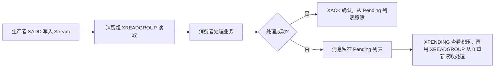
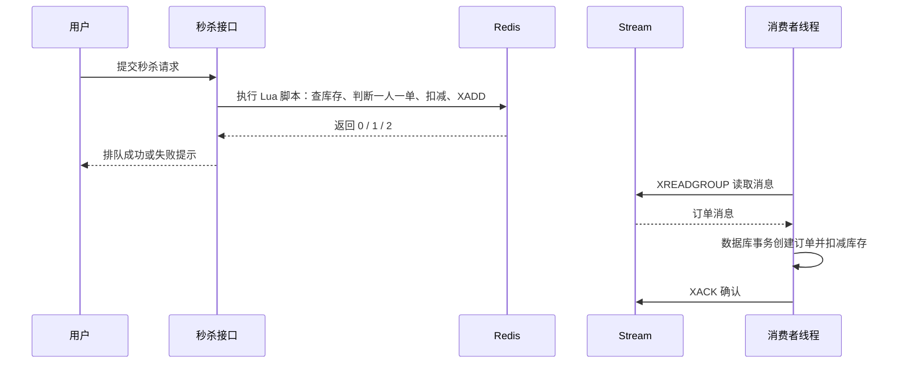

# Redis 实战：秒杀优化与消息队列

秒杀的核心矛盾是：判断资格要快、扣库存要准、写订单要稳，而这三件事的耗时量级完全不同。本篇延续前一篇的秒杀业务，把“同步下单”逐步改造成“Redis 快速判断 + 消息队列异步落库”，并补齐 Redis 三种轻量消息队列的用法与选型。

## 1 秒杀优化的整体思路

### 1.1 同步下单的问题

同步流程把资格判断、库存扣减、订单写入和响应全部放在一次请求里：

```text
请求 -> 校验参数 -> 查优惠券 -> 判断库存 -> 判断一人一单 -> 扣库存 -> 创建订单 -> 返回
```

这样做的问题：

| 问题 | 表现 |
| --- | --- |
| 数据库压力大 | 每个请求至少一次查询加两次写入，全部压在数据库上 |
| 响应时间长 | 一次请求要等所有写操作完成，用户要等几百毫秒以上 |
| 连接占用久 | 请求线程一直占着数据库连接，高并发下连接池很快耗尽 |
| 超卖风险 | 判断和扣减之间如果不用锁，会出现超卖 |

优化思路一句话：把“快速判断”放到 Redis，把“慢速落库”交给消息队列，让用户请求立刻返回。

### 1.2 三个阶段

| 阶段 | 做法 | 优点 | 缺点 |
| --- | --- | --- | --- |
| 同步下单 | 一个请求做完所有事 | 代码直观，请求结束就能返回订单结果 | 数据库压力大，响应慢 |
| 阻塞队列 | 请求线程只做判断，订单放进内存队列由线程异步处理 | 响应快，实现简单，不用引入中间件 | 受内存限制，服务重启消息全丢 |
| 消息队列 | 判断在 Redis，订单消息写进 Redis Stream | 响应快，消息可持久化、可确认、可重试 | 引入了消费组、幂等、消息堆积等新问题 |

实际项目里，阻塞队列常作为过渡方案，最终会演进到消息队列（Redis Stream 或专业的 MQ）。

### 1.3 中间方案：阻塞队列

思路：订单不再同步写数据库，而是先扔进内存里的阻塞队列，后台单线程慢慢处理。

```java
private static final ExecutorService SECKILL_ORDER_EXECUTOR = Executors.newSingleThreadExecutor();

// 指定容量，避免无限制堆积把内存吃满
private final BlockingQueue<VoucherOrder> orderTasks = new ArrayBlockingQueue<>(1024 * 1024);

@PostConstruct                       // Spring Boot 3 用 jakarta.annotation.PostConstruct
private void init() {
    SECKILL_ORDER_EXECUTOR.submit(new VoucherOrderHandler());
}

private class VoucherOrderHandler implements Runnable {
    @Override
    public void run() {
        while (true) {
            try {
                VoucherOrder order = orderTasks.take();   // 队列为空时阻塞等待
                handleVoucherOrder(order);
            } catch (Exception e) {
                log.error("处理订单异常", e);
            }
        }
    }
}
```

请求线程只做三件事：执行 Lua 判断资格、生成订单 ID、把订单放进队列。

```java
if (orderTasks.add(voucherOrder)) {
    return Result.ok("下单成功");
}
return Result.fail("服务器繁忙，请稍后重试");
```

`ArrayBlockingQueue` 的 `add` 在队列满时抛异常，`offer` 返回 `false`，正好用来做“队列满了就拒绝请求”的限流。

这个方案有两个明显缺陷：

| 缺陷 | 说明 | 后果 |
| --- | --- | --- |
| 内存限制 | 队列容量写死在内存里，最大就是 `ArrayBlockingQueue` 的容量 | 队列满以后只能拒绝请求 |
| 可靠性差 | 消息只存在于本机内存中 | 服务重启或宕机，队列里未处理的订单直接丢失 |

数据库连接池大小和队列长度还有隐式关系：如果 `ArrayBlockingQueue` 容量远大于连接池，队列会堆着大量待写订单，处理速度跟不上；所以要按实际吞吐量估算容量。

### 1.4 最终方案：Redis 判断 + Stream 异步落库

```text
请求线程：Lua 脚本（查库存 + 一人一单 + 扣库存 + 写下单消息）-> 立即返回“排队成功”
消费者线程：读取消息 -> 创建订单、扣数据库库存 -> XACK 确认
```

对比三个阶段的关键差异：

| 环节 | 同步下单 | 阻塞队列 | Redis + Stream |
| --- | --- | --- | --- |
| 资格判断 | 数据库 | Redis | Redis |
| 订单存放 | 数据库 | JVM 内存 | Redis Stream（可持久化） |
| 服务重启 | 数据在数据库，不影响 | 内存中的订单丢失 | 消息仍在 Stream 中，可继续消费 |
| 多实例部署 | 天然支持 | 只能在单机内存里排队 | 多实例通过消费组共同消费 |

## 2 Lua 脚本完成原子判断

### 2.1 为什么要用 Lua

判断库存、判断一人一单、扣库存、记录用户这四步必须一起成功或一起失败。如果分成多条命令发给 Redis，中间可能插入其他请求的命令，出现“判断时还有库存、扣减时已经被别人扣完”的超卖问题。

Lua 脚本在 Redis 中连续执行，期间不会插入其他客户端的命令，因此脚本内的“判断加修改”整体具有原子性。

### 2.2 脚本内容

```lua
-- KEYS[1] 库存 key，KEYS[2] 下单用户集合
-- ARGV[1] 用户 ID，ARGV[2] 优惠券 ID，ARGV[3] Java 侧预生成的订单 ID
local stock = tonumber(redis.call('GET', KEYS[1]))
if stock == nil or stock <= 0 then
    return 1
end
if redis.call('SISMEMBER', KEYS[2], ARGV[1]) == 1 then
    return 2
end
redis.call('DECR', KEYS[1])
redis.call('SADD', KEYS[2], ARGV[1])
return 0
```

返回值约定：`0` 表示有资格并已扣减，`1` 表示库存不足，`2` 表示已经购买过。Java 侧按返回值给出不同提示。

### 2.3 在脚本里直接写下单消息

既然脚本已经保证了原子性，就可以顺手把下单消息也写进 Stream，省掉一次网络往返：

```lua
-- KEYS[1] 库存 key，KEYS[2] 下单用户集合
-- ARGV[1] 用户 ID，ARGV[2] 优惠券 ID，ARGV[3] 预生成的订单 ID
local stock = tonumber(redis.call('GET', KEYS[1]))
if stock == nil or stock <= 0 then
    return 1
end
if redis.call('SISMEMBER', KEYS[2], ARGV[1]) == 1 then
    return 2
end
redis.call('DECR', KEYS[1])
redis.call('SADD', KEYS[2], ARGV[1])
redis.call('XADD', 'stream.orders', '*', 'id', ARGV[3], 'userId', ARGV[1], 'voucherId', ARGV[2])
return 0
```

这里把订单 ID 从 Java 侧传进来，是因为订单 ID 需要全局唯一（通常由雪花算法或 Redis 自增生成），放在 Java 里生成更可控，也便于后续按 ID 查订单。

`stream.orders` 直接写死在脚本里，脚本更简洁；如果希望脚本通用，可以把它作为 `KEYS[3]` 传进来，但要注意集群模式下脚本涉及的所有 key 必须落在同一个 slot，否则会报跨槽错误。

### 2.4 Java 侧加载与执行

```java
private static final DefaultRedisScript<Long> SECKILL_SCRIPT;

static {
    SECKILL_SCRIPT = new DefaultRedisScript<>();
    SECKILL_SCRIPT.setLocation(new ClassPathResource("seckill.lua"));
    SECKILL_SCRIPT.setResultType(Long.class);
}
```

```java
Long result = stringRedisTemplate.execute(
        SECKILL_SCRIPT,
        List.of(SECKILL_STOCK_KEY + voucherId, SECKILL_ORDER_KEY + voucherId),
        userId.toString(),
        voucherId.toString(),
        orderId.toString());
int r = result == null ? -1 : result.intValue();
if (r != 0) {
    return Result.fail(r == 1 ? "库存不足" : "不能重复下单");
}
return Result.ok(orderId);
```

### 2.5 写脚本时的注意事项

| 注意点 | 原因 |
| --- | --- |
| 脚本要短、逻辑要简单 | Redis 单线程执行脚本，脚本长时间运行会阻塞所有请求 |
| 不要在脚本里做网络或磁盘操作 | 脚本内只应操作 Redis 数据 |
| 所有 key 通过 `KEYS` 传入 | 集群模式下 Redis 需要据此检查 key 是否同槽，也便于运维统计 |
| 不要把大量数据塞进 `ARGV` | 参数过大影响网络传输和内存 |
| 脚本本身不提供回滚 | 脚本报错时已执行的命令不会自动撤销，所以要保证脚本内逻辑不会中途失败 |

## 3 Redis 作为消息队列

### 3.1 消息队列的基本概念

| 概念 | 说明 |
| --- | --- |
| 生产者 | 产生消息的一方，这里就是秒杀请求线程 |
| 消息队列 | 暂存消息的容器，起到削峰和异步的作用 |
| 消费者 | 读取并处理消息的一方，这里就是后台线程 |
| 确认 | 消费者处理成功后告诉队列“这条消息可以删了” |
| 重试 | 处理失败或消费者宕机时，消息能被再次处理 |
| 幂等 | 同一条消息处理多次，业务结果只生效一次 |
| 死信 | 多次重试仍失败的消息，需要单独记录和人工处理 |

Redis 提供了三种轻量级消息队列方案：List、Pub/Sub 和 Stream。它们的可靠性依次递增。

### 3.2 可靠性流程



### 3.3 List 实现的队列

```text
# 生产者
RPUSH queue:order {"userId":1001,"voucherId":10}

# 消费者，0 表示一直阻塞等待
BLPOP queue:order 0
```

用 List 做队列就是“左边进右边出”或者反过来，`BLPOP` 在队列为空时阻塞等待，不占用 CPU 空转。

想让取出和备份成为一步，可以用 `BRPOPLPUSH queue:order queue:order:backup 0`，把取出的消息同时放进备份队列；处理成功后从备份队列删除，处理失败时可以重新放回。Redis 6.2 起推荐使用功能更强的 `BLMOVE`（`BRPOPLPUSH` 已标记为过时用法）。

| 优点 | 缺点 | 适用场景 |
| --- | --- | --- |
| 命令少、学习成本低，支持阻塞读取 | 没有确认和消费组；消息取出后消费者宕机就可能丢失 | 可靠性要求低的简单任务 |

### 3.4 Pub/Sub 发布订阅

```text
# 订阅者
SUBSCRIBE order-channel

# 发布者
PUBLISH order-channel order-created
```

发布者把消息发给频道，所有订阅该频道的客户端都会收到。除了 `SUBSCRIBE` 精确订阅，还有 `PSUBSCRIBE` 模式订阅，模式里可以用通配符：

```text
PSUBSCRIBE order.*        # 匹配 order.created、order.paid 等
PUBLISH order.paid 2001
```

`PSUBSCRIBE` 收到的消息类型是 `pmessage`，比普通消息多一个匹配到的模式字段。查看频道可以用 `PUBSUB CHANNELS`，查看订阅数可以用 `PUBSUB NUMSUB` 和 `PUBSUB NUMPAT`。

Pub/Sub 适合实时通知，但没有消息持久化和确认机制，订阅者离线期间发布的消息不会补发，也无法重试。

| 优点 | 缺点 | 适用场景 |
| --- | --- | --- |
| 一条消息广播给所有订阅者，实时性好 | 不保存历史消息，无法确认和重试 | 在线通知、配置变更广播、聊天室 |

### 3.5 Stream 基础命令

Stream 是追加式日志，每条消息有唯一的 ID，格式是“毫秒时间戳-序号”，例如 `1710000000000-0`。

```text
# 追加消息，* 表示由 Redis 生成 ID
XADD stream.orders * userId 1001 voucherId 10

# 限制长度，只保留最近 1000 条，~ 表示近似裁剪，效率更高
XADD stream.orders MAXLEN ~ 1000 * userId 1001 voucherId 10

# 查看长度
XLEN stream.orders

# 按 ID 范围读取，- 是最小 ID，+ 是最大 ID
XRANGE stream.orders - +

# 倒序读取
XREVRANGE stream.orders + -

# 删除指定消息
XDEL stream.orders 1710000000000-0
```

`XREAD` 面向单个消费者，不记录消费进度：

```text
# 从指定 ID 之后开始读，$ 表示只读从现在起产生的新消息
XREAD COUNT 2 BLOCK 1000 STREAMS stream.orders $
```

### 3.6 消费组与消息确认

消费组（consumer group）让多个消费者分摊同一条 Stream 的消息，每条消息在组内只投递给一个消费者。

```text
# 创建消费组，0 表示从最早的消息开始；MKSTREAM 表示 Stream 不存在时自动创建
XGROUP CREATE stream.orders order-group 0 MKSTREAM

# 从组里读取新消息
XREADGROUP GROUP order-group worker-1 COUNT 1 BLOCK 2000 STREAMS stream.orders >

# 处理成功后确认
XACK stream.orders order-group 1710000000000-0

# 查看组、消费者信息
XINFO GROUPS stream.orders
XINFO CONSUMERS stream.orders order-group
```

`XREADGROUP` 的 ID 参数有两种含义，这是最容易混的地方：

| ID 写法 | 含义 |
| --- | --- |
| `>` | 读取从未投递给任何消费者的新消息 |
| 具体 ID 或 `0` | 读取当前消费者 Pending 列表里的消息，从一个 ID 之后开始 |

另外 `XREADGROUP` 支持 `NOACK` 参数，表示读完不写入 Pending 列表：

```text
XREADGROUP GROUP order-group worker-2 NOACK STREAMS stream.orders >
```

`NOACK` 省掉了确认开销，但也意味着这条消息不会再被重试，只适合“丢一条无所谓”的场景，可靠异步任务不要用。

消费组的管理命令：

```text
# 删除消费组
XGROUP DESTROY stream.orders order-group

# 手动创建和删除消费者（一般由 XREADGROUP 自动创建）
XGROUP CREATECONSUMER stream.orders order-group worker-3
XGROUP DELCONSUMER stream.orders order-group worker-3
```

### 3.7 Pending 列表与失败重试

被投递但还没 `XACK` 的消息会进入 Pending 列表（PEL）。如果消费者处理到一半宕机，消息就一直挂在列表里。

```text
# 概览：待确认消息总数、最小 ID、最大 ID、各消费者待确认数量
XPENDING stream.orders order-group

# 明细：查看具体的待确认消息
XPENDING stream.orders order-group - + 10

# 只看某个消费者的待确认消息
XPENDING stream.orders order-group - + 10 worker-1
```

重试的做法很直接：用自己的消费者名字，从 Pending 列表里把消息按顺序取出来重新处理，成功后再确认。

```text
# 注意这里读的是自己 pending 里的消息，不是新消息
XREADGROUP GROUP order-group worker-1 COUNT 1 STREAMS stream.orders 0

# 处理成功
XACK stream.orders order-group 1710000000000-0
```

循环执行“读取 Pending、处理、XACK”，直到 `XPENDING` 返回空，说明这个消费者没有遗留消息了。这个流程通常配合下面的启动逻辑：

| 时机 | 处理方式 |
| --- | --- |
| 应用启动时 | 先处理一次 Pending 列表，把上次没确认完的消息补完 |
| 正常读取时抛异常 | 记录日志，转入 Pending 处理流程 |
| 消费者永久下线 | Redis 6.2 起可用 `XAUTOCLAIM` 按空闲时间批量认领消息，也可以人工用 `XCLAIM` 指定认领 |

Pending 消息不会自动过期，长时间没人确认就会一直堆积，所以要定期用 `XPENDING` 监控积压数量。

### 3.8 三种方案的横向对比

| 维度 | List | Pub/Sub | Stream |
| --- | --- | --- | --- |
| 消息持久化 | 有，存在 List 里并随 RDB/AOF 持久化 | 无，发完即丢 | 有，追加日志，可持久化 |
| 消费确认 | 无 | 无 | `XACK` 加 Pending 列表 |
| 阻塞读取 | `BLPOP`、`BRPOP` | 订阅本身就是被动推送 | `XREADGROUP ... BLOCK` |
| 消费组 | 无，一条消息只能被一个消费者取走 | 无，所有订阅者都会收到 | 有，组内分摊消息 |
| 消息回溯 | 无 | 无 | 有，可按 ID 范围重新读取 |
| 消息堆积 | 可堆积，容量靠业务控制 | 不能堆积，处理不过来就丢 | 可堆积，可用 `MAXLEN` 控制长度 |
| 典型场景 | 极简任务队列 | 实时广播通知 | 可靠异步任务、事件流 |

选型口诀：只要通知用 Pub/Sub，图简单用 List，要可靠就用 Stream。

## 4 Spring Data Redis 操作 Stream

### 4.1 发送消息

```java
private static final String QUEUE_NAME = "stream.orders";

Map<String, String> message = Map.of(
        "id", orderId.toString(),
        "userId", userId.toString(),
        "voucherId", voucherId.toString());
stringRedisTemplate.opsForStream().add(
        StreamRecords.newRecord().ofMap(message).withStreamKey(QUEUE_NAME));
```

如果消息在 Lua 脚本里已经写进 Stream，这一步就不需要了。

### 4.2 创建消费组（幂等处理）

```java
@PostConstruct
private void init() {
    try {
        stringRedisTemplate.opsForStream().createGroup(QUEUE_NAME, ReadOffset.from("0"), GROUP_NAME);
    } catch (Exception e) {
        log.debug("消费组已存在，忽略该异常");
    }
}
```

`ReadOffset.from("0")` 表示从最早的消息开始消费，`ReadOffset.latest()` 表示只消费之后产生的新消息。重复创建消费组时 Redis 返回 `BUSYGROUP Consumer Group name already exists`，Spring Data Redis 会把它包成异常抛出，所以要用 `try-catch` 保证幂等。

### 4.3 消费消息

```java
private static final String GROUP_NAME = "g1";
private static final String CONSUMER_NAME = "consumer-1";

private void consume() {
    while (true) {
        try {
            List<MapRecord<String, Object, Object>> records = stringRedisTemplate.opsForStream().read(
                    Consumer.from(GROUP_NAME, CONSUMER_NAME),
                    StreamReadOptions.empty().count(1).block(Duration.ofSeconds(2)),
                    StreamOffset.create(QUEUE_NAME, ReadOffset.lastConsumed()));
            if (records == null || records.isEmpty()) {
                continue;
            }
            MapRecord<String, Object, Object> record = records.get(0);
            handleVoucherOrder(parse(record));
            stringRedisTemplate.opsForStream().acknowledge(QUEUE_NAME, GROUP_NAME, record.getId());
        } catch (Exception e) {
            log.error("处理消息异常", e);
            handlePendingList();
        }
    }
}
```

`ReadOffset.lastConsumed()` 等价于命令行里的 `>`，表示读取从未投递的新消息。`block(Duration)` 让读取阻塞等待，避免空转。

### 4.4 处理 Pending 列表

```java
private void handlePendingList() {
    while (true) {
        try {
            List<MapRecord<String, Object, Object>> records = stringRedisTemplate.opsForStream().read(
                    Consumer.from(GROUP_NAME, CONSUMER_NAME),
                    StreamReadOptions.empty().count(1),
                    StreamOffset.create(QUEUE_NAME, ReadOffset.from("0")));
            if (records == null || records.isEmpty()) {
                break;
            }
            MapRecord<String, Object, Object> record = records.get(0);
            handleVoucherOrder(parse(record));
            stringRedisTemplate.opsForStream().acknowledge(QUEUE_NAME, GROUP_NAME, record.getId());
        } catch (Exception e) {
            log.error("处理 Pending 消息异常", e);
            break;
        }
    }
}
```

`ReadOffset.from("0")` 换成具体 ID 后，读的就是该消费者 Pending 列表里的消息；处理成功后必须 `acknowledge`，否则下次启动还会重复处理。

### 4.5 让事务真的生效

`@Transactional` 靠 Spring 代理对象起作用，同一类里直接调用自己的方法属于自调用，不经过代理，事务会失效。所以消费者要持有服务的代理对象再调用：

```java
@Resource
private IVoucherOrderService voucherOrderService;

public void handleVoucherOrder(VoucherOrder order) {
    RLock lock = redissonClient.getLock("lock:order:" + order.getUserId());
    if (!lock.tryLock()) {
        log.error("不允许重复下单");
        return;
    }
    try {
        voucherOrderService.handleVoucherOrder(order);   // 通过 Spring 代理调用，事务生效
    } finally {
        lock.unlock();
    }
}
```

## 5 完整链路与幂等

### 5.1 异步秒杀链路



### 5.2 消费者必须保证幂等

同一条消息可能被投递两次（重试、Pending 补处理、消费者重连），所以创建订单的逻辑必须能识别重复。

| 做法 | 说明 |
| --- | --- |
| 数据库唯一索引 | 用户 ID 加优惠券 ID 建唯一索引，重复插入时捕获 `DuplicateKeyException` 视为处理成功 |
| 业务状态判断 | 先查订单是否已存在，存在就直接确认消息 |
| 记录已处理的消息 ID | 用 Set 或数据库表记录消息 ID，处理前先判断 |

推荐用数据库唯一索引兜底，因为它是最可靠的最后一道防线，代码里再配合查询减少无效插入。

### 5.3 常见坑

| 坑 | 说明 |
| --- | --- |
| 下单成功但订单没创建 | 消息丢了或消费者一直失败。必须监控 `XPENDING` 的积压数量 |
| 消息重复处理导致重复下单 | 缺少唯一索引或幂等判断 |
| 消费者启动顺序错误 | 消费者在消费组创建之前启动，会报 `NOGROUP` 错误 |
| `NOACK` 用错地方 | 用在不允许丢消息的场景，消息无法重试 |
| 事务失效 | 自调用导致 `@Transactional` 不生效，订单与库存不一致 |
| 用 Stream 存无限增长 | 没有设置 `MAXLEN`，Stream 一直增长，内存被吃满 |
| 把 Stream 当专业 MQ 用 | 缺少延时消息、事务消息、死信队列等完整能力，复杂场景建议用专业 MQ |

## 6 本篇总结

1. 秒杀优化的核心是把快速判断留在 Redis，把慢速落库交给异步消费者，让请求线程尽快返回。
2. 阻塞队列（`ArrayBlockingQueue` 加 `Executors.newSingleThreadExecutor`）是过渡方案，受内存限制且服务重启会丢消息。
3. Lua 脚本在 Redis 中连续执行，能把库存判断、一人一单、库存扣减和写消息合并成一个原子操作。
4. 订单 ID 一般由 Java 侧预生成后作为参数传给脚本，便于保证全局唯一和后续查询。
5. Stream 的消息有 ID、可持久化、支持消费组，`XGROUP CREATE` 配合 `MKSTREAM` 可以自动创建 Stream。
6. `XREADGROUP` 中 `>` 表示新消息，`0` 或具体 ID 表示读取自己的 Pending 列表消息。
7. 处理成功必须 `XACK`，失败的消息留在 Pending 列表，用 `XPENDING` 查看、重新读取并处理。
8. Spring Data Redis 用 `StreamOffset.create` 配合 `ReadOffset.lastConsumed()` 读新消息，配合 `ReadOffset.from("0")` 读 Pending。
9. List 简单、Pub/Sub 适合广播、Stream 适合可靠异步任务，选型看可靠性与复杂度要求。
10. 消费者必须处理幂等，并保证 `@Transactional` 通过 Spring 代理调用生效。
