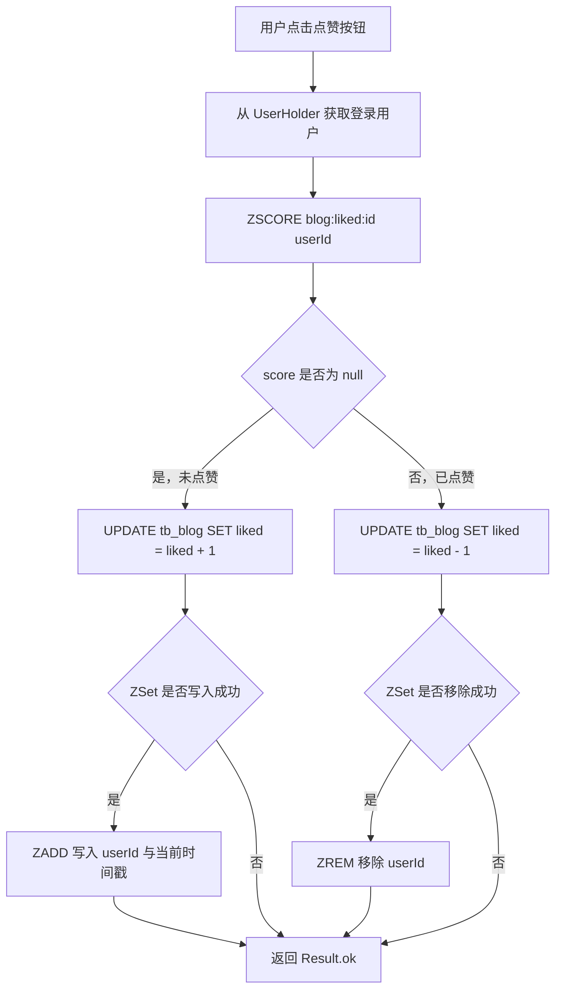
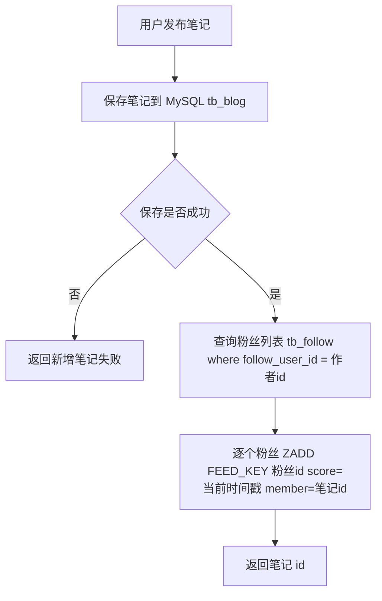
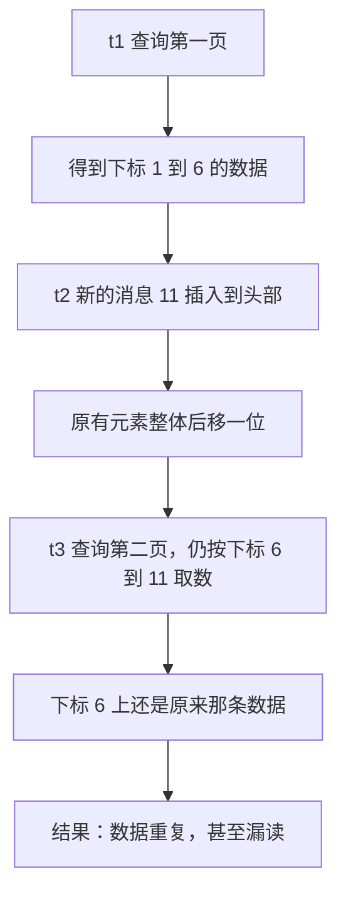

# Redis 实战：达人探店与好友关注

达人探店与好友关注是 Redis 在社交场景中最典型的两个应用。探店模块的核心是“内容在数据库，互动状态在 Redis”：数据库保存笔记正文、图片、作者关系和点赞总数；Redis 保存点赞用户集合、点赞时间排序和热点状态。好友关注模块的核心是“关系在数据库，集合运算在 Redis”：关注关系落库到 `tb_follow` 表，Redis 用 Set 保存关注列表从而支持原生交集运算；用户发布笔记时，再把笔记写入粉丝的 Redis 收件箱，形成 Feed 流。

本篇沿用黑马点评项目（hmdp）的代码结构，涉及 `tb_blog`、`tb_follow` 两张表和 `BlogController`、`BlogServiceImpl`、`FollowController`、`FollowServiceImpl` 四个主要类。

## 1 达人探店

达人探店模块负责笔记的发布、详情查询、点赞和点赞排行榜。这几项功能共用同一份数据源，只是访问频率差别很大，因此需要把“正文数据”和“互动状态”分开存放。

### 1.1 发布探店笔记

笔记发布本身并不使用 Redis，正文和图片路径都保存在 MySQL：

- `tb_blog`：探店笔记表，包含笔记的标题、文字、图片、作者 id 和点赞数 `liked` 等字段。
- `tb_blog_comments`：其他用户对探店笔记的评价。

发布功能只需要把图片上传目录常量指向自己的 nginx 服务器图片路径：

```java
public static final String IMAGE_UPLOAD_DIR = "E:\\software\\Java\\project\\itheima-redis\\nginx-1.18.0\\html\\hmdp\\imgs";
```

### 1.2 查看探店笔记

点击某一篇笔记后会请求笔记详情，接口设计如下：

| 项目 | 内容 |
| --- | --- |
| 请求方式 | GET |
| 请求路径 | `/blog/{id}` |
| 请求参数 | `id`，blog 的 id |
| 返回值 | `Blog`，笔记信息，包含用户信息 |

```java
@GetMapping("/{id}")
public Result queryBlogById(@PathVariable Long id) {
    return blogService.queryBlogById(id);
}
```

```java
@Override
public Result queryBlogById(Long id) {
    // 1.查询blog
    Blog blog = getById(id);
    if (blog == null) {
        return Result.fail("笔记不存在！");
    }
    // 2.查询blog有关的用户
    queryBlogUser(blog);
    return Result.ok(blog);
}

private void queryBlogUser(Blog blog) {
    Long userId = blog.getUserId();
    User user = userService.getById(userId);
    blog.setName(user.getNickName());
    blog.setIcon(user.getIcon());
}
```

查到笔记后必须补齐作者昵称和头像，前端才能正常显示。列表场景下逐条查询用户会产生大量 SQL 请求，后面会改为批量查询。

### 1.3 点赞数为什么必须存在 MySQL

一个常见的错误写法是：点赞用户存 `blog:liked:{id}`，点赞数用 `INCR blog:likes:{id}` 维护。这种做法有两个问题：

1. 键名冲突。`blog:liked:1001` 与 `blog:likes:1001` 只差一个字母，一旦手写错就会让同一个 key 既是 Set 又是 String，而 Redis 中同一个 key 只能是一种数据类型，误用会直接报类型错误。
2. 数据源分裂。如果改成用同一个 key 同时承载计数和集合，则一定失败——同一个 key 不可能既当计数器又当 Sorted Set。

因此正确的分工是：

- MySQL 的 `tb_blog.liked` 字段保存点赞总数，是唯一的计数来源。
- Redis 只负责回答“谁点过赞”，不保存总数。

计数增减必须由数据库原子完成，避免“读到旧值再加一”导致丢失更新。MyBatis-Plus 的 `update().setSql(...)` 直接拼接自增表达式，最终由数据库执行：

```java
boolean isSuccess = update().setSql("liked = liked + 1").eq("id", id).update();
```

```sql
UPDATE tb_blog SET liked = liked + 1 WHERE id = 1001;
```

取消点赞则执行 `liked = liked - 1`。三种方案的对比：

| 方案 | 计数存放位置 | 优点 | 缺点 | 适用场景 |
| --- | --- | --- | --- | --- |
| 只修改数据库 | MySQL 字段 | 数据来源单一，一致性直观 | 高并发下数据库压力大 | 低流量后台系统 |
| Redis 同时存计数和集合 | Redis | 读写都在内存，速度快 | 同一个 key 无法既当计数器又当集合；易与库不一致 | 不推荐 |
| Redis 只存“谁点过”，计数在 MySQL | MySQL 字段 | 计数由数据库自增保证正确，Redis 判断是否点过很快 | Redis 与数据库可能短暂不一致 | 本项目采用 |

### 1.4 点赞：从 Set 到 Sorted Set

最初的实现基于 Redis 的 Set 集合：判断 Set 中是否包含当前用户来决定点赞还是取消，并同步修改数据库的 `liked` 字段。Set 天然去重，重复添加同一个用户不会产生多余元素，因此一人一赞的约束由数据结构本身保证。

```text
# 点赞：加入集合，数据库 liked = liked + 1
SADD blog:liked:1001 2001

# 取消点赞：移出集合，数据库 liked = liked - 1
SREM blog:liked:1001 2001
```

但需求变了：在探店笔记详情页面，需要按照点赞时间的前后顺序显示 Top5 点赞排行榜。Set 是无序集合，不能表达“先点后点”的先后关系，也无法按时间做范围查询，所以原来的 Set 集合就不能再用了，需要使用 Sorted Set 集合存放点赞用户，score 字段放置时间戳。

| 对比项 | Set 方案 | Sorted Set 方案 |
| --- | --- | --- |
| 是否有序 | 否 | 是，按 score 排序 |
| score 含义 | 无 | `System.currentTimeMillis()` 点赞时间戳 |
| 判断是否点过 | `SISMEMBER` 返回 true/false | `ZSCORE` 返回 null 表示未点赞 |
| 取前若干名 | 不支持，只能全量取回 | `ZRANGE key 0 4` 直接取前 5 个 |
| 适用场景 | 只需判断“点没点过” | 需要排行榜、按时间排序 |

#### 1.4.1 判断是否点过：ZSCORE 代替 SISMEMBER

Sorted Set 没有 `SISMEMBER`，但有更直接的办法：查询当前用户在集合中的 score。`ZSCORE` 返回 null 说明该用户不在集合中，即未点赞；返回时间戳说明已点赞，返回值还顺便告诉了我们点赞时间。

```text
# 未点赞：返回 nil
ZSCORE blog:liked:1001 2001

# 点赞后：返回点赞时写入的时间戳
ZADD blog:liked:1001 1710000000000 2001
ZSCORE blog:liked:1001 2001
```

#### 1.4.2 点赞逻辑改造

Blog 类需要新增一个非数据库字段用于返回给前端：

```java
// 是否点赞过了
@TableField(exist = false)
private Boolean isLike;
```

BlogController 修改原有的 likeBlog 方法：

```java
@PutMapping("/like/{id}")
public Result likeBlog(@PathVariable("id") Long id) {
    return blogService.likeBlog(id);
}
```

BlogServiceImpl 中改造后的点赞逻辑：

```java
@Override
public Result likeBlog(Long id) {
    // 1.获取登录用户
    Long userId = UserHolder.getUser().getId();
    // 2.判断当前登录用户是否已经点赞
    String key = RedisConstants.BLOG_LIKED_KEY + id;
    Double score = stringRedisTemplate.opsForZSet().score(key, userId.toString());
    if (score == null) {
        // 3.如果未点赞，可以点赞
        // 3.1 数据库点赞数+1
        boolean isSuccess = update().setSql("liked = liked + 1").eq("id", id).update();
        // 3.2 保存用户到Redis的sorted set集合，score 为当前时间戳
        if (isSuccess) {
            stringRedisTemplate.opsForZSet().add(key, userId.toString(), System.currentTimeMillis());
        }
    } else {
        // 4.如果已点赞，取消点赞
        // 4.1 数据库点赞数-1
        boolean isSuccess = update().setSql("liked = liked - 1").eq("id", id).update();
        // 4.2 把用户从Redis的sorted set集合移除
        if (isSuccess) {
            stringRedisTemplate.opsForZSet().remove(key, userId.toString());
        }
    }
    return Result.ok();
}
```

先更新数据库、成功后再写 Redis，是为了保证“数据库没改成功就不留下 Redis 脏数据”。

#### 1.4.3 点亮点赞按钮与热门笔记查询

点赞后并不会自动点亮点赞按钮，还需要修改探店笔记查询接口。BlogController 的 queryHotBlog 方法：

```java
@GetMapping("/hot")
public Result queryHotBlog(@RequestParam(value = "current", defaultValue = "1") Integer current) {
    return blogService.queryHotBlog(current);
}
```

BlogServiceImpl 中的实现：按 `liked` 倒序分页，再逐条补齐作者信息和点赞状态。

```java
@Override
public Result queryHotBlog(Integer current) {
    // 根据用户查询
    Page<Blog> page = query()
            .orderByDesc("liked")
            .page(new Page<>(current, SystemConstants.MAX_PAGE_SIZE));
    // 获取当前页数据
    List<Blog> records = page.getRecords();
    // 查询用户
    records.forEach(blog -> {
        this.queryBlogUser(blog);
        this.isBlogLiked(blog);
    });
    return Result.ok(records);
}

private void isBlogLiked(Blog blog) {
    // 1.获取登录用户
    UserDTO user = UserHolder.getUser();
    if (user == null) {
        // 用户未登录，无需查询是否点赞
        return;
    }
    Long userId = user.getId();
    // 2.判断当前登录用户是否已经点赞
    String key = RedisConstants.BLOG_LIKED_KEY + blog.getId();
    Double score = stringRedisTemplate.opsForZSet().score(key, userId.toString());
    blog.setIsLike(score != null);
}
```

这里有一个容易忽略的细节：如果直接写 `UserHolder.getUser().getId()`，未登录用户访问热门笔记时会抛空指针异常。加上 `user == null` 判断后直接 return，`isLike` 保持默认值，接口依然可以正常返回，`queryHotBlog` 也就天然支持未登录访问。

#### 1.4.4 点赞排行榜：取点赞最多的前 5 个

BlogController 新增 queryBlogLikes 方法：

```java
@GetMapping("/likes/{id}")
public Result queryBlogLikes(@PathVariable("id") Long id) {
    return blogService.queryBlogLikes(id);
}
```

BlogServiceImpl 类新增 queryBlogLikes 方法：

```java
@Override
public Result queryBlogLikes(Long id) {
    String key = RedisConstants.BLOG_LIKED_KEY + id;
    // 1.查询top5的点赞用户 zrange key 0 4
    Set<String> top5 = stringRedisTemplate.opsForZSet().range(key, 0, 4);
    if (top5 == null || top5.isEmpty()) {
        return Result.ok(Collections.emptyList());
    }
    // 2.解析出其中的用户id
    List<Long> ids = top5.stream().map(Long::valueOf).collect(Collectors.toList());
    String idStr = StrUtil.join(",", ids);
    // 3.根据用户id查询用户 WHERE id IN ( 5 , 1 ) ORDER BY FIELD(id, 5, 1)
    List<UserDTO> userDTOS = userService.query()
            .in("id", ids).last("ORDER BY FIELD(id," + idStr + ")").list()
            .stream()
            .map(user -> BeanUtil.copyProperties(user, UserDTO.class))
            .collect(Collectors.toList());
    // 4.返回
    return Result.ok(userDTOS);
}
```

这里必须用 `ORDER BY FIELD`。`ZRANGE key 0 4` 返回的顺序是点赞时间顺序，但 SQL 是 `WHERE id IN (5, 1)`，`IN` 只能筛选、不保证顺序，数据库可能按主键返回 1、5，把排行榜顺序打乱：

```text
# 等价的 Redis 命令：按 score 升序取下标 0 到 4 的成员，即最早点赞的 5 个
ZRANGE blog:liked:1001 0 4
```

```sql
SELECT * FROM tb_user WHERE id IN (5, 1) ORDER BY FIELD(id, 5, 1);
```

`FIELD(id, 5, 1)` 返回 id 在列表中的位置，因此 5 会排在 1 前面。MyBatis-Plus 用 `last()` 把排序片段拼到 SQL 末尾：

```java
userService.query()
        .in("id", ids).last("ORDER BY FIELD(id," + idStr + ")").list();
```

`last()` 的内容会原样拼接到 SQL 末尾，存在 SQL 注入风险。这里的 `idStr` 由 Redis 中的成员转成 `Long` 后再拼接，类型可控，属于安全用法；如果拼接用户直接输入的内容，必须改用参数绑定。

### 1.5 点赞完整流程



## 2 好友关注

关注关系是集合关系：用户 A 的关注集合与用户 B 的关注集合求交集，就能得到共同关注。Set 的价值在于自动去重和原生集合运算，所以关注列表适合用 Set 保存。

### 2.1 关注关系的数据模型

用户和用户的关注关系为多对多，这里使用 `tb_follow` 表用于记录关注关系，关注即查询信息是否存在，取消关注即删除数据。

| 字段 | 含义 |
| --- | --- |
| `user_id` | 关注发起方的用户 id |
| `follow_user_id` | 被关注的用户 id |

关注关系本身保存在 MySQL，Redis 只是它的一份“关注列表缓存”。

### 2.2 关注与取消关注

使用 Set 保存某个用户关注了谁，key 为 `follows:{userId}`；关注时 SADD，取消关注时 SREM。

```java
@Resource
private IFollowService followService;

// 关注
@PutMapping("/{id}/{isFollow}")
public Result follow(@PathVariable("id") Long followUserId, @PathVariable("isFollow") Boolean isFollow) {
    return followService.follow(followUserId, isFollow);
}

// 取消关注
@GetMapping("/or/not/{id}")
public Result isFollow(@PathVariable("id") Long followUserId) {
    return followService.isFollow(followUserId);
}
```

```java
@Service
public class FollowServiceImpl extends ServiceImpl<FollowMapper, Follow> implements IFollowService {

    @Override
    public Result follow(Long followUserId, Boolean isFollow) {
        // 1.获取登录用户
        Long userId = UserHolder.getUser().getId();
        String key = "follows:" + userId;
        // 2.判断到底是关注还是取关
        if (isFollow) {
            // 关注，新增数据
            Follow follow = new Follow();
            follow.setUserId(userId);
            follow.setFollowUserId(followUserId);
            boolean isSuccess = save(follow);
            if (isSuccess) {
                // 把关注用户的id，放入redis的set集合 sadd userId followerUserId
                stringRedisTemplate.opsForSet().add(key, followUserId.toString());
            }
        } else {
            // 取关，删除 delete from tb_follow where user_id = ? and follow_user_id = ?
            boolean isSuccess = remove(new QueryWrapper<Follow>()
                    .eq("user_id", userId).eq("follow_user_id", followUserId));
            if (isSuccess) {
                // 把关注用户的id从Redis集合中移除
                stringRedisTemplate.opsForSet().remove(key, followUserId.toString());
            }
        }
        return Result.ok();
    }

    @Override
    public Result isFollow(Long followUserId) {
        // 1.获取登录用户
        Long userId = UserHolder.getUser().getId();
        // 2.查询是否关注 select count(*) from tb_follow where user_id = ? and follow_user_id = ?
        Integer count = query().eq("user_id", userId).eq("follow_user_id", followUserId).count();
        // 3.判断
        return Result.ok(count > 0);
    }
}
```

注意 key 的写法是 `follows:` 而不是 `follow:`。这个前缀必须与项目常量保持一致，因为共同关注和 Feed 推送都要读写同一批 key；一旦某个方法写成 `follow:{userId}`，交集就会算错，得到的共同关注会一直是空集。

### 2.3 共同关注

查询两个人的共同关注就是求两个人关注列表的交集，考虑到 Redis 的 Set 集合有求交集功能，这里用 Set 集合实现。先把交集结果取出来，再批量查询用户信息：

```java
@GetMapping("/common/{id}")
public Result followCommons(@PathVariable Long id) {
    return followService.followCommons(id);
}
```

```java
@Resource
private IUserService userService;

@Override
public Result followCommons(Long id) {
    // 1.获取当前用户
    Long userId = UserHolder.getUser().getId();
    String key = "follows:" + userId;
    // 2.求交集
    String key2 = "follows:" + id;
    Set<String> intersect = stringRedisTemplate.opsForSet().intersect(key, key2);
    if (intersect == null || intersect.isEmpty()) {
        // 无交集
        return Result.ok(Collections.emptyList());
    }
    // 3.解析id集合
    List<Long> ids = intersect.stream().map(Long::valueOf).collect(Collectors.toList());
    // 4.查询用户
    List<UserDTO> users = userService.listByIds(ids)
            .stream()
            .map(user -> BeanUtil.copyProperties(user, UserDTO.class))
            .collect(Collectors.toList());
    return Result.ok(users);
}
```

```text
# 等价的 Redis 命令：求两个用户关注列表的交集
SINTER follows:1001 follows:1002
```

用 `listByIds` 批量查询，避免按 id 循环查库。如果结果很多，应限制查询数量或改用分页，避免一次返回过多数据。

### 2.4 三层数据结构的分工

到这里，项目里已经出现了三类 Redis 结构，容易混淆，用一张表固定下来：

| 业务 | Redis 结构 | key 形态 | 作用 |
| --- | --- | --- | --- |
| 点赞用户 | Sorted Set | `BLOG_LIKED_KEY + blogId` | 判断是否点过、取 Top5 排行榜 |
| 关注列表 | Set | `follows:{userId}` | 求共同关注，支持 `SINTER` |
| 粉丝收件箱 | Sorted Set | `FEED_KEY + userId` | 按发布时间排序的 Feed 数据 |

点赞数、关注关系、笔记正文都不在 Redis 中，它们分别由 `tb_blog.liked` 字段和 `tb_follow` 表承担。

## 3 关注推送与 Feed 流

### 3.1 Feed 流是什么

推送就是把消息推送给用户，使用户可以及时看到消息，而关注推送就是用户如果发布了一篇笔记，就把这篇笔记推送给所有的粉丝，为用户提供沉浸式体验，通过无限下拉刷新获取新的消息，也叫 Feed 流。

Feed 的本质是“每个用户的一份有序收件箱”。Sorted Set 的 score 保存发布时间，member 保存内容 ID；读取时再根据 ID 批量查询正文。

### 3.2 两种 Feed 模式

Feed 流的实现有两种模式：

- Timeline：不做内容筛选，简单地按照内容发布时间排序，常用于好友或关注。例如朋友圈。
  - 优点：信息全面，不会有缺失，并且实现也相对简单。
  - 缺点：信息噪音较多，用户不一定感兴趣，内容获取效率低。
- 智能排序：利用智能算法屏蔽掉违规的、用户不感兴趣的内容，推送用户感兴趣的信息来吸引用户。
  - 优点：投喂用户感兴趣信息，用户粘度很高，容易沉迷。
  - 缺点：如果算法不精准，可能起到反作用。

| 模式 | 是否筛选内容 | 排序依据 | 优点 | 缺点 | 典型场景 |
| --- | --- | --- | --- | --- | --- |
| Timeline | 不筛选 | 发布时间 | 信息全面无缺失，实现简单 | 噪音多，获取效率低 | 朋友圈、关注列表 |
| 智能排序 | 算法筛选 | 兴趣度 | 用户粘度高 | 算法不精准时适得其反 | 推荐流、短视频 |

本例基于关注的好友来做 Feed 流，所以采用 Timeline 模式。

### 3.3 三种投递模式

Timeline 模式的实现模式有三种。

拉模式：也叫读扩散。比如张三、李四、王五各自有自己的发件箱，发送消息发送到自己的发件箱；如果赵六要读取，需要拉取三个人的发件箱信息到自己的收件箱，然后按照时间排序，读取完清除。

- 优点：节约空间，没有重复读取，读完清除。
- 缺点：比较延迟，每次读取都要拉取，如果关注的人多，会造成压力。

推模式：也叫写扩散。比如每个粉丝都有自己的收件箱，张三或李四发布内容要推送到所有粉丝的收件箱里。

- 优点：时效快，不用临时拉取。
- 缺点：内存压力大，如果粉丝很多就会推送麻烦。

推拉结合模式：也叫读写混合，兼具推和拉两种模式的优点。比如普通用户粉丝少，就可以直接把消息推送给所有粉丝；而大 V 粉丝多，有一个自己的发件箱，发送消息写入发件箱的同时推送给活跃的粉丝，不活跃的粉丝查看时自己从发件箱读。

| 对比项 | 拉模式 | 推模式 | 推拉结合模式 |
| --- | --- | --- | --- |
| 别名 | 读扩散 | 写扩散 | 读写混合 |
| 写比例 | 低 | 高 | 中 |
| 读比例 | 高 | 低 | 中 |
| 用户读取延迟 | 高 | 低 | 低 |
| 实现难度 | 复杂 | 简单 | 很复杂 |
| 使用场景 | 很少使用 | 用户量少，没有大 V | 过千万的用户量，有大 V |

三种模式的核心取舍是：把成本放在写入时（推模式）还是放在读取时（拉模式）。推模式牺牲写性能换读性能，拉模式相反，推拉结合则按用户规模区分对待。

### 3.4 推送到粉丝收件箱

需求如下：

- 修改新增探店笔记的业务，在保存 blog 到数据库的同时，推送到粉丝的收件箱。
- 收件箱要满足可以根据时间戳排序，必须用 Redis 的数据结构实现。
- 查询收件箱数据时，可以实现分页查询。



```java
@PostMapping
public Result saveBlog(@RequestBody Blog blog) {
    return blogService.saveBlog(blog);
}
```

```java
@Resource
private IFollowService followService;

@Override
public Result saveBlog(Blog blog) {
    // 1.获取登录用户
    UserDTO user = UserHolder.getUser();
    blog.setUserId(user.getId());
    // 2.保存探店笔记
    boolean isSuccess = save(blog);
    if (!isSuccess) {
        return Result.fail("新增笔记失败!");
    }
    // 3.查询笔记作者的所有粉丝 select * from tb_follow where follow_user_id = ?
    List<Follow> follows = followService.query().eq("follow_user_id", user.getId()).list();
    // 4.推送笔记id给所有粉丝
    for (Follow follow : follows) {
        // 4.1.获取粉丝id
        Long userId = follow.getUserId();
        // 4.2.推送
        String key = RedisConstants.FEED_KEY + userId;
        stringRedisTemplate.opsForZSet().add(key, blog.getId().toString(), System.currentTimeMillis());
    }
    // 5.返回id
    return Result.ok(blog.getId());
}
```

```text
# 等价的原生命令：把笔记 9001 推送到粉丝 1002 的收件箱
ZADD feed:1002 1710000000000 blog:9001
```

一个细节：`saveBlog` 用 `System.currentTimeMillis()` 作为所有粉丝的 score，同一篇笔记在不同粉丝收件箱里的 score 完全一致，这样才能保证不同用户看到的时间线顺序一致。

## 4 滚动分页

### 4.1 为什么传统 page 分页会错乱

以传统的分页查询为例，t1 时刻查询第一页数据到 6，t2 时刻 Feed 流推送了新的消息 11，t3 时再查询第二页数据，理论上应该从 5 开始，但是实际上是从 6 开始，所以原始的分页查询不适用。

原因在于：Feed 流的数据总是从头部插入。`page` / `pageSize` 分页依赖“下标偏移量”定位数据，一旦新数据插到头部，原来位于下标 5 的元素就被挤到了下标 6，于是：

- 第 2 页的定义（下标 6 到 11）整体向后漂移，原本属于第 1 页的元素重复出现。
- 如果头部插入的数据超过一整页，第 2 页的起点可能直接跳过一部分元素，造成漏读。



采用滚动分页时，t1 时刻查询到 6，此时记录下这一次查询的最后值 6；t2 时刻 Feed 流推送了新的消息 11，但是此时我们从上一次查询的最后值 6 往后分页查询，就查询到了正确的数据。滚动分页不依赖绝对下标，而是依赖“上一页最后一条记录的位置”，因此头部插入新数据不会影响后续页。

| 对比项 | 传统 page 分页 | 滚动分页 |
| --- | --- | --- |
| 定位方式 | 下标偏移量 `(page - 1) * size` | 上一页最后一条数据的 score |
| 新数据插入头部 | 偏移漂移，重复或漏读 | 不受影响 |
| 请求参数 | `page`、`pageSize` | `max`、`offset`、`count` |
| 能否跳页 | 可以跳到任意页 | 只能顺序向下滚动 |
| 适用场景 | 数据相对稳定的列表 | Feed 流等头部持续写入的列表 |

### 4.2 ZREVRANGEBYSCORE 的命令约定

考虑到 Set 集合只能通过索引分页，所以这里使用 Sorted Set 集合实现，以时间戳为 score，每次记录最后的时间戳 score，下次从这里开始：

```text
ZREVRANGEBYSCORE key max min [WITHSCORES] [LIMIT offset count]
```

- `key`：集合名称。
- `max`：分数的上限，包含该值。
- `min`：分数的下限，包含该值。
- `WITHSCORES`：返回成员是否要包含其分数，加上表示包含。
- `LIMIT`：用于分页，`offset` 表示起始位置（从 0 开始），`count` 表示返回几条数据。

经过分析，本次案例参数的设置如下：

- max：第一页使用当前时间戳，其他页使用上一次查询的最小时间戳。
- min：0。
- offset：第一次使用 0，后面使用上一次结果中与最小值一样的元素的个数。
- count：3。

为什么 `offset` 要取“与最小值相同的时间戳元素个数”？因为 `max` 是包含边界，上一页最后一条记录如果和末尾时间戳相同，下一轮会被再次查出来；统计上一页末尾有多少条记录共享这个最小时间戳，把数量作为 `offset` 跳过它们，就能既不重复也不遗漏。

| 参数 | 第一页 | 后续页 |
| --- | --- | --- |
| `max` | 当前时间戳 `System.currentTimeMillis()` | 上一页返回的 `minTime` |
| `min` | 0 | 0 |
| `offset` | 0 | 上一页中与最小时间戳相同的元素个数 |
| `count` | 3 | 3 |

### 4.3 滚动分页的返回结构

在 dto 包下创建实体类 ScrollResult（已经实现）：

```java
@Data
public class ScrollResult {
    private List<?> list;
    private Long minTime;
    private Integer offset;
}
```

三个字段的分工是：`list` 是本页数据，`minTime` 是本页最小时间戳（下一页的 `max`），`offset` 是与最小时间戳相同的元素个数（下一页的 `offset`）。

### 4.4 查询收件箱的实现

```java
@GetMapping("/of/follow")
public Result queryBlogOfFollow(@RequestParam("lastId") Long max,
                                @RequestParam(value = "offset", defaultValue = "0") Integer offset) {
    return blogService.queryBloyOfFollow(max, offset);
}
```

```java
@Override
public Result queryBloyOfFollow(Long max, Integer offset) {
    // 1.获取当前用户
    Long userId = UserHolder.getUser().getId();
    // 2.查询收件箱 ZREVRANGEBYSCORE key Max Min LIMIT offset count
    String key = RedisConstants.FEED_KEY + userId;
    Set<ZSetOperations.TypedTuple<String>> typedTuples = stringRedisTemplate.opsForZSet()
            .reverseRangeByScoreWithScores(key, 0, max, offset, 2);
    // 3.非空判断
    if (typedTuples == null || typedTuples.isEmpty()) {
        return Result.ok();
    }
    // 4.解析数据：blogId、minTime（时间戳）、offset
    List<Long> ids = new ArrayList<>(typedTuples.size());
    long minTime = 0;
    int os = 1;
    for (ZSetOperations.TypedTuple<String> tuple : typedTuples) {
        // 4.1.获取id
        ids.add(Long.valueOf(tuple.getValue()));
        // 4.2.获取分数(时间戳）
        long time = tuple.getScore().longValue();
        if (time == minTime) {
            os++;
        } else {
            minTime = time;
            os = 1;
        }
    }
    // 5.根据id查询blog
    String idStr = StrUtil.join(",", ids);
    List<Blog> blogs = query().in("id", ids).last("ORDER BY FIELD(id," + idStr + ")").list();
    for (Blog blog : blogs) {
        // 5.1.查询blog有关的用户
        queryBlogUser(blog);
        // 5.2.查询blog是否被点赞
        isBlogLiked(blog);
    }
    // 6.封装并返回
    ScrollResult r = new ScrollResult();
    r.setList(blogs);
    r.setOffset(os);
    r.setMinTime(minTime);
    return Result.ok(r);
}
```

这段代码里有几个关键点：

1. `reverseRangeByScoreWithScores(key, 0, max, offset, 2)` 的参数顺序是 `min`、`max`，对应命令里的 `max min`，所以方法签名的第一个数字参数是下界 0。
2. 返回结果是倒序的（时间戳从大到小），最后一个元组就是本页最小的时间戳；`os` 统计的就是与这个最小时间戳相同的元素个数，初始值为 1 是因为只要循环至少执行一次，最小值至少出现 1 次。
3. 第 5 步同样用 `ORDER BY FIELD(id, ...)` 保持 Redis 返回的时间顺序，并逐条补齐作者信息和点赞状态。

返回的 `minTime` 和 `offset` 会由前端在下次请求时通过 `lastId` 和 `offset` 参数回传，形成滚动查询的闭环：

```text
# 第一页：max 取当前时间戳，offset 取 0
ZREVRANGEBYSCORE feed:1002 1710000000000 0 WITHSCORES LIMIT 0 3

# 后续页：max 取上一页返回的 minTime，offset 取上一页返回的 offset
ZREVRANGEBYSCORE feed:1002 1709999999000 0 WITHSCORES LIMIT 2 3
```

## 5 本篇总结

1. 探店模块的分工是：正文与点赞总数放 MySQL，点赞用户放到 Redis 的 Sorted Set，`BLOG_LIKED_KEY + blogId` 既是“是否点过”的判断依据，也是 Top5 排行榜的数据来源。
2. 点赞数不能另起一个 key 用 `INCR` 维护，否则容易出现键名冲突和双数据源不一致；正确做法是用 `update().setSql("liked = liked + 1")` 让数据库自增。
3. 需要按点赞时间排序时，Set 必须换成 Sorted Set：score 存 `System.currentTimeMillis()`，用 `ZSCORE` 返回 null 代替 `SISMEMBER` 判断未点赞，用 `ZRANGE key 0 4` 取前 5 个点赞用户。
4. 从 Redis 拿到顺序后再用 `IN` 查库，顺序会丢失，必须用 `ORDER BY FIELD(id, ...)`（MyBatis-Plus 用 `last()` 拼接）来还原顺序。
5. `queryHotBlog` 按 `liked` 倒序分页，并逐条补作者信息与点赞状态；`isBlogLiked` 要先判断 `UserHolder.getUser()` 是否为 null，未登录时直接返回，避免空指针。
6. 关注集合的 key 是 `follows:{userId}`，关注用 `SADD`、取关用 `SREM`、共同关注用 `SINTER`，key 前缀必须与项目常量一致。
7. Feed 流有两种模式：Timeline 按发布时间排序、智能排序按算法筛选；Timeline 有三种投递方式：拉模式（读扩散）、推模式（写扩散）、推拉结合（读写混合），取舍的本质是把成本放在写入还是读取。
8. 关注推送用 `ZADD FEED_KEY + userId` 把笔记 id 以发布时间为 score 写入每个粉丝的收件箱。
9. Feed 流必须用滚动分页而不是 `page` / `pageSize`：新数据从头部插入会让下标偏移漂移，造成重复或漏读；滚动分页用 `ZREVRANGEBYSCORE key max min WITHSCORES LIMIT offset count`，`max` 取上一页的 `minTime`，`offset` 取上一页中与最小时间戳相同的元素个数。
10. 滚动分页的返回结构 `ScrollResult{list, minTime, offset}` 把下一页所需的两个定位参数一并交给前端，形成闭环。
