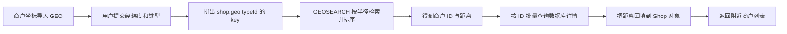
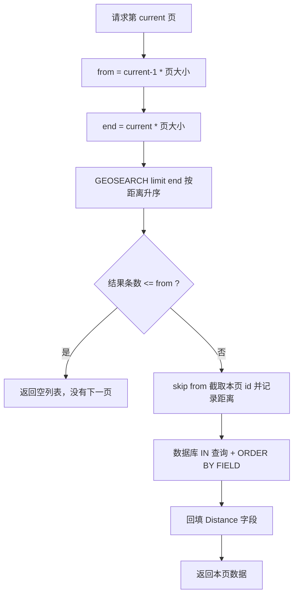
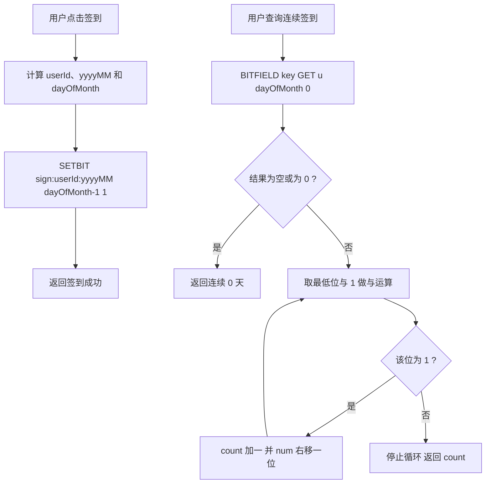
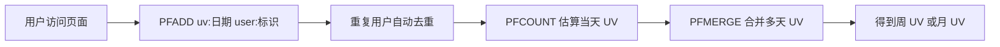

# Redis 实战：附近商户、签到与 UV 统计

前面几篇讲的是数据结构和命令本身，这一篇讲它们落到业务里的三个例子：附近商户、用户签到、UV 统计。

三个问题看起来毫不相干，但解法是同一种思路：先用一个合适的数据结构把数据压小或索引好，让 Redis 承担高频的筛选、排序和去重，MySQL 只做最终的事实存储。

- 附近商户要回答“离我最近的几家店是谁”，靠 GEO 把经纬度索引起来。
- 用户签到要回答“这个用户这个月哪几天来过”，靠 Bitmap 把一个月的状态压进几十个 bit。
- UV 统计要回答“今天有多少个不同的人来过”，靠 HyperLogLog 用十几 KB 内存估算百万级基数。

每个小节都先说清“是什么、为什么”，再给命令和代码。

## 1 附近商户与 GEO

### 1.1 GEO 是什么

GEO 是 Redis 提供的地理坐标索引能力：保存若干成员的经纬度，并支持按距离做范围检索。

它只保存“成员名 + 坐标”，不保存商户名称、图片、评分这些详情，因此典型用法是两步：

1. 先查 GEO，拿到落在范围内的商户 id 以及距当前点的距离；
2. 再按 id 回数据库批量查询详情（回表），拼好之后返回给前端。

GEO 适合附近商户、附近门店、配送范围这类问题，不适合路网计算、多边形围栏这类复杂地图分析。

### 1.2 GEO 的底层实现：Sorted Set 加 GeoHash

GEO 不是一种新的数据类型，它底层就是 Sorted Set。每个成员的 score 是一个 52 bit 的整数，这个整数由该成员的经纬度经 GeoHash 编码得到。

编码过程可以拆成三步：

1. 量化。经度按区间 [-180, 180]、纬度按区间 [-85.05112878, 85.05112878] 分别做二分逼近，各得到 26 bit 的二进制串。26 + 26 = 52 bit，正好控制在 double 尾数可以精确表示 53 bit 整数这个上限之内。
2. 交错合并。把两个 26 bit 串按位交错（你一位、我一位）拼成一个 52 bit 整数，这个整数就是该成员在 Sorted Set 里的 score。
3. 排序与检索。Sorted Set 按 score 天然有序，于是“地理上相邻”被翻译成了“score 接近”，范围查询就退化成了对有序集合按 score 区间扫描。

查询时的两步走：

1. 粗筛。根据查询点和半径算出需要扫描的 score 区间，在 Sorted Set 上按 score 范围取出候选成员。为了避免落在编码块边界上的成员被漏掉，扫描范围会向外扩张，覆盖查询区域所在的编码块及其邻近块。
2. 精算。对候选成员逐个按球面距离（Haversine）算出真实距离，再按半径过滤、按距离排序。

所以 GEO 是一种近似范围查询：它先用编码区间做粗筛，再对候选精算距离，返回的坐标和距离都受 GeoHash 量化精度影响，量级在米级。理解这一点，就不会拿 GEO 去做亚米级的定位计算。

### 1.3 经纬度的有效范围与顺序

GEOADD 的参数顺序是固定的：

```text
GEOADD key 经度 纬度 member [经度 纬度 member ...]
```

- 经度（longitude）在前，纬度（latitude）在后，写反了不会报错，但坐标会落到地球另一边。
- 经度有效范围是 -180 ~ 180。
- 纬度有效范围约 -85.05112878 ~ 85.05112878，不是 -90 ~ 90（这是 Web 墨卡托投影的截断范围）。
- 超出有效范围会直接报错，例如 `ERR invalid longitude,latitude pair`。

| 项 | 取值 | 说明 |
| --- | --- | --- |
| 参数顺序 | 经度 纬度 member | 经度在前，纬度在后 |
| 经度范围 | -180 ~ 180 | 超出报错 |
| 纬度范围 | 约 -85.05112878 ~ 85.05112878 | 超出报错 |
| 编码位宽 | 每维 26 bit，合计 52 bit | score 落在 double 可精确表示的整数范围内 |
| 精度量级 | 约 0.5 米到 1 米 | 由 52 bit 量化精度决定，因此 GEOPOS 返回的坐标与写入值可能有微小差异 |

### 1.4 GEOADD：写入坐标

GEOADD 添加一个或多个成员，返回实际新增的成员个数（已存在且坐标未变的成员不计数）。

```text
# 一次添加一个商户：GEOADD key 经度 纬度 member
GEOADD shop:geo:1 120.155100 30.274100 1001

# 一次添加多个商户，参数成组出现，比循环单条写入快得多
GEOADD shop:geo:1 120.155100 30.274100 1001 120.160000 30.280000 1002 120.148000 30.265000 1003

# 6.2 起还支持 NX（只新增不更新）、XX（只更新已存在成员）、CH（返回值改为“发生变化的成员数”）
GEOADD shop:geo:1 NX 120.155100 30.274100 1001
GEOADD shop:geo:1 XX CH 120.155200 30.274200 1001
```

同一个成员再次 GEOADD 时坐标会被更新，score 随之改变，相当于一次 Sorted Set 的分数更新。

### 1.5 GEOPOS：查成员坐标

GEOPOS 返回指定成员被存进 Redis 时的坐标，返回值是“经度、纬度”的顺序，与写入顺序一致。

```text
GEOPOS shop:geo:1 1001
# 输出两个字符串：经度、纬度，例如 120.1551000000 与 30.2741000000

GEOPOS shop:geo:1 1001 1002 9999
# 一次查多个成员，返回值与参数一一对应，成员不存在时对应位置返回 nil
```

注意 GEOPOS 返回的是经纬度，不是距离；由于坐标经过 52 bit 量化后再解码，返回值可能与当初写入的数值有米级差异，这是正常现象。

### 1.6 GEODIST：算两个成员的距离

GEODIST 计算同一个 key 内两个成员之间的直线距离（按球面距离算），可以指定单位。

```text
GEODIST shop:geo:1 1001 1002
# 不写单位时默认按米返回，例如 "556.7"

GEODIST shop:geo:1 1001 1002 km
# 指定千米，例如 "0.5567"

# 任一成员不存在时返回 nil
```

| 单位参数 | 含义 | 备注 |
| --- | --- | --- |
| m | 米 | 默认单位，可以省略 |
| km | 千米 | 最常用 |
| mi | 英里 | 英制场景 |
| ft | 英尺 | 英制场景 |

GEODIST 不能算两个不同 key 里的成员之间的距离，要算就必须把成员放在同一个 key 里。

### 1.7 GEOHASH：查成员的 base32 编码

GEOHASH 把成员的坐标转成标准的 base32 字符串返回，一个成员对应一个字符串。

```text
GEOHASH shop:geo:1 1001
# 返回 11 位 base32 字符串；成员不存在时返回 nil
```

这个字符串是通用的 geohash 表示，可以和别的系统（例如 PostgreSQL、Elasticsearch、第三方地图 SDK）交换数据。字符串越长表示精度越高，前几位相同表示地理位置接近。

### 1.8 GEORADIUS 与 GEOSEARCH 的关系

GEORADIUS 按“圆心 + 半径”检索成员，是早期的写法：

```text
GEORADIUS key 经度 纬度 半径 M|KM|FT|MI
    [WITHCOORD] [WITHDIST] [WITHHASH]
    [COUNT count [ANY]] [ASC|DESC]
    [STORE key] [STOREDIST key]
```

从 Redis 6.2 起 GEORADIUS 已被标记为废弃（deprecated），官方推荐改用 GEOSEARCH 与 GEOSEARCHSTORE。要区分两点：

- 它只是被标记废弃，还没有被移除，仍能执行，但新项目不应该再写。
- 它能力上也不如 GEOSEARCH：GEORADIUS 只能按圆形范围查，而 GEOSEARCH 同时支持圆形（BYRADIUS）和矩形（BYBOX）。

| 对比项 | GEORADIUS | GEOSEARCH |
| --- | --- | --- |
| 引入版本 | 3.2 | 6.2 |
| 当前状态 | 6.2 起标记废弃 | 推荐使用 |
| 查询形状 | 只支持圆形（半径） | 支持圆形（BYRADIUS）与矩形（BYBOX） |
| 参考点写法 | 只支持直接给经纬度 | FROMLONLAT 给经纬度，FROMMEMBER 给已有成员 |
| 结果存储 | 用 STORE / STOREDIST 参数 | 用独立的 GEOSEARCHSTORE 命令 |
| 客户端支持 | 老版本 Spring Data Redis 也支持 | 需要 Spring Data Redis 2.6 以上 |

### 1.9 GEOSEARCH：范围检索主力命令

GEOSEARCH 的完整语法可以拆成三部分来记：从哪查、查什么形状、怎么返回。

```text
GEOSEARCH key
    <FROMMEMBER member | FROMLONLAT 经度 纬度>
    <BYRADIUS 半径 M|KM|FT|MI | BYBOX 宽 高 M|KM|FT|MI>
    [ASC|DESC]
    [COUNT count [ANY]]
    [WITHCOORD] [WITHDIST] [WITHHASH]
```

第一部分，参考点：

- FROMMEMBER member：以 key 中某个已有成员的坐标为中心。
- FROMLONLAT 经度 纬度：直接给一个坐标为中心。

第二部分，范围形状：

- BYRADIUS 半径 单位：圆形范围，例如 BYRADIUS 5 km。
- BYBOX 宽 高 单位：矩形范围，矩形以参考点为中心，例如 BYBOX 10 5 km。

第三部分，返回控制：

- ASC / DESC：按距离升序或降序，不写则不保证顺序。
- COUNT count：限制返回条数，只保留前 count 条。
- COUNT count ANY：只要凑够 count 条就返回，不再追求最近的若干条，可以显著降低扫描量，但结果不是最近的。
- WITHCOORD：同时返回成员坐标。
- WITHDIST：同时返回成员到参考点的距离。
- WITHHASH：同时返回成员 score 的原始 52 bit 整数。

```text
# 以坐标 (120.1500, 30.2700) 为中心，查 5 千米内的商户，带上距离，按距离升序，最多 10 条
GEOSEARCH shop:geo:1 FROMLONLAT 120.1500 30.2700 BYRADIUS 5 km WITHDIST ASC COUNT 10

# 以成员 1001 的坐标为中心，查 3 千米内的商户，同时返回坐标和距离
GEOSEARCH shop:geo:1 FROMMEMBER 1001 BYRADIUS 3 km WITHCOORD WITHDIST

# 矩形范围：以坐标为中心，查 10 千米宽、5 千米高的矩形内的商户
GEOSEARCH shop:geo:1 FROMLONLAT 120.1500 30.2700 BYBOX 10 5 km ASC
```

### 1.10 GEOSEARCHSTORE：把结果存成新 key

GEOSEARCHSTORE 的检索能力和 GEOSEARCH 完全一致，区别是它不直接返回结果，而是把结果写进另一个 key（类型仍是 Sorted Set）。

```text
GEOSEARCHSTORE destination source
    <FROMMEMBER member | FROMLONLAT 经度 纬度>
    <BYRADIUS 半径 单位 | BYBOX 宽 高 单位>
    [ASC|DESC] [COUNT count [ANY]] [STOREDIST]
```

- destination：结果要写入的 key；如果已存在会被覆盖。
- source：被检索的 GEO key。
- STOREDIST：可选参数，写了以后新 key 的 score 存“距离”，不写则 score 存原始的 GeoHash 编码。

```text
# 把 5 千米内的商户写进 shop:geo:1:nearby，score 用距离（米），后续可以直接按距离排序或分页
GEOSEARCHSTORE shop:geo:1:nearby shop:geo:1 FROMLONLAT 120.1500 30.2700 BYRADIUS 5 km ASC STOREDIST

# 结果 key 是普通 Sorted Set，可以继续用 ZRANGE、ZREVRANGE、ZSCORE 等命令
ZRANGE shop:geo:1:nearby 0 -1 WITHSCORES
```

它适合“一次查询、多次消费”的场景，例如把某次筛选结果落成临时集合，后续分页或做交集。

### 1.11 七个命令对比

| 命令 | 作用 | 关键参数 | 备注 |
| --- | --- | --- | --- |
| GEOADD | 写入成员坐标 | 经度 纬度 member | 可一次写多个成员 |
| GEOPOS | 查成员的坐标 | member ... | 返回经度、纬度，可能为 nil |
| GEODIST | 算两个成员的距离 | member1 member2 [单位] | 单位 m/km/mi/ft，默认米 |
| GEOHASH | 坐标转 base32 字符串 | member ... | 通用 geohash，便于和外部系统交换 |
| GEORADIUS | 圆形范围检索 | 经度 纬度 半径 单位 | 6.2 起废弃，不推荐新项目使用 |
| GEOSEARCH | 圆形或矩形范围检索 | FROMMEMBER/FROMLONLAT + BYRADIUS/BYBOX | 支持 ASC/DESC/COUNT/WITHDIST/WITHCOORD/WITHHASH |
| GEOSEARCHSTORE | 检索结果存到新 key | destination source + 同上范围参数 | 可用 STOREDIST 让新 key 的 score 存距离 |

### 1.12 GEO 查询流程



### 1.13 导入商户数据：按类型分 key

思路是：以商户类型 id 作为 key 的一部分，key 里放该类型下每个商铺的坐标，member 用商铺 id。查询时只需要根据类型到对应的 key 里找距离即可。

key 的构造是前缀加 typeId：

```java
String key = RedisConstants.SHOP_GEO_KEY + typeId; // 例如 shop:geo:1
```

导入时先把商户按 typeId 分组，再对每组做一次批量 GEOADD：

```java
@Test
void loadShopData() {
    // 1.查询店铺信息
    List<Shop> list = shopService.list();
    // 2.把店铺分组，按照 typeId 分组，typeId 一致的放到一个集合
    Map<Long, List<Shop>> map = list.stream().collect(Collectors.groupingBy(Shop::getTypeId));
    // 3.分批完成写入 Redis
    for (Map.Entry<Long, List<Shop>> entry : map.entrySet()) {
        // 3.1.获取类型 id
        Long typeId = entry.getKey();
        String key = RedisConstants.SHOP_GEO_KEY + typeId;
        // 3.2.获取同类型的店铺的集合
        List<Shop> value = entry.getValue();
        List<RedisGeoCommands.GeoLocation<String>> locations = new ArrayList<>(value.size());
        // 3.3.写入 redis GEOADD key 经度 纬度 member
        for (Shop shop : value) {
            locations.add(new RedisGeoCommands.GeoLocation<>(
                    shop.getId().toString(),
                    new Point(shop.getX(), shop.getY())
            ));
        }
        stringRedisTemplate.opsForGeo().add(key, locations);
    }
}
```

有两个细节值得注意：

- 先分组再批量写，一个类型只发一次 GEOADD，比“每个商户发一次”少了几个数量级的网络往返。
- 坐标为空（x 或 y 为 null）的商户应跳过并记日志，否则 GEOADD 会因为参数非法而整批失败。

### 1.14 为什么必须按 typeId 分 key

不能把所有商户塞进一个 `shop:geo`，原因很直接：GEO 的范围查询只能指定“参考点 + 形状 + 距离”，没有“按某个字段过滤”的能力。

如果只有一个 key，要查“美食类型的附近商户”，就只能先把附近所有类型的商户都取出来，再到应用层逐条过滤 typeId。这样有两个后果：一是 COUNT 限制的是过滤前的条数，可能取回一堆不属于该类型的商户；二是被过滤掉的商户位置会被白白占用，分页和距离排序都会失真。

拆成 `shop:geo:{typeId}` 之后，类型过滤变成了“选 key”这一动作，检索只在目标类型内部进行，比例合适、结果准确。

| 方案 | 类型过滤方式 | 结果 | 分页 | 说明 |
| --- | --- | --- | --- | --- |
| 单个 shop:geo | 应用层逐条过滤 | 可能不足一页，需要反复扩大范围 | COUNT 无法作用于过滤后的结果 | 不推荐 |
| 按类型 shop:geo:{typeId} | 选择对应的 key | 结果都在目标类型内 | COUNT 直接作用于目标类型 | 推荐 |

代价是 key 数量变多，导入和更新时要保证每个 typeId 对应的 key 都被正确维护。

### 1.15 member 用纯 id、距离回填

member 直接存纯 `shop.getId().toString()`，不要加 `shop:` 前缀：

```java
// 写入时：member 就是纯 id
locations.add(new RedisGeoCommands.GeoLocation<>(
        shop.getId().toString(),
        new Point(shop.getX(), shop.getY())
));
```

这样回表解析时直接 `Long.valueOf(shopIdStr)` 就能转成 id，不用额外的字符串裁剪。前缀是多余的，加了反而每次都要 `substring`。

查询返回的距离也不是白拿的：它只在这次 GEO 结果里存在，必须回填到实体上才能传给前端。

```java
Map<String, Distance> distanceMap = new HashMap<>(list.size());
// 遍历 GEO 结果时把距离按 member 存进 map
list.stream().skip(from).forEach(result -> {
    String shopIdStr = result.getContent().getName();
    ids.add(Long.valueOf(shopIdStr));
    Distance distance = result.getDistance();
    distanceMap.put(shopIdStr, distance);
});
// 回表之后按 id 取出距离，塞回 Shop 对象
for (Shop shop : shops) {
    shop.setDistance(distanceMap.get(shop.getId().toString()).getValue());
}
```

### 1.16 分页：COUNT 与内存排序的取舍

GEOSEARCH 只能限制返回条数（COUNT），不支持真正的 offset 分页，没有办法直接告诉 Redis“跳过前 20 条，返回第 21 到 40 条”。所以分页只能在应用层做：

1. 把前端传来的页码换算成区间：`from = (current - 1) * DEFAULT_PAGE_SIZE`，`end = current * DEFAULT_PAGE_SIZE`。
2. 用 `limit(end)` 让 Redis 返回按距离升序排好的前 end 条，也就是“前若干页的所有数据”。
3. 用 `list.size() <= from` 判断是否还有下一页：连 from 条都凑不满，说明本页已经越界，直接返回空列表。
4. 在应用层用 `skip(from)` 跳过前面几页，截取本页的 id。
5. 回表时用 `ORDER BY FIELD(id, ...)` 保持 GEO 给出的距离顺序，因为 `IN` 查询的返回顺序不受 SQL 保证。
6. 把距离回填到 Shop 对象上返回。

```java
// 2.计算分页参数
int from = (current - 1) * SystemConstants.DEFAULT_PAGE_SIZE;
int end = current * SystemConstants.DEFAULT_PAGE_SIZE;

// 3.查询 redis、按照距离排序、分页。结果：shopId、distance
String key = RedisConstants.SHOP_GEO_KEY + typeId;
GeoResults<RedisGeoCommands.GeoLocation<String>> results = stringRedisTemplate.opsForGeo()
        .search(
                key,
                GeoReference.fromCoordinate(x, y),
                new Distance(5000),
                RedisGeoCommands.GeoSearchCommandArgs.newGeoSearchArgs().includeDistance().limit(end)
        );
// 4.解析出 id
if (results == null) {
    return Result.ok(Collections.emptyList());
}
List<GeoResult<RedisGeoCommands.GeoLocation<String>>> list = results.getContent();
if (list.size() <= from) {
    // 没有下一页了，结束
    return Result.ok(Collections.emptyList());
}
// 4.1.截取 from ~ end 的部分
List<Long> ids = new ArrayList<>(list.size());
Map<String, Distance> distanceMap = new HashMap<>(list.size());
list.stream().skip(from).forEach(result -> {
    String shopIdStr = result.getContent().getName();
    ids.add(Long.valueOf(shopIdStr));
    Distance distance = result.getDistance();
    distanceMap.put(shopIdStr, distance);
});
// 5.根据 id 查询 Shop
String idStr = StrUtil.join(",", ids);
List<Shop> shops = query().in("id", ids).last("ORDER BY FIELD(id," + idStr + ")").list();
for (Shop shop : shops) {
    shop.setDistance(distanceMap.get(shop.getId().toString()).getValue());
}
// 6.返回
return Result.ok(shops);
```

为什么用 `ORDER BY FIELD(id, ...)`：MySQL 的 `IN` 只保证“取到这些行”，不保证顺序。如果直接返回，页面上的商户顺序会和距离顺序不一致，用户看到的就是乱的。`FIELD(id, 21, 8, 15)` 会按参数列表里 id 的位置排序，正好把 GEO 算出来的距离顺序还原回来。

这个方案的取舍：

| 页码 | 需要从 Redis 取回的条数 | 代价 |
| --- | --- | --- |
| 第 1 页 | end 条 | 最省，等于一页的数据量 |
| 第 2 页 | 2 倍页大小 | 多取一倍，应用层丢掉一半 |
| 第 n 页 | n 倍页大小 | 越靠后越贵，且都要回表前先截取 |

所以这种分页只适合“用户只会翻前几页”的场景。真要做深度分页，得先把结果用 GEOSEARCHSTORE 落成一个 Sorted Set，再用 `ZRANGE offset count` 在 Redis 侧完成偏移，避免把大量数据搬回应用内存。



### 1.17 无坐标时的回退分支

如果前端没有传坐标（x 或 y 为 null），说明用户没有定位，这时不必查 GEO，直接按 type_id 走数据库分页即可：

```java
// 1.判断是否需要根据坐标查询
if (x == null || y == null) {
    // 不需要坐标查询，按数据库查询
    Page<Shop> page = query()
            .eq("type_id", typeId)
            .page(new Page<>(current, SystemConstants.DEFAULT_PAGE_SIZE));
    return Result.ok(page.getRecords());
}
```

这个分支不是可有可无的兜底代码，而是正常业务路径：用户拒绝授权定位、浏览器不支持定位、或者从 PC 端访问，都会走到这里。

### 1.18 客户端版本门槛

Spring Data Redis 2.3.9 并不支持 Redis 6.2 提供的 GEOSEARCH 命令，需要在 pom 里做版本升级：把 `spring-data-redis` 升到 2.6.2，把 `lettuce-core` 升到 6.1.6.RELEASE。

```xml
<dependency>
    <groupId>org.springframework.boot</groupId>
    <artifactId>spring-boot-starter-data-redis</artifactId>
    <exclusions>
        <exclusion>
            <artifactId>spring-data-redis</artifactId>
            <groupId>org.springframework.data</groupId>
        </exclusion>
        <exclusion>
            <artifactId>lettuce-core</artifactId>
            <groupId>io.lettuce</groupId>
        </exclusion>
    </exclusions>
</dependency>
<dependency>
    <groupId>org.springframework.data</groupId>
    <artifactId>spring-data-redis</artifactId>
    <version>2.6.2</version>
</dependency>
<dependency>
    <groupId>io.lettuce</groupId>
    <artifactId>lettuce-core</artifactId>
    <version>6.1.6.RELEASE</version>
</dependency>
```

做法是先把 starter 里的旧版本排除，再显式引入新版本。不升级就会出现“命令明明在 Redis 里能用，Java 代码却调不到对应 API”的情况。

### 1.19 控制器入口

```java
@GetMapping("/of/type")
public Result queryShopByType(
        @RequestParam("typeId") Integer typeId,
        @RequestParam(value = "current", defaultValue = "1") Integer current,
        @RequestParam(value = "x", required = false) Double x,
        @RequestParam(value = "y", required = false) Double y
) {
    return shopService.queryShopByType(typeId, current, x, y);
}
```

x、y 用 `required = false` 接收，就是为了让“没有坐标”成为一个合法输入，交给上层走 1.17 的回退分支。

## 2 用户签到与 Bitmap

### 2.1 为什么用位图存签到

如果用一张签到表，每次签到写一行记录，面对海量用户和每天都签的活跃用户，数据量的增长是难以想象的。

签到这个业务有个很好的特征：它只需要回答“这一天有没有签”，是典型的布尔状态。于是一串由 0 和 1 组成的字符串就够了：一个位置代表一天，0 表示未签到，1 表示已签到。这种思想就是位图（Bitmap）。

一个用户一个月最多 31 天，也就是 31 个 bit，4 个字节都不到。

| 存储方案 | 一个用户一个月 | 能表达的信息 | 适合场景 |
| --- | --- | --- | --- |
| 签到表 | 每天一行，最多 31 行 | 签到时间、设备、备注等全部明细 | 需要审计明细 |
| Bitmap | 最多 31 个 bit | 某天是否签到 | 高频签到状态与统计 |

### 2.2 Bitmap 的上限

Redis 用 String 类型的数据结构实现位图，因此它的上限就是 String 的上限：最大 512 MB，换算成 bit 就是 2^32 个 bit 位（约 42.9 亿位）。

这意味着 offset 的取值空间是 0 到 2^32 - 1。用 offset 表示“第几天”时完全够用，但如果拿 offset 表示用户 id（例如 offset 直接等于 userId），就要注意用户 id 的量级，别把上限撞穿。

### 2.3 签到相关命令

```text
# SETBIT：把指定 offset 的位设为 0 或 1，返回该位原来的值
SETBIT sign:5:202203 0 1

# GETBIT：读取指定 offset 的位
GETBIT sign:5:202203 0

# BITCOUNT：统计位图里 1 的个数，也就是本月签到天数
BITCOUNT sign:5:202203

# BITCOUNT 也可以只统计某个字节范围
BITCOUNT sign:5:202203 0 3

# BITFIELD：读取、修改、自增位数组中的指定片段
BITFIELD sign:5:202203 GET u14 0

# BITFIELD_RO：只读版本，语义等同 BITFIELD 的 GET，但明确不会写入，可以在只读副本上执行
BITFIELD_RO sign:5:202203 GET u14 0

# BITOP：把多个位图做位运算（与、或、异或、非），结果写到目标 key
BITOP AND sign:5:202203:both sign:5:202203 sign:5:202204
BITOP OR sign:5:spring sign:5:202203 sign:5:202204 sign:5:202205
BITOP NOT sign:5:202203:inv sign:5:202203

# BITPOS：查找第一个 0 或 1 出现的位置
BITPOS sign:5:202203 1
BITPOS sign:5:202203 0 0 30
```

几个使用要点：

- BITOP 的目标 key 会被覆盖，源 key 不变；做交集时可以直接把两个月的签到位图 AND 起来，得到“两个月都签到的那些天”。
- BITPOS 的 start、end 可以指定搜索范围，还可以带上 BYTE 或 BIT 单位决定范围按字节还是按位计算。
- BITCOUNT、BITPOS 都只做统计和查找，不改变数据。

### 2.4 BITFIELD 完整语法

BITFIELD 是位图里功能最强的一条命令，它把位图当成“位数组”，可以按任意位宽读写：

```text
BITFIELD key [GET type offset] [SET type offset value] [INCRBY type offset increment] [OVERFLOW WRAP|SAT|FAIL]
```

- key：要操作的字符串键。
- 子命令可以同时包含多个，按书写顺序依次执行。
- GET type offset：读取从 offset（从 0 开始）起、指定类型的位值，返回对应的十进制数。
- SET type offset value：把从 offset 起、指定类型的位值设置为 value。
- INCRBY type offset increment：对从 offset 起、指定类型的位值做自增，increment 可正可负。
- OVERFLOW WRAP|SAT|FAIL：可选参数，指定 INCRBY 的溢出策略，默认 WRAP。它只影响写在它后面的 INCRBY 子命令。

type 用来指定位宽和符号属性，格式是 `[u|i]<bits>`：

- `u<bits>`：无符号整数，bits 可以是 1 到 64，例如 `u8` 是 8 位无符号整数。
- `i<bits>`：有符号整数，bits 可以是 1 到 63，例如 `i16` 是 16 位有符号整数。

例如 `BITFIELD field1 GET u3 1` 表示从 field1 的第 2 位开始读取 3 位，返回这 3 位二进制对应的无符号整数。

### 2.5 位宽与溢出策略

| 类型 | 范围 | 位宽取值 | 说明 |
| --- | --- | --- | --- |
| u（无符号） | 0 到 2^bits - 1 | 1 ~ 64 | 最高可以一次读 64 位 |
| i（有符号） | -2^(bits-1) 到 2^(bits-1) - 1 | 1 ~ 63 | 有符号数要留一位符号位，所以最大 63 |

| 溢出策略 | 行为 | 适用场景 |
| --- | --- | --- |
| WRAP | 溢出时回绕，无符号整数溢出后从 0 重新开始，有符号数从最小值继续 | 默认策略，允许“环形”计数 |
| SAT | 饱和，溢出时停在最大值或最小值，不再变化 | 计数只允许单调增长且有上限 |
| FAIL | 溢出时返回错误，本次操作不执行 | 希望显式发现溢出、不允许静默丢数据 |

### 2.6 签到 key 的设计

签到 key 由用户 id 和年月组成，统一写成 `sign:{userId}:{yyyyMM}`：

```java
String keySuffix = now.format(DateTimeFormatter.ofPattern(":yyyyMM"));
String key = RedisConstants.USER_SIGN_KEY + userId + keySuffix; // 例如 sign:5:202203
```

几个约定：

- key 里带年月，一个月一个 key，自动隔离，跨月不用清理历史数据。
- offset 用 `dayOfMonth - 1`，因为 offset 从 0 开始，而日期从 1 开始，所以 1 号对应 offset 0。
- 过期时间可以按需设置，例如两个月后过期，保留近期查询能力即可。

### 2.7 实现签到

```java
@PostMapping("/sign")
public Result sign() {
    return userService.sign();
}
```

```java
@Override
public Result sign() {
    // 1.获取当前登录用户
    Long userId = UserHolder.getUser().getId();
    // 2.获取日期
    LocalDateTime now = LocalDateTime.now();
    // 3.拼接 key
    String keySuffix = now.format(DateTimeFormatter.ofPattern(":yyyyMM"));
    String key = RedisConstants.USER_SIGN_KEY + userId + keySuffix;
    // 4.获取今天是本月的第几天
    int dayOfMonth = now.getDayOfMonth();
    // 5.写入 Redis SETBIT key offset 1
    stringRedisTemplate.opsForValue().setBit(key, dayOfMonth - 1, true);
    return Result.ok();
}
```

SETBIT 本身是幂等的，同一天重复签到只是把同一个位置再设一次 1，不会重复计数。

### 2.8 连续签到统计

需求是统计“从今天开始往前数，用户本月连续签到了多少天”。请求信息：

- 请求方式：GET
- 请求路径：/user/sign/count
- 请求参数：无
- 返回值：连续签到的天数

关键一步是用 `BITFIELD key GET u[dayOfMonth] 0` 一次性把前 dayOfMonth 位读出来，得到一个十进制整数，例如今天是 14 号就读 u14：

```text
BITFIELD sign:5:202203 GET u14 0
```

读出来的这个整数，位序是这样对应的：

- offset 0（也就是 1 号）在返回值里是最高位；
- offset dayOfMonth - 1（也就是今天）在返回值里是最低位。

所以要“从今天往前数连续天数”，就要从最低位开始判断：把数字与 1 做按位与，得到的就是今天的签到位；判断完把数字右移一位（`num >>>= 1`），最低位就变成昨天，如此循环，遇到 0 停止，累加过程中 1 的个数就是连续签到天数。

直接用 `Long.numberOfLeadingZeros` 这类“从高位开始数”的方法是错的：它数的是高位方向（1 号那一侧），方向和需求正好相反。

```java
@GetMapping("/sign/count")
public Result signCount() {
    return userService.signCount();
}
```

```java
@Override
public Result signCount() {
    // 1.获取当前登录用户
    Long userId = UserHolder.getUser().getId();
    // 2.获取日期
    LocalDateTime now = LocalDateTime.now();
    // 3.拼接 key
    String keySuffix = now.format(DateTimeFormatter.ofPattern(":yyyyMM"));
    String key = RedisConstants.USER_SIGN_KEY + userId + keySuffix;
    // 4.获取今天是本月的第几天
    int dayOfMonth = now.getDayOfMonth();
    // 5.获取本月截止今天为止的所有的签到记录，返回的是一个十进制的数字 BITFIELD sign:5:202203 GET u14 0
    List<Long> result = stringRedisTemplate.opsForValue().bitField(
            key,
            BitFieldSubCommands.create()
                    .get(BitFieldSubCommands.BitFieldType.unsigned(dayOfMonth)).valueAt(0)
    );
    if (result == null || result.isEmpty()) {
        // 没有任何签到结果
        return Result.ok(0);
    }
    Long num = result.get(0);
    if (num == null || num == 0) {
        return Result.ok(0);
    }
    // 6.循环遍历
    int count = 0;
    while (true) {
        // 6.1.让这个数字与 1 做与运算，得到数字的最后一个 bit 位，判断这个 bit 位是否为 0
        if ((num & 1) == 0) {
            // 如果为 0，说明未签到，结束
            break;
        } else {
            // 如果不为 0，说明已签到，计数器 +1
            count++;
        }
        // 把数字右移一位，抛弃最后一个 bit 位，继续下一个 bit 位
        num >>>= 1;
    }
    return Result.ok(count);
}
```

用右移而不是普通除法，是因为 Java 的 `>>` 是有符号右移，负数的最高位会补 1，处理无符号位图时应当用无符号右移 `>>>`。

### 2.9 签到与统计流程



### 2.10 Bitmap 的适用边界

Bitmap 很省内存，但它只适合“是否发生过”这种布尔状态。需要保存签到时间、签到地点、备注这类信息时，还是得回到数据库表。

它适合的是：

- 状态只有两种取值，且可以用固定的 offset 定位，例如签到、打卡、活跃、是否已读。
- 需要频繁做统计，例如本月签到天数、连续签到天数、两个集合的交集。

它不适合的是：

- 需要保存明细字段的场景。
- offset 稀疏且跨度极大的场景，例如只有 3 个用户但 id 达到千万级，直接按 id 当 offset 会白白撑大内存。

## 3 UV 统计与 HyperLogLog

### 3.1 UV 与 PV

- UV（Unique Visitor）是独立访客量，指访问、浏览这个网页的自然人。1 天内同一个用户多次访问该网站，只记录 1 次。
- PV（Page View）是页面访问量或点击量，用户每访问网站的一个页面就记录 1 次 PV，同一个用户多次打开页面会记录多次。通常用来衡量网站的流量。

一般来说 PV 比 UV 大得多。如果每次访问都往 Redis 里存一份用户标识，内存消耗会非常大，所以需要用估算结构来统计 UV。

| 指标 | 统计对象 | 同一用户一天多次访问 | 用途 |
| --- | --- | --- | --- |
| PV | 页面访问次数 | 计多次 | 衡量流量规模 |
| UV | 独立访客数 | 只计一次 | 衡量真实到访人数 |

### 3.2 HyperLogLog 是什么

HyperLogLog（HLL）是从 Loglog 算法派生的概率算法，用来确定非常大的集合的基数，而不需要存储集合里的所有值。

Redis 中的 HLL 是基于 String 实现的，单个 HLL 占用的内存永远小于 16 KB，内存占用极低。它内部把哈希值分成若干桶做概率估算，这也是它能用极小内存统计巨大基数的原因。

代价是它的结果不是精确值，只提供估算。HLL 不能列出具体有哪些元素，所以不能用于必须精确对账的场景。

### 3.3 误差与内存

- 误差率小于 0.81%。
- 这个数字来自标准误差公式：`1.04 / sqrt(m)`，其中 m 是寄存器个数，Redis 用的是 16384 个寄存器，`1.04 / sqrt(16384) = 1.04 / 128 ≈ 0.0081`，也就是约 0.81%。
- 内存方面，每个寄存器用 6 bit 存计数值，16384 个寄存器约 12 KB，加上少量头部信息，单个 HLL 永远小于 16 KB；稀疏编码下实际占用还会更小。

### 3.4 HyperLogLog 常用命令

```text
# PFADD key element [element ...]：向 HLL 添加元素，重复的元素只算一次
PFADD uv:20260601 user:1001 user:1002 user:1001

# PFCOUNT key [key ...]：统计 HLL 中元素的个数，粗略统计，结果不一定准确
PFCOUNT uv:20260601

# PFCOUNT 传多个 key 时，会先做并集再估算
PFCOUNT uv:20260601 uv:20260602

# PFMERGE destkey sourcekey [sourcekey ...]：合并多个 HLL，相当于 Set 求并集
PFMERGE uv:week uv:20260601 uv:20260602 uv:20260603
```

PFADD 的返回值表示“内部寄存器是否被改动过”，返回 0 不代表元素一定不存在，不能用它来判断某个用户是否来过。

### 3.5 测试百万数据的统计

用单元测试往 HLL 里插 100 万条数据，看看估算结果和真实值的差距：

```java
@Test
void testHyperLogLog() {
    // 准备数组，装存储到 HLL 中的数据
    String[] values = new String[1000];
    // 数组角标
    int j = 0;
    for (int i = 0; i < 1000000; i++) {
        // 计算角标
        j = i % 1000;
        // 得到 HLL 中的数据
        values[j] = "user_" + i;
        // 每 1000 条发送一次
        if (j == 999) {
            stringRedisTemplate.opsForHyperLogLog().add("hll2", values);
        }
    }
    // 统计数量
    Long size = stringRedisTemplate.opsForHyperLogLog().size("hll2");
    System.out.println("size = " + size);
}
```

插入 100 万条数据后，统计出来的是 997593。误差约 0.24%，落在 0.81% 的标准误差之内，同时内存占用只有十几 KB。这个量级的误差在 UV 这类指标上完全可以接受，因为 UV 本身就是一个用来观察趋势的估算指标。

### 3.6 UV 统计流程



一个常见的用法是：每天一个 HLL key，需要周 UV 时不用重新遍历原始数据，直接 PFMERGE 合并即可，合并的代价远小于重新统计。

### 3.7 三种统计方案对比

| 需求 | 推荐结构 | 是否精确 | 典型命令 |
| --- | --- | --- | --- |
| 附近商户 | GEO | 支持按半径或矩形的范围检索，返回结果可按距离排序；精度受 GeoHash 编码影响，约为米级 | GEOADD、GEOSEARCH |
| 每日签到 | Bitmap | 精确 | SETBIT、BITCOUNT、BITFIELD |
| 大规模 UV | HyperLogLog | 估算，误差小于 0.81% | PFADD、PFCOUNT、PFMERGE |

| 方案 | 优点 | 缺点 | 适用场景 |
| --- | --- | --- | --- |
| Set 统计 UV | 结果精确，可以查询具体用户 | 用户量大时占用大量内存 | 用户规模有限、需要精确名单 |
| Bitmap 统计签到 | 极度节省空间，统计精确 | 只能表达固定 offset 的 0/1 状态 | 布尔状态与连续统计 |
| HyperLogLog 统计 UV | 内存占用极低，适合百万级以上访客 | 有误差，不能获取成员明细 | 大规模 UV、PV 之外的基数估算 |

选择的核心是三件事：结果要不要精确、内存能承受多少、需不需要拿到成员明细。三个都明确之后，结构自然就定了。

## 4 本篇总结

1. GEO 底层是 Sorted Set，score 是经纬度经 GeoHash 编码得到的 52 bit 整数，所以它先按编码区间粗筛、再按真实距离精算。
2. GEOADD 的参数顺序是经度在前、纬度在后，经度范围 -180 ~ 180，纬度范围约 -85.05112878 ~ 85.05112878，精度在米级。
3. GEO 的七个命令各司其职：GEOADD 写入、GEOPOS 查坐标、GEODIST 算距离、GEOHASH 转 base32、GEORADIUS 已废弃、GEOSEARCH 检索、GEOSEARCHSTORE 落结果。
4. 附近商户必须按类型分 key（shop:geo:{typeId}），member 存纯 id，查询距离要回填到实体，没有坐标时回退到数据库分页。
5. GEOSEARCH 只支持 COUNT 限制条数，不支持 offset 分页，要靠“取前 end 条 + 应用层 skip + ORDER BY FIELD 保持顺序”来实现。
6. Bitmap 基于 String 实现，上限是 512 MB 也就是 2^32 个 bit；BITFIELD 能按任意位宽读写，BITOP、BITPOS 分别做位运算和位置查找。
7. 签到 key 统一用 sign:{userId}:{yyyyMM}，offset 用 dayOfMonth - 1。
8. 连续签到统计用 `BITFIELD key GET u[dayOfMonth] 0` 一次取出前若干位，再从最低位（今天）向高位逐位判断，遇到 0 停止。
9. HyperLogLog 基于 String 实现，单个 key 占用永远小于 16 KB，误差率小于 0.81%，标准误差为 1.04 / sqrt(16384)。
10. 100 万条数据估算出 997593，说明 HLL 适合 UV 这类趋势指标，不适合要求精确名单的场景。
