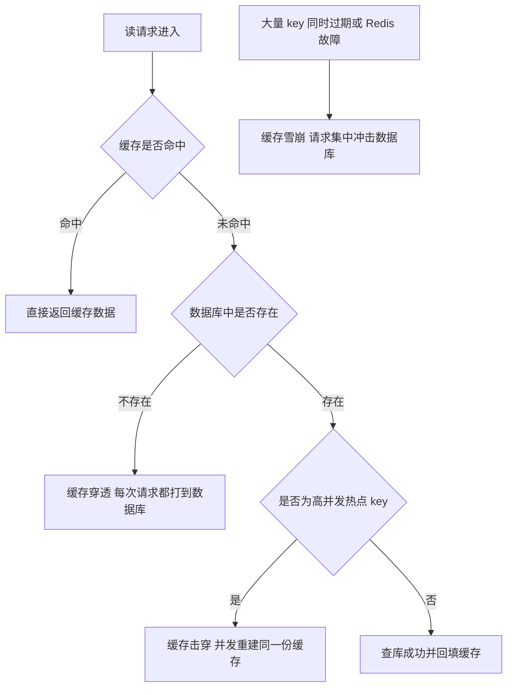
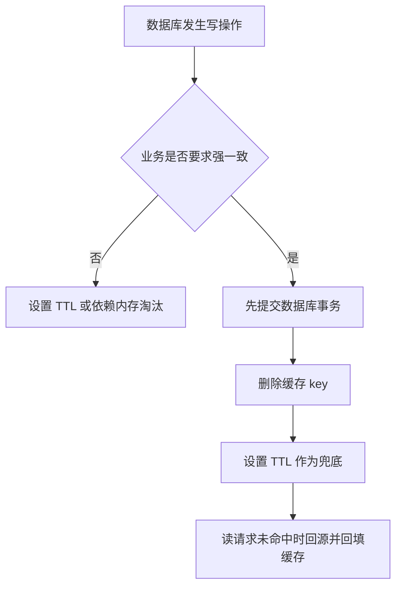
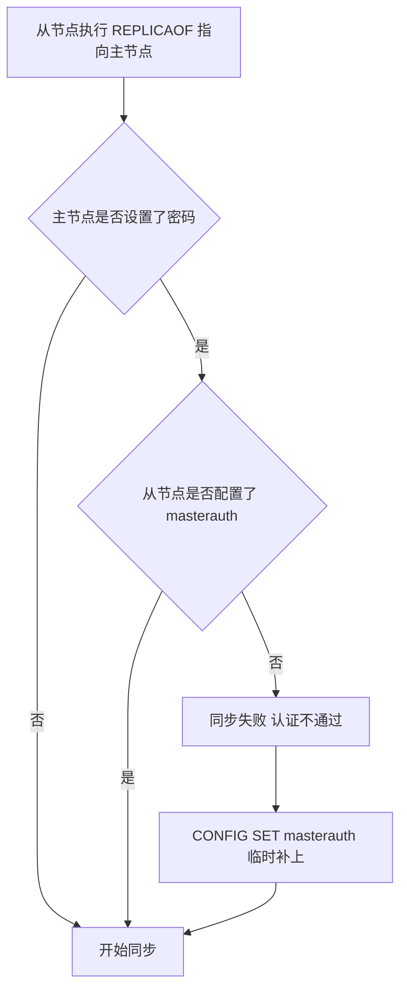

# Redis 实战：流程图与版本演进

前面几篇按主题讲了实战代码：04 篇是短信登录与缓存，05 到 07 篇是秒杀、分布式锁与 Feed 流，08 篇是 GEO、签到与 UV 统计。这一篇不再引入新业务，而是把散在各篇里的判断题收拢成流程图，并把命令的版本差异整理清楚。

- 缓存出了问题是哪一类，请求路径差在哪里。
- 写数据时先动数据库还是先动缓存。
- 缓存是删还是改，主从配置命令用哪种写法。
- 本目录 01 到 16 篇分别覆盖了什么。

流程图统一用 Mermaid 描述，Redis 命令放在 `text` 代码块里，配置文件片段放在 `conf` 代码块里。

## 1 三类缓存问题对比

缓存挡在数据库前面，作用是让读请求不必每次都落到数据库。有三种情况会让这道屏障失效：查的数据本来就不存在、大量缓存同时失效、某个热点数据在过期瞬间被并发访问。它们常被笼统地叫做“缓存问题”，成因和解法却完全不同。

### 1.1 三者的定义

缓存穿透：查一个数据库里也不存在的 key。缓存没有、数据库也没有，查不到的结果没法被缓存，于是每次请求都打到数据库。

缓存雪崩：大量 key 在同一时间附近过期，或者 Redis 故障导致缓存整体不可用，请求同时未命中，一起压到数据库。

缓存击穿：某个热点 key 过期的那一瞬间，大量并发请求同时去查数据库，并同时尝试重建同一份缓存。

一句话区分：穿透是数据不存在，雪崩是失效范围大，击穿是并发集中在一个 key 上。

### 1.2 成因、现象与危害对比

| 问题 | 成因 | 现象 | 危害 |
| --- | --- | --- | --- |
| 缓存穿透 | 请求的 key 在缓存和数据库中都不存在 | 每次请求都穿过缓存打到数据库 | 数据库被无效查询持续占用 |
| 缓存雪崩 | 大量 key 同时过期，或 Redis 整体故障 | 大批请求同时未命中缓存 | 数据库压力陡增，拖慢甚至拖垮服务 |
| 缓存击穿 | 热点 key 恰好在高并发时过期 | 多个线程同时查库、同时重建同一份缓存 | 数据库瞬时压力突增，重建动作重复 |

三者的共同点是最终都由数据库兜底，区别在于三件事：数据本来就没有、失效范围很大、失效时机很集中。

### 1.3 请求路径差异



正常请求走的是“未命中、查库、回填”这条主路。穿透在“数据库中是否存在”这一步走向左边，也就是缓存永远帮不上忙；击穿仍然走主路，只是在过期瞬间被并发放大；雪崩的入口不在单个 key 上，而是失效范围这一层。

### 1.4 解决办法对比

| 问题 | 方案 | 思路 | 代价与限制 |
| --- | --- | --- | --- |
| 缓存穿透 | 缓存空对象 | 数据库确认不存在时写入特殊空值并设置较短 TTL | 占用额外内存，短时间内空值可能与数据库不一致 |
| 缓存穿透 | 布隆过滤器 | 用多个哈希位预先判断 key 是否可能存在 | 存在误判，判定为存在时仍需查 Redis 或数据库 |
| 缓存穿透 | 参数校验 | 在进入缓存前拒绝明显非法的参数 | 只能挡住明显非法请求，挡不住合法但不存在的 ID |
| 缓存雪崩 | 过期时间加随机值 | 给 TTL 加上随机偏移，让过期时刻散开 | 只能缓解同时过期，挡不住 Redis 整体故障 |
| 缓存雪崩 | 集群部署 | 多节点提供缓存服务，降低整体不可用概率 | 部署与运维成本更高 |
| 缓存雪崩 | 多级缓存 | 在 Redis 之外再加一层本地缓存 | 一致性更复杂，本地缓存的失效要另外设计 |
| 缓存击穿 | 互斥锁 | 只让拿到锁的线程查库重建，其余线程等待后重试 | 线程需要等待，吞吐下降，锁异常处理不当有风险 |
| 缓存击穿 | 逻辑过期 | value 中保存逻辑过期时间，过期后异步重建并暂时返回旧值 | 允许短暂旧数据，需要线程池与重建锁 |

布隆过滤器只能保证“判断为不存在时一定不存在”，判断为存在时仍可能是误判，所以命中之后还要继续查 Redis 或数据库。空对象与参数校验只解决穿透，热点 key 的并发失效要另外处理。

实际代码通常组合使用：参数校验加空对象或布隆过滤器防穿透，随机 TTL 加集群防雪崩，互斥锁或逻辑过期防击穿。

## 2 缓存一致性决策流程

缓存是数据库的副本，写数据时必须决定缓存怎么办。这个决定可以拆成两个判断题：改缓存还是删缓存，以及先动数据库还是先动缓存。

### 2.1 第一个判断：更新缓存还是删除缓存

数据库写完之后，对缓存有两种处理：写入新值，或者删除 key 等下次读请求回填。

| 做法 | 优点 | 缺点 | 适用情况 |
| --- | --- | --- | --- |
| 更新数据库并更新缓存 | 更新后马上能读到新值，命中率高 | 多次写库会产生多次无效缓存写入，双写失败时难以判断以谁为准 | 写入不多且对实时性要求高 |
| 更新数据库并删除缓存 | 写入次数少，只有真正被读到的数据才会重建 | 删除后的第一次访问要回源查库 | 大多数 Cache Aside 场景 |

结论是优先删除缓存：删除的写入次数更少，也不会因为某次更新之后没人读取而白写一次缓存。代价是删除后的第一次读要回源，所以仍然要设置 TTL。

### 2.2 第二个判断：先删缓存还是先更新数据库

| 顺序 | 并发下的问题 | 后果 |
| --- | --- | --- |
| 先删除缓存，再更新数据库 | 缓存已删除、事务尚未提交时，其他线程未命中并读到数据库旧值，随即把旧值回填缓存，此后数据库才更新完成 | 缓存中长期保留旧值，直到 TTL 到期或再次被删除 |
| 先更新数据库，再删除缓存 | 只有“读线程在删缓存前查库、又在删缓存之后才回填”这一小段窗口会留下旧值 | 不一致窗口很短，概率低，且能被 TTL 兜底 |

推荐做法是先更新数据库、再删除缓存，也就是 Cache Aside。原因在于：先删缓存会把“读到旧值并回填”的机会留给并发读线程，而先提交数据库事务再删缓存，留下的窗口只是一次回填的时间，实践中可以接受。

删除缓存本身也可能失败，常见补偿是给 key 设置 TTL 兜底，或把删除操作放进重试机制。

### 2.3 一致性决策流程图



这张图只有两个分叉：一致性要求不高时可以让缓存被动失效；要求高时必须走“先提交数据库、再删除缓存”，并用 TTL 兜住删除失败和极端并发留下的旧值。

## 3 缓存更新方案对比

数据库改完之后，缓存怎么变新有三条路：完全不管，让它自己过期，或者写代码主动维护。三者都能让缓存最终变新，差别在可控程度和代码量。

### 3.1 三种方案横向对比

| 方案 | 说明 | 一致性强度 | 维护成本 | 实现复杂度 |
| --- | --- | --- | --- | --- |
| 内存淘汰 | 不写更新逻辑，依赖 Redis 内存不足时的淘汰机制被动清理 | 差 | 无 | 无 |
| 超时剔除 | 给缓存设置 TTL，到期自动删除，下次查询时重建 | 一般 | 低 | 低 |
| 主动更新 | 在业务代码里修改数据库的同时删除或更新缓存 | 好 | 高 | 高 |

### 3.2 内存淘汰为什么不能当成一致性方案

内存淘汰指的是 maxmemory 与 maxmemory-policy 这套机制：只有内存使用达到上限、或者写入需要更多内存时，Redis 才会按策略淘汰 key。

| 关注点 | 内存淘汰的表现 |
| --- | --- |
| 触发条件 | 内存不足才触发，内存充足时旧缓存可以一直留着 |
| 淘汰对象 | 由 maxmemory-policy 决定，业务无法指定该淘汰谁 |
| 淘汰时机 | 不确定，无法回答“数据库改了以后缓存多久会变新” |
| 能否承担一致性 | 不能，只能当作内存保护手段 |

所以内存淘汰只能防止 Redis 被写满，不能承担一致性。内存淘汰完全不可控，超时剔除最终一致但有延迟窗口，主动更新一致性最强但要自己写代码保证。

### 3.3 主动更新与三种读写模式

主动更新的一致性最强，代价是读写缓存的逻辑都要自己写，落地时先看用哪种读写模式。

| 模式 | 谁负责读写缓存 | 一致性由谁保证 | 优点 | 缺点 |
| --- | --- | --- | --- | --- |
| Cache Aside | 业务代码 | 业务代码 | 灵活、改造成本低，适合大多数 Java 服务 | 业务代码较多，双写失败需要补偿 |
| Read/Write Through | 缓存服务 | 缓存服务 | 业务层简单，一致性规则集中 | 需要额外的缓存服务或框架，接入成本高 |
| Write Behind | 业务只写缓存 | 缓存服务与异步任务 | 写入性能好，可合并多次写操作 | 数据有延迟，服务故障时存在丢数据风险 |

大多数项目停在 Cache Aside 这一格：没有统一的缓存服务，也不需要异步落库。

```java
@Transactional
public void updateShop(Shop shop) {
    shopMapper.updateById(shop);
    stringRedisTemplate.delete("cache:shop:" + shop.getId());
}
```

先提交数据库事务，再删除缓存，并用 TTL 兜底，这就是 Cache Aside 在业务代码里的样子。

### 3.4 场景选择

| 一致性需求 | 采用的组合 | 例子 |
| --- | --- | --- |
| 低 | 只依赖内存淘汰 | 店铺类型的查询缓存 |
| 高 | 主动更新为主，超时剔除兜底 | 店铺详情查询的缓存 |

实际项目以主动更新为主、超时剔除兜底，内存淘汰只当内存保护，这一点在 04 篇的商户缓存里已经出现过。

## 4 主从配置命令的历史写法

配置主从就是告诉从节点跟随哪个主节点。命令有新旧两种写法，配置也有临时和永久两种方式，主节点带密码时还要额外交代一件事。

### 4.1 SLAVEOF 与 REPLICAOF

Redis 5.0 之前只有 `SLAVEOF`，5.0 起新增 `REPLICAOF` 并成为推荐写法。两者效果一致，旧命令仍然兼容，新项目统一使用 `REPLICAOF`。

| 命令 | 出现时间 | 现状 | 建议 |
| --- | --- | --- | --- |
| `SLAVEOF host port` | Redis 5.0 之前 | 仍然兼容，效果与 `REPLICAOF` 一致 | 旧资料中常见，新代码不再使用 |
| `REPLICAOF host port` | Redis 5.0 起新增 | 现行推荐命令 | 新配置统一使用 |

改配置文件永久生效，连上客户端执行命令则在重启后失效。

### 4.2 配置文件写法

把下面两行追加到 redis.conf 中，重启后配置依然生效：

```conf
replicaof 192.168.150.101 7001
masterauth <主节点密码>
```

第一行告诉当前实例跟随的主节点地址与端口，第二行是主节点的访问密码。旧版配置文件里把 replicaof 写成 slaveof，其余含义相同。

### 4.3 运行时命令写法

连接从节点并执行命令只对当前实例生效，重启后失效：

```text
redis-cli -p 7002
REPLICAOF 192.168.150.101 7001
CONFIG SET masterauth <主节点密码>
```

两个从节点 7002、7003 都要分别执行一次，命令只对当前实例生效。`CONFIG SET` 改的是运行时配置，重启后丢失；想让改动保留下来，可以在启动时指定了配置文件的前提下执行 `CONFIG REWRITE` 写回文件。验证方式是在主节点执行 `INFO replication`，查看 role 与从节点连接情况；也可以在从节点执行写命令，从节点默认只读，写入会报错。

### 4.4 masterauth 与同步失败

主节点设置了密码时，从节点必须配置 `masterauth`，否则同步会因为认证不通过而失败；运行时可以用 `config set masterauth` 临时补上。



### 4.5 其他命令与依赖的版本差异

| 项目 | 旧写法或旧版本 | 新写法或新版本 | 说明 |
| --- | --- | --- | --- |
| 主从命令 | `SLAVEOF host port` | `REPLICAOF host port` | Redis 5.0 起推荐新命令，旧命令仍兼容 |
| 半径查询 | `GEORADIUS` | `GEOSEARCH` | Redis 6.2 起推荐新命令，`GEOSEARCHSTORE` 可把结果存到另一个 key |
| 消息队列 | List 与 Pub/Sub | Stream | Stream 在 Redis 5.0 引入，支持消费组与 Pending List |
| 写入并设置过期 | `SETEX key seconds value` | `SET key value EX seconds` | 写入与过期条件可以放在一次操作里 |
| 仅在不存在时写入 | `SETNX key value` | `SET key value NX` | 同上，并可和 EX 组合使用 |

客户端版本也要和服务端匹配。资料里的 Spring Data Redis 2.3.9 不支持 `GEOSEARCH`，示例因此升级到 Spring Data Redis 2.6.2 与 Lettuce 6.1.6.RELEASE。选版本时先确认服务端支持哪些命令，再确认客户端是否封装了这些命令。

## 5 本篇覆盖度说明

本目录 01 到 09 篇覆盖的是原课程笔记的“快速入门”和“Redis 实战”两部分：01 到 03 篇是快速入门，04 到 09 篇是实战。原笔记里剩下的内容分在后面七篇：持久化在第 10 篇，高可用与集群在第 11 篇，过期与内存淘汰在第 12 篇，最佳实践在第 13 篇，底层数据结构在第 14 篇，网络模型与通信协议在第 15 篇，多级缓存与缓存同步在第 16 篇。


### 5.1 各篇覆盖的主题

| 篇号 | 文件名 | 主题 |
| --- | --- | --- |
| 01 | `01-redis基础入门.md` | 基础认识与环境准备 |
| 02 | `02-redis数据类型与常用命令.md` | 数据类型与常用命令 |
| 03 | `03-redis应用实践与总结.md` | 应用实践与总结 |
| 04 | `04-Redis实战-短信登录与缓存.md` | 短信登录与缓存，从 Session 到 Redis，从直查数据库到抗风险缓存 |
| 05 | `05-Redis实战-优惠券秒杀与分布式锁.md` | 优惠券秒杀与分布式锁，从 SETNX 手写锁到 Redisson |
| 06 | `06-Redis实战-秒杀优化与消息队列.md` | 秒杀优化与消息队列，从同步下单到 Stream 异步消费 |
| 07 | `07-Redis实战-探店关注与Feed流.md` | 达人探店与好友关注，Feed 流的推拉与分页 |
| 08 | `08-Redis实战-GEO签到与UV统计.md` | 附近商户、签到与 UV 统计，从 GEORADIUS 到 GEOSEARCH |
| 09 | `09-Redis实战-流程图与版本演进.md` | 本篇，跨主题的流程图与命令版本差异 |
| 10 | `10-Redis持久化.md` | 持久化：RDB 与 AOF |
| 11 | `11-Redis高可用与集群.md` | 高可用与集群：主从、哨兵与分片集群 |
| 12 | `12-Redis过期与内存淘汰.md` | 过期删除与内存淘汰 |
| 13 | `13-Redis最佳实践.md` | 最佳实践：key 设计、批处理与内存治理 |
| 14 | `14-Redis底层数据结构.md` | 底层数据结构 |
| 15 | `15-Redis网络模型与通信协议.md` | 网络模型与通信协议 |
| 16 | `16-Redis多级缓存与缓存同步.md` | 多级缓存与缓存同步 |

### 5.2 本篇与相邻篇章的边界

| 内容 | 归属 |
| --- | --- |
| 短信登录、商户缓存、秒杀、分布式锁、Feed 流、GEO 的方案演进 | 04 到 08 篇，各自写在对应主题文件里 |
| 跨主题的判断题、流程图与方案对比 | 本篇第 1 到 3 节 |
| 命令的版本差异，包括 SLAVEOF、REPLICAOF、GEOSEARCH 与 Stream | 本篇第 4 节 |
| 持久化、高可用、过期与内存淘汰的完整机制 | 第 10 到 12 篇 |
| key 设计、内存治理与多级缓存的落地细节 | 第 13 与第 16 篇 |

本篇因此不再重复 04 篇已经展开过的缓存代码，只保留判断顺序、对比结论和版本差异。

## 6 本篇总结

1. 缓存穿透、雪崩、击穿的区别在于数据本来就不存在、失效范围很大、失效时机很集中，不能用一个方案机械处理。
2. 穿透用缓存空对象或布隆过滤器，雪崩用过期时间加随机值、集群部署和多级缓存，击穿用互斥锁或逻辑过期。
3. 缓存一致性先判断改缓存还是删缓存，再判断先动数据库还是先动缓存，推荐先更新数据库、再删除缓存，也就是 Cache Aside。
4. 先删缓存再更新数据库会把旧值回填的机会留给并发读线程，缓存里的旧值要等到 TTL 到期才会消失。
5. 三种缓存更新方案里，内存淘汰完全不可控，只能当内存保护手段；超时剔除最终一致但有延迟窗口；主动更新一致性最强，代价是自己写代码保证。
6. 实际项目以主动更新为主、超时剔除兜底，低一致性场景可以直接依赖内存淘汰。
7. Redis 5.0 起主从配置推荐 `REPLICAOF`，旧命令 `SLAVEOF` 仍然兼容；主节点设置了密码时，从节点必须配置 `masterauth`，否则同步失败。
8. 本篇覆盖 01 到 09 篇的快速入门与实战内容，持久化、高可用、内存淘汰、底层原理等主题在第 10 篇之后。
