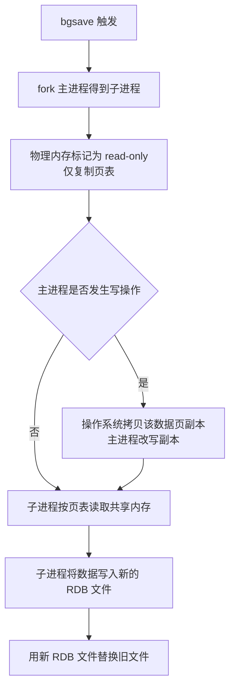
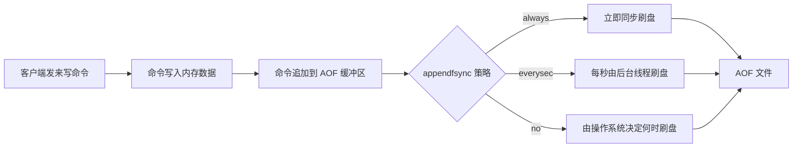

# Redis 持久化：RDB 与 AOF

Redis 把数据放在内存里，内存的读写速度很快，但有一个绕不开的先天问题：数据易失。进程退出、机器断电、内核把进程杀掉，内存里的内容就全部消失。而 Redis 在实际项目中往往不只是"缓存"这一个角色，它还会承担计数器、分布式锁、消息队列、登录状态、库存令牌这些一丢就很难恢复的数据。

持久化就是解决这个问题的机制：把内存中的数据按某种方式写到磁盘，Redis 故障重启后再从磁盘文件读回内存。这样数据的生命周期就不只依赖进程存活，而是落到了磁盘上。

Redis 提供两种持久化方式，它们的思路完全不同：

| 方式 | 全称 | 记录的内容 | 一句话理解 |
| --- | --- | --- | --- |
| RDB | Redis DataBase | 某一时刻内存中的全部数据 | 定时给内存拍一张照片 |
| AOF | Append Only File | 每一条写命令 | 把写命令记成一本流水账 |

两种方式不是二选一的关系，可以同时开启，也可以在只做缓存的实例上全部关闭。下面分别讲清楚它们的原理、配置和取舍。

## 1 RDB 持久化

### 1.1 RDB 是什么

RDB 是 Redis 的数据备份文件，也被叫做 Redis 数据快照。它的做法是：把内存中的所有数据都记录到磁盘中，当 Redis 实例故障重启后，从磁盘读取快照文件，恢复数据。这个快照文件称为 RDB 文件，默认保存在当前运行目录。

RDB 文件默认名为 `dump.rdb`，保存位置由 `dir` 配置项决定。因为它记录的是"数据本身"而不是"操作过程"，文件里是经过序列化和压缩的二进制内容，所以体积相对小，恢复时只要整体加载进内存即可。

配置文件中与 RDB 文件本身相关的几项：

```conf
# 是否压缩，建议设置 no 不开启，压缩也会消耗 cpu，磁盘的话不值钱
rdbcompression yes

# RDB 文件名称，默认是 dump.rdb
dbfilename dump.rdb

# rdb 文件保存的路径目录，./ 表示当前目录
dir ./
```

这几项各自影响什么，可以对照下表理解：

| 配置项 | 作用 | 取舍 |
| --- | --- | --- |
| `rdbcompression` | 是否压缩 RDB 文件内容 | 建议设置 no 不开启，压缩也会消耗 cpu，磁盘的话不值钱 |
| `dbfilename` | RDB 文件名称 | 默认是 dump.rdb |
| `dir` | RDB 文件保存的路径目录 | `./` 表示当前目录，生产环境应指向独立数据盘 |
| `save` | 触发 bgsave 的阈值条件 | `save ""` 表示禁用 RDB |

### 1.2 RDB 的四种执行时机

RDB 持久化在四种情况下会执行，这四种时机的代价和用途差别很大，是实际使用中最容易混淆的一点。

| 触发方式 | 命令或来源 | 是否阻塞主线程 | 典型用途 |
| --- | --- | --- | --- |
| 手动 save | `save` 命令 | 阻塞，期间其他命令无法执行 | 数据迁移等少数场景 |
| 手动 bgsave | `bgsave` 命令 | 不阻塞，不影响处理用户请求 | 手动做一次备份 |
| 停机时自动 | Redis 停机（如 `shutdown`） | 停机过程中执行一次 `save` | 保证正常退出不丢数据 |
| 配置阈值自动 | `save <seconds> <changes>` | 不阻塞，走 `bgsave` | 生产环境的主要方式 |

第一种是执行 `save` 命令。`save` 命令立马执行 RDB 持久化，但是主线程会被阻塞，期间其他命令无法执行，只有数据迁移时可能用到。

第二种是执行 `bgsave` 命令。`bgsave` 命令开启一个新线程执行 RDB 持久化，主线程不会被阻塞，不影响主进程处理用户请求。

第三种是 Redis 停机时。Redis 停机时会自动执行一次 `save` 命令，实现 RDB 持久化。

第四种是触发 RDB 条件时，也就是在 `redis.conf` 文件中配置的阈值条件被满足：

```conf
# 如 save 900 1 表示：900 秒内如果至少有 1 个 key 被修改，则执行 bgsave
# save "" 则表示禁用 RDB
save 900 1
save 300 10
save 60 10000
```

这里的三行 `save` 是三个并列条件，任意一条满足就会触发一次 `bgsave`：900 秒内至少 1 个 key 被修改，或者 300 秒内至少 10 个 key 被修改，或者 60 秒内至少 10000 个 key 被修改。条件写得越密，数据越安全，但 `bgsave` 越频繁，CPU 和磁盘压力越大。

判断"是否满足条件"的依据是被修改过的 key 数量，也就是自上次持久化以来发生了多少次写变更。因此读操作再多也不会触发 RDB，只有写命令才会累积这个计数。理解这一点有助于解释一个常见疑问：一个纯读的实例可能很久都不产生新的 RDB 文件，这是正常现象而不是持久化失效。

### 1.3 bgsave 的原理：fork 与 copy-on-write

`bgsave` 之所以能"不阻塞主线程"，关键在 fork 和 copy-on-write。

bgsave 开始时会 fork 主进程得到子进程，子进程共享主进程的内存数据。完成 fork 后读取内存数据并写入 RDB 文件。

fork 采用的是 copy-on-write 技术：

- 当主进程执行读操作时，访问共享内存
- 当主进程执行写操作时，则会拷贝一份数据，执行写操作

更具体地说：Redis 并不会直接操作内存，而是为进程设置一个虚拟内存，并通过页表保存虚拟内存和物理内存的映射关系。bgsave 开始 fork 主进程得到一个子进程，同时将物理内存中的数据标记为 read-only，仅仅复制页表，子进程根据页表读取内存中的数据，写一个新的 rdb 文件替换旧的 rdb 文件。如果复制页表或写 rdb 文件时主进程执行写操作，会将内存中的原数据拷贝一个副本，修改并读取副本的数据。

用流程图表示这个过程：



这张图说明了两件事：

1. 只有"被修改过的页"才会产生额外内存拷贝，所以正常情况下 COW 带来的内存开销远小于"复制一整份数据"。
2. 最坏情况下，如果整个写入期间主进程把每个页都改了一遍，额外内存占用会接近一整个数据集的大小。这是运维上"持久化期间要预留内存"的直接原因。

### 1.4 RDB 的优缺点

RDB 的优点：

- 文件是数据的整体快照，体积比记录命令的 AOF 小
- 恢复时直接加载，宕机恢复速度很快
- 对主线程影响小，`bgsave` 走子进程

RDB 的缺点，原始笔记里给出两条：

- 执行间隔时间长，两次 RDB 之间写入数据有丢失的风险
- fork 子进程、压缩、写出 RDB 文件都比较耗时

第一条是 RDB 最本质的短板。RDB 是"某个时刻的照片"，两次照片之间的所有写操作都只存在于内存中，一旦此时宕机，这部分数据无法找回。所以 RDB 适合能容忍数分钟数据丢失的场景。

## 2 AOF 持久化

### 2.1 AOF 是什么

AOF 即追加文件。Redis 处理的每一个写命令都会记录在 AOF 文件，可以看做是命令日志文件。

和 RDB 相比，RDB 记录"结果"，AOF 记录"过程"。恢复数据时，Redis 把 AOF 文件里的命令按顺序重新执行一遍，就能把数据重建成宕机前的状态。

AOF 默认是关闭的，需要修改 `redis.conf` 配置文件开启：

```conf
# 是否开启 AOF 功能，默认是 no
appendonly yes
# AOF 文件的名称
appendfilename "appendonly.aof"
```

写命令并不是立刻落盘，而是先进入 AOF 缓冲区，再由刷盘策略决定何时写回磁盘。这一步的取舍直接决定了 AOF 的可靠性上限。



从图中可以看出，`appendfsync` 决定的是"从缓冲区到磁盘"这一步的频率，而"命令进入缓冲区"是每条写命令都会发生的动作。所以即使选 `always`，AOF 也要先经过缓冲区，只是缓冲区几乎不滞留。

### 2.2 三种刷盘策略

AOF 的命令记录频率可以通过 `redis.conf` 文件来配置：

```conf
# 表示每执行一次写命令，立即记录到 AOF 文件
appendfsync always
# 写命令执行完先放入 AOF 缓冲区，然后表示每隔 1 秒将缓冲区数据写到 AOF 文件，是默认方案
appendfsync everysec
# 写命令执行完先放入 AOF 缓冲区，由操作系统决定何时将缓冲区内容写回磁盘，不建议
appendfsync no
```

三种策略的横向对比：

| 配置项 | 刷盘时机 | 优点 | 缺点 |
| --- | --- | --- | --- |
| Always | 同步刷盘 | 可靠性高，几乎不丢失数据 | 性能影响大 |
| everysec | 每秒刷盘 | 性能适中 | 最多丢失 1 秒数据 |
| no | 操作系统控制 | 性能最好 | 可靠性较差，可能丢失大量数据 |

`everysec` 是默认方案，也是绝大多数场景的合理选择：它最多丢 1 秒的数据，同时把刷盘开销从"每条命令"降到"每秒一次"。`always` 适合对数据安全要求极高、写入量不大的场景；`no` 相当于把可靠性交给操作系统，一般不建议在生产环境使用。

### 2.3 AOF 文件重写

因为 AOF 文件记录命令，往往比 RDB 文件大得多。对同一条数据的两次修改只有最后一条命令有效，但是会记录两次命令。比如先 `SET num 1` 再 `SET num 2`，AOF 里会出现两条命令，而实际有意义的状态只有一个。

通过 `bgrewriteaof` 命令可以对 AOF 文件进行重写，节省空间。重写的思路是：不再逐条重放历史命令，而是根据当前内存中的实际数据生成一份"最短命令集"，让新文件表达出同样的最终状态。


Redis 也会在触发阈值时自动去重写 AOF 文件，阈值可以在 `redis.conf` 中配置：

```conf
# AOF 文件比上次文件 增长超过多少百分比则触发重写
auto-aof-rewrite-percentage 100
# AOF 文件体积最小多大以上才触发重写
auto-aof-rewrite-min-size 64mb
```

两个参数是"与"的关系：文件体积要先达到 `64mb` 这个下限，并且相比上一次重写后的体积增长超过 `100%`（也就是翻倍），才会触发自动重写。只配其一都不足以触发，这样可以避免一个空实例刚写几条命令就频繁重写。

### 2.4 AOF 的优缺点

AOF 的优点：

- 数据完整性好，取决于刷盘策略，`everysec` 最多只丢 1 秒
- 追加写是顺序写，正常运行时磁盘 IO 模式友好
- 文件是文本命令，可读性好，便于排查问题

AOF 的缺点：

- 记录命令，文件体积很大
- 恢复时需要重放全部命令，宕机恢复速度慢
- 重写时会占用大量 CPU 和内存资源

## 3 RDB 与 AOF 对比

RDB 和 AOF 各有自己的优缺点，如果对数据安全性要求较高，在实际开发中往往会结合两者来使用。

| 维度 | RDB | AOF |
| --- | --- | --- |
| 持久化方式 | 定时对整个内存做快照 | 记录每一次执行的命令 |
| 数据完整性 | 不完整，两次备份之间会丢失 | 相对完整，取决于刷盘策略 |
| 文件大小 | 会有压缩，文件体积小 | 记录命令，文件体积很大 |
| 宕机恢复速度 | 很快 | 慢 |
| 数据恢复优先级 | 低，因为数据完整性不如 AOF | 高，因为数据完整性更高 |
| 系统资源占用 | 高，大量 CPU 和内存消耗 | 低，主要是磁盘 IO 资源，但 AOF 重写时会占用大量 CPU 和内存资源 |
| 使用场景 | 可以容忍数分钟的数据丢失，追求更快的启动速度 | 对数据安全性要求较高 |

### 3.1 同时开启时的加载优先级

当 RDB 和 AOF 同时开启时，Redis 重启后优先使用 AOF 文件恢复数据。原因就在上表那一行：AOF 的数据完整性更高，用它恢复出来的数据更接近宕机前的真实状态。

这也带来一个需要注意的后果：如果 AOF 文件被损坏或内容不完整，即使 RDB 文件是完好的，恢复也可能失败。所以同时开启时要保证 AOF 文件所在磁盘的可靠性，并留意启动日志里的加载结果。

### 3.2 选型建议

| 场景 | 建议 | 理由 |
| --- | --- | --- |
| 纯缓存，数据可从数据库重建 | 可以关闭持久化 | 缓存失效只是回源压力变大，不需要磁盘兜底 |
| 数据可容忍数分钟丢失，要求快速重启 | 只用 RDB | 文件小、恢复快 |
| 数据安全性要求高 | 只用 AOF 或两者结合 | AOF 提供秒级完整性 |
| 生产环境的标准做法 | 两者结合 | RDB 做冷备，AOF 保证完整性 |

生产环境还有一些配套建议：

- 用来做缓存的 Redis 实例尽量不要开启持久化功能
- 建议关闭 RDB 持久化功能，使用 AOF 持久化
- 利用脚本定期在 slave 节点做 RDB，实现数据备份
- 设置合理的 rewrite 阈值，避免频繁的 `bgrewrite`
- 配置 `no-appendfsync-on-rewrite = yes`，禁止在 rewrite 期间做 aof，避免因 AOF 引起的阻塞

## 4 常见问题

### 4.1 持久化太频繁导致 fork 阻塞

`bgsave` 和 `bgrewriteaof` 都要 fork 子进程。fork 本身需要复制页表，数据集越大，这一步耗时越长，而且 fork 是在主线程里完成的，期间无法处理命令。

几个相关的现象和判断依据：

- `save` 阈值配得过密（例如 `save 60 1`），会让 `bgsave` 反复触发，CPU 和磁盘持续处于高负载
- 单个实例内存过大（例如超过 8G），fork 一次就可能造成明显的响应抖动
- COW 期间如果写操作密集，主进程为了改副本会不断拷贝内存页，内存占用可能快速上涨

缓解方式：

- 把 `save` 阈值放宽，只在数据量确实增长的时间窗口内触发
- 单个 Redis 实例内存上限不要太大，例如 4G 或 8G，可以加快 fork 的速度、减少主从同步、数据迁移压力
- Redis 实例的物理机要预留足够内存，应对 fork 和 rewrite
- 不要与 CPU 密集型应用部署在一起，也不要与高硬盘负载应用一起部署，例如数据库、消息队列

判断是否已经踩到这个坑，可以按现象倒推原因：

| 现象 | 可能原因 | 处理方向 |
| --- | --- | --- |
| 周期性出现几百毫秒的响应毛刺 | `save` 阈值过密，`bgsave` 反复拉起 | 放宽阈值，拉长两次持久化的间隔 |
| 内存使用量在持久化期间突然上涨 | 写入密集导致 COW 大量拷贝内存页 | 预留内存，或错峰降低写入压力 |
| 持久化期间命令排队明显 | fork 复制页表耗时随数据集增大而变长 | 控制单实例内存规模 |
| 磁盘 IO 长期打满 | RDB 写出与 AOF 重写同时发生 | 错峰执行重写，避免与 RDB 撞车 |

回忆一下主线程在 AOF 刷盘时的行为序列：主线程接收到写操作后，不仅将数据写到内存，还要将命令写到 AOF 缓冲区，根据刷盘策略（如每 1 秒刷盘）开启新线程同步进行刷盘，同时监听本次刷盘时间，如果刷盘超过 2 秒，主线程阻塞等待刷盘完成为止，否则正常执行指令。这说明磁盘一旦变慢，AOF 就会把压力传导回主线程。

### 4.2 AOF 文件膨胀

AOF 记录的是命令流水，即使数据总量不变，反复修改同一个 key 也会让文件不断增大。文件越大，两个问题越明显：磁盘占用上升，重启恢复时间长。

处理方式：

- 手动执行 `bgrewriteaof` 做一次重写
- 检查 `auto-aof-rewrite-percentage` 和 `auto-aof-rewrite-min-size` 是否合理。如果 `min-size` 配得过大，小实例可能长期不触发重写；如果 `percentage` 配得过小，又会频繁重写
- 重写期间同样会占用大量 CPU 和内存资源，属于典型的"用资源换空间"，所以要错峰执行而不是无脑频繁执行

两个阈值的组合效果可以直接对照下表：

| `percentage` | `min-size` | 实际效果 |
| --- | --- | --- |
| 100 | 64mb | 默认组合，文件增长一倍且超过 64mb 才重写 |
| 100 | 很大 | 小实例可能长期不重写，文件持续增长，恢复时间变长 |
| 很小 | 64mb | 频繁触发重写，CPU 和磁盘被反复占用 |
| 100 | 偏小 | 重写更积极，适合写入量小但要求重启快的实例 |

重写期间产生的写命令也不能丢，Redis 会把这些新命令额外记录下来，在新 AOF 文件替换旧文件后再补写进去，保证重写过程本身不会造成数据缺口。

### 4.3 磁盘空间不足

RDB 和 AOF 最终都要落到磁盘。磁盘写不进去时，持久化会失败，这会直接影响服务行为：

- `bgsave` 失败后，新的写命令不再被允许执行，客户端会收到明确的错误
- AOF 无法追加写入，写操作同样会失败

所以磁盘容量和 inode 都要单独监控，`dir` 所在分区尤其要留出余量：RDB 写新文件时会先占一份空间（新文件写完才替换旧文件），AOF 重写也会在磁盘上并存新旧两个文件，这两段时间的峰值占用都比稳态高。

### 4.4 恢复失败时的排查顺序

| 现象 | 优先检查 | 说明 |
| --- | --- | --- |
| 重启后数据比预期旧很多 | `save` 阈值、AOF 是否真的开启 | 可能只用了 RDB，或 AOF 从未落盘 |
| 重启后数据是旧的但文件是新的 | 加载优先级 | 同时开启时 Redis 优先用 AOF 恢复 |
| 启动直接报错退出 | AOF 文件完整性、磁盘剩余空间 | 文件被截断或写入失败都可能让加载中断 |

## 5 本篇总结

1. Redis 用内存存数据，持久化是为了解决内存数据易失的问题，重启后从磁盘文件恢复。
2. RDB 是把内存数据整体快照到 `dump.rdb`，有 `save`、`bgsave`、停机自动和配置阈值四种触发时机。
3. `bgsave` 通过 fork 子进程和 copy-on-write 实现不阻塞主线程，代价是 fork 耗时和写入期的额外内存拷贝。
4. RDB 文件小、恢复快，缺点是两次快照之间会丢数据，所以适合容忍数分钟丢失、追求快速启动的场景。
5. AOF 记录每一条写命令，默认关闭，需要 `appendonly yes` 显式开启。
6. 三种刷盘策略中 `everysec` 是默认且性能与可靠的平衡点，`always` 最可靠但性能影响大，`no` 不建议使用。
7. AOF 文件会膨胀，用 `bgrewriteaof` 重写，也由 `auto-aof-rewrite-percentage` 和 `auto-aof-rewrite-min-size` 两个参数自动触发。
8. RDB 和 AOF 在数据完整性、文件体积、恢复速度、资源占用等维度上互补，生产环境常把两者结合使用。
9. 两者同时开启时，Redis 优先用 AOF 加载，因为它的数据完整性更高。
10. fork 阻塞、AOF 膨胀、磁盘写满是最常见的三类持久化问题，核心应对思路是控制单实例内存规模、留足磁盘与内存余量、把重写任务错峰执行。
