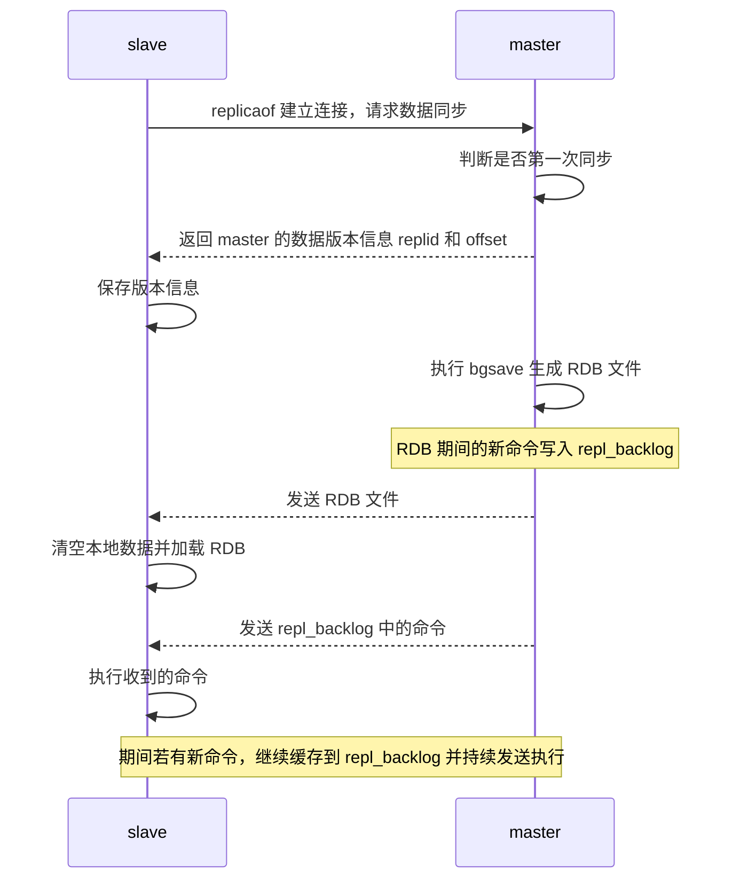
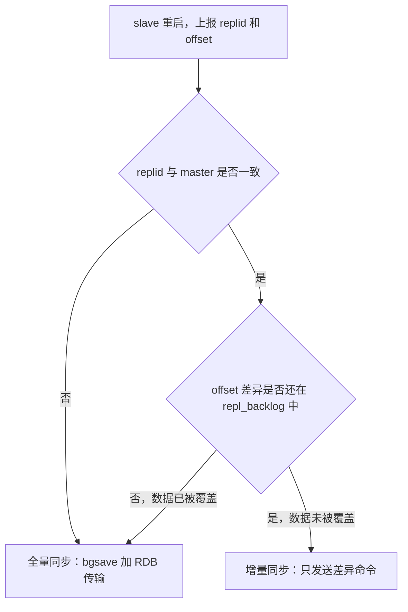
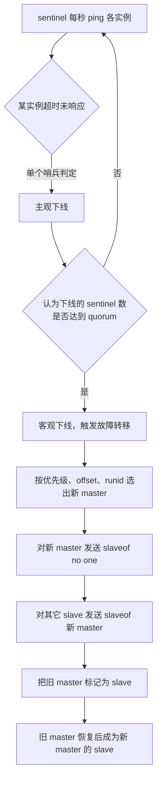
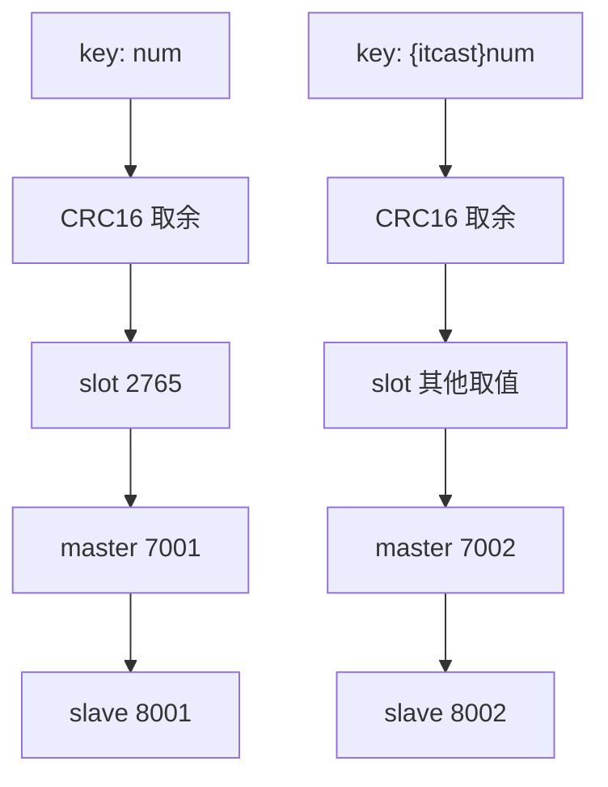

# Redis 高可用与集群：主从、哨兵与分片集群

单节点 Redis 的并发能力是有上限的，要进一步提高 Redis 的并发能力，就需要搭建主从集群，实现读写分离。除了并发能力，单节点还有两个问题：内存容量受单机限制，存不下海量数据；实例一旦宕机，所有依赖它的读写都会失败。

Redis 针对这两个问题给出了三种逐层递进的方案：

| 方案 | 解决的问题 | 是否自动故障恢复 | 数据容量上限 |
| --- | --- | --- | --- |
| 主从复制 | 读并发、数据备份 | 否，需要人工介入 | 单机内存上限 |
| 哨兵 Sentinel | 主从的自动故障恢复 | 是 | 单机内存上限 |
| 分片集群 Cluster | 海量数据存储与高并发 | 是 | 多主节点内存之和 |

这三种方案不是互相替代的关系：哨兵建立在主从之上，分片集群内部每个分片又是主从结构。下面按这个顺序展开。

## 1 主从复制

### 1.1 主从复制的作用

主从复制通过让一个 master 节点把数据同步给若干 slave（replica）节点，达到三个效果：

| 作用 | 说明 |
| --- | --- |
| 读写分离 | 写请求走 master，读请求分散到多个 slave，提升整体读并发能力 |
| 数据备份 | slave 持有 master 数据的完整副本，master 故障时数据不至于全丢 |
| 故障恢复 | 提供了"可以被提升为新 master 的候选节点"，是哨兵和集群的前提 |

需要注意一个约束：从节点默认只读，写操作只能在 master 上执行。这也是读写分离能够成立的基础。

### 1.2 搭建方式

可以和主从关系相关的命令有两个：`replicaof` 或者 `slaveof`。`replicaof` 在 Redis 5.0 以后新增，与 `slaveof` 效果一致，`slaveof` 是 5.0 以前的写法。

开启主从关系有临时和永久两种模式：

- 修改配置文件（永久生效）：在 `redis.conf` 中添加一行配置 `slaveof <masterip> <masterport>`
- 使用 redis-cli 客户端连接到 redis 服务，执行 `slaveof` 命令（重启后失效）

```text
# 连接从节点
redis-cli -p 7002
# 执行 slaveof，指定主节点 IP 和端口
slaveof 192.168.150.101 7001
```

如果主节点设置了密码，除了 `slaveof` 还要指定密码：

```text
# 若主节点有密码，必须配置此项，否则可以不配置
masterauth master_password
```

或者用命令方式临时指定：`config set masterauth password`。

搭建完成后可以查看集群状态：

```text
# 连接主节点
redis-cli -p 7001
# 查看复制状态
info replication
```

搭建完成后做一次验证：分别在三个节点执行 `set num 123` 和 `get num`，只有 7001 可以执行写操作，7002 和 7003 只能执行读操作。

还有一项配置值得单独提：`replica-announce-ip`。在容器、多网卡等环境下，节点之间互相看到的是对内网可见的地址，需要显式声明对外公布的 IP，否则主从之间、sentinel 与节点之间的地址会填错：

```conf
# 注册的实例 ip
replica-announce-ip 192.168.150.101
```

### 1.3 全量同步

主从第一次建立连接时，会执行全量同步，将 master 节点的所有数据都拷贝给 slave 节点。

整个过程的参与者有三个：slave 的请求、master 的判断与生成 RDB、以及期间的写命令缓存。用时序图表示：



流程拆开看是这几步：

1. 第一次建立连接时，slave 执行 `replicaof` 命令并建立连接，请求 master 进行数据同步
2. master 判断是否是第一次同步，是则返回 master 的数据版本信息
3. slave 收到并保存版本信息
4. master 执行 `bgsave` 命令生成 RDB 文件并发送 RDB 文件到 slave
5. slave 清空本地数据并加载收到的 RDB 文件
6. RDB 期间可能有新的命令执行，master 会记录这些命令缓存到 repl_backlog 中，RDB 结束后 master 再发送 repl_backlog 中的命令给 slave
7. slave 执行收到的命令；如果期间再有命令，还是缓存到 repl_backlog，然后不断地发送执行，从而保证主从数据同步

这里有两个贯穿始终的标识，理解它们才能理解同步的判定逻辑：

| 标识 | 含义 |
| --- | --- |
| Replication Id（replid） | 数据集的标记。id 一致则说明是同一数据集。每一个 master 都有唯一的 replid，slave 则会继承 master 节点的 replid |
| offset | 偏移量，随着记录在 repl_backlog 中的数据增多而逐渐增大。slave 完成同步时也会记录当前同步的 offset |

offset 的作用是判断落后程度：如果 slave 的 offset 小于 master 的 offset，说明 slave 数据落后于 master，需要更新。

slave 做数据同步必须向 master 声明自己的 replid 和 offset，master 才可以判断是否是第一次同步、同步哪些数据。初始时 slave 有自己的 replid 和 offset，建立连接时 master 发现 slave 发送来的 replid 与自己的不一致，需要做全量同步，并将自己的 replid 和 offset 都发送给这个 slave，slave 保存这些信息，以后 slave 的 replid 就与 master 一致了。

### 1.4 增量同步

全量同步是在 master 与 slave 第一次建立连接时执行的。其他情况、slave 重启时都是进行的增量同步，所谓增量同步，即只更新 slave 与 master 存在差异的部分数据。

当 slave 重启后，携带 replid 和 offset 向 master 请求数据同步，master 判断请求的 replid 与自己的一致，则不是第一次，回复 `continue` 给 slave，然后获取 repl_backlog 中 offset 偏移量之后的数据（命令）并发送给 slave，slave 执行收到的命令保证主从数据一致。

把两种同步方式的触发条件放在一起对比：

| 同步方式 | 触发条件 | 传输内容 | 代价 |
| --- | --- | --- | --- |
| 全量同步 | 主从第一次建立连接时 | 整个数据集的 RDB 文件加后续命令 | 高，占用大量磁盘 IO、网络带宽和内存 |
| 全量同步 | 从节点宕机时间太长，导致 repl_backlog 中尚未同步的数据被覆盖，无法基于 log 做增量同步 | 同上 | 同上 |
| 增量同步 | 主从第一次建立后，即全量同步后都执行增量同步 | 仅 offset 差异部分的命令 | 低 |
| 增量同步 | 从节点宕机重启，且 repl_backlog 中没有尚未同步的数据 | 仅 offset 差异部分的命令 | 低 |

### 1.5 repl_backlog 与数据覆盖

repl_backlog 是一个固定大小的环形数组，即角标到达数组末尾后，会再次从 0 开始读写。repl_backlog 中会记录 Redis 处理过的命令日志及 offset，包括 master 当前的 offset，和 slave 已经拷贝到的 offset。

进行增量同步时，仅仅是拷贝 slave 偏移量和 master 偏移量有差别的部分。随着不断地拷贝，slave 也在不断追赶 master，即使数组已经满了进行覆盖旧数据，由于这部分旧数据已经被 slave 同步，所以并不会有影响。

但有一种情况会退化成全量同步：如果 slave 宕机时间太长，以至于 master 偏移量超过了 slave 偏移量，此时 slave 重启发现自己的 slave 偏移量已经没有了，无法进行增量同步，就只能进行全量同步。



这个判断顺序是运维定位"从节点为什么做了全量同步"的排查依据：先看 replid 是否变化（比如主节点做过故障转移或 `replicaof no one`），再看 repl_backlog 是否够大。

### 1.6 同步优化手段

如果主从集群规模比较大，这时进行数据同步就会比较麻烦，可以从如下方面进行优化：

| 优化方向 | 做法 | 说明 |
| --- | --- | --- |
| 避免磁盘 IO | 在 master 配置文件中配置 `repl-diskless-sync yes` 启用无磁盘复制 | 避免全量同步时的磁盘 IO，但要保证网络情况良好 |
| 降低 RDB 开销 | Redis 单节点上的内存占用不要太大 | 减少 RDB 导致的过多磁盘 IO |
| 减少全量同步 | 适当提高 master 配置文件中 `repl_baklog` 的大小 | 发现 slave 宕机时尽快实现故障恢复，尽可能避免全量同步 |
| 降低 master 压力 | 限制一个 master 上的 slave 节点数量 | slave 太多时采用主-从-从链式结构，减少 master 压力 |

链式结构的思路是：不让所有 slave 都直接挂在 master 上，而是让部分 slave 去从其他 slave 同步数据，把同步压力沿链条分摊出去。

### 1.7 主从复制的边界

主从复制本身只解决"数据有多份"的问题，它不解决"什么时候切换"。master 宕机后，需要人工登录到某个 slave 执行 `slaveof no one` 把它提升为主，再让其他 slave 指向它，同时还要通知所有客户端改配置。这个过程既慢又容易出错，而且期间写服务是中断的。

正是这个缺口，引出了哨兵。

## 2 哨兵 Sentinel

Redis 的哨兵机制用来实现主从集群的自动故障恢复，它的职责可以归纳为三点：

| 职责 | 说明 |
| --- | --- |
| 监控 | Sentinel 会不断检查 master 和 slave 是否按预期工作 |
| 自动故障恢复 | 如果 master 故障，Sentinel 会将一个 slave 提升为 master。当故障实例恢复后也以新的 master 为主 |
| 通知 | Sentinel 充当 Redis 客户端的服务发现来源，当集群发生故障转移时，会将最新信息推送给 Redis 的客户端 |

### 2.1 集群结构与节点角色

哨兵集群由若干个独立的 sentinel 进程组成，它们监控同一套主从集群。以三个 sentinel 为例：

| 节点 | IP | PORT |
| --- | --- | --- |
| s1 | 192.168.150.101 | 27001 |
| s2 | 192.168.150.101 | 27002 |
| s3 | 192.168.150.101 | 27003 |

为什么至少要有三个 sentinel：判定"客观下线"需要多个 sentinel 达成一致，用一个 sentinel 做判断就无法区分"节点真的挂了"和"这个 sentinel 自己网络有问题"。三个节点允许挂掉一个还能正常判定，这是"多数派"思路在哨兵上的体现。

每个 sentinel 都要写配置文件，关键项如下：

```conf
# 当前 sentinel 实例的端口
port 27001
# 当前 sentinel 实例的 IP
sentinel announce-ip 192.168.150.101
# 指定 master 信息：
#     mymaster: 主节点名称，任意写
#     192.168.150.101 7001: master 的 IP 和端口
#     2: 选举 master 时的 quorum 值，2 表示至少两个 sentinel 认为 master 下线才进行故障恢复
sentinel monitor mymaster 192.168.150.101 7001 2
# 判定 master 主观下线的超时时间，5000 表示 5 秒内未 ping 通就认为 master 发生故障
sentinel down-after-milliseconds mymaster 5000
# 故障转移超时时间，60000 表示 60 秒内未进行完故障转移重新进行
sentinel failover-timeout mymaster 60000
# 哨兵节点的工作目录
dir "/tmp/s1"
```

启动方式：

```text
redis-sentinel s1/sentinel.conf
```

### 2.2 主观下线与客观下线

Sentinel 判断 Redis 服务器是否发生故障，是基于心跳机制监测服务状态，每隔 1 秒向集群的每个实例发送 ping 命令：

| 判定 | 触发条件 | 含义 |
| --- | --- | --- |
| 主观下线 | 如果某 Sentinel 节点发现某实例未在规定时间响应 | 单个哨兵的判断，可能因网络抖动误判 |
| 客观下线 | 若超过指定数量（quorum）的 sentinel 都认为该实例主观下线 | 多哨兵达成的共识，才触发故障转移 |

`quorum` 参数的作用就是设定这个"指定数量"，它出现在 `sentinel monitor` 命令的最后一个参数里，取值建议是：quorum 值最好超过 Sentinel 实例数量的一半。

以三个 sentinel 为例，`quorum` 配 2：一个哨兵认为下线只是主观下线，两个哨兵都认为下线才升级为客观下线，开始选主。如果把 `quorum` 配成 1，单个哨兵的误判就能触发整个故障转移，容易出现无意义的切换；如果配得过高（超过 sentinel 数量），则永远无法达成共识，故障恢复形同虚设。

### 2.3 选主的优先级规则

Sentinel 判断出 master 发生故障后，首先选择一个新的 slave 作为 master，选择机制按顺序逐级比较：

| 优先级 | 规则 | 说明 |
| --- | --- | --- |
| 1 | 判断 slave 节点与 master 节点断开时间长短 | 如果超过指定值 `down-after-milliseconds * 10` 则会排除该 slave 节点 |
| 2 | 判断 slave 节点的 `slave-priority`（新版本配置名为 `replica-priority`） | 越小优先级越高，如果是 0 则永不参与选举 |
| 3 | 判断 slave 节点的 `offset` 值 | 越大说明数据越新，优先级越高 |
| 4 | 判断 slave 节点的运行 id 大小 | 越小优先级越高 |

这个顺序体现了设计意图：先排除"数据太旧、状态不可信"的节点，再让运维能通过 `slave-priority` 人工干预，最后用 offset 保证选出的新主数据最新，runid 只是为了在完全同分时给一个确定性的结果，避免多个哨兵选出的结果不一致。

### 2.4 故障转移流程

选出一个新的 master 后，切换动作分三步：

- sentinel 给备选的 slave1 节点发送 `slaveof no one` 命令，让该节点成为 master
- sentinel 给所有其它 slave 发送 `slaveof 192.168.150.101 7002`（新 master 的 IP 和端口）命令，让这些 slave 成为新 master 的从节点，开始从新的 master 上同步数据
- 最后，sentinel 将故障节点标记为 slave（修改配置文件添加 `slaveof`），当故障节点恢复后会自动成为新的 master 的 slave 节点



第 3 步容易被忽略，但它决定了"旧主回来以后怎么办"：旧 master 不会自动抢回主节点身份，而是作为从节点接入，从上一步已经选出的新主同步数据。这样避免了主节点身份来回摇摆。

### 2.5 客户端如何感知变化

在 Sentinel 集群监管下的 Redis 主从集群，其节点会因为自动故障转移而发生变化，Redis 的客户端必须感知这种变化并及时更新连接信息。Spring 的 RedisTemplate 底层利用 lettuce 实现了节点的感知和自动切换。

配置上要指定 sentinel 的 master 名称和节点列表：

```conf
spring:
  redis:
    sentinel:
      master: mymaster
      nodes:
        - 192.168.150.101:27001
        - 192.168.150.101:27002
        - 192.168.150.101:27003
```

读写分离则通过 `ReadFrom` 策略控制，候选项如下：

| 策略 | 行为 |
| --- | --- |
| MASTER | 从主节点读取 |
| MASTER_PREFERRED | 优先从 master 节点读取，master 不可用才读取 replica |
| REPLICA | 从 slave（replica）节点读取 |
| REPLICA_PREFERRED | 优先从 slave（replica）节点读取，所有的 slave 都不可用才读取 master |

在启动类或配置类中注册一个 bean 即可切换策略：

```text
@Bean
public LettuceClientConfigurationBuilderCustomizer clientConfigurationBuilderCustomizer(){
    return clientConfigurationBuilder -> clientConfigurationBuilder.readFrom(ReadFrom.REPLICA_PREFERRED);
}
```

验证方式很直接：让 master 宕机，观察 sentinel 日志并继续调用写接口。因为客户端会自动切到新主，即使 master 宕机也不会影响写操作。

## 3 分片集群 Redis Cluster

### 3.1 为什么需要分片

主从加哨兵解决的是"读并发"和"故障自动恢复"，但它们的数据仍然是完整的一份，全部放在同一组主从里。这带来两个硬性限制：

- 内存容量受单节点限制。数据集大于单机可用内存时，无论如何加从节点都存不下
- 写并发仍受单个 master 限制。所有写操作都要落到唯一的主节点上

分片集群就是由多个主从搭建的 Redis 集群模式，可以解决海量数据存储和高并发问题。它的特点是：

- 集群中有多个 master，每个 master 保存不同数据
- 每个 master 都可以有多个 slave 节点
- master 之间通过 ping 监测彼此健康状态
- 客户端请求可以访问集群任意节点，最终都会被转发到正确节点

最后一条是分片集群最直观的特征：客户端不需要知道某个 key 到底在哪台机器上，只要连上集群中的任意一个节点即可。

### 3.2 集群的创建与副本数

Redis 5.0 以前集群命令都是用 redis 安装包下的 `src/redis-trib.rb` 来实现的，因为 `redis-trib.rb` 由 ruby 语言编写，所以需要安装 ruby 环境。Redis 5.0 以后集群管理已经集成到了 `redis-cli` 中。

```text
# Redis 5.0 以后的创建方式
redis-cli --cluster create --cluster-replicas 1 192.168.150.101:7001 192.168.150.101:7002 192.168.150.101:7003 192.168.150.101:8001 192.168.150.101:8002 192.168.150.101:8003
```

命令中各部分的含义：

| 部分 | 含义 |
| --- | --- |
| `redis-cli --cluster` 或 `./redis-trib.rb` | 代表集群操作命令 |
| `create` | 代表是创建集群 |
| `--replicas 1` 或 `--cluster-replicas 1` | 指定集群中每个 master 的副本个数为 1 |

副本数与 master 数量的关系是一条可以直接套用的公式：节点总数 ÷ (replicas + 1) 得到的就是 master 的数量。因此节点列表中的前 n 个就是 master，其它节点都是 slave 节点，随机分配到不同 master。

连接集群时有一个必须注意的细节：一定要加 `-c` 选项表示是集群模式，否则会出错。

```text
# 连接，这里一定要加 -c 选项表示是集群模式，否则会出错
redis-cli -c -p 7001
# 存储数据
set num 123
# 读取数据
get num
```

也可以用 `redis-cli -p 7001 cluster nodes` 查看集群状态。

### 3.3 散列插槽

Redis 会把每一个 master 节点映射到 0~16383 共 16384 个插槽（hash slot）上。数据 key 不是与节点绑定，而是与插槽绑定，插槽再分配给节点。这层间接性是整个分片机制的核心：数据迁移只要移动槽的归属，不需要改变 key 与槽的映射关系。



redis 会根据 key 的有效部分计算插槽值：

- key 中包含 `{}`，且 `{}` 中至少包含 1 个字符，`{}` 中的部分是有效部分
- key 中不包含 `{}`，整个 key 都是有效部分

例如 key 是 `num`，那么就根据 `num` 计算，如果是 `{itcast}num`，则根据 `itcast` 计算。计算方式是利用 CRC16 算法得到一个 hash 值，然后对 16384 取余，得到的结果就是 slot 值。

这个规则提供了一种控制数据落点的手段：要想将一类数据固定地保存在同一个 Redis 实例，可以使它们的 key 都以 `{typeId}` 为前缀，从而保证 key 有效部分相同。同时它也是双刃剑——所有 key 都用同一个 hash tag 时，数据会全部倾斜到同一个节点上。

### 3.4 集群伸缩

`redis-cli --cluster` 提供了很多操作集群的命令，可以通过 `redis-cli --cluster help` 命令查看。伸缩的完整流程是"先加节点，再迁槽"。

#### 3.4.1 添加节点

```text
# 将 7004 添加到 Redis 集群，以 7001 作为已有的集群入口
redis-cli --cluster add-node 192.168.150.101:7004 192.168.150.101:7001
```

添加完成后用 `redis-cli -p 7001 cluster nodes` 查看，7004 加入了集群，并且默认是一个 master 节点。但 7004 节点的插槽数量为 0，因此没有任何数据可以存储到 7004 上。这一步很容易被误解为"加完节点就扩容成功了"，实际只是加了一个空的 master。

#### 3.4.2 转移插槽

要让数据真正落到新节点上，必须把一部分槽分配给它：

```text
redis-cli --cluster reshard 192.168.150.101:7001
```

执行命令后会依次询问三个问题：

| 询问内容 | 应回答什么 | 说明 |
| --- | --- | --- |
| 要移动多少个插槽 | 例如 3000 | 决定这次迁移的规模 |
| 哪个节点接收这些插槽 | 目标节点的节点 ID | 节点 ID 可以在 `cluster nodes` 输出中拷贝 |
| 插槽是从哪里移动过来的 | `all`、具体节点 ID 或 `done` | all 代表三个节点各转移一部分；具体 ID 表示只从该节点迁；done 表示没有更多来源 |
| 最后询问是否确认转移 | yes | 确认后开始迁移 |

一个具体的判断依据：先用 `get num` 可以看到 `num` 对应的插槽位置是 2765。要把 `num` 存到 7004 上，就把包含 2765 的那段区间（例如前 3000 个插槽）从 7001 迁移到 7004。

#### 3.4.3 缩容

删除节点的操作与新增相反，需要先把该节点上的槽迁走再删除节点，顺序颠倒会造成部分槽无主、数据不可访问。迁移过程对客户端是透明的，这也是"数据与槽绑定而不是与节点绑定"这一设计带来的收益。

### 3.5 MOVED 与 ASK 重定向

前面提到"客户端请求可以访问集群任意节点，最终都会被转发到正确节点"，这个转发靠的就是重定向响应。客户端带 `-c` 时才会自动跟随重定向，不带 `-c` 时收到重定向响应就会直接报错——这正是前面强调"一定要加 -c"的原因。

| 响应 | 触发时机 | 客户端应如何处理 | 是否长期有效 |
| --- | --- | --- | --- |
| MOVED | 节点发现该 key 所属的槽不由自己负责，槽已稳定归属于另一个节点 | 按返回的地址连接目标节点并重新发送命令，同时更新本地槽映射缓存 | 是，这是槽归属的长期结论 |
| ASK | 该槽正在迁移中，key 可能已经搬到了目标节点，但仍属于源节点 | 先向目标节点发送 `ASKING`，再发送原命令，但不要修改本地槽映射缓存 | 否，仅对本次请求有效 |

两者的区别可以用一句话概括：MOVED 是"这个槽以后归它了，记住它"；ASK 是"这次你先去问它一下，但别改记录"。混淆二者的后果是：把 ASK 当成 MOVED 会让客户端在迁移过程中把槽归属记错，迁移结束后持续访问到错误节点。

### 3.6 故障转移与可用性要求

#### 3.6.1 自动故障转移

当集群中有一个 master 宕机时，会自动提升一个 slave 为 master，即使 master 重新启动了，也会变成 slave。观察到的过程分几个阶段：

1. 首先是该实例与其它实例失去连接
2. 然后是疑似宕机（PFAIL 状态）
3. 最后是确定下线，自动提升一个 slave 为新的 master
4. 当原来的 master 再次启动，就会变为一个 slave 节点

#### 3.6.2 手动故障转移

如果需要更新或修复某个 master 节点，可以通过手动故障转移方式选一个 slave 代替这个 master。利用 `cluster failover` 命令可以手动让集群中的某个 master 宕机，切换到执行该命令的 slave 节点，实现无感知的数据迁移。

failover 命令可以指定三种模式：

| 模式 | 行为 |
| --- | --- |
| 缺省 | 默认的完整流程，包含对 offset 的一致性校验 |
| force | 省略了对 offset 的一致性校验，直接从流程后段开始 |
| takeover | 直接执行切换，忽略数据一致性、忽略 master 状态和其它 master 的意见 |

举例来说，如果自动故障转移后 7002 节点成为了 slave，想要让 7002 重新成为 master，可以连接 7002 后执行 `cluster failover`，与其同步的 master 就会成为 slave。

#### 3.6.3 可用性要求

分片集群的可用性建立在多数主节点正常工作的前提上：

| 条件 | 结果 |
| --- | --- |
| 负责某槽的主节点下线，且它有可用的从节点 | 从节点被提升为新的主节点，该槽继续可用 |
| 负责某槽的主节点下线，且它没有可用的从节点 | 该槽不可用 |
| 超过半数的 master 节点失去联系 | 集群停止对外服务，避免出现脑裂式的部分写入 |
| 任意一个插槽不可用，且 `cluster-require-full-coverage` 为默认的 yes | 整个集群都会停止对外服务，建议将该配置改为 no 保证高可用 |

集群规模本身也需要控制。集群节点之间会不断地互相 ping 来确定集群中其它节点的状态，每次 ping 携带的信息至少包括插槽信息和集群状态信息；集群节点越多，集群状态信息数据量也越大，10 个节点的相关信息可能达到 1kb，此时每次集群互通需要的带宽会非常高，导致集群大量的带宽都被 ping 占用。

- 避免大集群，集群节点数不要太多，最好少于 1000，如果业务庞大则建立多个集群
- 避免在单个物理机中运行太多 Redis 实例，并配置合适的 `cluster-node-timeout` 值

## 4 三种高可用方案对比

| 维度 | 主从复制 | 哨兵 Sentinel | 分片集群 Cluster |
| --- | --- | --- | --- |
| 数据容量 | 单机内存上限，从节点是全量副本 | 单机内存上限，从节点是全量副本 | 多主节点内存之和，可横向扩展 |
| 并发能力 | 读并发可扩展，写并发受单主限制 | 读并发可扩展，写并发受单主限制 | 读写在多组主从上同时扩展 |
| 故障恢复方式 | 人工提升从节点并修改客户端配置 | 哨兵自动选主并完成切换，客户端自动感知 | 集群自动提升从节点，槽与客户端重定向自动完成 |
| 故障恢复是否需要人工 | 需要 | 不需要 | 不需要 |
| 数据是否分片 | 否 | 否 | 是，16384 个槽分布在各 master 上 |
| 客户端要求 | 自行配置读写地址 | 配置 sentinel 地址，由客户端框架感知 | 配置多个节点地址，且必须支持集群协议（如 `-c`） |
| 运维复杂度 | 低 | 中，需要维护哨兵集群和 quorum | 高，涉及槽分配、迁移和集群伸缩 |
| 适用场景 | 读多写少，单机容量够用的场景 | 单机容量够用且要求自动故障恢复的场景 | 海量数据、高并发读写，单机放不下的场景 |

补充一点客户端层面的差异：由于分片集群自带故障恢复（故障转移），所以原来的哨兵集群配置删除也没有影响。分片集群的使用和哨兵模式的差别仅仅在于集群地址的配置，其他一模一样。

## 5 本篇总结

1. 单节点 Redis 在并发、容量和可用性上都有上限，主从、哨兵、分片集群是逐层递进的三种解决方案。
2. 主从复制实现读写分离、数据备份和故障恢复候选节点，从节点默认只读。
3. 开启主从关系用 `replicaof`（Redis 5.0 后）或 `slaveof`（5.0 前），可写入配置文件永久生效，也可用命令临时生效。
4. 全量同步在首次建立连接时执行，流程是返回版本信息、`bgsave` 生成并发送 RDB、再补发期间缓存的命令。
5. replid 标记数据集身份，offset 标记同步进度，二者共同决定做全量还是增量同步。
6. repl_backlog 是固定大小的环形数组，从节点宕机太久导致差异数据被覆盖时，只能退化为全量同步。
7. 同步优化手段包括 `repl-diskless-sync yes`、控制单实例内存、调大 repl_backlog、用主-从-从链式结构分摊压力。
8. 哨兵提供监控、自动故障恢复和通知三项能力，靠每秒 ping 的心跳机制判定节点状态。
9. 主观下线是单个哨兵的判断，客观下线需要达到 `quorum` 数量的哨兵一致认为下线，quorum 最好超过哨兵数量的一半。
10. 选主依次比较断开时间、`slave-priority`、offset 和 runid，切换时对新主发 `slaveof no one`、对其他从节点发 `slaveof 新主`、把旧主标记为从节点。
11. 分片集群用 16384 个散列插槽把数据分布到多个 master 上，key 按有效部分的 CRC16 值对 16384 取余定位槽。
12. 伸缩的正确顺序是先加节点再迁槽，`add-node` 之后的节点槽数为 0，必须用 `reshard` 分配才能承载数据。
13. MOVED 表示槽归属已长期改变，ASK 表示槽正在迁移、仅本次有效，客户端带 `-c` 才能自动跟随重定向。
14. 集群的可用性要求多数 master 正常，任意槽不可用时默认整个集群停止服务，可通过 `cluster-require-full-coverage no` 放宽。
15. 三种方案的选型取决于数据量、并发要求和运维成本：容量够用优先哨兵，数据放不下或写并发不够才上分片集群。
