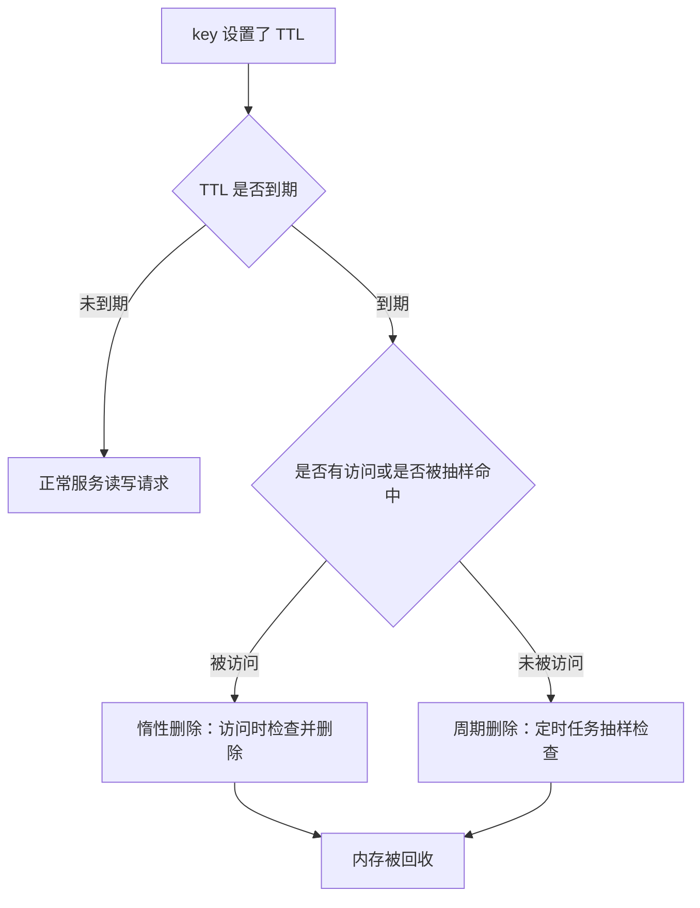
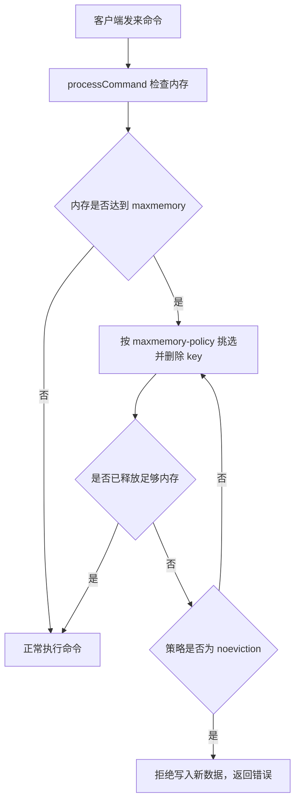

# Redis 过期删除与内存淘汰

Redis 是基于内存存储的，单个节点的内存大小不宜太大，会影响持久化或主从同步性能。内存使用达到上限时 Redis 就无法存储更多数据，当然，可以修改配置文件的 `maxmemory` 配置修改 Redis 内存上限。

内存总有上限，所以必须有一条"数据怎么离开 Redis"的路径。实际有两条，它们触发条件不同、目的也不同：

| 路径 | 触发条件 | 回收对象 | 目的 |
| --- | --- | --- | --- |
| 过期删除 | key 的 TTL 到期 | 设置了过期时间且已到期的 key | 执行用户设定的生命周期 |
| 内存淘汰 | 内存使用达到 `maxmemory` 上限 | 由 `maxmemory-policy` 策略挑选的 key | 给新数据腾出空间 |

过期删除是"按约定消失"，内存淘汰是"被迫挤掉"。二者都可能在同一条命令的执行路径上发生，也都会直接影响命中率和响应时间，所以要一起理解。

## 1 过期时间相关命令回顾

### 1.1 常用命令

Redis 通过 expire 命令可以为 key 设置一个有效期 TTL，当 key 过期后，访问这个 key 会返回 nil，代表 key 不存在，对应的内存也就会被回收。

围绕 TTL 的命令可以分成"设置"和"查询、取消"三类：

| 命令 | 作用 | 单位或说明 |
| --- | --- | --- |
| `EXPIRE key seconds` | 给一个 key 设置有效期 | 秒 |
| `PEXPIRE key milliseconds` | 同上，精度更高 | 毫秒 |
| `EXPIREAT key timestamp` | 把过期时间设置为指定时刻 | 秒级时间戳 |
| `TTL key` | 查看一个 key 的剩余有效期 | 秒 |
| `PERSIST key` | 移除 key 的过期时间，变成永不过期 | 无 |

需要提醒的是，`EXPIRE` 需要 key 已经存在，对一个不存在的 key 执行不会产生任何效果。

```text
# 设置 300 秒后过期
EXPIRE user:1001 300

# 查看剩余秒数
TTL user:1001

# 取消过期时间，key 变为永久有效
PERSIST user:1001

# 再查一次，TTL 会返回 -1 表示没有过期时间
TTL user:1001
```

`TTL` 的返回值有三种含义，排查问题时经常要用到：

| 返回值 | 含义 |
| --- | --- |
| 大于 0 的整数 | 剩余有效期 |
| -1 | key 存在但没有设置过期时间 |
| -2 | key 不存在（可能已过期被删，也可能从未存在） |

### 1.2 过期时间存在哪里

在 Redis 中最多可以有 16 个数据库，每个数据库都被保存为一个 redisDb 实例。Redis 所有数据都是以 key-value 的形式存在，在 redisDb 实例中，dict 用于存放所有的 key 和 value，expires 用于存放所有 key 的有效期 TTL（不包含 value）。

这一点决定了后面所有实现细节的基础：数据和过期时间是两张独立的表。这意味着：

- 判断一个 key 是否过期，需要额外去 expires 里查一次，不是读 value 时顺便看出来的
- 抽样清理过期 key 时，遍历的是 expires 表，而不是全量数据表
- 淘汰策略里 `volatile-*` 和 `allkeys-*` 的分工，本质就是"遍历 expires 表"还是"遍历 dict 表"

## 2 过期删除策略

### 2.1 为什么 TTL 到期不立即删除

一个很自然的想法是：给每个 key 都挂一个定时器，时间到了就删掉它。这个方案在 Redis 里行不通，原因是成本：如果同时存在几百万个设置了过期时间的 key，就相当于要维护几百万个定时器，管理这些定时器本身消耗的 CPU 时间会超过回收内存带来的收益。

所以 Redis 换了个思路：不维护定时器，而是在合适的时机做检查。当 key 的 TTL 到期后，key 不是会被立即删除，删除情况有惰性删除和周期删除两种。



### 2.2 惰性删除

惰性删除：在访问一个 key 的时候，检查该 key 的存活时间，如果已经过期才执行删除。

这个检查由内部的 `expireIfNeeded` 完成，它在每次按键访问数据时被调用，判断该 key 是否已被标记过期、是否需要立即删除，然后才决定这次访问读到的是值还是不存在的语义。也就是说"过期 key 读不到"这个保证，并不是靠定时任务，而是靠这条访问路径上的判断兜住的。

它的判断逻辑发生在读取路径上，可以理解为"不主动扫地，只在用到某个东西时确认一下它是否已经作废"。

| 项目 | 说明 |
| --- | --- |
| 触发时机 | 每次访问某个 key 时 |
| 优点 | 只在真正被访问时才做检查，对 CPU 几乎没有额外负担 |
| 缺点 | 过期后长期无人访问的 key 会一直占着内存，无法被释放 |

惰性删除的缺点很要命：如果很多 key 过期后很长时间没有被访问，只采用惰性删除时，这些 key 就无法被释放。缓存场景下这种情况很常见——一个热点活动结束后，对应的几十万个 key 再也不会有人查，它们会静静地占据内存。

### 2.3 周期删除

为了补上惰性删除的漏洞，Redis 增加了周期删除：通过一个定时任务，周期性地抽样部分过期的 key，然后执行删除。

抽样而不是全量扫描，是周期删除能够"不拖慢服务"的关键。抽样比例控制在很小的量级，因此单轮清理的时间是可控的。

执行周期有两种，它们的来源和目的都不同。

#### 2.3.1 SLOW 模式的来源

SLOW 模式由 Redis 服务初始化函数 `initServer()` 中设置的定时任务驱动，按照 `server.hz` 的频率执行过期 key 清理。

它的调用链可以拆成四步：

1. `initServer` 初始化服务器时，会创建一个定时器关联 `serverCron` 函数，这个函数初始时 1ms 后会执行一次
2. `serverCron` 先更新并获取当前时钟 `lruclock`，`lruclock` 可以理解为 Redis 内部维护的一个时钟，会不停更新记录时间，获取时钟后调用 `databasesCron` 进行过期数据清理（例如过期 key 处理）并返回下一次执行 `serverCron` 的时间（固定值 100ms），用于第 4 步判断
3. `databasesCron` 使用 SLOW 模式循环不断地尝试清理过期的 key
4. 初始化服务完成后，调用 `aeMain` 函数，`aeMain` 函数会开启一个无限循环

第 4 步的无限循环内部是这样的：

- 循环内先调用 `beforeSleep` 函数使用 FAST 模式尝试清理过期的 key，然后执行 `aeApiPoll` 等待 FD 就绪
- 有 FD 就绪处理完 IO 事件后，判断是否到可以调用 `serverCron` 使用 SLOW 模式清理（就是判断距离上次执行 `serverCron` 是否过去了 100ms），如果可以清理就调用 `serverCron` 清理，否则下一次循环

SLOW 模式的具体规则：

- 执行频率受 `server.hz` 影响，默认为 10，即每秒执行 10 次，每个执行周期 100ms
- 执行清理耗时不超过一次执行周期的 25%（默认 slow 模式耗时不超过 25ms）
- 逐个遍历 db，逐个遍历 db 中的 bucket，抽取 20 个 key 判断是否过期
- bucket：每个 redisDb 实例的 expires 字段数据结构其实是哈希表，哈希表每个 table 下标下都可以有 dictEntry 组成的链表，可以理解成每次依次遍历这些链表中的 dictEntry，取 20 个 dictEntry 判断是否过期，并记录本次遍历的位置
- 如果清理时间没达到清理耗时上限（25ms）并且过期 key 比例大于 10%，再进行一次抽样，否则结束

最后两条规则是 SLOW 模式能自动适应压力的关键：过期 key 多的时候会自动多抽样几轮，很快清干净；过期 key 少的时候一轮就结束，不会浪费 CPU。"记录本次遍历的位置"则保证了抽样能沿哈希表逐步推进，而不是每次都撞在同一段上。

### 2.4 FAST 模式的规则

FAST 模式由每个事件循环前的 `beforeSleep()` 调用触发，过期 key 比例小于 10% 不执行。它的规则如下：

- 执行频率受 `beforeSleep()` 调用频率影响，但两次 FAST 模式间隔不低于 2ms
- 执行清理耗时不超过 1ms
- 逐个遍历 db，逐个遍历 db 中的 bucket，抽取 20 个 key 判断是否过期
- 如果清理时间没达到清理耗时上限（1ms）并且过期 key 比例大于 10%，再进行一次抽样，否则结束

对比可以看出两种模式的分工：SLOW 模式的周期和耗时上限（25ms）都比 FAST 模式宽松（1ms），负责主力清理；FAST 模式挂在每个事件循环之前，频率高但每次只给 1ms，负责在请求间隙顺手清掉一批、把延迟摊平。

| 对比维度 | SLOW 模式 | FAST 模式 |
| --- | --- | --- |
| 调用来源 | `initServer()` 中关联 `serverCron` 的定时任务 | 每个事件循环前的 `beforeSleep()` |
| 执行频率 | 受 `server.hz` 影响，默认每秒 10 次，周期 100ms | 受 `beforeSleep()` 调用频率影响，两次间隔不低于 2ms |
| 单次耗时上限 | 不超过一次执行周期的 25%，默认不超过 25ms | 不超过 1ms |
| 抽样数量 | 每轮抽取 20 个 key | 每轮抽取 20 个 key |
| 继续抽样条件 | 未达耗时上限且过期 key 比例大于 10% | 未达耗时上限且过期 key 比例大于 10% |
| 进入条件 | 距上次执行 `serverCron` 已过 100ms | 过期 key 比例小于 10% 时不执行 |
| 定位 | 主力清理，单次处理量大 | 兜底微清理，把开销切碎到事件循环间隙 |

### 2.5 两种策略为什么要结合

单独看每一种都有明显漏洞：

- 只用惰性删除：过期后不再被访问的 key 永远不释放，内存只增不减
- 只用周期删除：两次清理之间必然存在窗口期，被访问到的过期 key 仍会被读到，语义上不对；而且抽样是随机的，某些 key 可能被反复漏掉

两者结合后，各自的短板被对方的机制补上：

| 组合作用 | 由谁承担 |
| --- | --- |
| 保证"已过期的 key 一定读不到" | 惰性删除，访问时必然检查一次，这是语义正确性的底线 |
| 保证"不被访问的过期 key 也能被释放" | 周期删除，抽样兜底 |
| 保证"清理不把 CPU 打满" | 两种模式都有耗时上限和抽样量限制 |

## 3 内存淘汰

### 3.1 触发条件

内存淘汰就是当 Redis 内存使用达到设置的上限时，主动挑选部分 key 删除以释放更多的内存。

触发条件由两个配置共同决定：

| 配置项 | 作用 |
| --- | --- |
| `maxmemory` | 设定 Redis 能够使用的最大内存，达到这个上限才开始考虑淘汰 |
| `maxmemory-policy` | 决定用哪种策略挑选被淘汰的 key |

源码层面的位置是 `processCommand()`：任何一条数据的写入操作都可能会导致内存溢出，因此 Redis 会在每一条命令执行前检查内存是否足够，如果不够会进行内存清理。Redis 会在处理客户端命令的方法 `processCommand()` 中尝试做内存淘汰。



淘汰发生在"命令执行前"这一点很重要：内存压力是先处理后写入，而不是让写入成功后再补救。这也意味着内存已经打满时，写命令的响应时间和失败率会立刻上升。

### 3.2 八种淘汰策略

Redis 支持 8 种不同策略来选择要删除的 key：

| 策略 | 淘汰范围 | 淘汰依据 |
| --- | --- | --- |
| `noeviction` | 不淘汰任何 key | 内存满时不允许写入新数据，默认就是这种策略 |
| `volatile-ttl` | 设置了 TTL 的 key | 比较 key 的剩余 TTL 值，TTL 越小越先被淘汰 |
| `volatile-random` | 设置了 TTL 的 key | 随机淘汰，也就是从 db->expires 中随机挑选 |
| `volatile-lru` | 设置了 TTL 的 key | 基于 LRU 算法进行淘汰 |
| `volatile-lfu` | 设置了 TTL 的 key | 基于 LFU 算法进行淘汰 |
| `allkeys-random` | 全体 key | 随机淘汰，也就是直接从 db->dict 中随机挑选 |
| `allkeys-lru` | 全体 key | 基于 LRU 算法进行淘汰 |
| `allkeys-lfu` | 全体 key | 基于 LFU 算法进行淘汰 |

两个算法的含义：

- LRU（Least Recently Used），最少最近使用。用当前时间减去最后一次访问时间，这个值越大则淘汰优先级越高
- LFU（Least Frequently Used），最少频率使用。会统计每个 key 的访问频率，值越小淘汰优先级越高

### 3.3 按两个维度重新排布

把 8 种策略按"淘汰范围"和"淘汰算法"两个维度重新排列，规律会清楚很多：

| 淘汰范围 ＼ 淘汰算法 | 随机 | TTL | LRU | LFU |
| --- | --- | --- | --- | --- |
| 仅设置了过期时间的 key（volatile） | `volatile-random` | `volatile-ttl` | `volatile-lru` | `volatile-lfu` |
| 全体 key（allkeys） | `allkeys-random` | 无 | `allkeys-lru` | `allkeys-lfu` |
| 不淘汰 | 无 | 无 | 无 | 无 |

从这个表能读出两条信息：

1. `allkeys` 系列没有 TTL 版本，因为对全体 key 比较剩余 TTL 没有意义——大量 key 根本没有 TTL
2. `noeviction` 不属于任何一列，它不是"选哪些 key 淘汰"，而是"拒绝淘汰"这个选项

`volatile-*` 系列还有一个前提容易被忽略：它们的候选集合只有设置了过期时间的 key。如果业务里的 key 大多数都没设 TTL，那么候选集合很小，甚至为空，此时 `volatile-*` 策略即使命中也可能腾不出空间，最终表现得和 `noeviction` 一样——写操作开始报错。这是生产环境最常见的一个配置陷阱。

## 4 LRU 与 LFU 的实现

### 4.1 redisObject 里的 lru 字段

Redis 的数据都会被封装为一个 redisObject，其中的 `unsigned lru:LRU_BITS` 属性用来统计当前 RedisObject 对象的访问信息，根据配置文件中配置的淘汰策略会记录不同的值：

| 淘汰策略 | `lru` 字段的用法 |
| --- | --- |
| LRU | 以秒为单位记录最近一次访问时间，长度 24bit |
| LFU | 高 16 位以分钟为单位记录最近一次访问时间，低 8 位记录逻辑访问次数 |

这个结构设计说明了两件事：

- 记录访问信息只花 24 bit，几乎不增加内存开销，所以可以给每个 key 都记
- 字段是复用的，同一个 24 bit 区域在不同策略下含义完全不同，因此不能在一个实例上中途随意切换策略——历史遗留的旧值在新策略下会被错误解读

### 4.2 LRU 的实现思路

LRU 的核心信息是"最后一次访问时间"。因为 `lru` 字段只有 24 bit，它记录的是相对于 Redis 内部时钟的一个时间戳，而不是完整的绝对时间。

按 LRU 的淘汰规则：用当前时间减去最后一次访问时间，这个值越大则淘汰优先级越高。也就是"最久没被访问的先走"。

需要注意 Redis 实现的是近似 LRU，而不是精确 LRU：

- 精确 LRU 需要维护一个按访问时间排序的链表，每次访问都要调整链表位置，开销大
- Redis 用抽样加局部淘汰来近似：不保存全量顺序，只在候选集合中抽样比较，从中挑出最该淘汰的

这个取舍用一点精度换来了很低的维护成本，也解释了后面 `maxmemory-samples` 这个配置为什么会存在——样本越少越省 CPU，但选错淘汰对象的概率越高。

### 4.3 LFU 的实现思路

Redis 会通过 `unsigned lru:LRU_BITS` 统计一个 key 最近一次的访问时间或最近一次访问的频率，其中 LFU 策略的逻辑访问次数并不是 key 的真实访问次数，而是通过计算得到：

- 生成 0~1 之间的随机数 R
- 计算 1 / (旧次数 * lfu_log_factor + 1)，记录为 P，lfu_log_factor 默认为 10
- 如果 R < P，则计数器 +1，且最大不超过 255
- 访问次数会随时间衰减，距离上一次访问时间每隔 lfu_decay_time 分钟（默认为 1），计数器 -1

随着该 key 的访问次数增多，得到的 P 越来越小，R<P 的可能就越来越小，该 key 的逻辑访问次数增加的可能也会越来越小。如果长时间不访问，访问次数会随时间衰减。逻辑访问次数虽然不是真正访问次数，但是对所有 key 来说，这个次数还是能说明一个 key 的访问频率的高低。

用一段可读的方式描述计数器随访问次数增长的趋势：

| 已记录次数 | 计算出的 P 大致量级 | 效果 |
| --- | --- | --- |
| 1 | 约 1/11 | 增加的概率较高 |
| 10 | 约 1/101 | 明显变难 |
| 100 | 约 1/1001 | 很难再涨 |

这种"对数式"增长是 8 bit 计数器能表达高频访问的前提：如果按真实次数计数，8 bit 最多只能数到 255，超过就饱和了，高频和超高频的 key 会看起来一样热。用概率增长后，有限的位数也有了区分度。

两个相关配置的含义：

| 配置项 | 默认值 | 作用 |
| --- | --- | --- |
| `lfu_log_factor` | 10 | 控制计数器增长速度，值越大增长越慢 |
| `lfu_decay_time` | 1 | 控制衰减速度，每隔这么多分钟计数器减 1 |

有了衰减，"历史上热过但现在没人访问"的 key 会逐渐降级，不会永久占据排行榜前列。这是 LFU 相对 LRU 的一个独特之处：LRU 只关心"多久没访问"，LFU 还关心"总共访问了多少次"。

### 4.4 LRU 与 LFU 的横向对比

| 对比维度 | LRU | LFU |
| --- | --- | --- |
| 判断依据 | 最后一次访问时间 | 逻辑访问次数（并结合时间衰减） |
| `lru` 字段用法 | 完整的 24 bit 记录秒级时间戳 | 高 16 位记分钟级时间，低 8 位记次数 |
| 需要的关键参数 | 无 | `lfu_log_factor`、`lfu_decay_time` |
| 优点 | 实现简单，能快速反映访问的"新鲜度" | 能区分"偶发访问"和"长期高频"，抗突发访问干扰 |
| 缺点 | 一次全表扫描式的批量访问就可能把大量冷 key 刷成热点 | 参数需要调优，历史热度靠衰减才消退 |
| 适合的访问模式 | 访问模式较稳定、有明显新老交替 | 存在稳定的高频热点，且偶发批量访问较多 |

选择上可以这样判断：如果业务的热点是"最近在用的数据"，LRU 足够；如果存在"少数 key 被反复访问，同时时不时的批量操作会扫过大量一次性 key"，LFU 更稳。

## 5 淘汰池与采样

### 5.1 为什么不做全量排序

执行 LRU、LFU、TTL 淘汰策略本质是比较 key 的过期时间进行淘汰，但数据库通常有成千上万的 key，不可能遍历所有 key 进行比较，所以就创建一个淘汰池 `eviction_pool`，从数据库（遍历所有 DB）中随机找一部分 key 进行比较。

这里点出了 Redis 内存淘汰两个关键设计：

- 不遍历全量 key，而是随机采样
- 不直接淘汰排名第一的 key，而是先放进淘汰池再决定

### 5.2 eviction_pool 的作用

淘汰池的规则是按照某一种规则进行升序排列，排列后值越大的越先淘汰，具体的算法根据淘汰策略不同进行调整，使之可以适用越大越先淘汰的逻辑；池子中的数据删除时倒序，值越大越应该删除。

淘汰池存在的意义是累积信息。如果每轮采样只比较本轮抽到的 key，样本量小，很容易漏掉真正该淘汰的对象；而池子会把多轮采样中出现的候选 key 聚在一起排序，等于在不增加单轮开销的前提下扩大了"比较范围"。

| 设计点 | 做法 | 收益 |
| --- | --- | --- |
| 采样范围 | 遍历所有 DB 随机挑选 | 避免只盯着当前 DB，也避免全量扫描 |
| 排序方式 | 按策略统一折算成"值越大越先淘汰" | 不同策略共用同一套池子结构 |
| 出池顺序 | 倒序，值越大越先删 | 保证每次删的是池内当前最该删的 |
| 值的来源 | LRU 或 LFU 或 TTL 的剩余时间 | 实现近似淘汰，而不是精确淘汰 |

### 5.3 maxmemory-samples 的取舍

采样数量由配置项 `maxmemory-samples` 控制，它决定每轮随机抽取多少个 key 参与比较。

| 取值倾向 | 效果 | 代价 |
| --- | --- | --- |
| 取值小 | 采样开销低，淘汰判断更快 | 近似程度差，可能把热点 key 误判为冷 key 淘汰掉 |
| 取值大 | 更接近真实的 LRU、LFU 排序 | 每次淘汰的计算开销上升 |

调优的基本思路是：如果观察到"热点 key 经常莫名其妙被淘汰，导致命中率下降、请求经常回源"，可以适当调大采样数量；如果淘汰本身成为 CPU 热点，再往回调。由于淘汰是近似算法，"完全没有误淘汰"是不存在的目标，能接受的程度取决于业务对命中率的敏感度。

## 6 生产环境选型与常见坑

### 6.1 内存该配多少

当 Redis 内存不足时，可能导致 Key 频繁被删除、响应时间变长、QPS 不稳定等问题。当内存使用率达到 90% 以上时就需要警惕，并快速定位到内存占用原因。

Redis 的内存占用分成几部分，理解它们的性质才能判断"内存去哪了"：

| 内存占用 | 说明 |
| --- | --- |
| 数据内存 | 是 Redis 最主要的部分，存储 Redis 的键值信息。主要问题是 BigKey 问题、内存碎片问题 |
| 进程内存 | Redis 主进程本身运行也需要占用内存，如代码、常量池等等；这部分内存大约几兆，在大多数生产环境中与 Redis 数据占用的内存相比可以忽略 |
| 缓冲区内存 | 一般包括客户端缓冲区、AOF 缓冲区、复制缓冲区等。客户端缓冲区又包括输入缓冲区和输出缓冲区两种。这部分内存占用波动较大，不当使用 BigKey，可能导致内存溢出 |

关于内存碎片：Redis 底层分配并不是 key 有多大就会分配多大，而是有自己的分配策略，比如 8、16、20 等等，假定当前 key 只需 10 个字节，此时分配 8 不够，就会分配 16 个字节，多出来的 6 个字节就会空闲，成为内存碎片。

配套的排查命令：

| 命令 | 用途 |
| --- | --- |
| `info memory` | 查看内存分配的情况 |
| `memory stats` | 查看内存相关统计信息 |

### 6.2 策略选型建议

| 场景 | 建议策略 | 理由 |
| --- | --- | --- |
| 纯缓存，所有数据都可从数据库重建 | `allkeys-lru` 或 `allkeys-lfu` | 淘汰范围是全体 key，不受 TTL 覆盖率影响 |
| 缓存中存在明显的稳定热点 | `allkeys-lfu` | 能识别长期高频访问，抵抗批量扫描的干扰 |
| 数据分类存放，希望优先淘汰临时数据 | `volatile-lru` 或 `volatile-ttl` | 只回收设了过期时间的 key，持久数据不受影响 |
| 数据不可丢失，宁可写入失败 | `noeviction` | 用报错代替静默删数据 |
| 主从或分片集群中的缓存节点 | `allkeys-lru` 且从节点也要配置 | 不同节点策略不一致会导致行为难以预测 |

选择策略时可以把握一个总原则：淘汰策略是"内存不够时牺牲谁"的决策。如果任何数据被删掉都不可接受，就应该选 `noeviction` 并让写入失败，由上层感知并处理，而不是让 Redis 悄悄删掉数据。

### 6.3 常见坑

| 现象 | 原因 | 处理方式 |
| --- | --- | --- |
| 配置了 `volatile-lru` 但内存一直涨，最后写报错 | 大部分 key 没有 TTL，候选集合为空，策略退化成 `noeviction` | 改用 `allkeys-*`，或给缓存 key 统一设置 TTL |
| 没配 `maxmemory-policy`，内存满了直接写失败 | 默认策略是 `noeviction` | 明确选择需要的淘汰策略 |
| 热点 key 频繁被淘汰，命中率下降 | 采样数量偏小，近似 LRU 误判 | 适当调大 `maxmemory-samples` |
| 过期 key 长期占内存不释放 | 这些 key 已不再被访问，惰性删除不会触发；周期删除抽样也有窗口期 | 属于设计预期内的延迟，观察内存是否缓慢回落即可 |
| `maxmemory` 设得接近机器总内存，出现进程被杀 | 持久化的 fork 和 copy-on-write、AOF 重写都需要额外内存；缓冲区也会波动 | 物理机预留足够内存应对 fork 和 rewrite，单个实例内存上限不要太大 |
| 内存使用率长期高于 90% | 数据内存里存在 BigKey、内存碎片，或缓冲区异常增长 | 用 `info memory` 和 `memory stats` 定位，重点查 BigKey 和缓冲区 |

还有一条与部署相关但直接影响内存稳定性的经验：不要与 CPU 密集型应用部署在一起，也不要与高硬盘负载应用一起部署，例如数据库、消息队列。淘汰和清理都发生在主线程，CPU 与磁盘竞争会直接放大响应时间抖动。

## 7 本篇总结

1. Redis 的数据离开内存有两条路径：TTL 到期由过期删除回收，内存达到 `maxmemory` 由内存淘汰回收。
2. `EXPIRE`、`PEXPIRE`、`EXPIREAT` 用于设置过期时间，`TTL` 查看剩余时间，`PERSIST` 取消过期时间。
3. TTL 返回 -1 表示没有过期时间，返回 -2 表示 key 不存在，这是排查问题的基本判断。
4. 每个 redisDb 实例中，dict 存放 key 和 value，expires 存放有效期，两张表是独立的。
5. 惰性删除在访问 key 时检查存活时间，已过期才删除，优点是几乎不增加 CPU 开销，缺点是不被访问的过期 key 无法释放。
6. 周期删除通过定时任务抽样清理，补上惰性删除的漏洞。
7. 周期删除分 SLOW 和 FAST 两种模式：SLOW 由 `serverCron` 按 `server.hz` 频率驱动、单次可到 25ms；FAST 由 `beforeSleep` 驱动、单次不超过 1ms。
8. 两种周期模式都以每轮抽取 20 个 key 为基本单位，并在未超时且过期 key 比例大于 10% 时继续抽样。
9. 内存淘汰由 `maxmemory` 触发，在 `processCommand()` 中于每条命令执行前进行，策略由 `maxmemory-policy` 决定。
10. 8 种淘汰策略按淘汰范围分为 volatile、allkeys 和不淘汰三类，按算法分为随机、TTL、LRU、LFU 四种。
11. `volatile-*` 系列只淘汰设置了 TTL 的 key，key 普遍没有 TTL 时会退化成不淘汰、写入报错。
12. LRU 用 24 bit 记录秒级访问时间，LFU 用高 16 位记分钟级时间、低 8 位记访问次数。
13. LFU 的访问次数是概率增长的逻辑值，随次数增多增长越来越难，并会按 `lfu_decay_time` 逐分钟衰减。
14. 内存淘汰用随机采样加淘汰池 `eviction_pool` 实现近似 LRU/LFU，而不是全量排序。
15. `maxmemory-samples` 控制采样数量，是"淘汰开销"与"命中率"之间的调节旋钮。
16. 生产环境要把内存使用率、BigKey、内存碎片和缓冲区一起监控，并为 fork、rewrite 预留内存。
