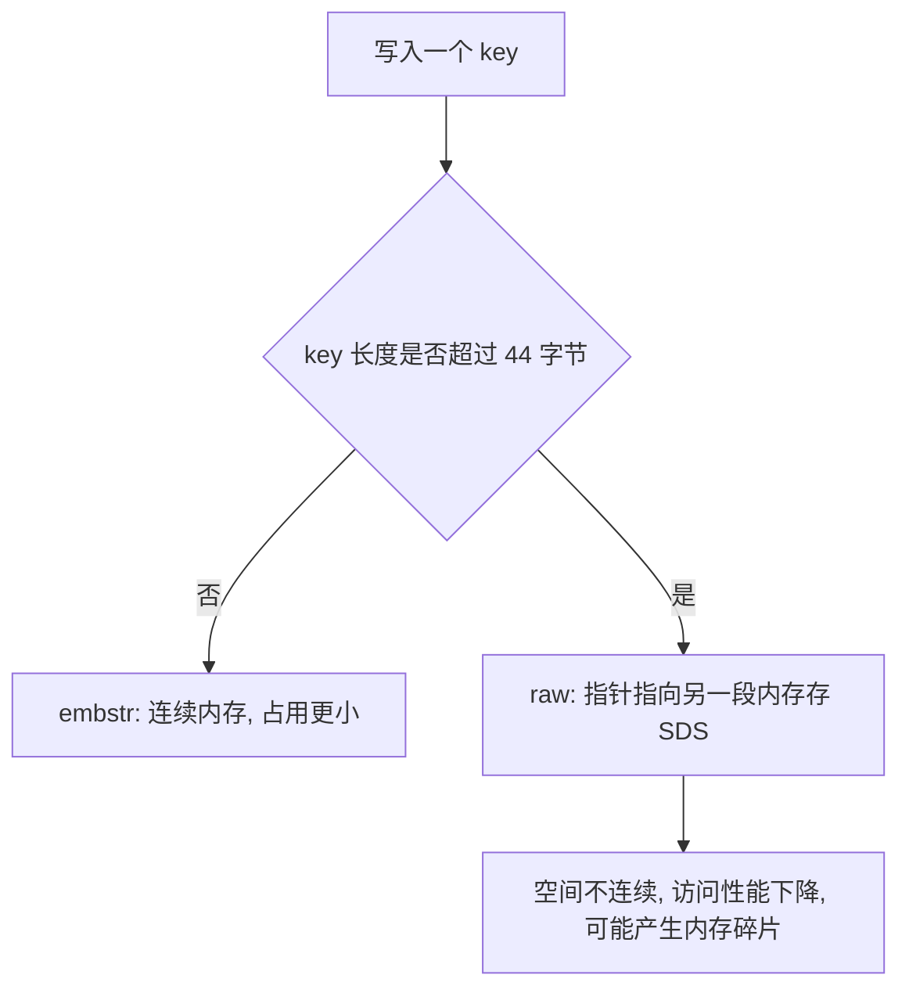
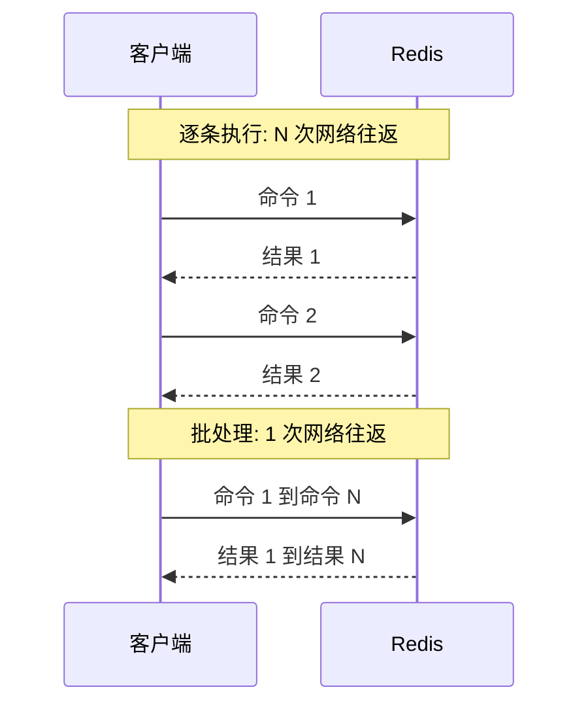
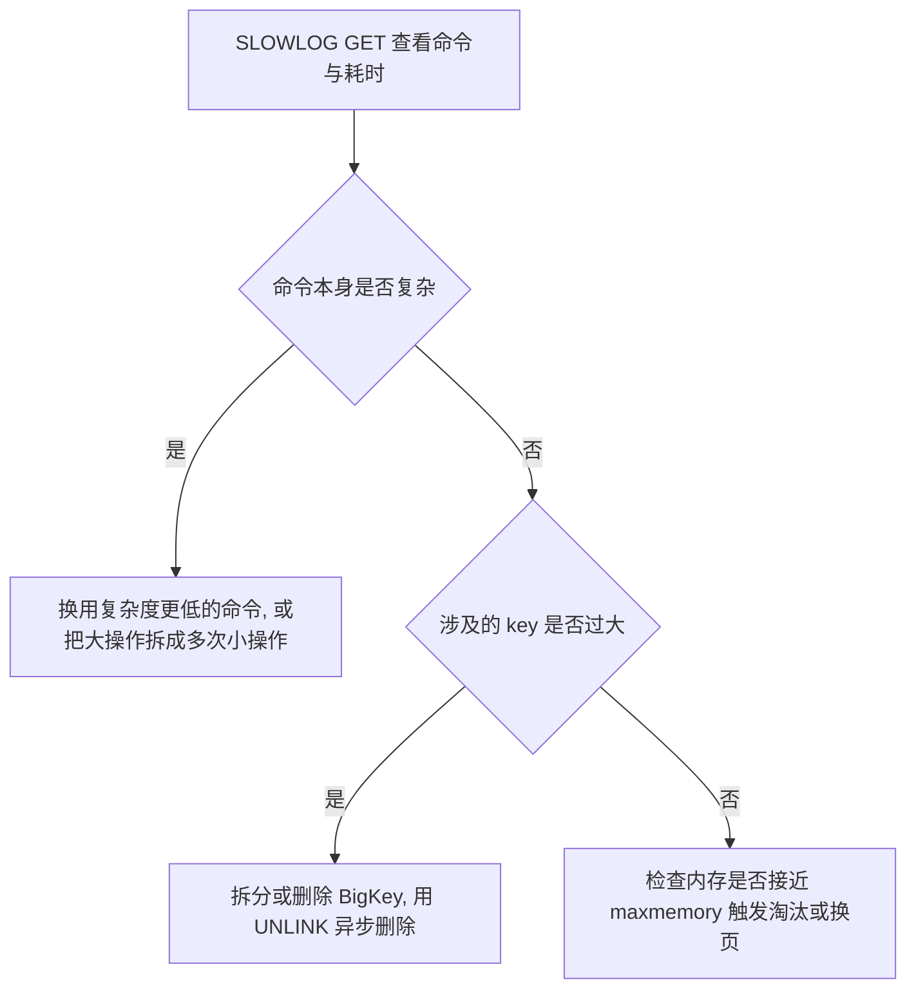

# Redis 最佳实践：key 设计、批处理与内存治理

前面几篇讲的是 Redis 的机制：数据类型、持久化、高可用与内存淘汰。真实项目里暴露问题的地方往往不是"不会用命令"，而是 key 设计随意、出现 BigKey、批处理写错、慢查询没人管、内存到顶才开始排查。本篇按工程落地的顺序，把 key 规范、BigKey 治理、数据类型选择、批处理优化、慢查询与内存配置串成一条可执行的实践路径。

## 1 Key 的结构规范

### 1.1 固定格式与好处

Redis 的 key 虽然可以自定义，但最好遵循统一约定：格式为 `[业务名称]:[数据名]:[id]`，长度不超过 44 字节，不包含特殊字符。例如登录业务（login）保存用户信息（user），id 为 10 的用户，key 设计为 `login:user:10`。

| 业务名称 | 数据名 | 示例 key | 说明 |
| --- | --- | --- | --- |
| login | user | `login:user:10` | 登录业务中 id 为 10 的用户 |
| item | stock | `item:stock:1001` | 商品 1001 的库存 |
| order | detail | `order:detail:2024` | 订单详情数据 |

这样设计的好处：可读性强，看 key 就知道它属于哪个业务、存的是什么数据；避免 key 冲突，不同类型的数据天然带业务前缀；方便管理，排查问题和批量清理时能按前缀定位；更节省内存，短 key 的内存占用更小。

### 1.2 key 长度与底层编码

key 的本质是字符串，会被存储在字典结构中，每个 key 对应字典结构里的一个键值对节点，所以 key 的底层编码包含 int、embstr 和 raw 三种。

embstr 在小于 44 字节时使用，采用连续内存空间，内存占用更小。当字节数大于 44 字节时，会转为 raw 模式存储：raw 模式下内存空间不是连续的，而是用一个指针指向另外一段内存空间，在这段空间里存储 SDS 内容，这样空间不连续，访问时性能会受影响，还有可能产生内存碎片。

| 编码 | 使用条件 | 内存布局 | 影响 |
| --- | --- | --- | --- |
| int | key 或值可表示为整数 | 直接保存整数 | 最省内存 |
| embstr | 长度小于 44 字节 | 连续内存，一次分配 | 内存占用小、访问效率高 |
| raw | 长度大于 44 字节 | 指针指向独立内存中的 SDS | 内存占用大、访问性能下降、可能产生碎片 |



用 `TYPE key` 查询数据类型，用 `OBJECT ENCODING key` 查看指定 key 对应的底层编码方式。

### 1.3 危险命令与 key 数量的管理成本

| 命令 | 作用 | 风险 |
| --- | --- | --- |
| `KEYS *` | 匹配所有 key | 遍历整个键空间，单线程下阻塞其他请求 |
| `FLUSHALL` | 清空所有库的数据 | 数据不可恢复 |
| `FLUSHDB` | 清空当前库的数据 | 数据不可恢复 |
| `CONFIG SET` | 在线修改配置 | 被攻击者利用可造成安全问题，见 7 节 |

key 数量过多也会带来管理成本：每个 key 都要占用字典节点、过期时间等额外内存，业务数据之外的开销随 key 数量线性上升；备份、迁移、排查、批量清理这些运维动作耗时会明显变长，一次误操作的影响面也被放大；无过期时间的 key 越堆越多时，还容易触发内存淘汰。

## 2 BigKey 的判定与治理

### 2.1 判定标准

BigKey 通常以 key 的大小和 key 中成员的数量综合判定，判断标准并不唯一，原笔记给出的例子如下。

| 类型 | 判定情形 |
| --- | --- |
| String | 一个 String 类型的 key，它的值为 5 MB |
| ZSet | 一个 ZSet 类型的 key，它的成员数量为 10,000 个 |
| Hash | 成员数量只有 1,000 个，但这些成员的 value 总大小为 100 MB |

工程上常见的经验线是：单个 key 的 value 小于 10 KB，集合类型的 key 元素数量小于 1,000；也有团队按更宽松的线来卡，例如 String 上限 10 KB、集合类元素上限 5,000。原笔记的巡检代码里用的是 String 阈值 `10 * 1024` 字节、集合类阈值 500。

确认单个 key 是否过大时，`MEMORY USAGE key` 返回的是 key 及其 value 在 Redis 中实际占用的内存字节数（不是简单的 key 与 value 字节数之和）；`STRLEN key` 只适用于 string 类型，返回 value 的字节长度（不包含 key 本身）；`LLEN key` 只适用于 list 类型，返回列表中的元素个数，key 不存在返回 0。要补充说明的是，`MEMORY USAGE key` 对 CPU 使用率的影响比较高，不建议频繁使用。

### 2.2 BigKey 的危害

| 危害 | 成因 | 后果 |
| --- | --- | --- |
| 网络阻塞 | 对 BigKey 执行读请求 | 少量 QPS 就可能占满带宽，拖慢 Redis 实例乃至所在物理机 |
| 数据倾斜 | BigKey 集中在个别实例上 | 该实例内存使用率远超其他实例，分片内存无法均衡 |
| Redis 阻塞 | 对元素较多的 hash、list、zset 做运算 | 运算耗时长，主线程被阻塞，后续命令排队 |
| CPU 压力 | 对 BigKey 数据做序列化和反序列化 | CPU 使用率飙升，影响 Redis 实例和本机其他应用 |

### 2.3 发现 BigKey 的方式

原笔记给出的思路是：redis-cli --bigkeys、SCAN 扫描、第三方工具、网络监控。

| 方式 | 做法 | 局限 |
| --- | --- | --- |
| `redis-cli --bigkeys` | 遍历分析所有 key，返回整体统计信息与每个类型数据的 Top1 big key | 只统计每个类型占用内存最大的 key，这个 key 不一定是 BigKey |
| `SCAN` 抽样 | 用游标迭代遍历 key，再用 `STRLEN`、`HLEN`、`LLEN`、`SCARD`、`ZCARD` 判断长度 | 需要自己写代码，结果依赖阈值设置 |
| `MEMORY USAGE` | 对可疑 key 逐个查询实际内存占用 | CPU 开销高，只适合小范围确认 |
| 分析 RDB 文件 | 用 Redis-Rdb-Tools 等第三方工具分析 RDB 快照文件，全面分析内存使用情况 | 依赖离线快照，不是实时数据 |

```text
redis-cli -a 密码 --bigkeys
SCAN cursor [MATCH pattern] [COUNT count] [TYPE type]
```

SCAN 的第一个参数是迭代游标，首次调用必须传入 0 开启新的迭代，后续调用使用上一次返回的游标值，直到返回游标为 0 表示迭代结束；MATCH 用于过滤 key 的匹配模式，支持 `*`、`?` 通配符；COUNT 提示每次迭代应返回的大约数量（非精确值），默认为 10；TYPE 在 Redis 6.0 及以上支持，只返回指定类型的 key。SCAN 返回两个元素：第一个是下一次迭代的游标，第二个是本次匹配到的 key 数组。把 SCAN 和长度命令组合起来，就可以自己实现 BigKey 巡检：

```java
final static int STR_MAX_LEN = 10 * 1024; // string 类型的阈值长度（字节）
final static int HASH_MAX_LEN = 500;      // hash、list、set、zset 的长度阈值

String cursor = "0";
do {
    ScanResult<String> result = jedis.scan(cursor);
    cursor = result.getCursor();
    for (String key : result.getResult()) {
        int maxLen = HASH_MAX_LEN;
        long len = 0;
        String type = jedis.type(key);
        switch (type) {
            case "string": len = jedis.strlen(key); maxLen = STR_MAX_LEN; break;
            case "hash":   len = jedis.hlen(key);   break;
            case "list":   len = jedis.llen(key);   break;
            case "set":    len = jedis.scard(key);  break;
            case "zset":   len = jedis.zcard(key);  break;
        }
        if (len >= maxLen) {
            System.out.printf("Found big key : %s, type: %s, length or size: %d %n", key, type, len);
        }
    }
} while (!cursor.equals("0"));
```

### 2.4 删除 BigKey

BigKey 内存占用较多，即便是删除这样的 key 也需要耗费很长时间，导致 Redis 主线程阻塞，引发一系列问题。

| 阶段 | 做法 |
| --- | --- |
| Redis 3.0 之前 | 如果是集合类型，遍历 BigKey 的元素，先逐个删除子元素，最后删除 BigKey |
| Redis 4.0 以后 | 使用异步删除命令 `UNLINK key [key ...]`，它会开启新线程进行删除 |

`UNLINK` 把"回收内存"这一步挪到后台线程，命令本身立即返回，因此删除超大 key 时不会长时间卡住主线程。对于无法一次 `UNLINK` 完的场景，按批次删除的思路和 3.2 的拆分思路一致：控制单次操作的 key 数量或元素数量，避免一条命令处理大量元素。

## 3 数据类型的选择

### 3.1 存对象的三种方式

存储一个 User 对象，可以有三种存储方式，原笔记的比较如下。

| 方式 | 数据组织 | 优点 | 缺点 |
| --- | --- | --- | --- |
| json 字符串 | `user:1` 存放 {"name":"Jack","age":21} | 实现简单粗暴 | 数据耦合，不够灵活 |
| 字段打散 | `user:1:name`、`user:1:age` 各存一个字段 | 可以灵活访问对象任意字段 | 占用空间大，没办法做统一控制 |
| hash | `user:1` 中 name、age 作为 field | 底层使用 ziplist，空间占用小，可以灵活访问任意字段 | 代码相对复杂 |

Hash 的读写就是 `HSET user:1 name Jack age 21`、`HGET user:1 name`、`HGETALL user:1` 这几条命令。取舍的关键是读写粒度：每次都整对象读取、字段很少变更，用 String 存整个 JSON 更简单，缺点是要改一个字段也得把整个对象读出、修改、写回；需要单独更新某个字段时，Hash 用一条 `HSET user:1 age 22` 就能完成，代价是代码要多写一层字段映射。字段打散只适合极少数固定字段被频繁访问的情况。

### 3.2 Hash 过大时的两种拆分方案

如果 hash 类型的 key 中有 100 万对 field 和 value，field 是自增 id（id:0 到 id:999999），这时 hash 的 entry 数量超过 500，会使用哈希表而不是 ZipList，内存占用较多。

- 可以用 `MEMORY USAGE key` 查看单个 key 的内存占用；`INFO memory` 统计的是整个 Redis 服务器的指标（包含 used_memory_human），结果不只限于单个 hash。
- entry 使用哈希表的上限 500 可以通过 `CONFIG SET hash-max-ziplist-entries maxLen` 修改（不建议超过 1,000），用 `CONFIG GET hash-max-ziplist-entries` 查看当前值。

方案一是拆分为 string 类型，把每个 field 变成一个独立的 key：这种方案 spring 底层没有太多内存优化，可能内存占用更大，而且获取数据也麻烦。

方案二是拆分为小的 hash，将 id / 100 作为 key，将 id % 100 作为 field，这样每 100 个元素为一个 Hash。

| key | field | value |
| --- | --- | --- |
| key:0 | id:00 至 id:99 | value0 至 value99 |
| key:1 | id:00 至 id:99 | value100 至 value199 |
| key:9999 | id:00 至 id:99 | value999900 至 value999999 |

实测结果是方案二的内存占用少了很多，而方案一内存占用反而增加了。

### 3.3 计数的两种写法

```text
INCR article:1001:views
INCRBY article:1001:views 10
HINCRBY stats:1001 views 1
HINCRBY stats:1001 likes 1
```

| 写法 | 结构 | 优点 | 代价 |
| --- | --- | --- | --- |
| String `INCR` / `INCRBY` | 一个指标一个 key | 命令简单，单指标读写直接 | 指标多时 key 数量膨胀，管理成本高 |
| Hash `HINCRBY` | 一个对象一个 key，多个 field 分别计数 | key 数量少，可以一次 `HGETALL` 取出同一对象的全部指标 | 多一层结构，field 过多时编码会退化为哈希表 |

选择原则：指标独立、数量固定且访问频繁时用 String；同一对象下有很多维度的计数、需要一起读取时用 Hash。

## 4 批处理优化

### 4.1 为什么需要批处理

单个命令的执行流程是：一次命令的响应时间 = 1 次往返的网络传输耗时 + 1 次 Redis 执行命令耗时。N 条命令则是 N 次往返的网络传输耗时 + N 次 Redis 执行命令耗时。由于 Redis 执行命令很快，命令响应时间往往只取决于网络传输耗时，所以可以一次发送 N 条命令，此时 N 条命令的响应时间变成：1 次往返的网络传输耗时 + N 次 Redis 执行命令耗时。



### 4.2 MSET / MGET

```text
MSET key value [key value ...]
MGET key [key ...]
HMSET key field value [field value ...]
```

`MSET`、`MGET` 仅支持 string 类型，`HMSET` 仅支持 hash 类型，而且只能添加一个 key。批量发送时要注意分包，原笔记的示例是每 1,000 条命令发送一次请求，避免造成 CPU 一次插入 10 万数据的压力。

### 4.3 Pipeline

MSET 命令只能操作 string 类型，其他类型如果想要一次操作多个 key，就需要用到 Pipeline。Pipeline 即管道，允许客户端一次发送多个命令给 Redis 服务器，然后 Redis 依次执行这些命令，最后将结果按顺序打包响应给客户端。但是遇到执行异常的命令会跳过执行下一条，所以 Pipeline 不保证数据的原子性。

```java
Pipeline pipeline = jedis.pipelined();
for (int i = 1; i <= 100000; i++) {
    pipeline.set("test:key_" + i, "value_" + i);
    if (i % 1000 == 0) {
        // 每放入 1000 条命令批量执行，不建议一次携带太多命令
        pipeline.sync();
    }
}
```

| 方式 | 一次网络往返携带的命令 | 支持的类型 | 原子性 |
| --- | --- | --- | --- |
| 逐条命令 | 1 条 | 全部 | 单条命令本身原子 |
| MSET / MGET / HMSET | 多条 | MSET、MGET 仅 string，HMSET 仅 hash | 不保证多条命令的原子性 |
| Pipeline | 多条 | 全部 | 不保证，异常命令会被跳过 |

批处理的收益来自减少网络往返，而不是减少 Redis 的执行时间。一批 Pipeline 携带的命令也不宜过多，通常按每批 1,000 条左右分包发送，避免单次请求过大造成内存与延迟波动。

### 4.4 集群模式下的批处理限制

在 Redis 集群模式下，MSET 或 Pipeline 中的命令，所有 key 必须落在同一个插槽，否则会执行失败，但这是很难保证的（不建议使用 `{}` 使大量 key 落在同一个插槽）。

实践中的处理办法是先算出每个 key 的插槽，按插槽把 key 分成若干组，再串行地对每组执行批处理命令。Spring 提供的客户端已经解决了这个问题，所以直接使用 `stringRedisTemplate.opsForValue().multiSet(map)` 在集群下不会报错：底层先按插槽把数据分区，得到以插槽为 key、以对应数据为 value 的分组结果，再按分组异步发送，最后合并结果。

如果确实需要让多个 key 落在同一个插槽，可以使用 hash tag：用 `{}` 包裹 key 中真正参与槽位计算的部分，例如 `item:{1001}:stock` 与 `item:{1001}:sales` 会落到同一个插槽。但这会把大量数据集中到一个节点，引发数据倾斜，因此只适合少量强相关的 key。

## 5 慢查询

### 5.1 两个配置项

慢查询指那些 Redis 执行时耗时超过某个阈值的命令。Redis 是单线程的，客户端发出的指令都会进入到 Redis 底层的 queue 中执行，如果此时有一些慢查询的数据，就会导致大量请求阻塞，从而引起报错。

| 配置项 | 含义 | 取值注意 |
| --- | --- | --- |
| `slowlog-log-slower-than` | 慢查询阈值，单位微秒，默认 10000，建议 1000 | 设为 0 表示记录所有命令，设为负数（如 -1）表示关闭慢查询日志 |
| `slowlog-max-len` | 慢查询日志的长度，即最多可存多少条慢查询 | 日志超过长度后旧记录会被淘汰，条数要留够 |

```conf
CONFIG SET slowlog-log-slower-than 1000
CONFIG SET slowlog-max-len 1000
slowlog-log-slower-than 1000
slowlog-max-len 1000
```

用 `CONFIG GET slowlog-log-slower-than` 和 `CONFIG GET slowlog-max-len` 可以查看当前值；`CONFIG SET` 只是临时修改，只对当前实例生效，写成 `slowlog-log-slower-than`、`slowlog-max-len` 两行才是写入配置文件的永久设置。

### 5.2 查看慢查询日志

```text
SLOWLOG LEN
SLOWLOG GET [n]
SLOWLOG RESET
```

| 命令 | 作用 |
| --- | --- |
| `SLOWLOG LEN` | 查询慢查询日志长度，即当前记录了多少条慢查询 |
| `SLOWLOG GET [n]` | 读取 n 条慢查询日志，包含命令、耗时、发生时间等信息 |
| `SLOWLOG RESET` | 清空慢查询列表 |

### 5.3 排查思路

慢查询出现后，先看日志里的命令和耗时，再按下面的顺序判断原因：



常见的三类原因：命令本身复杂，单条命令的时间复杂度高，一次就要遍历大量元素；key 太大，命中 BigKey，命令复杂度不高但数据量大，耗时随之陡增；内存不足，内存接近上限触发频繁淘汰或换页，命令执行与内存分配都变慢。

## 6 内存划分与配置

### 6.1 内存的三个部分

当 Redis 内存不足时，可能导致 key 频繁被删除、响应时间变长、QPS 不稳定等问题。当内存使用率达到 90% 以上时就需要警惕，并快速定位内存占用原因。

| 内存占用 | 说明 |
| --- | --- |
| 数据内存 | Redis 最主要的部分，存储键值信息，主要问题是 BigKey 问题和内存碎片问题 |
| 进程内存 | Redis 主进程本身运行占用的内存，如代码、常量池等，大约几兆，多数生产环境可忽略 |
| 缓冲区内存 | 一般包括客户端缓冲区、AOF 缓冲区、复制缓冲区等，客户端缓冲区又分为输入缓冲区和输出缓冲区，占用波动较大，不当使用 BigKey 可能导致内存溢出 |

内存碎片的来源：Redis 底层分配并不是 key 有多大就分配多大，而是有自己的分配策略，比如 8、16、20 等。假定当前 key 只需 10 个字节，此时分配 8 不够，就会分配 16 个字节，多出来的 6 个字节就会空闲，成为内存碎片。

### 6.2 查看内存与关键字段

`INFO memory` 用于查看内存分配的情况，重点关注 used_memory 与 used_memory_rss，以及两者的比值所反映的内存碎片率：used_memory 是 Redis 分配器分配出去的内存总量，used_memory_rss 是操作系统视角下该进程实际占用的常驻内存，两者差距较大时通常意味着存在内存碎片。`MEMORY STATS` 用于查看内存相关的统计信息，原笔记整理的关键字段如下。

| 字段 | 含义 |
| --- | --- |
| peak.allocated | Redis 进程自启动以来消耗内存的峰值 |
| total.allocated | Redis 使用其分配器分配的总字节数，即当前的总内存使用量 |
| startup.allocated | Redis 启动时消耗的初始内存量 |
| replication.backlog | 复制积压缓冲区的大小 |
| aof.buffer | AOF 持久化使用的缓存和 AOF 重写时产生的缓存 |
| overhead.hashtable.main | 当前数据库的 hash 链表开销内存总和，即元数据内存 |
| keys.count | 当前 Redis 实例的 key 总数 |
| dataset.bytes | 纯业务数据占用的内存大小 |
| fragmentation | 内存的碎片率 |

### 6.3 maxmemory 的合理设置

maxmemory 不能把机器内存全部用满，要为持久化与复制留出空间。

| 需要预留的部分 | 原因 |
| --- | --- |
| fork 与 rewrite 的额外内存 | 持久化时 fork 子进程，写入期间可能产生大量额外内存占用 |
| 复制缓冲区 | 主从复制期间的积压数据需要额外内存 |
| AOF 缓冲区 | 刷盘之前的缓存区域，且无法设置容量上限 |
| 客户端输出缓冲区 | 返回大量数据时占用，普通客户端默认没有限制 |

部署层面的几条建议：Redis 实例所在的物理机要预留足够内存，应对 fork 和 rewrite；单个 Redis 实例内存上限不要太大，例如 4G 或 8G，这样可以加快 fork 速度、减少主从同步和数据迁移的压力；不要与 CPU 密集型应用部署在一起；不要与高硬盘负载应用一起部署，例如数据库、消息队列。

### 6.4 缓冲区的分类与排查

| 缓冲区 | 说明 | 是否可配置 |
| --- | --- | --- |
| 复制缓冲区 | 主从复制的 repl_backlog_buf，如果太小可能导致频繁的全量复制，影响性能 | 通过 `repl-backlog-size` 设置，默认 1 MB |
| AOF 缓冲区 | AOF 刷盘之前的缓存区域，以及 AOF 执行 rewrite 时的缓冲区 | 无法设置容量上限 |
| 客户端缓冲区 | 分为输入缓冲区和输出缓冲区 | 输入缓冲区最大 1G 且不能设置，输出缓冲区可以设置 |

复制缓冲区和 AOF 缓冲区通常不会有问题，最关键的是客户端缓冲区。输入缓冲区最大 1G 且不能设置，如果超过了这个空间，Redis 会直接断开；真正需要担心的是输出缓冲区。`client-output-buffer-limit` 是 Redis 用于限制客户端输出缓冲区大小的配置项，格式为 `client-output-buffer-limit <class> <hard limit> <soft limit> <soft seconds>`：`<class>` 是客户端类型，normal 为普通客户端、slave 为从节点客户端、pubsub 为发布订阅客户端；`<hard limit>` 指输出缓冲区超过此值（字节）时 Redis 会立即断开客户端连接；`<soft limit>` 和 `<soft seconds>` 指输出缓冲区在 `soft seconds` 秒内持续超过 `soft limit` 字节数时 Redis 会断开客户端连接。

```conf
client-output-buffer-limit normal 0 0 0
client-output-buffer-limit replica 256mb 64mb 60
client-output-buffer-limit pubsub 32mb 8mb 60
```

由于普通客户端输出缓冲区没有限制，如果突然处理大量的 BigKey，会导致内存突然占满，进而导致 Redis 断开。解决方式有两个：一是设置输出缓冲区大小，同时避免 BigKey；二是增加服务器带宽，避免突然出现的大量数据超过 Redis 的承受能力。

| 命令 | 返回内容 | 用途 |
| --- | --- | --- |
| `INFO clients` | 客户端连接的统计性概览，不含单个客户端的详细信息 | 看整体连接状态，如 connected_clients、client_recent_max_output_buffer、blocked_clients |
| `CLIENT LIST` | 每个客户端连接的详细信息 | 定位到具体连接，重点看 flags（`N` 普通客户端、`S` 从节点、`P` 发布订阅客户端）、omem（输出缓冲区大小）与 cmd（最近执行的命令）等字段 |

## 7 服务端与集群的其他实践

### 7.1 持久化配置建议

用来做缓存的 Redis 实例尽量不要开启持久化功能；建议关闭 RDB 持久化功能，使用 AOF 持久化；利用脚本定期在 slave 节点做 RDB，实现数据备份；设置合理的 rewrite 阈值，避免频繁的 bgrewrite；配置 `no-appendfsync-on-rewrite = yes`，禁止在 rewrite 期间做 aof，避免因 AOF 引起的阻塞。最后一条的原理是：主线程接收到写操作后，不仅将数据写到内存，还要将命令写到 AOF 缓冲区，再根据刷盘策略（如每 1 秒刷盘）开启新线程同步刷盘，同时监听本次刷盘时间，如果刷盘超过 2 秒，主线程阻塞等待刷盘完成为止，否则正常执行指令。

### 7.2 命令与安全配置

Redis 默认绑定在 0.0.0.0:6379，这样会把 Redis 服务暴露到公网，如果没有做身份认证，会出现严重的安全漏洞。漏洞出现的核心原因有三个：Redis 未设置密码、利用了 Redis 的 `CONFIG SET` 命令动态修改配置、使用了 root 账号权限启动 Redis。对应的建议是：Redis 一定要设置密码；禁止线上使用 `KEYS`、`FLUSHALL`、`FLUSHDB`、`CONFIG SET` 等命令，可以利用 `rename-command` 禁用；用 `bind` 限制网卡，禁止外网网卡访问，同时开启防火墙；不要使用 root 账户启动 Redis，尽量不使用默认端口。

### 7.3 集群使用的注意事项

| 问题 | 说明 | 建议 |
| --- | --- | --- |
| 集群完整性 | 默认配置下，如果发现任意一个插槽不可用，整个集群都会停止对外服务 | 将 `cluster-require-full-coverage` 配置为 no |
| 集群带宽 | 节点之间不断互相 Ping 确认状态，每次携带插槽信息和集群状态信息，节点越多数据量越大 | 节点数最好少于 1000，业务庞大时建立多个集群；避免单机运行太多实例；配置合适的 `cluster-node-timeout` |
| 数据倾斜 | BigKey 或集群批处理使用了相同的 hash tag 都会造成数据倾斜 | 治理 BigKey，慎用 hash tag |
| 客户端性能 | 访问集群需要做节点选择、读写分离判断、插槽判断等 | 评估客户端开销，优先考虑主从架构 |
| 命令兼容性 | 批处理要求 key 落在相同 slot，大量 key 同时操作无法完成 | 客户端按 slot 分组处理，参考第 4.4 节 |
| lua 与事务 | lua 和事务都要保证原子性，如果 key 不在一个节点，无法保证其特性 | 集群模式下无法执行 lua 和事务 |

关于集群和主从的选择：单体 Redis（主从 Redis）已经能达到万级别的 QPS，并且也具备很强的高可用特性。如果主从能满足业务需求，尽量使用主从，不到万不得已，尽量不要搭建 Redis 集群。

## 8 本篇总结

1. key 遵循 `[业务名称]:[数据名]:[id]` 格式，长度不超过 44 字节，不包含特殊字符。
2. key 超过 44 字节会从 embstr 退化为 raw 编码，内存占用变大、访问性能下降，用 `OBJECT ENCODING` 可以验证。
3. 生产环境禁止使用 `KEYS *`、`FLUSHALL`、`FLUSHDB`、`CONFIG SET` 这类危险命令，必要时用 `rename-command` 禁用。
4. BigKey 以大小和成员数量综合判定，经验线是单 key value 小于 10 KB、集合类元素数量小于 1000，Hash 的 entry 数量不要超过 1000。
5. BigKey 会导致网络阻塞、数据倾斜、主线程阻塞和 CPU 压力，发现手段有 `--bigkeys`、SCAN 抽样、`MEMORY USAGE`、分析 RDB 文件与网络监控；删除时优先用 Redis 4.0 的 `UNLINK` 异步删除，老版本按元素分批删除。
6. 存对象优先用 Hash，内存占用小且能单独读写字段，Hash 过大时拆成多个小 Hash 而不是拆成大量 String；计数按维度选择，单指标用 String 的 `INCR`，同一对象多维度计数用 Hash 的 `HINCRBY`。
7. 批处理用 MSET / MGET 或 Pipeline 减少网络往返，Pipeline 不保证原子性，单批命令不宜过多。
8. 集群下批处理的 key 必须落在同一插槽，可以按插槽分组串行执行，或依赖 Spring 客户端的分区实现，慎用 hash tag。
9. 慢查询由 `slowlog-log-slower-than` 与 `slowlog-max-len` 控制，用 `SLOWLOG GET`、`SLOWLOG LEN`、`SLOWLOG RESET` 查看与清理，排查顺序是命令是否复杂、key 是否过大、内存是否不足。
10. 内存分为数据内存、进程内存和缓冲区内存，用 `INFO memory` 与 `MEMORY STATS` 定位占用，重点看碎片率与客户端输出缓冲区。
11. `maxmemory` 要为 fork、rewrite、复制缓冲区和 AOF 缓冲区留出空间，单实例上限建议 4G 到 8G；缓冲区用 `client-output-buffer-limit` 限制，排查用 `INFO clients` 与 `CLIENT LIST`。
12. 缓存实例尽量不开启持久化，关闭 RDB 使用 AOF，并配置 `no-appendfsync-on-rewrite = yes`；集群要配置 `cluster-require-full-coverage no`，控制节点规模，能用主从满足需求就不要上集群。
