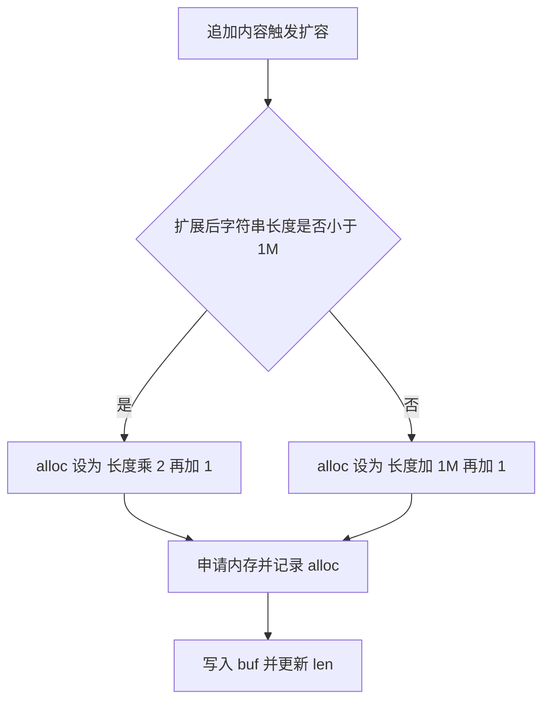
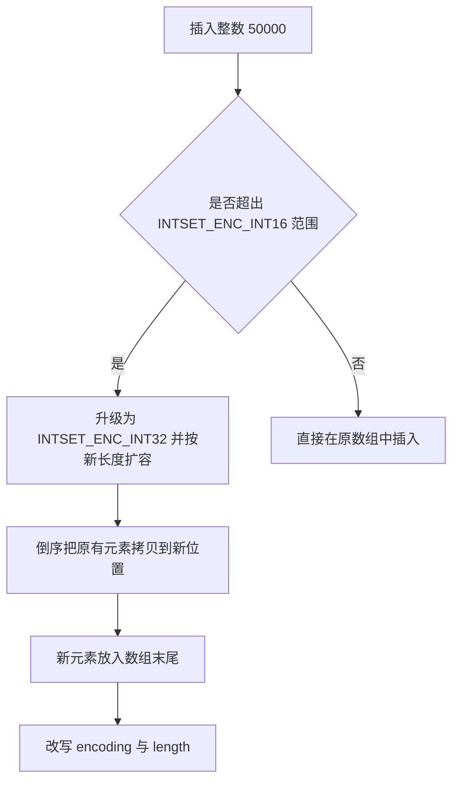
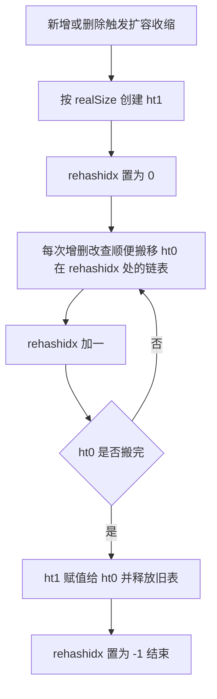
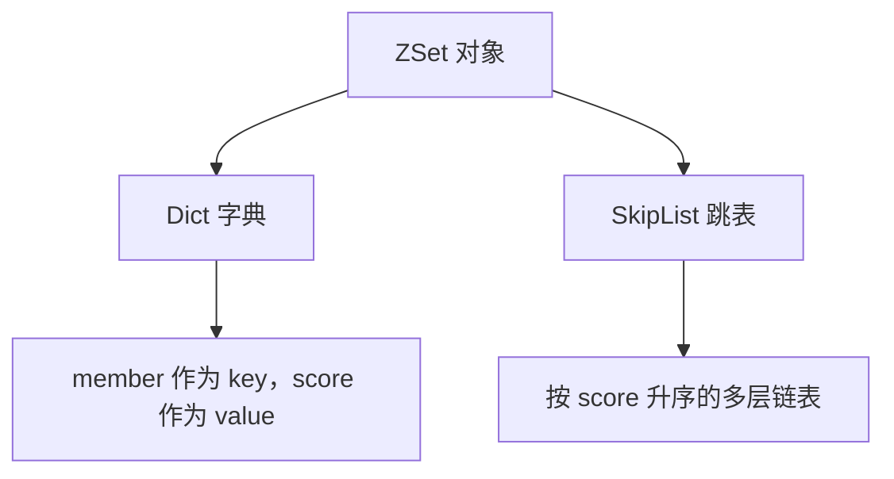

# Redis 底层数据结构

Redis 对外只暴露 String、List、Hash、Set、ZSet 五种数据类型，但同一个类型在内存里未必只用一种结构存储。元素很少的 List 可能是一整块连续内存，元素多了就换成由多个小块串起来的双端链表；全是整数的 Set 用有序数组存，一旦混入字符串就立刻换成哈希表。

这些切换对使用者是透明的，命令还是那几条命令，但只有理解了底层的 SDS、IntSet、Dict、ZipList、QuickList、SkipList 以及 RedisObject，才能解释清楚“为什么某些写法更省内存”“为什么大 key 会卡住主线程”“为什么 Redis 取字符串长度是 O(1)”。本篇把这些结构逐个讲清楚。

## 1 SDS 动态字符串

### 1.1 为什么不用 C 字符串

Redis 的 key 本质上就是字符串，value 也常常是字符串或者字符串的集合，可见字符串是 Redis 最常用的数据形态。C 语言本身并没有提供字符串类型，字符串是以空字符 `\0` 结尾的字符数组，直接拿它来存 Redis 的数据有三个绕不开的问题：

- 没有内置的字符串类型，长度信息不随数据一起保存。
- 取长度必须从头遍历到 `\0` 为止，复杂度是 O(N)。
- 不能包含 `\0`，否则会被当作字符串结束，因此图片、视频这类二进制数据无法保存，也就是非二进制安全。

这三点决定了 Redis 必须自己设计一个字符串结构，即简单动态字符串 SDS（Simple Dynamic String）。例如执行 `SET name jack`，Redis 会创建两个 SDS，一个保存 `name`，另一个保存 `jack`。

| 对比项 | C 字符串 | SDS |
| --- | --- | --- |
| 长度获取 | 遍历到 `\0`，O(N) | 直接读 len 字段，O(1) |
| 二进制安全 | 不安全，内容不能含 `\0` | 安全，长度由 len 决定，内容可含 `\0` |
| 缓冲区溢出 | 拼接时若忘记扩容会溢出 | 追加前按 alloc 判断并自动扩容 |
| 内存分配次数 | 每次修改都要重新分配 | 预分配加惰性释放，修改次数被摊薄 |
| 结束标识 | 唯一依赖 `\0` | 仍保留 `\0`，但只用于复用 C 字符串函数 |

### 1.2 SDS 的结构

SDS 是一个结构体，核心字段如下：

```text
struct sdshdr {
    uint8_t  len;    // 已保存字符串的长度，不包含结束符 \0
    uint8_t  alloc;  // buf 实际分配的空间大小，初始与 len 相同
    uint8_t  flags;  // 低 3 位标识头部类型，高 5 位在 sdshdr5 中复用为长度
    char     buf[];  // 字符数组，保存真正的数据，末尾保留一个 \0
}
```

- `len` 记录已保存字符串的长度，取长度只需读这个字段，不必遍历。
- `alloc` 记录 buf 分配到的空间大小。初始时 `alloc` 和 `len` 相同，随着动态扩容两者会出现差异，差值就是预留的空闲空间。
- `flags` 标识当前使用的是哪一种头部结构。
- `buf[]` 保存字符串内容，末尾仍保留一个结束标识 `\0`，这样 SDS 可以直接复用一部分 C 的字符串函数。

### 1.3 五种头部结构

为了适应不同长度的字符串，Redis 设计了五种 SDS 头部，它们的主要区别是能表示的字符串长度范围不同，也就是 `len` 和 `alloc` 字段占用的字节数不同。

| 头部类型 | len / alloc 字段 | buf 可表示的最大长度 | 对应 flags 取值 | 典型用途 |
| --- | --- | --- | --- | --- |
| sdshdr5 | 不单独占用，长度存在 flags 高 5 位 | 31 | SDS_TYPE_5 | 只用于极短的 key |
| sdshdr8 | 各 1 字节 | 255 | SDS_TYPE_8 | 短字符串 |
| sdshdr16 | 各 2 字节 | 65535 | SDS_TYPE_16 | 中等长度字符串 |
| sdshdr32 | 各 4 字节 | 2^32 - 1 | SDS_TYPE_32 | 较长字符串 |
| sdshdr64 | 各 8 字节 | 2^64 - 1 | SDS_TYPE_64 | 超长字符串 |

以保存 `hi` 为例，长度落在 sdshdr8 的范围内，于是写入 flags 类型标记，`len = 2`、`alloc = 2`，buf 中依次是 `h`、`i`、`\0`。

需要强调两点：

- Redis 存储字符串时会根据实际长度选择合适的头部结构。
- 当已有字符串变长并超出当前头部的表示上限时，SDS 做的是动态扩容，而不是切换到另一种头部结构。

### 1.4 动态扩容：预分配与惰性释放

在 `hi` 后面追加 `,Amy` 时，SDS 先申请内存，规则是：

- 新的字符串小于 1M：新空间为扩展后字符串长度的两倍再加 1。
- 新的字符串大于 1M：新空间为扩展后字符串长度加 1M 再加 1，这被称为内存预分配。

多出来的那 1 个字节是留给结尾的 `\0`。



扩容之外，SDS 还有惰性空间释放策略：当字符串缩短时，SDS 不会立即回收多出来的内存，而是把它记录在 `alloc` 中留着将来使用。预分配减少的是“扩容太频繁”，惰性释放减少的是“缩短太频繁”，两者一起把内存分配和释放的次数压下来。

### 1.5 SDS 带来的好处

| 好处 | 原因 |
| --- | --- |
| 取长度为 O(1) | 长度直接存在 len 字段里，不必遍历 |
| 支持动态扩容 | 追加前按 alloc 判断空间是否够用，不够就按规则扩容 |
| 减少内存分配次数 | 预分配多留一段空闲空间，惰性释放不急着归还 |
| 二进制安全 | 用 len 判断结尾而不是 `\0`，内容可以包含 `\0` |
| 避免缓冲区溢出 | 追加前先检查空间，而不是直接往数组里写 |

## 2 IntSet 整数集合

### 2.1 IntSet 是什么

IntSet 是 Redis 中 Set 集合的一种实现方式，基于整数数组实现，并具备长度可变、元素有序、元素不重复这几个特征。

为了方便查找，Redis 会把 IntSet 中的所有整数按升序依次保存在 contents 数组中。例如存放 `[5, 10, 20]` 并使用 `INTSET_ENC_INT16` 编码，结构由三部分组成：

- `encoding`：4 字节，标识编码方式。
- `length`：4 字节，记录元素个数。
- `contents`：每个元素 2 字节，3 个元素共 6 字节。

数组里每个元素采用相同的编码方式，占用空间大小一致，所以结合数组起始地址和下标就能快速定位到元素的物理地址：`startPtr + sizeof(int16) * index`。换句话说，数组下标也表示当前元素到数组起始地址之间间隔了多少个元素，这也正是能直接二分查找的前提。

### 2.2 三种 encoding

`encoding` 有三种取值，表示存储的整数大小不同：

| 编码 | 每个元素占用 | 可表示的整数范围 |
| --- | --- | --- |
| INTSET_ENC_INT16 | 2 字节 | 16 位有符号整数 |
| INTSET_ENC_INT32 | 4 字节 | 32 位有符号整数 |
| INTSET_ENC_INT64 | 8 字节 | 64 位有符号整数 |

整个 IntSet 共用一个 encoding，也就是说所有元素占用的空间必须一样大，元素才能靠下标直接寻址。这正是编码升级存在的原因。

### 2.3 编码升级

向 `[5, 10, 20]` 中添加 50000 时，这个数字已经超出 `INTSET_ENC_INT16` 的范围，IntSet 会自动升级编码到合适的大小，过程分四步：

1. 升级编码为 `INTSET_ENC_INT32`，每个整数占 4 字节，并按新的编码方式和元素个数扩容数组。
2. 倒序依次把数组中的原元素拷贝到扩容后的正确位置。
3. 把待添加的元素放入数组末尾。
4. 把 IntSet 的 encoding 属性改为 `INTSET_ENC_INT32`，length 属性改为 4。



倒序拷贝是关键：元素变大后位置会整体后移，从后往前搬才不会覆盖尚未处理的旧数据。

### 2.4 为什么升级后不降级

元素只会让编码往上走，一旦升级到 `INTSET_ENC_INT32`，即使后来把那个大整数删掉，编码也不会退回 `INTSET_ENC_INT16`。原因是：降级同样要重新分配内存并搬移全部元素，而搬移之后只要再插入一个大整数又要重新升级，在高频增删的场景下会来回震荡，收益远小于代价。IntSet 干脆只保留升级这一条路径，实现也更简单。

### 2.5 IntSet 的特点

- Redis 会确保 IntSet 中的元素唯一且有序。
- 具备类型升级机制，在元素取值范围较小时可以节省内存空间。
- 底层采用二分查找来查询，前提是数组有序且元素等宽。

## 3 Dict 字典

### 3.1 Dict 的结构

Redis 是一个键值型数据库，可以根据键实现快速的增删改查，而键与值的映射关系正是通过 Dict 实现的。Dict 由三部分组成：

- 哈希表 DictHashTable。
- 哈希节点 DictEntry。
- 字典 Dict。

哈希表实际上是一个数组，其中的字段含义如下：

| 字段 | 含义 |
| --- | --- |
| `dictEntry **table` | 指向 DictEntry 指针数组，数组里保存的是一个个指向 DictEntry 对象的指针 |
| `size` | 哈希表数组的大小，默认为 4，且总是 2 的幂次方 |
| `sizemask` | 哈希表大小的掩码，总等于 size 减 1 |
| `used` | 哈希表数组中已存在的 entry 个数 |

向 Dict 添加键值对时，Redis 先根据 key 算出哈希值 h，再用 `h & sizemask` 计算元素应该落在数组的哪个索引上。

这里用位运算代替取余是有道理的：由于 size 总是 2 的幂次方，它的二进制只有一位是 1，其余位都是 0，因此 `size - 1` 的二进制就是那一位之后全是 1、前面全是 0，与 h 做按位与恰好等于 `h % size`，而位运算比取余更快。

### 3.2 哈希冲突与链式解决

如果两个 key 算出的哈希值落在同一个索引上，就发生了哈希冲突。Redis 的处理方式是把冲突的节点串成链表，并且把新节点用头插法插入链表头部。

用头插法而不是尾插法，是因为尾插必须遍历整条链表找到最后一个节点再插入，效率更低；头插只需要改动新节点和表头指针。

### 3.3 负载因子与扩容收缩

哈希表就是数组加单向链表的组合。集合中元素较多时，哈希冲突必然增多，链表变长，查询效率会明显降低，所以 Dict 需要根据负载因子动态调整表的大小。负载因子 LoadFactor 等于 used 除以 size。

Dict 在每次新增键值对时都会检查负载因子，以下两种情况都会触发哈希表扩容：

| 触发场景 | 条件 | 说明 |
| --- | --- | --- |
| 一般扩容 | LoadFactor 大于等于 1 | 且服务器没有执行 BGSAVE、BGREWRITEAOF 等后台进程 |
| 强制扩容 | LoadFactor 大于 5 | 冲突已经严重到必须立刻处理，不再看是否有后台进程 |
| 收缩 | LoadFactor 小于 0.1 | 每次删除元素时检查，满足则做哈希表收缩 |

扩容时刻意避开后台子进程运行期间，是因为这两个命令会用 fork 产生子进程，而 fork 依赖写时复制机制，此时大量写入会加剧内存页的复制，所以 Redis 倾向于等后台任务结束再扩容。

扩容和收缩都会调用 `dictExpand`，两者的差别只在于新表大小怎么算：

- 扩容时，新 size 是第一个大于等于 `dict.ht[0].used + 1` 的 2 的 n 次方。
- 收缩时，新 size 是第一个小于等于 `dict.ht[0].used` 的 2 的 n 次方，且不得小于 4。

### 3.4 rehash 流程

不管是扩容还是收缩，都必然要创建新的哈希表，于是 size 和 sizemask 都变了。key 的索引位置与 sizemask 有关，因此必须对哈希表中的每一个 key 重新计算索引并插入新表，这个过程称为 rehash。完整流程如下：

1. 计算新哈希表的 realSize，取值取决于当前是扩容还是收缩。
2. 按 realSize 申请内存空间，创建 dictht，并赋值给 `dict.ht[1]`。
3. 设置 `dict.rehashidx = 0`，标示开始 rehash。
4. 把 `dict.ht[0]` 中的每一个 dictEntry 都 rehash 到 `dict.ht[1]`。
5. 把 `dict.ht[1]` 赋值给 `dict.ht[0]`，把 `dict.ht[1]` 初始化为空哈希表，释放原来的 `dict.ht[0]` 的内存。
6. 把 rehashidx 赋值为 -1，代表 rehash 结束。

### 3.5 渐进式 rehash

上面第 4 步是一次性搬完所有 entry。但 rehash 是在执行增删操作时判断并触发的，这些操作跑在 Redis 主进程里，一次迁移太多 entry 会让主进程阻塞，直到 rehash 结束才能处理新命令。

因此真实的 Dict rehash 并不是一次性完成的，而是分多次、渐进式地完成，称为渐进式 rehash。它相对上面流程的变化只有一个：第 4 步不再一次搬完。

每次执行增删改查时，都检查 `dict.rehashidx` 是否大于 -1，如果是，就把 `dict.ht[0].table[rehashidx]` 处的 entry 链表 rehash 到 `dict.ht[1]`，并把 rehashidx 加一，直到 `dict.ht[0]` 的所有数据都搬到 `dict.ht[1]`。



这样做的好处是把一次可能长达数十万次搬移的开销，摊到后续的每一次命令执行上，单次耗时从“与 entry 数量成正比”降到几乎恒定，主进程不会被长时间阻塞。

### 3.6 rehash 期间为什么查找要查两张表

rehash 进行中时，数据同时存在于 `dict.ht[0]` 和 `dict.ht[1]` 里，所以这段时间各类操作的处理方式并不相同：

| 操作 | 处理方式 | 原因 |
| --- | --- | --- |
| 新增 | 直接写入 ht[1] | 保证 ht[0] 只减不增，最终必然清空 |
| 查询 | 依次在 ht[0] 和 ht[1] 中查找 | 无法确定数据落在哪张表 |
| 修改 | 依次在 ht[0] 和 ht[1] 中查找后再改 | 同上 |
| 删除 | 依次在 ht[0] 和 ht[1] 中查找后再删 | 同上 |

正因为新增只写 ht[1]、且每次命令都会推进 rehashidx，`dict.ht[0]` 的数据只会减少不会增加，随着 rehash 推进最终必然为空，两张表的过渡状态也就一定能结束。

## 4 ZipList 压缩列表

### 4.1 为什么需要压缩列表

Dict 由数组加单向链表实现，数据在内存中不连续，需要靠指针相互关联。这种方式的主要问题是内存浪费：指针本身要占字节，节点分散还会产生内存碎片。

ZipList 是一种压缩存储结构，用于存储字符串或整数。它使用一系列特殊编码的连续内存块存储数据，可以把它看成一维数组形式的特殊双端链表：像数组一样连续，但每个节点长度并不一致，因此需要记录节点长度来推算前后节点的位置。它可以在任一端进行压入和弹出，且这些操作的时间复杂度为 O(1)。

ZipList 的整体结构如下：

| 字段 | 类型与长度 | 作用 |
| --- | --- | --- |
| zlbytes | uint32_t，4 字节 | 记录整个压缩列表占用的内存字节数 |
| zltail | uint32_t，4 字节 | 记录表尾节点距离压缩列表起始地址有多少字节，凭这个偏移量能直接定位表尾节点 |
| zllen | uint16_t，2 字节 | 记录节点数量，最大值为 UINT16_MAX（65534）；超过这个值时此处记录为 65535，真实数量必须遍历整个列表才能算出 |
| entry | 长度不定 | 压缩列表包含的各个节点，长度由保存的内容决定 |
| zlend | uint8_t，1 字节 | 特殊值 0xFF，用于标记压缩列表的末端 |

### 4.2 entry 的结构

ZipList 的 entry 并不像普通链表那样记录前后节点的指针，因为两个指针要占 16 个字节，太浪费内存。它采用的结构如下：

| 字段 | 长度 | 含义 |
| --- | --- | --- |
| previous_entry_length | 1 字节或 5 字节 | 前一个节点的长度 |
| encoding | 1 字节、2 字节或 5 字节 | 记录 content 的数据类型与长度 |
| contents | 不定 | 节点的数据，可以是字符串或整数 |

`previous_entry_length` 的取值规则是：

- 前一节点的长度小于 254 字节时，用 1 个字节保存这个长度值。
- 前一节点的长度大于等于 254 字节时，用 5 个字节保存，第一个字节固定为 0xfe，后四个字节才是真实长度数据。

于是定位相邻节点都不需要指针：

- 下一个节点的地址等于当前节点地址加上当前 entry 的长度。
- 前一个节点的地址等于当前节点地址减去 `previous_entry_length`。

需要注意 ZipList 中所有存储长度的数值都采用小端字节序，也就是低位字节在前、高位字节在后。例如数值 0x1234 按小端字节序实际存储为 0x3412（十六进制两位对应一个字节）。

另外，如果列表数据过多导致链表过长，查询中间的某个数据要经过多次计算寻址，可能影响查询性能，这正是需要 QuickList 来控制单个 ZipList 大小的原因。

### 4.3 encoding 的编码规则

entry 中的 encoding 分字符串和整数两种情况。

字符串：encoding 以 `00`、`01` 或 `10` 开头时，说明 content 是字符串，编码本身占用 1 个、2 个或 5 个字节，用来表示不同的长度上限。

| 开头比特 | 编码长度 | 说明 |
| --- | --- | --- |
| 00 | 1 字节 | 用剩余 6 位表示较小的字符串长度 |
| 01 | 2 字节 | 用剩余 14 位表示中等长度的字符串 |
| 10 | 5 字节 | 编码占 5 字节，可表示很大的字符串长度 |
| 11 | 1 字节 | content 是整数，长度由类型决定 |

例如依次存储 `ab` 和 `bc`：第一个 entry 的 `previous_entry_length = 0`；`a` 和 `b` 的 UTF-8 编码分别是 97、98，即 01100001、01100010；`ab` 长度为 2 字节，采用 `00xxxxxx` 形式，encoding 是 00000010。

整数：encoding 以 `11` 开头说明 content 是整数，且 encoding 固定只占 1 个字节。整数的类型只有 byte、short、int、long 四种，对应数据分别占 1、2、4、8 个字节，确定了类型就确定了 content 的长度，所以整数编码无需保存 content 的长度。

为了更省空间，`1111xxxx` 形式会把剩余四位直接用来存放数据代替 content。由于 0000 和 1110 已被占用，这四位只能表示 0001 到 1101，减一后得到实际值，于是 0 到 12 范围内的整数不再需要单独的 content 字段。

### 4.4 连锁更新

ZipList 的每个 entry 都用 `previous_entry_length` 记录上一个节点的大小，而这个字段是 1 个字节或 5 个字节，取决于前一节点的长度是否达到 254 字节。这个“长度门槛”正是连锁更新的成因。

假设有 N 个连续的 entry，每个的长度都在 250 到 253 字节之间。此时每个 entry 的 `previous_entry_length` 都只需要 1 个字节就能表示前一节点的长度。

若此时在表头插入一个长度为 254 字节的 entry：

1. 原来表头 entry 的 `previous_entry_length` 要从 1 个字节变成 5 个字节，于是这个 entry 的长度也变成了 254 字节。
2. 原来第二个 entry 为了记录前一个 entry 的长度，其 `previous_entry_length` 也要从 1 个字节变成 5 个字节，它的长度同样变成 254 字节。
3. 于是又会引起后面一个 entry 的 `previous_entry_length` 变大，如此向后逐级传递。


ZipList 在特殊情况下产生的这种连续多次空间扩展操作，称为连锁更新。新增和删除都可能触发连锁更新，但发生概率很低，实际使用中不必过于在意。

如果接受不了连锁更新，可以把 Redis 升级到 7.0 以上版本。ListPack 移除了 prevlen 字段，采用不同的结构来存储数据。它是在 Redis 5 版本中引入的，当时只用于 Stream，从 7.0 以后才全面替代 ZipList，从而解决了连锁更新的问题。

ZipList 的特性可以总结为：

- 可以看作一种连续内存空间的“双向链表”。
- 节点之间不靠指针连接，而是记录上一节点和本节点的长度来寻址，内存占用较低。
- 列表数据过多、链表过长时，可能影响查询性能。
- 增删较大数据时有可能发生连续更新问题。

## 5 QuickList 快速列表

### 5.1 为什么要把 ZipList 串起来

ZipList 申请的内存必须是连续的。如果内存占用较大，申请效率会很低，所以需要限制单个 ZipList 的长度和 entry 大小。但要存储大量数据时，超出 ZipList 的最佳上限就不可避免，这时就需要用多个 ZipList 分片存储数据，而分片之间总要有一个结构来管理，QuickList 就是用来管理多个 ZipList、保证它们之间联系的数据结构。

QuickList 是 Redis 3.2 引入的数据结构，它是一个双端链表，只不过链表中的每个节点都是一个 ZipList。它结合了 ZipList 和双向链表的优点，既解决传统链表的内存碎片和指针开销问题，又控制住单个 ZipList 的大小，从而提供高效的内存利用率和快速的插入删除操作。

### 5.2 `list-max-ziplist-size`

为了避免 QuickList 中每个 ZipList 的 entry 过多，Redis 提供了配置项 `list-max-ziplist-size` 来限制：

| 取值 | 含义 |
| --- | --- |
| 正值 | ZipList 允许的 entry 个数的最大值 |
| -1 | 每个 ZipList 的内存占用不能超过 4kb |
| -2 | 每个 ZipList 的内存占用不能超过 8kb |
| -3 | 每个 ZipList 的内存占用不能超过 16kb |
| -4 | 每个 ZipList 的内存占用不能超过 32kb |
| -5 | 每个 ZipList 的内存占用不能超过 64kb |

可以通过 `config get list-max-ziplist-size` 或 `config set list-max-ziplist-size` 查看与临时修改，也可以在配置文件中修改，默认值是 -2。

```conf
# 每个 ZipList 的内存占用上限，负值表示按内存大小限制，默认 -2 即 8kb
list-max-ziplist-size -2
```

### 5.3 `list-compress-depth`

除了控制 ZipList 的大小，QuickList 还可以对节点的 ZipList 做压缩，通过配置项 `list-compress-depth` 控制：

| 取值 | 含义 |
| --- | --- |
| 0 | 特殊值，代表不压缩 |
| 1 | QuickList 的首尾各有 1 个节点不压缩，中间节点压缩 |
| 2 | QuickList 的首尾各有 2 个节点不压缩，中间节点压缩 |
| n | 以此类推，首尾各保留 n 个节点不压缩 |

同样可以通过 `config get list-compress-depth` 或 `config set list-compress-depth` 查看与临时修改，也可以在配置文件中修改，默认值是 0。

```conf
# 首尾各保留 1 个节点不压缩，中间节点压缩；0 表示不压缩
list-compress-depth 0
```

之所以首尾节点不压缩，是因为 List 最常用的操作就是两端压入弹出，访问越频繁的位置越不适合压缩；中间的节点访问概率低，压缩换来的内存收益更大。

### 5.4 插入与删除时的节点调整

向 QuickList 中插入一个元素时，Redis 会根据一定的策略选择一个合适的 quicklistNode，并把元素插入到该节点中。如果插入操作导致该节点中的元素数量超过阈值（由 `list-max-ziplist-size` 决定），Redis 会把这个节点拆分成两个节点；反过来，如果删除操作导致节点中元素数量过少，Redis 会把相邻的两个节点合并成一个节点。

QuickList 的特点可以总结为：

- 是一个节点为 ZipList 的双端链表。
- 节点采用 ZipList，解决了传统链表的内存占用问题。
- 控制了 ZipList 大小，解决了连续内存空间申请效率问题。
- 中间节点可以压缩，进一步节省内存。

## 6 SkipList 跳表

### 6.1 为什么需要跳表

SkipList 即跳表，是为了解决有序集合的高效查找、插入和删除而设计的。它结合了平衡树和链表的优点，既保持数据有序，又提供快速的访问速度。

SkipList 首先是链表，但与普通链表有两点差异：

- 元素按升序排列存储。
- 节点可能包含多个指针，指针的跨度不同，也就是多级指针。

跳表节点的核心字段：

| 字段 | 含义 |
| --- | --- |
| ele | 节点的值，类型是动态字符串 |
| score | 节点的分数，按分数对节点升序排列，用于排序和查找 |
| backward | 指向前一个节点的指针 |
| level[] | 多级索引数组 |

`level[]` 用数组保存是因为每个节点包含的指针数量并不固定：首节点的指针最多，中间节点的较少。这些指针分布在不同层级上，用于实现多级索引，每个指针都包括指向下一节点的指针和该指针的跨度。

### 6.2 查找过程

1. 从最高层开始，通过前进指针逐层向下查找。
2. 如果当前节点的下一个节点的值小于要查找的值，则向右移动。
3. 如果大于要查找的值，则向下移动。
4. 重复上述过程，直到找到目标节点，或者确定目标节点不存在。

层级越高，指针的跨度越大，所以先用高层指针快速跳过大量节点，再用底层指针精确定位，整体接近二分查找的效果。

### 6.3 插入过程

1. 先执行查找操作，找到插入位置。
2. 随机生成一个层数，根据这个层数在每一层插入新节点。
3. 更新相关节点的前进指针和跨度。

跳表的一个关键特性是允许节点存在于不同层级上。为了确定新节点的层级，通常使用一个概率模型来随机选择：设置一个小于 1 的预设值 p，生成一个 0 到 1 之间的随机数，如果随机数小于 p 就把层数加一，直到达到预设的最大层数或者随机数不再小于 p 为止。

这种随机性保证了跳表的平衡性：不需要像平衡树那样维护严格的平衡条件，靠概率就能让索引层次维持在合理范围。Redis 中每个节点的层数是 1 到 32 之间的随机数。

删除操作与插入对称：先查找要删除的节点，然后在每一层删除这个节点，并调整相关节点的前进指针和跨度。

### 6.4 为什么 ZSet 用跳表而不是红黑树

| 维度 | 跳表 | 红黑树 |
| --- | --- | --- |
| 增删改查复杂度 | 与红黑树基本一致 | 与跳表基本一致 |
| 实现复杂度 | 更简单，节点只需要多级指针 | 需要维护旋转与变色规则 |
| 范围查询 | 找到起点后沿底层链表顺序前进即可 | 需要中序遍历，通常要借助额外的栈 |
| 并发友好度 | 局部改动，影响范围小，容易改造成并发结构 | 旋转会牵动较多节点 |

对 ZSet 来说，排行榜类的范围查询非常多，跳表在这一点上比红黑树更顺手，实现也更简单，所以选了跳表。

### 6.5 为什么 ZSet 同时使用跳表和字典

ZSet 中的每个元素都需要指定一个 score 值和一个 member 值，它要同时满足三个要求：可以根据 score 排序、member 必须唯一、可以根据 member 查询分数。单独看两种结构都不够：

- SkipList 可以排序，也能同时存储 score 和 ele（member）值，但无法保证键的唯一性，也无法快速根据 member 找到 score，只能遍历。
- Dict 可以做键值存储，也可以根据 key 找 value，但无法排序。

于是 ZSet 底层同时使用这两种结构，把两者的能力拼起来。创建 ZSet 对象时，先创建 Zset 对象，再为它创建 Dict 和 SkipList，并把编码方式设置为 `OBJ_ENCODING_SKIPLIST`。



| 结构 | 负责的能力 | 对应的典型命令 |
| --- | --- | --- |
| Dict | 按 member 查 score、判断 member 是否存在，保证唯一性 | `ZSCORE`、`ZADD` 时的存在性判断 |
| SkipList | 按 score 排序与范围扫描 | `ZRANGE`、`ZRANGEBYSCORE` |

代价是同一份数据存了两份，用内存换性能。当元素数量不多时，两份结构的优势并不明显，反而更耗内存，所以 ZSet 还会采用 ZipList 来节省内存，不过需要同时满足两个条件：

1. 元素数量小于 `zset-max-ziplist-entries`，默认值 128。
2. 每个元素都小于 `zset-max-ziplist-value` 字节，默认值 64。

ZipList 本身没有排序功能，也没有键值对的概念，因此 ZSet 用逻辑编码来实现：ZipList 是连续内存，所以 score 和 element 是紧挨着的两个 entry，element 在前、score 在后；score 越小越接近队首，score 越大越接近队尾，整体按 score 升序排列。

```conf
# ZSet 使用 ZipList 编码的元素数量上限，设为 0 表示禁用 ZipList
zset-max-ziplist-entries 128

# ZSet 使用 ZipList 编码时单个元素的大小上限
zset-max-ziplist-value 64
```

创建 ZSet 时，如果 `zset-max-ziplist-entries` 被设置为 0（即禁用了 ZipList），或者 value 大小超过了 `zset-max-ziplist-value`，就采用 SkipList 加 Dict 的方案，否则采用 ZipList。

向 ZSet 中添加元素时，先判断编码方式：如果本身已经是 SKIPLIST 编码，就不需要转换；否则可能存在编码转换的可能，条件不再满足时就切换到 SKIPLIST 加 Dict。

## 7 RedisObject

### 7.1 为什么需要 RedisObject

Redis 中所有数据都以 key-value 的形式存放，保存一个键值对需要存储三样东西：key、value，以及 key 到 value 的映射关系。key 用 SDS 就足够，映射关系由 Dict 维护，但 value 有五种基本类型，为了让同一个 Dict 内能存储不同类型的 value，就需要一个通用的数据类型，这就是 RedisObject，简写为 robj。Redis 中所有 value 都被存储为 redisObject 类型。

### 7.2 五个字段

```text
typedef struct redisObject {
    unsigned type:4;        // 数据类型，如字符串、列表、哈希等
    unsigned encoding:4;    // 编码方式，如 int、raw、hashtable 等
    unsigned lru:LRU_BITS;  // 记录对象最近被访问的时间
    int refcount;           // 引用计数，用于自动内存管理
    void *ptr;              // 指向实际存储数据的指针
} robj;
```

| 字段 | 位宽 | 作用 |
| --- | --- | --- |
| type | 4 bit | 表示数据对象的类型，对应五种基本数据类型 |
| encoding | 4 bit | 底层编码方式，共 11 种，不同编码对应不同存储结构 |
| lru | 24 bit | 记录对象最近被访问的时间，用于实现 LRU 内存淘汰 |
| refcount | 通常 4 字节 | 对象引用计数器，引用计数为 0 时对象可以被释放 |
| ptr | 32 位系统 4 字节，64 位系统 8 字节 | 指向实际存储数据的指针，随类型和编码指向不同结构 |

`type` 的取值定义如下：

```text
#define OBJ_STRING 0
#define OBJ_LIST   1
#define OBJ_SET    2
#define OBJ_ZSET   3
#define OBJ_HASH   4
```

ptr 指向什么由 type 和 encoding 共同决定。例如一个 robj 的 type 是 `OBJ_LIST`、encoding 是 `OBJ_ENCODING_QUICKLIST`，那它就是一个 List，值保存在 QuickList 结构里，ptr 就指向这个 QuickList 对象。

在 64 位系统上，一个 redisObject 的头信息占用 `(4 + 4) / 8 + 24 / 8 + 4 + 8 = 16` 字节。如果有 n 个字符串分别用 string 类型存储，就会造成大量空间浪费在头信息上；若改用 List 集合存储这些字符串，一个 redisObject 就够了。所以在有大量数据要存储时，尽量选择集合类型，避免内存浪费。

RedisObject 的作用可以概括为三点：

- 统一对象管理：为各种数据类型提供统一接口，使 Redis 能以一致的方式处理不同类型的数据。
- 内存优化：通过引用计数和 LRU 机制实现自动内存管理与淘汰策略，节省内存空间。
- 操作一致性：为不同类型的数据提供统一的操作接口，如获取对象类型、编码方式、值等。

### 7.3 十一种编码方式

Redis 会根据存储的数据类型不同选择不同的编码方式，共包含 11 种：

| 编号 | 编码方式 | 说明 |
| --- | --- | --- |
| 0 | OBJ_ENCODING_RAW | raw 编码动态字符串 |
| 1 | OBJ_ENCODING_INT | long 类型的整数的字符串 |
| 2 | OBJ_ENCODING_HT | 哈希表（字典 dict） |
| 3 | OBJ_ENCODING_ZIPMAP | 已废弃 |
| 4 | OBJ_ENCODING_LINKEDLIST | 双端链表 |
| 5 | OBJ_ENCODING_ZIPLIST | 压缩列表 |
| 6 | OBJ_ENCODING_INTSET | 整数集合 |
| 7 | OBJ_ENCODING_SKIPLIST | 跳表 |
| 8 | OBJ_ENCODING_EMBSTR | embstr 的动态字符串 |
| 9 | OBJ_ENCODING_QUICKLIST | 快速列表 |
| 10 | OBJ_ENCODING_STREAM | Stream 流 |

### 7.4 String 的三种编码

String 是 Redis 中最常见的数据存储类型，它的编码有三种。基本编码方式是 RAW，基于 SDS 实现，存储上限为 512mb。

| 编码 | 触发条件 | 内存布局 |
| --- | --- | --- |
| INT | 存储的字符串是整数值，且大小在 LONG_MAX 范围内 | 数据直接保存在 redisObject 的 ptr 位置，不再需要 SDS |
| EMBSTR | 存储的 SDS 长度小于 44 字节 | redisObject 对象头和 SDS 是一段连续空间，申请内存只需调用一次分配函数 |
| RAW | 其余情况，包括整数值超过 LONG_MAX 范围 | redisObject 和 SDS 分两次分配，整数被当成字符串存储 |

为什么 EMBSTR 的门槛是 44 字节？SDS 头信息中 len、alloc、flags 各占 1 字节，字符结束符 `\0` 占 1 字节，加上字符串内容 44 字节，整个 SDS 共占 48 字节；redisObject 头信息占 16 字节，两者相加是 64 字节。Redis 默认使用 jemalloc 作为内存分配器，它会为不同大小的内存请求分配固定大小的块（这些块的大小通常是 2 的幂次），并尽量满足内存对齐要求，以减少频繁分配释放产生的内存碎片。64 字节刚好是 jemalloc 的一个分配单位，能把对象头和 SDS 放进同一个连续内存块中而不产生碎片。

### 7.5 List 的编码

Redis 的 List 需要从首、尾操作元素，还支持按索引查询。候选结构各有权衡：

| 结构 | 双端访问 | 内存占用 | 存储上限 |
| --- | --- | --- | --- |
| LinkedList | 支持 | 较高，内存碎片较多 | 高 |
| ZipList | 支持 | 低 | 低 |
| QuickList | 支持 | 较低，包含多个 ZipList | 高 |

- 3.2 版本之前：Redis 采用 ZipList 和 LinkedList 实现 List，当元素数量小于 512 并且元素大小小于 64 字节时采用 ZipList 编码，超过则采用 LinkedList 编码。
- 3.2 版本之后：统一采用 QuickList 实现 List。

### 7.6 Set 的编码

Set 是 Redis 中的单列集合，特点是不保证有序性、保证元素唯一、支持求交集并集差集。集合操作要查询集合来确定重复元素，保证元素唯一同样要查询集合确定元素是否存在，可见 Set 对查询性能要求很高，很容易想到 HashTable，也就是 Dict。

- 为了查询效率和唯一性，Set 采用 HT 编码（Dict），Dict 中的 key 用来存储元素，value 统一为 null。
- 当存储的所有数据都是整数，并且元素数量不超过 `set-max-intset-entries` 时，Set 会采用 IntSet 编码以节省内存。该配置项可以在配置文件中设置，默认为 512。

第一次向 Set 中添加元素时会创建新的 Set，并根据元素的值决定采用什么编码：

- 如果该字符是数值类型，采用 IntSet 编码，创建 IntSet 存储元素。
- 如果该字符不是数值类型，采用 HT 编码，创建 Dict 存储元素。

在向 Set 插入元素的过程中（非第一次插入），处理逻辑分两种情况：

- 若原来的编码类型是 HT，直接插入。
- 若当前的编码是 IntSet，需要判断：当本次插入的元素不是数值类型，或者该元素是数值类型但成功插入后 Set 中的元素个数超过了设定值，该 Set 的编码会从 IntSet 切换为 HT，并用 Dict 存储当前 IntSet 中的所有值；这两个条件都不满足时，继续在原来的 IntSet 中存储新元素。

```conf
# Set 使用 IntSet 编码的元素数量上限，超出后转为 HT 编码
set-max-intset-entries 512
```

### 7.7 ZSet 编码小结

ZSet 的编码与转换条件如下：

- 元素数量小于 `zset-max-ziplist-entries`（默认 128）且每个元素都小于 `zset-max-ziplist-value` 字节（默认 64）时，采用 ZipList 编码。
- 条件不再满足时，转为 SkipList 加 Dict 的组合编码。

### 7.8 Hash 的编码

Redis 中的 Hash 结构与 ZSet 非常类似，都是键值存储、都能根据键获取值、键都必须唯一，区别有两点：

- ZSet 的键是 member，值是 score；Hash 的键和值都是任意值。
- ZSet 要根据 score 排序；Hash 则无需排序。

所以 Hash 底层采用的编码与 ZSet 基本一致，只是没有 SkipList。Hash 结构默认采用 ZipList 编码以节省内存，ZipList 中相邻的两个 entry 分别保存 field 和 value。

当数据量较大时，Hash 结构会转为 HT 编码，触发条件有两种：

- ZipList 中的元素数量超过了 `hash-max-ziplist-entries`，默认 512。
- ZipList 中的任意 entry 大小超过了 `hash-max-ziplist-value`，默认 64 字节。

```conf
# Hash 使用 ZipList 编码的元素数量上限
hash-max-ziplist-entries 512

# Hash 使用 ZipList 编码时单个 entry 的大小上限
hash-max-ziplist-value 64
```

创建 Hash 结构时默认采用 ZipList 编码。由于存在两种编码格式，在添加元素时可能发生格式转换：一旦元素数量或单个字段大小越过上面两条线，就整体切换为 HT 编码。

## 8 数据类型、编码与转换条件总表

Redis 的五种基本数据类型与底层编码的对应关系，以及各自的转换条件汇总如下：

| 数据类型 | 常见编码 | 触发条件 | 说明 |
| --- | --- | --- | --- |
| String | int | 整数值且在 LONG_MAX 范围内 | 数据直接存在 ptr 中，不需要 SDS |
| String | embstr | SDS 长度小于 44 字节 | 对象头与 SDS 在同一块 64 字节内存中 |
| String | raw | 其余情况 | 对象头与 SDS 分开分配，上限 512mb |
| List | quicklist | 3.2 之后的默认实现 | 双端链表，节点是 ZipList |
| List | ziplist | 3.2 之前：元素数量小于 512 且元素小于 64 字节 | 3.2 之后不再使用 |
| List | linkedlist | 3.2 之前：不满足 ZipList 条件时 | 3.2 之后不再使用 |
| Set | intset | 全为整数且元素数量不超过 `set-max-intset-entries`（默认 512） | 有序数组，支持二分查找 |
| Set | hashtable | 出现非数值元素，或插入后元素数量超过阈值 | 即 Dict，key 存元素，value 为 null，转换后不再回退 |
| ZSet | ziplist | 元素数量小于 `zset-max-ziplist-entries`（默认 128）且每个元素小于 `zset-max-ziplist-value`（默认 64 字节） | element 在前、score 在后，按 score 升序排列 |
| ZSet | skiplist | 不满足 ZipList 条件，或 `zset-max-ziplist-entries` 设为 0 | 同时使用 SkipList 和 Dict，转换后不再回退 |
| Hash | ziplist | 字段数量不超过 `hash-max-ziplist-entries`（默认 512）且每个 entry 不超过 `hash-max-ziplist-value`（默认 64 字节） | 相邻 entry 分别存 field 和 value |
| Hash | hashtable | 字段数量或单个 entry 大小超过阈值 | 即 Dict，转换后不再回退 |

需要留意的是，编码转换基本都是单向的：IntSet 升级后不降级，Set、ZSet、Hash 从压缩编码切到 Dict 或 SkipList 后也不再回退。这是用内存的确定性换来实现简单，避免在大数据量下反复申请和搬移内存。

## 9 本篇总结

1. SDS 用 `len`、`alloc`、`flags` 加 `buf` 替代 C 字符串，换来 O(1) 取长度、二进制安全、自动扩容和防止溢出；预分配与惰性释放进一步减少了内存分配次数。
2. IntSet 是元素有序且不重复的整数数组，用 `encoding` 区分元素宽度，插入超出当前范围的值时按四步升级编码，且升级后不会降级。
3. Dict 由哈希表、哈希节点、字典组成，用链式头插解决哈希冲突；新增时按负载因子判断扩容，删除时按负载因子判断收缩，新表大小总是 2 的幂次方。
4. rehash 采用渐进式完成，把搬移开销摊到每次增删改查；rehash 期间新增只写 ht[1]，查询、修改、删除要依次查 ht[0] 和 ht[1]。
5. ZipList 是一段连续内存，用 `zlbytes`、`zltail`、`zllen`、`entry`、`zlend` 组织；entry 由 `prevlen`、`encoding`、`data` 组成，靠长度推算相邻节点；长度跨越 254 字节门槛时会引发连锁更新，ListPack 通过移除 prevlen 解决了这一问题。
6. QuickList 把多个 ZipList 串成双端链表，`list-max-ziplist-size` 控制单个 ZipList 的 entry 数量或内存上限，`list-compress-depth` 控制中间节点的压缩深度。
7. SkipList 用多层指针实现近似二分查找，层数随机生成；ZSet 选它而不是红黑树，是因为增删改查效率相当而实现更简单、范围查询更方便。
8. ZSet 同时使用跳表和字典：字典负责按 member 查 score 并保证唯一，跳表负责按 score 排序和范围查询，用两份存储换性能；元素少时改用 ZipList 省内存。
9. RedisObject 用 `type`、`encoding`、`lru`、`refcount`、`ptr` 五个字段统一封装各种类型，`ptr` 指向什么由 type 和 encoding 共同决定；对象头在 64 位系统上占 16 字节，这是小字符串用 embstr、大量数据建议用集合类型存储的根因。
10. 数据类型与底层编码的对应关系不是固定的，会随元素数量、元素大小、是否全是整数等条件在 ZipList、IntSet、QuickList、HT、SkipList 之间切换，且切换基本都是单向的。
