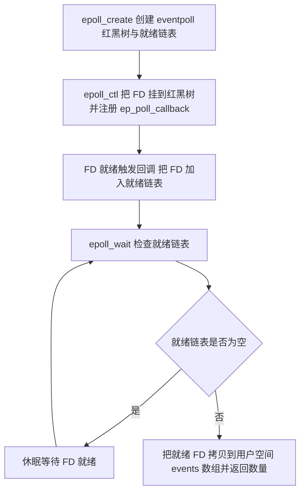
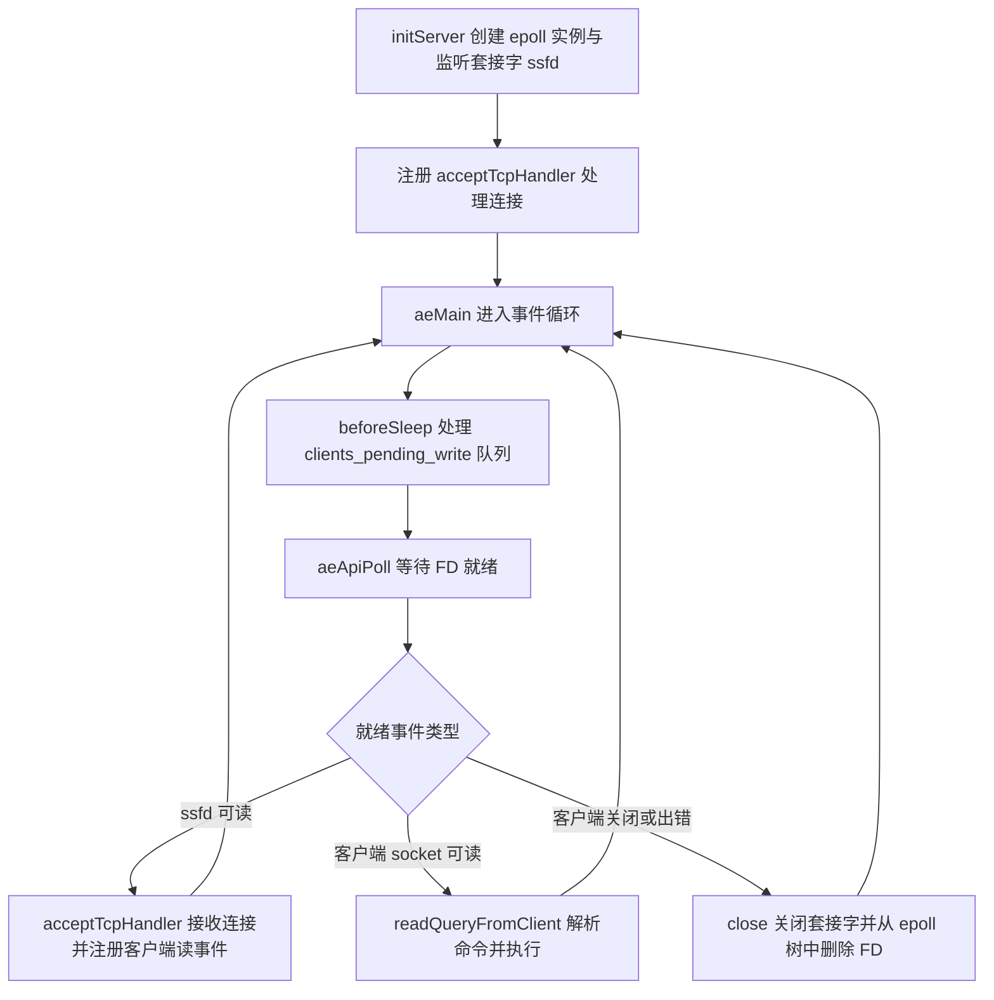

# Redis 网络模型与通信协议

Redis 的性能瓶颈通常不在命令执行上，而在网络上。它的命令处理跑在单个线程里，却能撑住十万级 QPS，靠的是一套基于 IO 多路复用的事件循环；而客户端与服务端之间能对上话，靠的是一套叫 RESP 的通信协议。

要理解这两件事，得先补上操作系统层面的前置知识：用户空间与内核空间的边界、Linux 的五种 IO 模型，以及多路复用函数 select、poll、epoll 的差别。只有把这些弄清楚，才能解释 Redis 为什么敢用单线程，以及 6.0 之后引入的多线程到底线程处理了哪些工作。

## 1 用户空间与内核空间

Ubuntu 和 CentOS 都是 Linux 的发行版，发行版可以看成在 Linux 外面包了一层壳，任何 Linux 发行版的系统内核都是 Linux。

Redis、MySQL 这类用户应用无法直接访问系统硬件，需要先通过发行版这层壳访问内核，再由内核访问计算机硬件。计算机硬件包括 CPU、内存、网卡等，内核通过寻址空间操作硬件，但内核需要不同设备的驱动，有了驱动之后才能做内存管理、文件系统管理、进程管理等。

用户应用要访问计算机硬件，计算机就必须对外暴露一些接口，应用通过这些接口间接操控内核。但内核本身也是一个应用，也需要内存、CPU 等资源，用户应用也在消耗这些资源。为了避免用户程序随意操作系统资源、错误或恶意执行危险指令（如清空内存、修改时钟），就必须把用户和内核隔离开。于是进程的寻址空间被划分成内核空间和用户空间，也就是常说的内核态和用户态。

用户空间和内核空间都无法直接访问物理内存，而是通过分配虚拟内存映射到物理内存。虚拟内存把内核空间与用户空间隔离开来，避免用户程序错误或恶意地访问内核空间。在 32 位 Linux 操作系统中虚拟内存空间大小为 4GB，高位的 1G 作为内核空间，低位的 3G 作为用户空间。

在 Linux 中权限分成两个等级 0 和 3：

| 空间 | 权限等级 | 能做什么 |
| --- | --- | --- |
| 用户空间 | Ring3 | 只能执行受限命令，不能直接调用系统资源，必须通过内核提供的接口访问 |
| 内核空间 | Ring0 | 可以执行特权命令，调用一切系统资源 |

一般情况下用户程序运行在用户空间、内核运行在内核空间。当应用程序需要调用特权资源、执行一些内核空间的操作时，就需要在用户态和内核态之间切换。这种切换本身就是有成本的，所以切换频率直接影响 IO 效率。

## 2 Linux IO 模型

### 2.1 一次读操作的两个阶段

Linux 为了提高 IO 效率，会在用户空间和内核空间都加入缓冲区：

- 写数据时，先把用户缓冲区的数据拷贝到内核缓冲区，然后写入设备。
- 读数据时，先从设备读取数据到内核缓冲区，然后拷贝到用户缓冲区。

用户读数据时，先向内核态申请读取内核的数据，而内核数据要等待驱动程序从硬件上读取；当数据从磁盘加载完成之后，内核会把数据写入内核缓冲区，再把数据拷贝到用户态缓冲区，返回给应用程序。


整个过程的时间主要花在两处：一是用户等待数据就绪，二是用户态和内核态缓冲区之间的数据拷贝。Linux 的五种 IO 模型，本质上就是在“等待数据就绪”和“读取数据”这两个阶段上做了不同的处理：

- 阻塞 IO（Blocking IO）
- 非阻塞 IO（Nonblocking IO）
- IO 多路复用（IO Multiplexing）
- 信号驱动 IO（Signal Driven IO）
- 异步 IO（Asynchronous IO）

### 2.2 阻塞 IO

阻塞 IO 的两个阶段都是阻塞的：数据从硬件读取到内核缓冲区时阻塞，内核把缓冲区的数据拷贝到用户缓冲区时也阻塞。

当应用程序调用 IO 函数（如 read 或 write）时，如果数据没有准备好，用户进程会被阻塞，直到数据准备好并被复制到应用程序的缓冲区中。在阻塞期间进程无法执行其他任务，但阻塞期间并不会占用 CPU 资源。

### 2.3 非阻塞 IO

非阻塞 IO 的 recvfrom 操作会立即返回结果，而不是阻塞用户进程。如果数据没有准备好，函数会立即返回一个错误码（如 EWOULDBLOCK），表示当前没有数据可读或可写。用户程序需要不断轮询内核，检查数据是否准备好，这会导致 CPU 资源的浪费。

非阻塞 IO 模型中，用户进程第一个阶段是非阻塞的，第二个阶段依然是阻塞状态。所以虽然叫非阻塞，性能并没有本质提高，反而因为忙等机制导致 CPU 空转，CPU 使用率可能暴增。

### 2.4 IO 多路复用

无论是阻塞 IO 还是非阻塞 IO，用户应用在第一阶段都需要调用 recvfrom 获取数据，差别只在于无数据时怎么处理：

- 调用 recvfrom 时恰好没有数据，阻塞 IO 让进程阻塞，非阻塞 IO 让 CPU 空转，都不能充分发挥 CPU 的作用。
- 调用 recvfrom 时恰好有数据，用户进程可以直接进入第二阶段，读取并处理数据。

比如服务端处理客户端 Socket 请求时，单线程情况下只能依次处理每一个 socket。如果正在处理的 socket 恰好未就绪（数据不可读或不可写），线程就会被阻塞，其他所有客户端 socket 都必须等待，性能自然很差。解决方式是用单个线程监听多个 socket，当某个 socket 就绪时用户应用再去读取数据，监听过程中线程处于休眠状态。

这里涉及一个关键概念：文件描述符，简称 FD，是一个从 0 开始递增的无符号整数，用来关联 Linux 中的一个文件。在 Linux 中一切皆文件，常规文件、视频、硬件设备都是文件，当然也包括网络套接字 socket。

IO 多路复用就是利用单个线程同时监听多个 FD，并在某个 FD 可读、可写时得到通知，从而避免无效等待，充分利用 CPU 资源。

Linux 监听 FD 的方式和通知的方式有多种实现，常见的有 select、poll 和 epoll。它们是 Linux 提供的用于监听多个文件描述符状态的系统调用，允许程序把一组文件描述符注册到监听队列中，当其中任何一个文件描述符的状态发生变化（如可读、可写或发生错误）时，系统调用会返回并通知应用程序。

#### 2.4.1 select

select 是 Linux 中最早的 IO 多路复用实现方案。它用位数组 fds_bits 表示要监听的 FD 集合，数组中每个元素占 4 乘 8 等于 32 个 bit，数组长度为 32，所以整个数组可以表示 32 乘 32 等于 1024 个 bit，每个比特位监听一个 FD。要监听哪个 FD，就把对应位置（自低位从 1 开始）的比特置为 1。

select 方式的流程如下：

1. 假设现在都是读操作，创建 fd_set rfds（rfds 是 readfds 的简写），初始时将所有比特位都置为零。
2. 假如要监听 fd 等于 1、2、5，就把 rfds 中对应的比特位置为 1。
3. 调用 select 函数，把这些 fd 信息拷贝到内核空间，由内核负责对这些 fd 进行监听。
4. 内核遍历 rfds，从最低位开始，到传入的最大值 nfds 减 1 为止，判断这个范围内被标记的 fd 是否已经就绪。
5. 若当前没有就绪的 fd，休眠等待数据就绪被唤醒或超时。
6. 当有 fd 就绪时，内核遍历 rfds 找到被监听的 fd，将其与已就绪的 fd 比较，相同则保留，其余置为 0；之后内核把自己的 rfds 拷贝回用户空间的 rfds，此时 rfds 中保存的是已就绪的 fd，select 函数返回已就绪 fd 的数量。
7. 最后用户进程遍历 fd_set，找到就绪的 fd，读取其中的数据。

如果还有未就绪的 fd 或者其他数据，线程会按上述流程把要读取的 fd 重新添加到 rfds 中（一个 fd 可能被循环拷贝多次）传到内核重新监听，再次执行一次上述流程，循环往复地处理读写数据请求。

select 模式存在的问题：

- 需要把整个 fd_set 从用户空间拷贝到内核空间，select 结束还要再拷贝回用户空间。
- select 无法得知具体是哪个 fd 就绪，需要遍历整个 fd_set。
- 监听的 fd 数量不能超过 1024。

#### 2.4.2 poll

poll 模式对 select 模式做了简单改进，但性能提升不明显。它的流程如下：

1. 用户进程调用 poll 函数，把需要监听的 fd 及其关注的事件类型（如读就绪、写就绪）传递给内核。传递给 poll 函数的是一个 pollfd 结构体数组，每个结构体中包含一个文件描述符和该描述符所关注的事件类型。
2. 内核接收到 poll 调用后，把这些文件描述符和事件类型注册到内核内部的监听列表中（转成链表存储，无上限），并监视这些文件描述符的状态。
3. 当内核检测到某个 fd 的事件已经就绪时，会修改该 fd 在 pollfd 结构体中的 revents 为已就绪，并把 pollfd 结构体数组从内核空间拷贝回用户空间，返回就绪 fd 数量。
4. 用户进程阻塞等待直到有文件描述符就绪或者超时。当 poll 函数返回时，用户进程通过遍历 pollfd 结构体数组中的 revents 成员，得知哪些文件描述符的事件已经就绪，进而读取对应 fd 的数据。

poll 与 select 的对比：

- select 模式中的 fd_set 大小固定为 1024，而 pollfd 在内核中采用链表，理论上无上限。
- poll 函数在内核中是通过轮询方式来检查文件描述符状态的，监听的 FD 越多，每次遍历消耗时间越久，性能反而会下降。

#### 2.4.3 epoll

epoll 是对 select 和 poll 的改进，能够显著减少数据复制的开销并提高系统资源利用率。它的工作原理有三个要点：

- 事件驱动：采用事件通知机制，只有 FD 有事件发生时才被通知。与 select、poll 的轮询机制相比，epoll 避免了无效轮询。
- 数据结构：使用红黑树和就绪链表管理 FD，红黑树用于快速查找和管理注册的 FD，就绪链表用于存储已经就绪的 FD。
- 回调机制：通过回调函数通知用户进程 FD 的事件状态。当事件发生时，内核调用相应的回调函数，把事件信息添加到就绪链表中。

epoll 方式实现 IO 多路复用的流程如下：

1. epoll_create：在内核创建 eventpoll 结构体，返回对应的句柄 epfd，即该 eventpoll 的唯一标识。每一个句柄 epfd 对应一个 eventpoll。
2. epoll_ctl：把一个 FD 添加到 eventpoll 的红黑树中并对其进行监听，但不会等待 FD 就绪，而是为该 FD 设置事件发生时的回调函数 ep_poll_callback。当要监听的事件发生时，自动调用该回调函数，把对应的 FD 加入到就绪链表 list_head 中。
3. epoll_wait：把 FD 添加到红黑树后调用 epoll_wait，检查就绪链表是否为空，不为空则返回就绪的 FD 数量，同时把就绪链表中的 FD 拷贝到用户空间的 events 数组中（只拷贝就绪的 FD）；如果就绪链表为空就等待 FD 就绪。



把三种函数放在一起对比：

| 对比项 | select | poll | epoll |
| --- | --- | --- | --- |
| 监听 FD 的存储结构 | 固定长度的位数组 | 链表，理论上无上限 | 红黑树，理论上无上限 |
| 监听上限 | 不超过 1024 | 无上限 | 无上限 |
| 每次是否需要拷贝全部 FD | 需要，且结束后还要拷回 | 需要，且结束时要拷回就绪结构体 | 不需要，FD 只通过 epoll_ctl 添加一次 |
| 判断就绪的方式 | 遍历整个集合 | 轮询所有 FD | 回调把 FD 放进就绪链表，只取就绪的 |
| 性能随 FD 数量的变化 | 明显下降 | 明显下降 | 基本不下降 |

epoll 解决前面问题的方式可以对应成三条：

- 用 epoll 实例中的红黑树保存要监听的 FD，理论上无上限，而且增删改查效率都很高。
- 每个 FD 只需要执行一次 epoll_ctl 添加到红黑树，以后每次 epoll_wait 无需传递任何参数，也无需重复拷贝 FD 到内核空间。
- 利用 ep_poll_callback 机制监听 FD 状态，无需遍历所有 FD，因此性能不会随监听的 FD 数量增多而下降。

#### 2.4.4 LT 与 ET 事件通知机制

在 IO 多路复用中，事件通知机制主要有两种触发模式 LT 和 ET，它们定义了当文件描述符上的事件发生时（如 FD 就绪），内核如何通知用户进程，以及用户进程应该如何处理这些事件。

| 对比项 | 水平触发 LT | 边缘触发 ET |
| --- | --- | --- |
| 通知次数 | FD 有数据可读时，每次调用 epoll_wait 都会返回该事件，会重复通知多次 | FD 有数据可读时只会被通知一次，不管数据是否处理完成 |
| 是否默认 | 是 epoll 的默认模式 | 需要显式指定 |
| 用户进程的要求 | 可以在每次调用时处理一部分数据，不必担心遗漏事件 | 必须确保收到通知后一次性处理完所有就绪事件，否则可能遗漏 |
| 主要风险 | 若事件处理不及时，可能导致事件堆积，增加处理复杂度 | 处理不完整就会遗漏后续事件 |
| 常用搭配 | 简化事件处理逻辑，可容忍一定延迟 | 通常与非阻塞 IO 结合使用，提高吞吐量和响应速度 |

在 epoll 模式中，把就绪链表 list_head 中的 FD 拷贝到用户空间 events 数组之前，会先就把绪的 FD 从 list_head 移除。假设第一次没有拷贝完 FD 的数据，若采用 LT 模式，拷贝完会把这些 FD 重新添加回 list_head；若采用 ET 模式则不会添加回去。

举例说明两者的差别：

1. 假设一个客户端 socket 对应的 FD 已经注册到了 epoll 实例中。
2. 客户端 socket 发送了 2kb 的数据。
3. 服务端调用 epoll_wait，得到通知说 FD 就绪。
4. 服务端从 FD 读取了 1kb 数据，回到步骤 3。
5. 再次调用 epoll_wait，形成循环。若采用 LT 模式，因为 FD 中仍有 1kb 数据，这一步依然返回结果并得到通知；若采用 ET 模式，因为第 3 步已经消费了 FD，这一步 FD 状态并没有变化，因此 epoll_wait 不会返回，数据无法读取，客户端响应超时。

在实际应用中，应根据应用场景和需求选择模式：LT 模式适用于可以容忍一定延迟、但希望简化事件处理逻辑的场景；ET 模式适用于需要高效处理大量并发事件、对延迟敏感的场景，如高性能网络服务器。

### 2.5 信号驱动 IO

信号驱动 IO 允许用户进程通过注册一个信号处理函数来异步接收数据可用的通知。当设备数据可用时，内核会向用户进程发送一个 SIGIO 信号，触发用户进程预先注册的信号处理函数，进而执行相应的 IO 操作，期间用户应用可以执行其他业务，无需阻塞等待。

与其他 IO 模型的比较：

- 与阻塞 IO 相比，信号驱动 IO 避免了用户进程在 IO 操作完成前的阻塞，提高了 IO 效率。
- 与非阻塞 IO 相比，信号驱动 IO 不需要用户进程通过轮询方式不断尝试读写文件描述符，减少了 CPU 资源浪费。
- 与 IO 复用（select、poll、epoll）相比，信号驱动 IO 通过信号机制实现 IO 操作的异步通知，不需要进程主动调用轮询函数来检查 IO 状态。
- 与异步 IO 相比，信号驱动 IO 仍然需要用户进程在信号处理函数中执行 IO 操作，而异步 IO 则完全由内核处理 IO 操作，并在完成后通知用户进程。

它的短板也很明显：当有大量 IO 操作时，信号较多，SIGIO 处理函数不能及时处理可能导致信号队列溢出，而且内核空间与用户空间频繁的信号交互性能也较低。

### 2.6 异步 IO

异步 IO 的整个过程都是非阻塞的。用户进程调用完异步 API 后就可以去做其他事情，内核等待数据就绪并拷贝到用户空间后才会递交信号，通知用户进程。

优点：

- 高性能：异步 IO 能在 IO 操作进行的同时让 CPU 去执行其他任务，从而提高系统整体性能。
- 资源利用率高：可以让一个线程同时处理多个 IO 操作，避免频繁的线程切换。
- 提高响应速度：不需要等待 IO 操作完成，可以立即返回执行其他任务。
- 高并发处理能力：可以处理大量并发 IO 请求。

缺点：

- 编程复杂度增加：异步编程模型涉及事件循环、回调函数等概念，编写和维护成本更高。
- 错误处理困难：可能存在回调地狱等问题，代码难以理解和调试，容易出现逻辑错误和内存泄漏。
- 调试困难：异步程序中的事件顺序比较随机，追踪执行流程更困难。
- 资源竞争：如果异步操作涉及共享资源的读写，可能产生资源竞争和数据一致性问题，需要额外的同步机制。

### 2.7 五种 IO 模型对比

| 模型 | 阶段一：等待数据就绪 | 阶段二：内核缓冲区拷贝到用户缓冲区 | 主要问题 |
| --- | --- | --- | --- |
| 阻塞 IO | 阻塞 | 阻塞 | 进程被挂起，无法做其他事 |
| 非阻塞 IO | 不阻塞，返回错误码，需要轮询 | 阻塞 | 忙等导致 CPU 空转 |
| IO 多路复用 | 由 select、poll、epoll 等待，线程休眠 | 阻塞 | 需要额外的系统调用与 FD 管理 |
| 信号驱动 IO | 不阻塞，数据可用时收到 SIGIO | 阻塞 | 信号量大时队列可能溢出，信号交互有开销 |
| 异步 IO | 不阻塞 | 不阻塞，由内核完成后通知 | 编程复杂、调试困难、需处理资源竞争 |

### 2.8 同步异步与阻塞非阻塞是两组维度

很多人会把这两组概念混在一起，其实它们回答的是不同的问题。

| 维度 | 判断依据 | 关注点 |
| --- | --- | --- |
| 阻塞与非阻塞 | 调用发起后，进程在数据未就绪时是否能立刻返回 | 进程有没有被挂起 |
| 同步与异步 | 数据在内核空间与用户空间之间的拷贝过程由谁完成、要不要等 | 阶段二是同步还是异步 |

在 IO 操作中，同步和异步与阻塞和非阻塞没有直接关系。IO 操作是同步还是异步，关键看数据在内核空间与用户空间的拷贝过程（也就是数据读写的 IO 操作）是同步还是异步，也就是阶段二是同步还是异步。

按这个标准回看：阻塞 IO、非阻塞 IO、IO 多路复用、信号驱动 IO 的第二阶段都需要用户进程参与并等待，所以都属于同步 IO；只有异步 IO 的第二阶段由内核完全接管，才属于真正的异步 IO。

## 3 Redis 网络模型

### 3.1 Redis 为什么使用单线程

先回答一个容易被问混的问题：Redis 是单线程还是多线程？Redis 的核心业务部分（命令处理）使用的是单线程，但整个 Redis 又使用了多线程。

Redis 版本迭代过程中在两个重要时间节点上引入了多线程支持：

| 版本 | 引入的多线程能力 |
| --- | --- |
| Redis 4.0 | 引入多线程异步处理一些耗时较长的任务，例如异步删除命令 UNLINK |
| Redis 6.0 | 在核心网络模型中引入多线程，进一步提高对多核 CPU 的利用率 |

为什么 Redis 选择单线程来处理核心业务？原因有三条：

- 抛开持久化不谈，Redis 是纯内存操作，执行速度非常快，性能瓶颈是网络延迟而不是执行速度，因此多线程并不会带来巨大的性能提升。
- 多线程会导致过多的上下文切换，带来不必要的开销。
- 引入多线程会面临线程安全问题，必然要引入线程锁这样的手段，实现复杂度增高，性能也会大打折扣。

### 3.2 单线程网络模型的执行流程

Redis 通过 IO 多路复用来提高网络性能，并支持各种不同的多路复用实现。Redis 把这些实现封装起来，提供了统一的高性能事件库 API 库，即 AE。在 ae.c 中会根据当前系统支持的多路复用方式引入对应的 API 库，之后调用 API 时就会调用对应文件中的函数。在 Linux 系统下，Redis 底层使用 epoll 实现多路复用。

单线程网络模型的执行流程如下：

1. server.c 中的 main 方法是整个服务器的入口，服务器启动时执行 main 方法。
2. 首先执行 initServer 方法初始化服务：调用 aeApiCreate（类似 epoll_create）创建 epoll 实例（红黑树和就绪链表），然后监听 TCP 端口创建服务端监听套接字 ServerSocket 并得到 FD（即 ssfd），之后注册 Socket 连接处理器。该处理器内部会调用 aeApiAddEvent（类似 epoll_ctl）监听 ServerSocket 的读事件，并为其绑定事件触发时的处理器 acceptTcpHandler。
3. 在 acceptTcpHandler 中处理 ServerSocket 上的读事件：接收客户端 socket 连接，获取客户端 FD，把 FD 关联到客户端连接实例 conn 上，然后监听客户端 socket 的读事件，并为其绑定读事件触发时的处理器 readQueryFromClient。
4. readQueryFromClient 负责处理客户端发来的命令请求：读取请求数据到客户端的读缓冲区 `c->querybuf`，解析这些字节转为 Redis 命令参数存入 `c->argv` 数组，从 argv 中取出命令名称，根据名称找到对应的 command 处理函数并执行，得到响应结果；之后把响应写到客户端写缓冲区 `c->buf`，如果 `c->buf` 满了写不下，就写到 `c->reply`，这是一个容量无上限的链表；最后把客户端添加到 `server.clients_pending_write` 这个队列，等待被写出给客户端。
5. 绑定事件触发处理器 acceptTcpHandler 后不会立即进行 epoll_wait，而是先注册一个 ae_api_poll 前的前置处理器，处理器触发时会执行 beforeSleep。
6. 初始化服务后执行 aeMain 方法开始循环监听事件，等待 FD 就绪。不过在休眠等待 FD 就绪前，会先调用一次前置处理器 beforeSleep，对 clients_pending_write 队列中等待写出的客户端进行处理，依次把其中的数据返回给客户端。
7. 最后开始监听 FD，执行 aeApiPoll（类似 epoll_wait），当有 FD 就绪时返回就绪 FD 的数量，并调用对应的处理器处理就绪的 FD。



整体来讲，Redis 使用了 IO 多路复用技术，允许单个线程同时监听多个文件描述符（包括服务端的 ServerSocket 和客户端的 socket），并在有数据可读或可写时把任务派发给不同的处理器：

- 服务端的 ServerSocket 发生读事件时，说明有客户端连接，把对应的任务分配给连接应答处理器 tcpAcceptHandler，获取客户端 socket 对应的 fd 并为其注册监听。
- 客户端 socket 发生读事件时，说明有客户端命令请求到达，把对应的任务分配给命令请求处理器 readQueryFromClient，从客户端读缓冲区 `c->queryBuf` 中读取命令字符串并解析为 Redis 命令进行处理，把处理结果写到客户端写缓冲区 buf 或 reply，并把该客户端放入 clients_pending_write 队列等待数据写回。
- 在每次循环监听 fd 之前，通过 beforeSleep 方法调用命令回复处理器 sendReplyToClient 处理 clients_pending_write 队列中的客户端，把存储在客户端输出缓冲区（buf 字段）或输出链表（reply 字段）中的响应数据发送给客户端。

### 3.3 单线程为什么还能这么快

对 Redis 来说，监听 FD 和命令执行用单线程已经完全足够，真正影响性能的永远是 IO：

- 处理客户端命令请求时需要从客户端 Socket 中读出命令，这个过程涉及网络 IO 的读操作，会受到网络带宽等影响。
- 把服务端处理结果写回客户端 Socket 也涉及网络 IO 的写操作，这又是一个性能瓶颈。

也就是说，瓶颈不在 CPU 上的命令执行，而在网卡两端的收发包。加上命令执行本身是纯内存操作、又不需要加锁，主线程才不会成为短板。反过来，一旦某个命令本身耗时过长（例如对大 key 做全量操作），它就会占住这个唯一的执行线程，所有其他客户端都得排队，这也是大 key 和慢命令必须避免的根本原因。

### 3.4 Redis 6.0 的多线程 IO

既然瓶颈是 IO，Redis 6.0 就针对 IO 引入多线程以提高读写效率：在解析客户端命令、写响应结果时采用了多线程，而核心的命令执行、IO 多路复用模块依然由主线程执行。


多线程 IO 涉及两个配置项：

| 配置项 | 作用 |
| --- | --- |
| `io-threads` | 设置 IO 线程的数量，包含主线程在内；例如设为 4 表示 1 个主线程加 3 个 IO 线程 |
| `io-threads-do-reads` | 是否启用多线程读取与解析请求，默认关闭，只对写回响应启用多线程 |

```conf
# IO 线程数量，包含主线程；默认 1 表示只使用主线程
io-threads 4

# 是否让 IO 线程参与读取与解析命令，默认 no
io-threads-do-reads no
```

关于是否值得开启，有两点判断依据：

- 只有当 CPU 核数较多、且网络已经成为瓶颈时，多线程 IO 才有收益。如果是 4 核以下的机器，或者瓶颈在命令执行、内存或大 key 上，开多线程不会有明显改善，反而增加线程切换与同步开销。
- 官方的建议是先用 `--intrinsic-latency` 这类手段确认瓶颈确实在网络上，再逐步增加线程数，并且线程数不应超过 CPU 核数。

必须明确的是，命令执行仍然是单线程的。因此多线程 IO 不会改变“单条慢命令会阻塞所有客户端”这一事实，它只把网络读写与协议解析这两段从主线程上剥离开来。

## 4 Redis 通信协议

### 4.1 为什么需要通信协议

Redis 是一个 CS 架构的软件，通信一般分两步（不包括 pipeline 和 PubSub）：

- 客户端向服务端发送一条命令。
- 服务端解析并执行命令，返回响应结果给客户端。

因此客户端发送命令的格式、服务端响应结果的格式必须有一个规范，这个规范就是通信协议。

### 4.2 RESP 协议

Redis 中采用的是 RESP 协议，它的发展过程如下：

- Redis 1.2 版本引入了 RESP 协议。
- Redis 2.0 版本中成为与 Redis 服务端通信的标准，称为 RESP2。
- Redis 6.0 版本中从 RESP2 升级到了 RESP3 协议，增加了更多数据类型，并且支持 6.0 的新特性客户端缓存。

不过目前默认使用的依然是 RESP2 协议，下面统称 RESP。

在 RESP 中，通过首字节的字符来区分不同数据类型，常用的数据类型包括五种：

| 前缀 | 类型 | 说明 | 示例 |
| --- | --- | --- | --- |
| `+` | 单行字符串 | 后面跟单行字符串，以 CRLF 结尾，非二进制安全，不允许包含 CRLF，通常用于服务端返回的信息 | `+OK\r\n` |
| `-` | 错误 | 后面用空格和异常信息隔开，以 CRLF 结尾 | `-Error message\r\n`，异常信息是 message |
| `:` | 数值 | 后面跟数字格式的字符串，以 CRLF 结尾 | `:10\r\n` 表示数字 10 |
| `$` | 多行字符串 | 表示二进制安全的字符串，记录时保存字符串长度和字符串本身，最大支持 512MB | `$3\r\nabc\r\n` |
| `*` | 数组 | 后面跟数组元素个数，再跟元素，元素数据类型不限 | `*2\r\n$3\r\nabc\r\n:10\r\n` |

关于多行字符串有两个特殊长度值：

- 大小为 0 时代表空字符串，形式为 `$0\r\n\r\n`。
- 大小为 -1 时代表不存在，形式为 `$-1\r\n`。

### 4.3 一条 SET 命令的报文

以执行 `SET name jack` 为例，客户端把这条命令编码成 RESP 数组，数组里每个元素都是一条批量字符串，每条批量字符串先声明自己的字节数，再给出内容。用 `\r\n` 作为分隔符展开后，请求报文的真实字节形式如下：

```text
*3\r\n
$3\r\n
SET\r\n
$4\r\n
name\r\n
$4\r\n
jack\r\n
```

逐段拆解：

- `*3` 表示这是一个包含 3 个元素的数组，也就是命令名加两个参数。
- `$3` 表示下一个字符串长度为 3 个字节，内容是 `SET`。
- `$4` 表示下一个字符串长度为 4 个字节，内容是 `name`。
- `$4` 表示下一个字符串长度为 4 个字节，内容是 `jack`。

服务端执行成功后返回一个简单字符串：

```text
+OK\r\n
```

换成一段 Java 代码来发送请求，就能更直观地看到这套编码规则：先写 `*` 加参数个数，再对每个参数先写 `$` 加该参数按 UTF-8 编码后的字节长度，最后写参数本身。这里要注意参数字节长度必须按 UTF-8 编码后的字节数计算，而不是字符个数。

```java
private static void sendRequest(String ... args) {
    writer.println("*" + args.length);
    for (String arg : args) {
        writer.println("$" + arg.getBytes(StandardCharsets.UTF_8).length);
        writer.println(arg);
    }
    writer.flush();
}
```

解析响应时则按首字节分派：`+` 直接读一行作为字符串，`-` 读一行并抛出异常，`:` 读一行并转成长整数，`$` 先读长度再读内容（长度为 -1 返回 null，为 0 返回空字符串），`*` 先读数组长度再递归解析每个元素。

### 4.4 RESP 格式的优缺点

| 方面 | 优点或缺点 | 说明 |
| --- | --- | --- |
| 可读性 | 优点 | 基于文本和 `\r\n` 分隔，人可以直接读懂报文含义 |
| 实现难度 | 优点 | 只有五种类型，解析器非常容易实现，手写客户端也不困难 |
| 二进制安全 | 优点 | 批量字符串显式声明长度，内容可以包含任意字节 |
| 传输开销 | 缺点 | 文本形式需要额外传输长度声明和分隔符，比纯二进制协议多占一些字节 |
| 数据结构表达力 | 缺点 | RESP2 只有五种类型，表达复杂结构需要靠数组嵌套组合 |
| 类型信息 | 缺点 | 客户端需要根据首字节自行分派处理，类型语义不如 schema 清晰 |

### 4.5 客户端与服务端的交互

调试和排查问题时，有两个工具经常一起使用。

`redis-cli --raw` 的作用是关闭命令行客户端对输出的美化与转义处理，直接输出原始内容。默认情况下 redis-cli 会把字符串结果加上引号、把二进制内容转成转义形式，便于阅读；加 `--raw` 之后输出与协议里的字节一致，适合把结果直接对接给其他脚本处理，或者确认某一项内容里到底有没有多余的空格、换行与转义字符。

```text
# 默认输出会带引号
redis-cli GET name

# 原始输出，直接得到字节内容，适合管道与脚本
redis-cli --raw GET name
```

`MONITOR` 命令用于查看服务端实时收到的命令流。执行之后，服务端会把之后接收到的每一条命令实时推送给这个客户端，输出包含时间戳、数据库编号、客户端地址与端口、命令与参数。

```text
redis-cli MONITOR
```

| 方面 | 说明 |
| --- | --- |
| 用途 | 观察实际打到 Redis 上的命令，常用于排查意外的全量扫描、确认缓存未命中的查询、定位某条数据被谁改写 |
| 性能影响 | MONITOR 会把每条命令都额外发送给监控客户端，命令量大时监控客户端自身也可能成为瓶颈，并占用主线程的资源 |
| 使用建议 | 只在排查问题时短暂开启，不要在生产环境长期挂着 |

它的性能影响根源于 3.1 节说过的事实：命令处理和事件循环都在同一个线程里，MONITOR 的每条推送都要由这个线程发出去，因此被观察的实例和被监控客户端会互相拖慢。

## 5 本篇总结

1. 用户空间和内核空间通过虚拟内存隔离，用户程序只能通过内核暴露的接口访问硬件，涉及特权操作时要进行用户态与内核态的切换。
2. 一次读操作分两个阶段：等待数据从硬件到内核缓冲区，以及把数据从内核缓冲区拷贝到用户缓冲区；五种 IO 模型的差别就是在这两个阶段上做的不同处理。
3. 阻塞 IO 两个阶段都阻塞；非阻塞 IO 第一阶段轮询、第二阶段阻塞，会因忙等浪费 CPU；信号驱动 IO 靠 SIGIO 通知，信号过多时可能溢出；异步 IO 两个阶段都不阻塞，但编程与调试更复杂。
4. 同步与异步、阻塞与非阻塞是两组不同维度：前者看阶段二的拷贝由谁完成，后者看调用后进程是否被挂起；按此标准，只有异步 IO 属于真正的异步。
5. IO 多路复用用单个线程监听多个 FD，在 FD 就绪时得到通知，避免无效等待；select 有 1024 上限且每次都要全量拷贝与遍历，poll 用链表解除了数量上限但仍需遍历。
6. epoll 用红黑树保存监听的 FD、用就绪链表加 ep_poll_callback 回调做事件通知，FD 只需注册一次、也不用遍历全部 FD，因此性能不随监听数量下降。
7. LT 会重复通知直到数据被处理完，是 epoll 的默认模式；ET 只通知一次，必须一次处理完，通常与非阻塞 IO 搭配使用。
8. Redis 的核心命令处理是单线程，因为纯内存操作下瓶颈在网络而非 CPU，多线程只会带来上下文切换与锁竞争的开销。
9. 单线程指的是命令执行与 IO 多路复用由主线程负责，而持久化、UNLINK 异步删除、集群同步等工作由其他线程完成；Redis 4.0 引入异步删除，Redis 6.0 引入多线程 IO。
10. Redis 6.0 的多线程 IO 只用于读取并解析命令、写回响应，命令执行仍是单线程，可通过 `io-threads` 与 `io-threads-do-reads` 开启，CPU 核数多且网络成为瓶颈时才有收益。
11. RESP 用首字节的 `+`、`-`、`:`、`$`、`*` 区分五种数据类型，`SET name jack` 的请求是数组嵌套批量字符串，响应是简单字符串 `+OK`。
12. `redis-cli --raw` 用于输出原始字节内容，`MONITOR` 用于查看实时命令流，后者有性能代价，只适合短暂排查。
