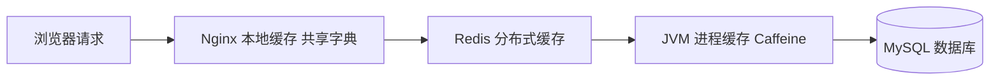
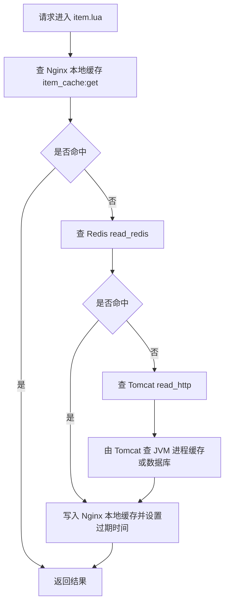
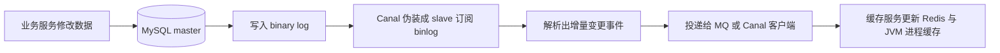
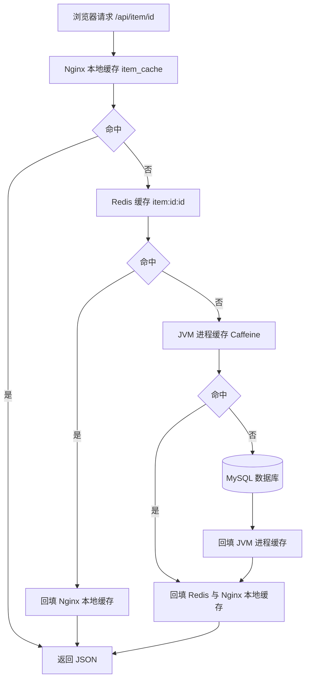

# Redis 多级缓存与缓存同步

只用 Redis 做缓存时，请求链路是“Tomcat 查 Redis，未命中再查数据库”。这条链路有两个明显的短板：一是每次读缓存都要走一次网络，二是 Redis 一旦未命中，压力就直接落到数据库，而 Tomcat 本身也会成为整条链路的瓶颈。多级缓存的做法是把请求经过的每一个环节都利用起来，逐级拦截读请求，让绝大多数请求在离用户更近的地方就被处理掉。

本篇围绕多级缓存展开：先看整体链路，再分别讲 JVM 进程缓存（Caffeine）、Lua 语法、OpenResty、Nginx 本地缓存，最后讲缓存预热与缓存同步方案。

## 1 多级缓存总览

### 1.1 什么是多级缓存

多级缓存就是充分利用请求处理的每个环节，分别添加缓存，减轻 Tomcat 压力，提升服务性能。

浏览器访问静态资源时，优先读取浏览器本地缓存；访问非静态资源（Ajax 查数据）时才请求服务器。请求到达 Nginx 后，优先读取 Nginx 本地缓存；如果 Nginx 本地缓存未命中，则去查 Redis 缓存（这一步不经过 Tomcat）；如果 Redis 也没命中，则查 Tomcat 内的 JVM 进程缓存；如果 JVM 进程缓存仍未命中，最后才查数据库。

### 1.2 为什么要多级

传统的 Tomcat 进程内缓存虽然快，但存在三个绕不开的问题：JVM 内存有限，能缓存的数据量小；多实例部署时各实例的缓存互不可见，容易不一致；进程一重启缓存就全部丢失。

只靠 Redis 也不够。Redis 存储在服务端，访问一次缓存就有一次网络开销，在海量读请求下这本身就成了延迟的主要来源；而且 Redis 未命中时请求会继续向上打到数据库。

各级缓存的分工可以这样理解：越是靠近用户、容量越小、速度越快，负责拦截高频热点；越是靠近数据库、容量越大、速度越慢，负责兜底。把请求按这个顺序逐级过滤，数据库承受的并发才会被压下来。

| 层级 | 位置 | 优点 | 局限 | 适合的数据 |
| --- | --- | --- | --- | --- |
| 浏览器本地缓存 | 用户浏览器 | 完全不走网络，最快 | 只缓存静态资源，服务端无法控制 | 图片、JS、CSS 等静态资源 |
| Nginx 本地缓存 | OpenResty 的 worker 共享字典 | 内存读取，省掉一次网络往返 | 容量受单机内存限制，多台 Nginx 之间不共享 | 热点只读数据 |
| Redis 分布式缓存 | 独立的缓存服务 | 容量更大、可靠性更好、可在集群间共享 | 每次访问都有网络开销 | 数据量较大、需要集群共享的数据 |
| JVM 进程缓存 | Tomcat 的堆内存 | 读取本地内存，没有网络开销，速度更快 | 存储容量有限、可靠性较低、无法共享 | 性能要求高、数据量小、变化少的数据 |
| 数据库 | 磁盘 | 数据的最终来源，可持久化 | 并发能力弱，最怕热点请求直打 | 所有需要落盘的数据 |

在多级缓存架构中，Nginx 内部需要编写本地缓存查询、Redis 查询、Tomcat 查询的业务逻辑，因此这样的 Nginx 不再是一个反向代理服务器，而是一个编写业务的 Web 服务器。所以需要搭建 Nginx 集群，再由专门的 Nginx 做反向代理；同理 Tomcat 也需要搭建集群。

### 1.3 请求链路



链路中每一级的作用不同：Nginx 本地缓存挡住同一台 Nginx 上的重复读，共享字典在多个 worker 之间共享数据；Redis 挡住整个集群范围内的重复读，是多个 Nginx 实例的共同缓存；JVM 进程缓存挡住落到某一台 Tomcat 上的重复读；数据库只在三级缓存都未命中时才被访问。

## 2 JVM 进程缓存与 Caffeine

### 2.1 分布式缓存与进程本地缓存的取舍

缓存可以分为分布式缓存（例如 Redis）和进程本地缓存（例如 HashMap、GuavaCache）两类，两者的取舍如下。

| 维度 | 分布式缓存（Redis） | 进程本地缓存（Caffeine） |
| --- | --- | --- |
| 存储位置 | 独立的缓存服务 | 应用进程的堆内存 |
| 访问开销 | 一次网络往返 | 本地内存读取 |
| 存储容量 | 更大 | 容量有限 |
| 可靠性 | 更好 | 较低，进程重启即丢失 |
| 集群共享 | 可以在集群间共享 | 无法共享，各实例独立 |
| 典型场景 | 缓存数据量较大、可靠性要求较高、需要在集群间共享 | 性能要求较高、缓存数据量较小 |

### 2.2 Caffeine 是什么

Caffeine 是基于 Java8 开发的、提供了近乎最佳命中率的高性能本地缓存库，目前 Spring 内部的缓存使用的就是 Caffeine。它的淘汰算法基于 W-TinyLFU，用极小的空间近似统计访问频率，从而在有限容量下接近最优的命中率。官方地址为 https://github.com/ben-manes/caffeine 。

最基础的用法是先用 `Caffeine.newBuilder().build()` 构建 `Cache` 对象，再用 `put` 存、用 `getIfPresent` 取。`get` 方法接受两个参数：参数一是缓存的 key，参数二是 Lambda 表达式，表达式参数就是缓存的 key，方法体是查询数据库的逻辑。它会优先根据 key 查询 JVM 缓存，如果未命中，则执行参数二的 Lambda 表达式。

```java
@Test
void testBasicOps() {
    Cache<String, String> cache = Caffeine.newBuilder().build();
    cache.put("gf", "迪丽热巴");
    String gf = cache.getIfPresent("gf");
    System.out.println("gf = " + gf);
    // 优先查缓存，未命中才执行 Lambda 查询数据库
    String defaultGF = cache.get("defaultGF", key -> "柳岩");
    System.out.println("defaultGF = " + defaultGF);
}
```

### 2.3 Cache 与 LoadingCache

Caffeine 提供两个入口接口，区别在于未命中时由谁负责加载数据。

| 接口 | 构建方式 | 读取方式 | 未命中时的行为 |
| --- | --- | --- | --- |
| Cache | `Caffeine.newBuilder().build()` | `getIfPresent(key)` 或 `get(key, Function)` | `getIfPresent` 返回 null；`get` 执行传入的 Function 并把结果写入缓存 |
| LoadingCache | `Caffeine.newBuilder().build(CacheLoader)` | `get(key)` | 自动调用 CacheLoader 的 load 方法加载并写入缓存 |

选择建议：缓存数据来源固定、只有一个查询入口时用 `LoadingCache`，加载逻辑集中在 CacheLoader 里；同一个缓存对象需要承载多种查询逻辑时用 `Cache`，把加载逻辑写在每次调用的 `get(key, Function)` 中，这也是本案例采用的方式。

### 2.4 常用构建配置

| 方法 | 作用 | 说明 |
| --- | --- | --- |
| `initialCapacity` | 设置缓存的初始容量 | 只是初始大小，不限制上限 |
| `maximumSize` | 按条数设置缓存上限 | 超出后触发驱逐策略 |
| `maximumWeight` 与 `weigher` | 按权重设置缓存上限 | 用于按内存占用而非条数计量 |
| `expireAfterWrite` | 设置写后过期时间 | 最后一次写入经过该时间未被访问就清除 |
| `expireAfterAccess` | 设置访问后过期时间 | 每次访问都会重置计时 |
| `build()` | 构建 Cache 对象 | 适用于自行控制加载逻辑的场景 |
| `build(CacheLoader)` | 构建 LoadingCache 对象 | 需要提供 load 实现 |

Caffeine 有三种缓存驱逐策略，用于清除缓存，避免内存消耗。

| 驱逐策略 | 配置方式 | 说明 |
| --- | --- | --- |
| 基于容量 | `maximumSize(1)` | 设置缓存的数量上限 |
| 基于时间 | `expireAfterWrite(Duration.ofSeconds(10))` | 设置缓存的有效时间，最后一次写入经过该时间未被访问就清除 |
| 基于引用 | 设置软引用或弱引用 | 利用 GC 回收缓存数据，性能较差，不建议使用 |

注意：在默认情况下，当一个缓存元素过期的时候，Caffeine 不会自动立即将其清理和驱逐，而是在一次读或写操作后，或者在空闲时间完成对失效数据的驱逐。

### 2.5 在 Spring Boot 中注册为 Bean

需求是给根据 id 查询商品的业务和根据 id 查询商品库存的业务添加缓存，缓存未命中时查询数据库，缓存初始大小为 100，缓存上限为 10000。在 `com.heima.item.config` 包下定义配置类 `CaffeineConfig`，其中定义两个 Caffeine 缓存对象，分别保存商品、库存的缓存数据。

```java
@Configuration
public class CaffeineConfig {
    @Bean
    public Cache<Long, Item> itemCache() {
        return Caffeine.newBuilder()
                .initialCapacity(100) // 初始大小为100
                .maximumSize(10_000) // 缓存上限为10000
                .build();
    }

    @Bean
    public Cache<Long, ItemStock> stockCache() {
        return Caffeine.newBuilder()
                .initialCapacity(100)
                .maximumSize(10_000)
                .build();
    }
}
```

注册为 Bean 之后，在 Controller 或 Service 中直接注入即可使用，缓存未命中时由传入的 Lambda 去查数据库并自动回填。

```java
@RestController
@RequestMapping("item")
public class ItemController {
    @Autowired
    private Cache<Long, Item> itemCache;
    @Autowired
    private Cache<Long, ItemStock> stockCache;

    @GetMapping("/{id}")
    public Item findById(@PathVariable("id") Long id) {
        return itemCache.get(id, key -> itemService.query()
                .ne("status", 3).eq("id", key)
                .one()
        );
    }

    @GetMapping("/stock/{id}")
    public ItemStock findStockById(@PathVariable("id") Long id) {
        return stockCache.get(id, key -> stockService.getById(key));
    }
}
```

### 2.6 为什么进程缓存适合变化少、访问多的数据

进程缓存建立在 JVM 堆内，读写不经过网络，因此延迟最低、吞吐最高，代价是每个实例各存一份。这个特性决定了它的适用边界。

一是容量。堆内存要同时承载业务对象和 GC 压力，能分给缓存的量级有限，数据量大就会频繁驱逐，命中率反而下降。

二是一致性。多实例各有一份副本，任何一次数据修改都需要通知所有实例，否则就会出现同一个 id 在不同 Tomcat 上返回不同结果的“多实例不一致”。变化少的数据把这个窗口压到最小。

三是可靠性。进程重启缓存即清空，如果缓存的数据本身获取成本很高，重启会带来一次数据库冲击。

所以“变化少、访问多”是最合适的场景：访问多意味着本地读取的收益大，变化少意味着不一致和失效的代价小。反过来，频繁变化或要求强一致的数据应该放在 Redis 甚至数据库里，进程缓存只作为可容忍短暂旧值的加速层。

在 Tomcat 集群下还有一点要注意：默认的负载均衡规则是轮询，同一商品的两次请求可能落到不同实例，第二台实例的进程缓存没有数据，就会查数据库，进程缓存相当于失效。Nginx 提供了基于请求路径做负载均衡的算法，根据请求路径做 hash 运算，把得到的数值对 Tomcat 服务的数量取余，余数是几就访问第几个服务，这样每个路径多次访问就会到达同一台 Tomcat。

```nginx
upstream tomcat-cluster {
    hash $request_uri;
    server 192.168.150.1:8081;
    server 192.168.150.1:8082;
}
```

## 3 Lua 语法

### 3.1 为什么要在 Nginx 或 Redis 里用 Lua

把业务逻辑放在 Lua 里执行，主要解决两个问题。

减少网络往返。以“查 Nginx 本地缓存，未命中查 Redis，再未命中查 Tomcat”为例，如果由客户端依次发起，就是多次网络往返；写成 Lua 脚本后全部在 Nginx 进程内完成，只保留一次对外响应。

把多步操作做成原子操作。Lua 脚本在 Redis 中以单线程方式整体执行，脚本执行期间不会插入其他命令，因此“判断库存、扣减库存、写记录”这类多步逻辑要么全部生效，要么全部不生效，不存在中间状态被其他请求看到的可能。

Lua 官网为 https://www.lua.org/ 。在 CentOS7 上安装 Lua 环境后，新建 hello.lua，写入 `print("Hello World!")`，执行 `lua hello.lua` 即可运行。

### 3.2 变量与类型

Lua 声明变量无需指定数据类型，可以通过 `type()` 函数判断数据类型，例如 `print(type('Hello World'))` 的输出结果是 `string`。

| 类型 | 含义 | 示例 |
| --- | --- | --- |
| nil | 空值，表示不存在 | `local a = nil` |
| boolean | 布尔值 | `local flag = true` |
| number | 数字 | `local num = 21` |
| string | 字符串，单引号或双引号均可 | `local str = 'hello'` |
| table | 表，可作数组也可作 map | `local arr = {'java', 'python', 'lua'}` |
| function | 函数 | `local f = function() end` |

```lua
-- 声明字符串，可以用单引号或双引号
local str = 'hello'
-- 字符串拼接使用 ..
local str2 = 'hello' .. 'world'
-- 声明数字
local num = 21
-- 声明布尔类型
local flag = true
```

### 3.3 local 与全局变量

Lua 用 `local` 声明变量为局部变量，作用域限于当前的代码块；不使用 `local` 的赋值语句会直接创建全局变量，例如 `num = 10` 相当于在全局表中写入一个字段。

| 写法 | 作用域 | 建议 |
| --- | --- | --- |
| `local a = 1` | 当前代码块内 | 默认选择，避免污染全局环境 |
| `a = 1` | 全局，所有脚本可见 | 仅用于确实需要跨文件共享的状态 |

在 Nginx 的 Lua 场景下这一点尤其重要：多个请求由同一个 worker 复用同一个 Lua 虚拟机，全局变量会被不同请求共享，既可能串数据又可能造成内存常驻，所以脚本里应一律使用 `local`。

### 3.4 条件与循环

与 Java 不同的是，Lua 布尔表达式中的逻辑运算是基于英文单词。

| 运算符 | 含义 |
| --- | --- |
| `and` | 逻辑与 |
| `or` | 逻辑或 |
| `not` | 逻辑非 |

条件分支语句的语法如下，注意结束标记是 `end` 而不是花括号。

```lua
if (布尔表达式) then
    -- 布尔表达式为 true 时执行该语句块
else
    -- 布尔表达式为 false 时执行该语句块
end
```

对于 table，可以利用 for 循环来遍历，不过数组和普通 table 的遍历略有差异：数组用 `ipairs` 按索引遍历，普通 table 用 `pairs` 按键值遍历。

```lua
-- 声明数组，key为索引的 table
local arr = {'java', 'python', 'lua'}
-- 遍历数组
for index, value in ipairs(arr) do
    print(index, value)
end

-- 声明map，也就是table
local map = {name = 'Jack', age = 21}
-- 遍历table
for key, value in pairs(map) do
    print(key, value)
end
```

### 3.5 函数

定义函数的语法为 `function 函数名(参数列表) ... return 返回值 end`。例如定义 printArr 函数打印数组，并对参数为空的情况做判断。

```lua
function printArr(arr)
    if not arr then
        print('数组不能为空！')
        return
    end
    for index, value in ipairs(arr) do
        print(value)
    end
end
```

### 3.6 表 table

table 是 Lua 里唯一的数据结构，既可以作为数组，又可以作为 Java 中的 Map 使用。数组就是特殊的 table，只是 key 是数组角标而已，需要注意 Lua 中的数组角标是从 1 开始的。

```lua
-- 声明数组，key为角标的 table
local arr = {'java', 'python', 'lua'}
-- 访问数组第一个元素，Lua 数组角标从 1 开始
print(arr[1])

-- 声明table，类似 Java 的 map
local map = {name = 'Jack', age = 21}
-- 访问 table，两种写法等价
print(map['name'])
print(map.name)
```

模块导出同样依赖 table：把函数放进一个约定的 table 并 `return` 出去，使用方通过 `require('模块名')` 拿到这个 table。例如在 `common.lua` 中定义 `local _M = { read_http = read_http }` 再 `return _M`，使用方写 `local common = require('common')`，然后通过 `common.read_http` 调用。

### 3.7 与 Nginx 交互的 ngx API

| API | 用途 | 说明 |
| --- | --- | --- |
| `ngx.var` | 读取 Nginx 变量 | 例如 `ngx.var[1]` 取正则 location 中第一个捕获分组的值 |
| `ngx.say` | 输出响应内容 | 直接在 Response 中写入内容，常用于返回 JSON |
| `ngx.arg` | 读取响应体数据块 | 在响应体过滤阶段使用，`ngx.arg[1]` 是本次的数据块，`ngx.arg[2]` 表示是否为最后一块，改写 `ngx.arg[1]` 即可改写响应体 |
| `ngx.shared.DICT:get` | 读取共享字典 | 返回字符串或 nil，即共享字典中的本地缓存命中判断 |
| `ngx.shared.DICT:set` | 写入共享字典 | `set(key, value, exptime)`，过期时间单位为秒，默认 0 表示永不过期 |
| `ngx.shared.DICT:incr` | 原子自增共享字典中的值 | `incr(key, value, init)`，key 不存在且给出 init 时用 init 初始化，适合在本地做计数 |
| `ngx.log` | 写错误日志 | 例如 `ngx.log(ngx.ERR, "查询Redis失败: ", err)` |
| `ngx.exit` | 结束请求 | 例如 `ngx.exit(404)` |

这些 API 中，`ngx.var`、`ngx.say` 用于取参数和输出结果，`ngx.shared.DICT` 用于本地缓存，`ngx.arg` 用于在过滤阶段处理响应体，是编写多级缓存业务最常用的几类。

### 3.8 一个完整的 Lua 脚本示例

下面的脚本把前面几节的语法组合起来：定义函数、遍历 table、读写共享字典、自增计数，并通过 `ngx.say` 输出结果。

```lua
-- 导入共享字典，名字要与 nginx.conf 中 lua_shared_dict 声明的一致
local item_cache = ngx.shared.item_cache

-- 定义函数：把 table 拼成一行文本
local function join(arr)
    if not arr then
        return ''
    end
    local result = ''
    for index, value in ipairs(arr) do
        if index > 1 then
            result = result .. ','
        end
        result = result .. value
    end
    return result
end

-- 读取路径参数
local id = ngx.var[1]

-- 先查本地缓存
local val = item_cache:get('item:id:' .. id)
if not val then
    -- 未命中时把待查信息写入本地缓存，过期时间 1800 秒
    val = 'cache-miss:' .. id
    item_cache:set('item:id:' .. id, val, 1800)
end

-- 原子累加访问次数，key 不存在时初始化为 0
local count = item_cache:incr('item:count:' .. id, 1, 0)

-- 输出结果
ngx.say('{"id":' .. id .. ',"tag":"' .. join({'hot', 'item'}) .. '","hits":' .. count .. '}')
```

## 4 OpenResty

### 4.1 OpenResty 是什么

OpenResty 是一个基于 Nginx 的高性能 Web 平台，用于方便地搭建能够处理超高并发、扩展性极高的动态 Web 应用、Web 服务和动态网关。它具备下列特点：具备 Nginx 的完整功能；基于 Lua 语言进行扩展，集成了大量精良的 Lua 库、第三方模块；允许使用 Lua 自定义业务逻辑、自定义库。官方网站为 https://openresty.org/cn/ 。

可以这样理解它的组成：OpenResty 就是 Nginx 加上 LuaJIT，再加上一大批开箱即用的 Lua 库和第三方模块。安装后目录默认是 `/usr/local/openresty`，其中的 nginx 目录结构与独立安装的 Nginx 基本一致，所以启动方式也一致。

### 4.2 安装

先安装依赖开发库、添加官方仓库、安装软件包与管理工具 opm。

```bash
# 安装依赖开发库
yum install -y pcre-devel openssl-devel gcc --skip-broken

# 如果 yum-config-manager 运行失败需要先执行这个指令
yum install -y yum-utils
yum-config-manager --add-repo https://openresty.org/package/centos/openresty.repo

# 安装 openresty 软件包
yum install -y openresty

# 安装管理工具 opm，用于安装第三方 Lua 模块
yum install -y openresty-opm
```

安装完成后配置环境变量，把 OpenResty 自带的 nginx 加入 PATH。

```bash
# 打开配置文件
vi /etc/profile

# 在配置文件最下面添加如下内容
export NGINX_HOME=/usr/local/openresty/nginx
export PATH=${NGINX_HOME}/sbin:$PATH

# 让配置生效
source /etc/profile
```

之后即可用常规的 nginx 命令启停与重载配置。

```bash
# 启动
nginx
# 重新加载配置
nginx -s reload
# 停止
nginx -s stop
```

### 4.3 把请求交给 Lua 脚本处理

OpenResty 的很多功能都依赖于其目录下的 Lua 库，需要在 nginx.conf 中指定依赖库的目录并导入依赖，然后通过 `content_by_lua_file` 把某个 location 的响应结果交给 Lua 脚本决定。

```nginx
# lua 模块
lua_package_path "/usr/local/openresty/lualib/?.lua;;";
# c模块
lua_package_cpath "/usr/local/openresty/lualib/?.so;;";

server {
    listen 8081;
    server_name localhost;

    location ~ /api/item/(\d+) {
        # 默认的响应类型，这里响应的是JSON数据
        default_type application/json;
        # 响应结果由 lua/item.lua 文件来决定
        content_by_lua_file lua/item.lua;
    }
}
```

这里的 location 使用了正则路径：`~` 表示这是一个正则路径，`()` 表示分组，`\d` 表示任意数字，`+` 表示至少一位数字。请求 `http://localhost/api/item/10001` 时，路径中的 `10001` 被捕获，在 Lua 脚本中用 `ngx.var[1]` 取到。

编写脚本时，把 Lua 文件放在 nginx 目录下的 lua 文件夹中。

```bash
# 进入nginx目录
cd /usr/local/openresty/nginx
# 创建lua文件夹
mkdir lua
# 创建item.lua文件
touch lua/item.lua
```

每次修改 Lua 脚本后需要重新加载配置才会生效：`nginx -s reload`。

### 4.4 声明共享字典

`lua_shared_dict` 用来声明共享字典并指定大小，它需要在 nginx.conf 的 http 段下声明。OpenResty 为 Nginx 提供了共享字典的功能，可以在 nginx 的多个 worker 之间共享数据，实现缓存功能。

```nginx
http {
    # 共享字典，也就是本地缓存，名称叫做 item_cache，大小 150MB
    lua_shared_dict item_cache 150m;
}
```

| 配置项 | 位置 | 作用 |
| --- | --- | --- |
| `lua_package_path` | http 段 | 指定 Lua 模块的搜索路径 |
| `lua_package_cpath` | http 段 | 指定 C 模块的搜索路径 |
| `lua_shared_dict` | http 段 | 声明共享字典及其大小，名称供 Lua 中 `ngx.shared.名称` 使用 |
| `content_by_lua_file` | location 段 | 指定由哪个 Lua 脚本产生响应内容 |
| `default_type` | location 段 | 指定响应类型，返回 JSON 时设置为 application/json |

### 4.5 完整的 Nginx + Lua 配置示例

下面的配置把“查商品缓存”这条业务串起来：Windows 上的 Nginx 做反向代理，OpenResty 集群编写多级缓存业务，Tomcat 集群通过 `hash $request_uri` 做基于路径的负载均衡。

```nginx
worker_processes  1;
error_log  logs/error.log;

events {
    worker_connections  1024;
}

http {
    include       mime.types;
    default_type  application/octet-stream;
    sendfile        on;
    keepalive_timeout  65;

    # 加载 OpenResty 的 Lua 模块
    lua_package_path "/usr/local/openresty/lualib/?.lua;;";
    lua_package_cpath "/usr/local/openresty/lualib/?.so;;";

    # 本地缓存共享字典
    lua_shared_dict item_cache 150m;

    # Tomcat 集群，按请求路径做负载均衡
    upstream tomcat-cluster {
        hash $request_uri;
        server 192.168.150.1:8081;
        server 192.168.150.1:8082;
    }

    server {
        listen       8081;
        server_name  localhost;

        # 商品查询接口，由 Lua 脚本处理
        location ~ /api/item/(\d+) {
            default_type application/json;
            content_by_lua_file lua/item.lua;
        }

        # 供 ngx.location.capture 内部调用，反向代理到 Tomcat 集群
        location /item {
            proxy_pass http://tomcat-cluster;
        }
    }
}
```

脚本中通过 `ngx.location.capture` 发送内部 HTTP 请求查询 Tomcat，它的返回值包含三部分：`resp.status` 是响应状态码，`resp.header` 是响应头（一个 table），`resp.body` 是响应体。需要注意这里的 path 是路径，并不包含 IP 和端口，这个请求会被 nginx 内部的 server 监听并处理，所以必须像上面那样编写一个 location 把该路径反向代理到 Tomcat。

```lua
local resp = ngx.location.capture("/item/10001", {
    method = ngx.HTTP_GET, -- 请求方式
    args = {a = 1, b = 2}, -- get 方式传参数
})
```

由于请求 Tomcat 经常使用，可以把它封装成函数库。在 `/usr/local/openresty/lualib` 目录下新建 common.lua。

```lua
-- 封装函数，发送http请求，并解析响应
local function read_http(path, params)
    local resp = ngx.location.capture(path, {
        method = ngx.HTTP_GET,
        args = params,
    })
    if not resp then
        -- 记录错误信息，返回404
        ngx.log(ngx.ERR, "http请求查询失败, path: ", path, ", args: ", params)
        ngx.exit(404)
    end
    return resp.body
end

-- 将方法导出
local _M = {
    read_http = read_http
}
return _M
```

查询得到的商品 JSON 串和库存 JSON 串需要转换成 Lua 的 table 并合并，再转回 JSON 返回，这一步用 cjson 完成序列化和反序列化。

```lua
local cjson = require('cjson')

-- 序列化：把 table 序列化为 json
local obj = {name = 'jack', age = 21}
local json = cjson.encode(obj)

-- 反序列化：json 转换为 table
local table_obj = cjson.decode('{"name": "jack", "age": 21}')
print(table_obj.name)
```

## 5 Nginx 本地缓存

### 5.1 共享字典的用法

共享字典就是 Nginx 本地缓存，声明后通过 `ngx.shared.名称` 获取对象，再调用 `get` 和 `set` 存取。

```lua
-- 获取本地缓存对象
local item_cache = ngx.shared.item_cache
-- 存储，指定 key、value、过期时间（单位 s），默认为 0 代表永不过期
item_cache:set('key', 'value', 1000)
-- 读取
local val = item_cache:get('key')
```

| 操作 | 用法 | 说明 |
| --- | --- | --- |
| 读取 | `item_cache:get(key)` | 命中返回字符串，未命中返回 nil |
| 写入 | `item_cache:set(key, value, expire)` | 过期时间单位秒，0 表示永不过期，也可省略 |
| 自增 | `item_cache:incr(key, value, init)` | 原子自增，可用于本地计数或限流 |

共享字典有几个必须清楚的特点：数据存放在 Nginx 的内存中，所有 worker 共享同一份；Nginx 重启后数据全部丢失，所以它只能作为加速层而不是数据源；容量由声明时的大小决定，写满时按 LRU 淘汰最久未使用的键。

### 5.2 分级查询流程

有了三级缓存之后，接收到请求时优先查询 Nginx 本地缓存，未命中再查询 Redis 缓存，最后才查 Tomcat 的 JVM 进程缓存，每一级命中后都要向上一级回填。



### 5.3 完整脚本

把 Redis 查询封装进 common.lua 的 `read_redis` 方法。

```lua
-- 导入redis模块
local redis = require('resty.redis')
-- 初始化redis对象
local red = redis:new()
-- 参数依次为连接超时、发送命令超时、接受响应超时，单位毫秒
red:set_timeouts(1000, 1000, 1000)

-- 关闭redis连接的工具方法，其实是放入连接池
local function close_redis(red)
    local pool_max_idle_time = 10000 -- 连接的空闲时间，单位是毫秒
    local pool_size = 100 -- 连接池大小
    local ok, err = red:set_keepalive(pool_max_idle_time, pool_size)
    if not ok then
        ngx.log(ngx.ERR, "放入redis连接池失败: ", err)
    end
end

-- 查询redis的方法，ip和port是redis地址，key是查询的key
local function read_redis(ip, port, key)
    local ok, err = red:connect(ip, port)
    if not ok then
        ngx.log(ngx.ERR, "连接redis失败 : ", err)
        return nil
    end
    local resp, err = red:get(key)
    if not resp then
        ngx.log(ngx.ERR, "查询Redis失败: ", err, ", key = ", key)
    end
    -- 得到的数据为空处理
    if resp == ngx.null then
        resp = nil
        ngx.log(ngx.ERR, "查询Redis数据为空, key = ", key)
    end
    close_redis(red)
    return resp
end

local _M = {
    read_http = read_http,
    read_redis = read_redis
}
return _M
```

在 item.lua 中实现三级查询：先查本地缓存，未命中查 Redis，再未命中查 Tomcat，最后把结果写回本地缓存并设置超时时间。

```lua
-- 导入common函数库
local common = require('common')
local read_http = common.read_http
local read_redis = common.read_redis
-- 导入cjson库
local cjson = require('cjson')
-- 导入共享词典，本地缓存
local item_cache = ngx.shared.item_cache

-- 封装查询函数
function read_data(key, expire, path, params)
    -- 查询本地缓存
    local val = item_cache:get(key)
    if not val then
        ngx.log(ngx.ERR, "本地缓存查询失败，尝试查询Redis， key: ", key)
        -- 查询redis
        val = read_redis("127.0.0.1", 6379, key)
        -- 判断查询结果
        if not val then
            ngx.log(ngx.ERR, "redis查询失败，尝试查询http， key: ", key)
            -- redis查询失败，去查询http
            val = read_http(path, params)
        end
    end
    -- 查询成功，把数据写入本地缓存，并指定超时时间
    item_cache:set(key, val, expire)
    -- 返回数据
    return val
end

-- 获取路径参数
local id = ngx.var[1]

-- 查询商品信息，设置缓存超时时间为30分钟
local itemJSON = read_data("item:id:" .. id, 1800, "/item/" .. id, nil)
-- 查询库存信息，设置缓存超时时间为1分钟
local stockJSON = read_data("item:stock:id:" .. id, 60, "/item/stock/" .. id, nil)

-- JSON转化为lua的table
local item = cjson.decode(itemJSON)
local stock = cjson.decode(stockJSON)
-- 组合数据
item.stock = stock.stock
item.sold = stock.sold

-- 把item序列化为json 返回结果
ngx.say(cjson.encode(item))
```

这里商品信息和库存设置了不同的过期时间，原因是商品基本信息变化少，可以缓存久一些；库存变化频繁，过期时间必须短，避免读到明显过期的库存。这也是多级缓存中每一级的过期时间都需要按数据变化频率单独设计的体现。

## 6 缓存预热与缓存同步

### 6.1 冷启动与缓存预热

Redis 缓存会面临冷启动问题。冷启动是指服务刚刚启动时，Redis 中并没有缓存，如果所有数据都在第一次查询时添加缓存，可能会给数据库带来较大压力。

缓存预热是指在项目启动时，把这些热点数据提前查询并保存到缓存中。这样上线瞬间的流量就直接打在缓存上，避免了大量请求同时穿透到数据库。

### 6.2 预热方式对比

| 方式 | 做法 | 优点 | 缺点 | 适用场景 |
| --- | --- | --- | --- | --- |
| 启动时加载 | 应用启动阶段查询数据并写入缓存 | 实现简单，上线即有缓存 | 启动变慢，全量数据量大时不适合 | 数据量小、可全量加载的数据 |
| 定时任务 | 按固定周期刷新缓存 | 与启动解耦，可周期纠正偏差 | 有刷新间隔，间隔内仍可能不一致 | 数据量中等、允许周期性刷新 |
| 接口手动触发 | 提供管理接口，由运维按需触发 | 灵活，可在大促前按需执行 | 依赖人工操作，容易遗漏 | 上线、大促等可预期的流量高峰 |
| 离线统计加启动加载 | 用大数据统计用户访问的热点数据，启动时只加载热点 | 只预热真正热点，成本可控 | 依赖离线链路，热点判定有滞后 | 数据量大、访问集中的场景 |

### 6.3 启动时预热实现

缓存预热需要在项目启动时完成，并且必须是拿到 RedisTemplate 之后。这里利用 `InitializingBean` 接口来实现，因为它可以在对象被 Spring 创建并且成员变量全部注入后执行。

```java
@Component
public class RedisHandler implements InitializingBean {
    @Autowired
    private StringRedisTemplate redisTemplate;
    @Autowired
    private IItemService itemService;
    @Autowired
    private IItemStockService stockService;

    private static final ObjectMapper MAPPER = new ObjectMapper();

    @Override
    public void afterPropertiesSet() throws Exception {
        // 1.查询商品信息
        List<Item> itemList = itemService.list();
        // 2.放入缓存
        for (Item item : itemList) {
            String json = MAPPER.writeValueAsString(item);
            redisTemplate.opsForValue().set("item:id:" + item.getId(), json);
        }

        // 3.查询商品库存信息
        List<ItemStock> stockList = stockService.list();
        // 4.放入缓存
        for (ItemStock stock : stockList) {
            String json = MAPPER.writeValueAsString(stock);
            redisTemplate.opsForValue().set("item:stock:id:" + stock.getId(), json);
        }
    }
}
```

### 6.4 缓存同步方案对比

缓存同步就是要保证缓存中的数据和数据库的数据保持一致。常见的方式有以下几种。

| 方案 | 做法 | 优点 | 缺点 | 适用场景 |
| --- | --- | --- | --- | --- |
| 设置有效期 | 给缓存设置有效期，到期后自动删除，再次查询时更新 | 简单、方便 | 时效性差，缓存过期之前可能不一致 | 更新频率较低、时效性要求低的业务 |
| 同步双写 | 在修改数据库的同时，直接修改缓存 | 时效性强，缓存与数据库强一致 | 有代码侵入，耦合度高 | 对一致性、时效性要求较高的缓存数据 |
| 异步通知 | 修改数据库时发送事件通知，相关服务监听到通知后修改缓存数据 | 低耦合，可以同时通知多个缓存服务 | 时效性一般，可能存在中间不一致状态 | 时效性要求一般、有多个服务需要同步 |

异步通知又可以基于消息队列（MQ）或者 Canal 来实现。

基于 MQ 的异步通知：业务完成对数据的修改后，发送一条消息到 MQ 中，缓存服务监听 MQ 消息，然后更新缓存，但这种方式仍然有少量代码入侵。

基于 Canal 的通知：业务完成对数据的修改后直接结束，Canal 监听 MySQL 变化，当发现 MySQL 变化后，立即通知缓存服务，缓存服务进行缓存更新，这种方式实现了代码零入侵。

| 异步实现 | 通知来源 | 代码侵入 | 说明 |
| --- | --- | --- | --- |
| 基于 MQ | 业务代码主动发送消息 | 有少量侵入 | 业务完成修改后发送消息，缓存服务监听消息更新缓存 |
| 基于 Canal | 监听 MySQL 的 binlog 变化 | 零侵入 | 业务修改完直接结束，Canal 发现变化后通知缓存服务 |

### 6.5 Canal 的工作原理

Canal 是阿里巴巴旗下的一款开源项目，基于 Java 开发，基于数据库增量日志解析，提供增量数据订阅和消费，Github 地址为 https://github.com/alibaba/canal 。

Canal 是基于 MySQL 的主从同步来实现的。MySQL 主从同步的原理是：master 将数据变更写入二进制日志（binary log），其中记录的数据叫做 binary log events；slave 将 master 的 binary log events 拷贝到它的中继日志（relay log），然后重放 relay log 中的事件，将数据变更反映到自己的数据中。

Canal 就是把自己伪装成 MySQL 的一个 slave 节点，从而监听 master 的 binary log 变化，再把得到的变化信息通知给 Canal 的客户端，进而完成对其它数据库的同步。



由于业务代码不需要感知缓存的存在，这条链路把“改库”和“改缓存”彻底解耦，代价是从数据落库到缓存更新之间存在一小段延迟，因此只适合时效性要求一般的场景。

### 6.6 Canal 使用步骤

第一步，开启 MySQL 主从。在 MySQL 容器挂载的配置文件（例如 `/tmp/mysql/conf/my.cnf`）末尾添加如下内容，其中 `log-bin` 设置 binary log 文件的存放地址和文件名，`binlog-do-db` 指定对哪个 database 记录 binary log events。

```text
[mysqld]
skip-name-resolve
character_set_server=utf8
datadir=/var/lib/mysql
server-id=1000
log-bin=/var/lib/mysql/mysql-bin
binlog-do-db=heima
```

第二步，添加一个仅用于数据同步的账户，仅提供对 heima 这个库的操作权限。

```sql
CREATE USER canal@'%' IDENTIFIED by 'canal';
GRANT SELECT, REPLICATION SLAVE, REPLICATION CLIENT,SUPER ON *.* TO 'canal'@'%' identified by 'canal';
FLUSH PRIVILEGES;
```

重启 MySQL 容器后，运行 `show master status;` 测试设置是否成功。

```bash
docker restart mysql
```

第三步，安装 Canal。创建一个网络，将 MySQL、Canal、MQ 放到同一个 Docker 网络中，并让 MySQL 加入这个网络。

```bash
docker network create heima
docker network connect heima mysql
docker load -i canal.tar
docker run -p 11111:11111 --name canal \
-e canal.destinations=heima \
-e canal.instance.master.address=mysql:3306 \
-e canal.instance.dbUsername=canal \
-e canal.instance.dbPassword=canal \
-e canal.instance.connectionCharset=UTF-8 \
-e canal.instance.tsdb.enable=true \
-e canal.instance.gtidon=false \
-e canal.instance.filter.regex=heima\\..* \
--network heima \
-d canal/canal-server:v1.1.5
```

其中 `-p 11111:11111` 是 canal 的默认监听端口；`canal.instance.master.address` 是数据库地址和端口，如果不知道 mysql 容器地址，可以通过 `docker inspect 容器id` 来查看；`canal.instance.filter.regex` 是要监听的表名称，多个正则之间以逗号分隔，转义符需要双斜杠。

第四步，在业务服务中监听 Canal。Canal 提供了各种语言的客户端，当 Canal 监听到 binlog 变化时，会通知 Canal 的客户端。这里使用与 SpringBoot 整合的第三方客户端 canal-starter，它自动装配，比官方客户端简单好用。

```xml
<dependency>
    <groupId>top.javatool</groupId>
    <artifactId>canal-spring-boot-starter</artifactId>
    <version>1.2.1-RELEASE</version>
</dependency>
```

```yaml
canal:
  destination: heima # canal的集群名字，要与安装canal时设置的名称一致
  server: 192.168.150.101:11111 # canal服务地址
```

### 6.7 监听 Canal 更新缓存

实体类需要通过 `@Id`、`@Column`、`@Transient` 注解完成与数据库表字段的映射，其中 `@Id` 标记表中的 id 字段，`@Column(name = "name")` 标记表中与属性名不一致的字段，`@Transient` 标记不属于表中的字段。

编写监听器时，通过实现 `EntryHandler<T>` 接口监听 Canal 消息，用 `@CanalTable("tb_item")` 指定要监听的表，泛型指定表关联的实体类，`insert`、`update`、`delete` 方法分别监听数据库表的增、改、删消息。

```java
@CanalTable("tb_item")
@Component
public class ItemHandler implements EntryHandler<Item> {
    @Autowired
    private RedisHandler redisHandler;
    @Autowired
    private Cache<Long, Item> itemCache;

    @Override
    public void insert(Item item) {
        // 写数据到JVM进程缓存
        itemCache.put(item.getId(), item);
        // 写数据到redis
        redisHandler.saveItem(item);
    }

    @Override
    public void update(Item before, Item after) {
        // 写数据到JVM进程缓存
        itemCache.put(after.getId(), after);
        // 写数据到redis
        redisHandler.saveItem(after);
    }

    @Override
    public void delete(Item item) {
        // 删除JVM进程缓存中的数据
        itemCache.invalidate(item.getId());
        // 删除redis中的数据
        redisHandler.deleteItemById(item.getId());
    }
}
```

缓存更新时，同一个监听器要同时处理 Redis 和 JVM 进程缓存。把 Redis 操作统一封装到 RedisHandler 中，预热和增量更新复用同一套 Key 规则，避免出现两处使用不同 key 前缀的问题。

```java
public void saveItem(Item item) {
    try {
        String json = MAPPER.writeValueAsString(item);
        redisTemplate.opsForValue().set("item:id:" + item.getId(), json);
    } catch (JsonProcessingException e) {
        throw new RuntimeException(e);
    }
}

public void deleteItemById(Long id) {
    redisTemplate.delete("item:id:" + id);
}
```

## 7 完整查询链路与取舍

把前面各节串起来，一次商品查询的完整链路是：浏览器 → Nginx 本地缓存 → Redis → JVM 进程缓存 → 数据库。



每一级的命中与回填规则如下。回填的顺序是自下而上的：谁查到了数据，就由它往上一级逐级填回去，这样下一轮相同请求会在更靠前的一级被拦截。

| 层级 | 命中判定 | 命中后动作 | 未命中后动作 |
| --- | --- | --- | --- |
| 浏览器本地缓存 | 本地资源未过期 | 直接使用，不发起请求 | 发起 Ajax 请求查询数据 |
| Nginx 本地缓存 | `item_cache:get(key)` 返回非 nil | 直接 `ngx.say` 返回 | 查询 Redis |
| Redis 缓存 | `read_redis` 返回非 nil | 用 `item_cache:set(key, val, expire)` 回填本地缓存并返回 | 查询 Tomcat |
| JVM 进程缓存 | `itemCache.getIfPresent(id)` 非空 | 返回数据，并由 Nginx 回填 Redis 与本地缓存 | 查询数据库 |
| 数据库 | 查询有结果 | 回填 JVM 进程缓存，再逐级回填 | 返回空结果 |

这条链路在一致性、延迟与数据库压力之间做了明确取舍。

| 层级 | 一致性 | 延迟 | 对数据库压力的作用 |
| --- | --- | --- | --- |
| 浏览器本地缓存 | 最差，完全由客户端控制 | 最低，不产生请求 | 减少静态资源请求 |
| Nginx 本地缓存 | 较差，多台 Nginx 之间不共享且重启丢失 | 很低，仅内存读取 | 拦截同一 Nginx 上的全部重复读 |
| Redis 缓存 | 较好，是集群内统一的缓存副本 | 中等，有一次网络往返 | 拦截集群范围内的大部分读请求 |
| JVM 进程缓存 | 较差，多实例各自一份 | 很低，本地内存读取 | 拦截落在单台 Tomcat 上的重复读 |
| 数据库 | 最强，是数据的最终来源 | 最高，最容易成为瓶颈 | 只承接三级缓存都未命中的请求 |

添加的层级越多，命中率越高、数据库压力越小、延迟越低，但需要同步的位置也越多，一致性越难保证。因此每一层的过期时间要按数据变化频率单独设置，缓存同步策略要同时覆盖 Redis 和 JVM 进程缓存，这一点在 Canal 监听器中体现为“update 时既写 Redis 也写进程缓存”。

## 8 本篇总结

1. 多级缓存的本质是把请求经过的每个环节都变成拦截点，浏览器、Nginx、Redis、JVM 逐级过滤，数据库只做最后兜底。
2. 分布式缓存容量大、可共享但有网络开销；进程本地缓存速度最快但容量有限、多实例不共享、重启即丢失。
3. Caffeine 是基于 W-TinyLFU 的高性能 Java 进程缓存，用 `initialCapacity`、`maximumSize`、`expireAfterWrite` 等参数构建，注册成 Spring Bean 后即可在业务中通过 `get(key, Function)` 使用。
4. 进程缓存适合“变化少、访问多”的数据；在 Tomcat 集群下需要配合 `hash $request_uri` 的负载均衡，才能让同一 id 的请求稳定落到同一台机器。
5. Lua 用于把多步操作合并成一次本地执行，`local` 声明局部变量、table 兼作数组与 map且角标从 1 开始、`ngx.shared.DICT` 提供 get/set/incr 操作共享字典。
6. OpenResty 是 Nginx 加 LuaJIT 和大量 Lua 库，通过 `content_by_lua_file` 把 location 交给 Lua 脚本，通过 `lua_shared_dict` 声明本地缓存共享字典。
7. 缓存的完整读写顺序是“本地缓存 → Redis → JVM 进程缓存 → 数据库”，每级命中后都要向上一级回填，并为不同数据设置不同的过期时间。
8. 缓存预热解决冷启动问题，可在启动时加载、定时刷新或通过接口手动触发；缓存同步有设置有效期、同步双写、基于 MQ 和基于 Canal 的异步通知，Canal 通过伪装成 MySQL 从节点订阅 binlog 实现零侵入。
